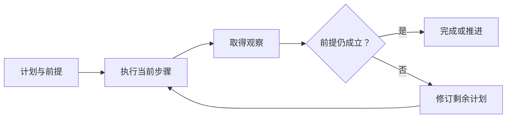

# 规划：分解、执行与计划修订

规划把目标表达成一组中间目标、依赖和检查条件。推理是形成判断的过程，显式计划是可供执行和检查的外部对象；二者相关，但生成一份计划不代表其中步骤已经完成。

---

## 一、计划应描述可检查的结果

「认真分析配置」缺少明确产物；「确认文件值、确认覆盖来源、解释最终值」能对应观察与完成条件。

| 计划部分 | 例子 |
| --- | --- |
| 目标 | 解释超时为何为 60 秒 |
| 前提 | 有权读取指定配置和运行信息 |
| 子目标 | 取得声明值、取得覆盖值、形成解释 |
| 依赖 | 解释依赖前两项证据 |
| 验收 | 数值、单位、来源相互一致 |

计划可以是列表、树或依赖图。表达形式应反映真实依赖，而不是把所有步骤都画成串行。

---

## 二、几种推进方法

| 方法 | 推进方式 | 适用条件 |
| --- | --- | --- |
| 逐步决策 | 每次根据观察决定一个动作 | 路径难预先确定 |
| 先规划再执行 | 先列主要步骤，再按结果推进 | 目标可分解、依赖较稳定 |
| 分层规划 | 先定子目标，再细化局部动作 | 任务较大、抽象层次清楚 |
| 候选比较 | 生成若干方案并按标准选择 | 有可用评分且比较成本可接受 |

候选更多会消耗额外预算；模型自评也可能重复原判断的偏差。只有评分标准能区分方案优劣时，搜索更多方案才有实际意义。

---

## 三、执行中的计划状态

图中的修订针对未来安排，不改写过去事实。例如原计划假设配置文件包含全部有效值，读取后发现有环境覆盖，就应增加覆盖检查；不能修改旧记录，假装一开始已经知道覆盖值。

一个步骤可以标记为待开始、进行中、已验证、失败或被替代。状态转换需要证据：列出文件名不是已经读取，生成测试计划不是测试通过。

---

## 四、计划修订的依据

修订可以由新资料、用户目标变化、工具不可用或验证不通过触发。应记录哪个前提改变、哪些已完成结果仍有效、哪些剩余动作需要替换。

例如用户从「解释」改为「提出修改建议」，之前的配置读取仍可能有用，但新的目标仍不意味着授权直接写入。计划变化与权限变化需要分别判断。

反思可总结失败原因并指导下一次尝试，但「模型说自己发现了问题」不是独立证明。有效反馈应来自实际结果、规则检查或外部评价；保存文字反馈也不等于更新模型权重。

---

## 五、评价规划能力

不要只评价计划是否详尽。可以检查依赖是否可满足、步骤是否与目标相关、观察变化后是否合理修订、是否出现无进展重复，以及最终结果和总成本。

让同一任务分别采用逐步决策和先规划后执行，在相同资源限制下比较完成率、额外调用和修订次数。一个简短但可执行的计划可能优于很长却不能检验的计划，这需要实际样例验证。

学习自检：为什么计划不是状态机？计划描述待做事项和依赖，状态机定义允许的运行状态迁移；一份新计划不能自行解除取消或审批等待。

---

## 参考资料

- [[3] 控制模式的工程分类](../references.md#source-anthropic-agents)
- [[48] 基于观察的推理与行动](../references.md#source-react-paper)
- [Workflow 与 Agent Loop](workflows.md)
