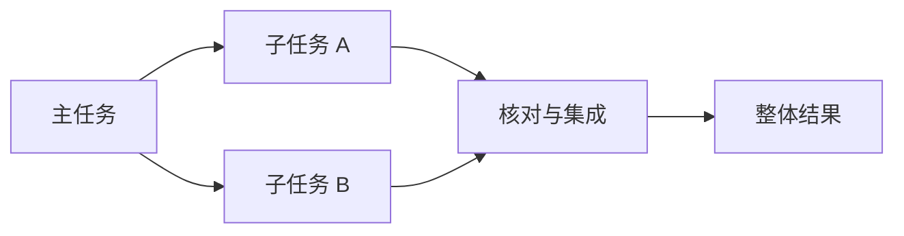

# 多 Agent：委派、协作与结果集成

多 Agent 把工作分配给多个拥有各自输入、状态或工具范围的执行者。执行者可以是一个短子任务，也可以维持持续交互；关键不在角色名称多少，而在信息、工作和结果如何分工。

---

## 一、三种组织方式

| 方式 | 控制关系 | 结果去向 |
| --- | --- | --- |
| 委派 | 主执行者分配子任务 | 返回主执行者 |
| 接力 | 当前执行者移交后续处理 | 接收者继续推进 |
| 并行协作 | 多个执行者处理独立部分 | 汇合、比较与集成 |

同一个模型可以承载多个执行者，不同模型也可以只组成一条固定 Workflow。多 Agent 描述执行者组织，不直接决定控制流是否动态。



图中集成是独立工作：两个子任务各自成功，不一定意味着整体目标已经满足。

---

## 二、委派契约

一个可执行的子任务需要目标、输入、范围、允许工具、产物形式和完成条件。例如：

```json
{
	"task_id": "inspect-config",
	"objective": "解释配置文件中的超时字段",
	"scope": ["config.yaml"],
	"mode": "read_only",
	"deliverable": ["value", "unit", "source", "unknowns"],
	"completion": "结论可由指定配置版本支持"
}
```

这比「你是配置专家，帮忙看看」更明确。子执行者还应知道哪些信息未提供，不能假设能访问主任务的全部对话、文件或凭据。

返回结果应带任务 ID、状态、产物和未解决事项。自然语言摘要可以帮助主执行者阅读，但不能替代实际文件、来源或验证记录。

---

## 三、并行与共享状态

可以并行阅读两个独立模块，再由主执行者比较；同时修改同一文件则需要明确所有权或隔离分支。即使写不同文件，也可能改变相同接口，集成时仍需验证兼容性。

通信应传递新增信息和必要上下文，避免不断广播全部历史。消息送达不等于接收者已经采用，接收者也不应把其他执行者转述的指令当作新用户授权。

取消主任务时，要决定是否取消子任务、如何收集在途结果以及怎样处理已经发生的副作用。不能只停止主界面而让子执行者无限运行。

---

## 四、结果覆盖与冲突

对任务集合 $T$ 和返回结果所覆盖的任务集合 $R$，首先检查是否存在 $T\setminus R$，即尚无结果的子任务。还要检查重复结果、非预期任务 ID 和失败状态，不能只比较条目数量。

两个子执行者对同一字段给出不同值时，应比较来源、版本、环境和读取时间，而不是按票数决定事实。相同模型读取同一资料后重复同一结论，也不等于独立验证。

对于代码任务，集成后的测试验证的是合并产物；每个分支独立通过不能替代集成检查。

---

## 五、收益与成本

多 Agent 可能提供上下文隔离、专门工具范围和并行工作；同时增加重复阅读、消息传递、结果压缩、冲突处理和汇总成本。

有意义的比较应固定任务、可用资料、总预算和评分方式，比较单执行者与协作方案。高度依赖共享细节的小任务，分工成本可能大于收益；多个独立资料源的研究则更容易形成清楚的边界。具体收益不能由执行者数量推断。

学习自检：两个子任务都成功，为什么主任务仍可能失败？可能遗漏整体需求、结果版本不同、接口不兼容，或集成解释引入错误。

---

## 参考资料

- [[3] 编排与工作者模式](../references.md#source-anthropic-agents)
- [[52] 多执行者产品案例](../references.md#source-cc-teams)
- [[53] 扩展协作的工程经验](../references.md#source-cursor-scaling)
- [[54] 上下文与协作成本的不同经验](../references.md#source-cognition-context)
