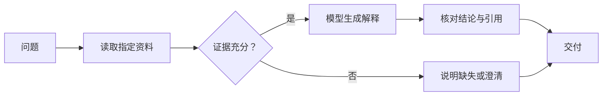
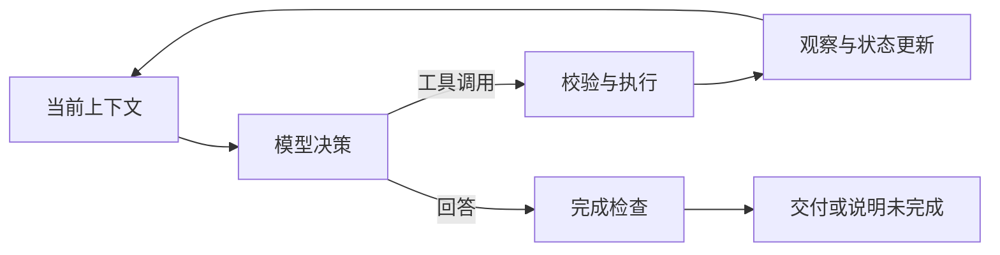

# 流程控制：Workflow 与 Agent Loop

流程控制决定多步任务如何推进：下一步执行什么，使用哪些前序结果，何时分支、重复或结束。Workflow 由预定义结构安排主要路径；Agent Loop 让模型根据当前观察提出后续动作，程序负责执行与边界。二者可以组合，不是必须逐级升级的两代系统。[[3]](../references.md#source-anthropic-agents)

---

## 一、步骤、数据和状态

一个步骤接收输入、完成操作并产生输出。依赖说明步骤何时可执行，数据传递说明后续步骤读取什么；状态则记录目前已经发生的事实。

| 概念 | 问题 | 例子 |
| --- | --- | --- |
| 步骤 | 做什么 | 读取配置、生成解释 |
| 数据依赖 | 需要谁的结果 | 解释需要读取内容 |
| 控制条件 | 是否走这条路 | 找到文件后才解释 |
| 状态 | 已发生什么 | 已读取版本 r2，尚未验证运行值 |
| 完成条件 | 何时交付 | 回答有对应证据且覆盖用户问题 |

计划「读取配置」是未来安排，状态「已读取」必须由实际结果更新。把计划文本直接当成完成记录，会让后续步骤依赖不存在的输入。

---

## 二、Workflow：预定义路径 {#workflow}

以「根据文档回答一个配置问题」为例，固定流程可以是读取资料、检查是否有答案、生成或澄清、核对并交付。



这里模型参与生成，主路径仍由程序规定。输入变化可以走不同分支，但分支的类型和条件事先可描述。

一次正常过程：

| 步骤 | 输入 | 输出 | 后续使用 |
| --- | --- | --- | --- |
| 读取 | 指定配置文件 | 端口 8080，来源 r2 | 提供事实 |
| 检查 | 用户问题与字段 | 所需字段存在 | 进入生成 |
| 生成 | 事实与解释要求 | 端口说明 | 进入核对 |
| 核对 | 说明和原始字段 | 数值与来源匹配 | 交付 |

若字段缺失，流程可以直接说明无法确认，不必强制让模型猜出答案。验证失败时也可以设置有限修正循环；有循环不等于变成 Agent。

### 常见控制结构

- 顺序：后一节点依赖前一节点。
- 分支：按条件选路径，避免执行无关动作。
- 并行与汇合：独立步骤同时推进，明确等待全部还是部分结果。
- 有界循环：重复检查或修正，设置次数与停止条件。

DAG 是无环依赖图；包含回路的 Workflow 不能简单按一次拓扑排序执行。图式表达便于展示复杂依赖，简单固定流程也可以用普通函数组合表达，概念不依赖框架。

---

## 三、Agent Loop：依据观察选择下一步 {#agent-loop}

Agent Loop 在一次模型输出与下一次模型输入之间形成反馈。模型可以提出工具调用，也可以提出回答；工具产生新观察后，模型重新判断，而不必提前列出全部路径。



图中的循环保存外部可验证的动作和观察，不要求输出或存储模型完整内部推理。ReAct 的原始研究讨论推理与行动交错，现代工具循环可借鉴反馈关系，但不必复制论文中的提示格式。[[48]](../references.md#source-react-paper)

### 完整过程推演

用户问「服务为什么采用 60 秒超时」：

1. 模型先选择读取配置，工具返回声明值 30 秒。
2. 模型看到该结果，提出检查覆盖来源。
3. 经允许的只读检查返回环境变量值 60 秒。
4. 模型结合配置与覆盖规则给出解释。
5. 程序核对回答依据，交付结果并结束。

如果第二步发现没有权限，则可以解释尚未确认的部分或请求必要授权，不能把更换路径绕过权限当作正常探索。

### 最小控制算法

```text
RUN-LOOP(task, budget)
	state ← INITIALIZE(task)
	while HAS-BUDGET(budget) and not CANCELLED(state) do
		decision ← GENERATE(BUILD-INPUT(state))
		budget ← ACCOUNT(budget, decision)
		if decision is incomplete then
			return REPORT-INCOMPLETE(state)
		end if
		if decision contains tool calls then
			results ← VALIDATE-AND-EXECUTE(decision.calls, budget)
			state ← APPEND-OBSERVATIONS(state, decision, results)
			budget ← ACCOUNT(budget, results)
		else
			return CHECK-AND-REPORT(state, decision)
		end if
	end while
	return REPORT-LIMIT(state)
```

执行步骤应遵守剩余时间和动作预算；被拒绝的调用不进入实际执行。若一次输出同时包含说明文字和工具调用，应先处理待执行调用，不能仅因出现文字就宣布任务结束。

---

## 四、结束条件不是一句「完成了」

| 结束原因 | 应交付什么 |
| --- | --- |
| 已满足目标 | 结果与必要依据 |
| 缺少资料 | 已知内容和缺失项 |
| 权限不足 | 未执行范围与所需用户决定 |
| 预算耗尽 | 已完成部分、未完成部分 |
| 用户取消 | 已停止的工作及已发生效果 |
| 执行失败 | 失败事实与可确定的状态 |

模型不再调用工具，只说明本次没有新的动作提议。是否完成仍由任务条件决定。反过来，缺资料时明确说明也可能是正确结果，不应为了循环次数而继续探索。

---

## 五、比较与组合

| 维度 | Workflow | Agent Loop |
| --- | --- | --- |
| 主要路径 | 预定义 | 依据观察动态提出 |
| 模型职责 | 完成指定节点 | 同时参与动作选择 |
| 可预测性 | 路径更易枚举 | 需要检查更多可能轨迹 |
| 适用任务 | 步骤稳定、规则明确 | 后续动作依赖未知观察 |
| 边界 | 节点契约与分支规则 | 工具范围、预算、终止条件 |

固定审核流程可以在「调查原因」节点内运行 Agent；Agent 也可以把稳定的查询流程当作一个工具。比较时应考虑任务表现和控制成本，不以自主性多少作为质量排名。

规划、多 Agent 和动态代码编排改变的是任务分解、执行者组织或控制表达，见对应专题；理解最小循环不要求先掌握它们。

---

## 学习检查与参考资料

判断以下推论为何不成立：「有三个模型调用，所以是 Agent」「存在循环，所以不是 Workflow」「模型回答结束，所以任务成功」。关键分别是控制权、预定义结构和独立完成条件。

- [[3] Building effective agents](../references.md#source-anthropic-agents)
- [[48] ReAct 原始论文](../references.md#source-react-paper)
- [规划与计划修订](reasoning-planning.md)
- [多 Agent 协作](subagents-multi-agent.md)
- [动态代码编排](dynamic-workflows.md)
