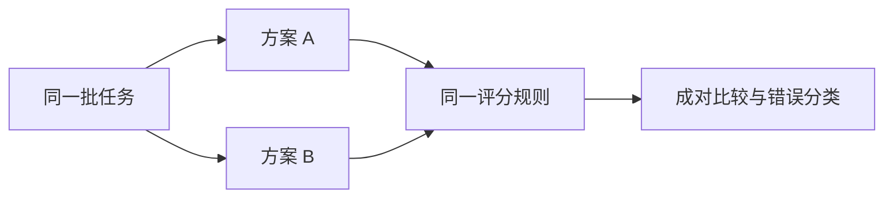

# 评测：对象、标准与实验设计

评测用明确的任务、输入和判定方法检查系统表现。Agent 的评价对象不只有最终文字，还包括工具选择、执行过程和环境中的实际结果。只有先定义成功，分数才有可解释的含义。

---

## 一、先确定评价对象

| 对象 | 要判断什么 | 合适证据 |
| --- | --- | --- |
| 回答 | 正确、完整、符合要求 | 原始资料与评分标准 |
| 结构化输出 | 字段合法且语义正确 | Schema 与业务规则 |
| 工具调用 | 工具和参数是否匹配任务 | 任务范围、实际调用记录 |
| 执行过程 | 是否遵守必要约束 | 事件、授权、步骤结果 |
| 最终环境 | 目标是否真实成立 | 文件、业务状态或测试结果 |

「模型说已修改」不是文件改动证据；「工具返回成功」也未必证明修改符合用户要求。纯问答任务可以主要核对文本与来源，写入任务则需要检查实际状态。[[66]](../references.md#source-anthropic-evals)

一个验收条件可写为：「从给定配置提取显式端口；缺失时返回 null；不得以框架默认值补全」。比「回答准确」更容易生成样例并定位错误。

---

## 二、评分方法

| 方法 | 适合对象 | 局限 |
| --- | --- | --- |
| 规则检查 | 字段、数值、范围、格式 | 难表达开放语义 |
| 程序或环境检查 | 文件行为、业务结果 | 检查本身可能不完整 |
| 人工评价 | 开放答案与复杂判断 | 成本、速度、一致性 |
| 模型辅助评分 | 大量语义判断或成对比较 | 偏差、误判、评分漂移 |

模型评分应给明确维度、参考依据和分级标准，并与人工标注校准。回答顺序、长度和措辞都可能影响评分；成对比较可以随机交换位置，避免固定顺序偏差。[[76]](../references.md#source-openai-eval-design)

评分器不要仅凭候选答案自行声称「已经检查」。能读取实际环境结果时，优先使用独立证据。

---

## 三、数据集与重复运行

样例至少包含正常输入、缺失信息、歧义、边界条件和重要失败场景。对图片问答，还应包含清晰、模糊、遮挡以及文字与图片不一致的情况。

开发集用于发现问题与调方法，保留集用于检验未见样例。把所有失败样例都写进 few-shot 后再在同一批样例上评分，不能说明泛化改善。

同一个任务多次运行可能产生不同轨迹。应分别报告一次尝试的表现和多次尝试策略的表现；允许重试三次得到的成功率，不能直接与别人一次尝试比较。

设 $N$ 次已评分运行中有 $S$ 次成功，则本样本的成功比例为：

$$
\widehat{p}=\frac{S}{N}
$$

样本较少时估计不稳定；同一任务的重复运行也可能相关。应保留任务级结果，报告分组差异与适当的不确定性，而不只给一个精确到小数点后很多位的总分。

---

## 四、对照实验：以 Prompt 改动为例 {#experiments}

假设旧提示为「提取端口」，新提示增加「只取显式值；缺失时返回 null」。待检验的假设是新提示减少默认值猜测，而非无条件提高所有任务表现。

实验步骤：

1. 固定模型设置、工具、资料和预算，只改变提示。
2. 使用相同样例，交错或随机安排运行顺序。
3. 对不稳定任务重复运行，保存原始输入输出。
4. 分别检查显式值、缺字段、注释旧值、多个环境。
5. 同时比较正确性、拒答、调用数、长度和时间。

下面是虚构的统计练习，不是项目实测：

| 同一组 20 个任务 | B 成功 | B 失败 |
| --- | ---: | ---: |
| A 成功 | 14 | 2 |
| A 失败 | 3 | 1 |

A 成功 16 个，B 成功 17 个；B 净增 1 个，但同时修复 3 个、退化 2 个。应检查退化的任务是否属于高风险边界，而不是只宣布总体提高 5 个百分点。

---

## 五、过程与结果共同评价

相同目标可能存在多条合法轨迹，不宜把某一条工具顺序设为唯一标准，除非顺序本身是任务约束。否则会惩罚更短或不同但正确的方法。

另一方面，最终答案碰巧正确也不能掩盖越权读取、遗漏审批或虚构执行。结果评分判断目标，过程评分检查必要约束。

故障注入可覆盖工具超时、部分结果、权限拒绝、用户取消和恢复中断。先给每种情况规定允许的行为与禁用行为，再观察系统是否满足；不是把所有异常都要求自动修复。

---

## 六、评测如何用于改进

先根据轨迹定位错误层次，再提出一个可检验改动。例如正确资料未进入输入应检查检索与选择，资料已给出却误读单位应检查提示或生成，工具已执行却报告失败应检查结果转换。

随后在开发集验证假设，在保留集确认边界，最后把有价值的失败样例加入回归集。优化对象也包括评分器本身，评分规则变更后旧分数未必可直接比较。

学习自检：为什么答复更长不代表更完整？为什么任务成功率不能替代安全指标？为什么相同平均分可能有完全不同的错误分布？

---

## 参考资料与后续阅读

- [[66] Agent 评测](../references.md#source-anthropic-evals)
- [[76] Evaluation best practices](../references.md#source-openai-eval-design)
- [可观测性](observability.md) · [性能与成本](performance-cost.md) · [版本与回归](versioning-release.md)
