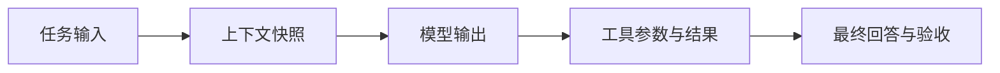

# 可观测性：事件、Trace 与故障诊断

可观测性提供运行过程的证据，使人能够解释一次结果如何产生。评测判断好坏，可观测性帮助定位原因；记录很多文本不等于能够重建控制与数据关系。

---

## 一、四种观测信息

| 信息 | 主要作用 | 例子 |
| --- | --- | --- |
| 日志 | 描述局部事件与上下文 | 参数校验失败 |
| 事件 | 记录有意义的状态变化 | 任务开始、等待审批、结束 |
| Trace | 关联一次任务的调用结构 | 模型步骤及其工具子步骤 |
| 指标 | 汇总大量运行的分布 | 成功率、延迟分位数、队列长度 |

一条 Trace 中的 Span 表示一段工作，父子关系表达调用关系；跨并行任务的关联不一定能用严格树形包含表达，可额外保留链接或任务 ID。具体字段与语义约定应按版本理解。[[65]](../references.md#source-otel-genai-repo)

---

## 二、先建立关联，再增加内容

最小记录需要定位任务、尝试、步骤和调用。对模型步骤，记录使用的输入或受控引用、配置版本、输出类型、结束原因和用量；对工具步骤，记录实际参数、执行状态、结果引用和耗时。

```json
{
	"task_id": "task-17",
	"attempt_id": "attempt-1",
	"step_id": "step-3",
	"parent_step_id": "step-2",
	"kind": "tool",
	"status": "not_found",
	"duration_ms": 18
}
```

这里 `not_found` 是业务结果，不一定是传输错误。观测系统应保留不同层次的状态，否则会把「查询完成但无此对象」误报成基础设施故障。

事件序号帮助去重和补读；时间戳帮助观察时间。分布式时钟可能偏移，不能只凭两个节点的时间戳推断因果顺序。

---

## 三、读取一条任务轨迹



沿图逐段检查：输入是否正确，模型是否看到关键资料，动作是否匹配，结果是否完整，最终结论是否有支持。第一处明确偏离预期的位置通常比最后一条报错更有诊断价值。

例如最终端口回答错误：若工具返回正确值但模型没收到，检查结果转换与上下文组装；若收到正确值但答错，检查生成与输出处理；若工具读了另一环境，检查参数和任务范围。

---

## 四、延迟与停滞

总时间包含排队、资料读取、模型生成、工具执行、人工等待及验证。并行调用不能直接把所有 Span 时长相加当作墙钟时间，应寻找关键路径。

停滞也要区分：等待用户、等待资源、工具仍在运行、反复生成无新信息，具有不同含义。只有心跳而无进展，不足以证明任务正常推进。

告警应围绕实际承诺，例如队列等待或任务完成期限；不能把正常审批等待等同于系统故障。

---

## 五、信息成本与保护

完整请求和工具输出有助于复查，也会增加存储和隐私成本。可以对日常统计采样，对关键状态变更保留必要记录；涉及秘密、个人信息或跨租户资料时，在写入前脱敏并限制访问。

被采样的 Trace 不能作为完整恢复日志。某条日志不存在，也不证明动作没有发生；审计和恢复若有完整性要求，需要另行保证。

学习自检：为什么最终错误日志不足以诊断模型问题？因为它没有说明模型实际输入和前序工具结果；为什么 Trace 正常结束也不保证任务正确？因为它记录执行过程，不替代验收标准。

---

## 参考资料

- [[65] OpenTelemetry GenAI 语义约定阅读记录](../references.md#source-otel-genai-repo)
- [评测对象与标准](evaluation.md)
