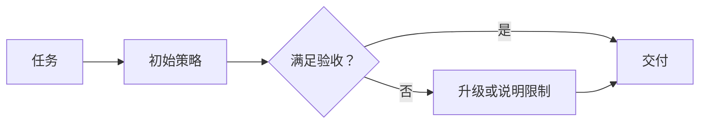

# 性能与成本：测量、权衡与优化

Agent 的成本来自多次模型生成、工具执行、检索、存储和可能的人工处理；用户感知延迟由整个任务路径决定。单次模型更快或 token 更少，不必然使整体任务更有效。

---

## 一、先固定比较条件

比较方案前记录任务集、输入输出长度、模型能力与生成设置、工具版本、并发、缓存状态和运行环境。若实验涉及本地推理，还应记录硬件、精度、批量和软件版本。

| 指标 | 说明 |
| --- | --- |
| 任务成功率 | 在同一验收标准下完成的比例 |
| 总完成时间 | 从接收到最终交付，包括排队 |
| 首个可用反馈时间 | 不仅是收到一个无意义字符 |
| 模型与工具调用数 | 解释循环和往返成本 |
| 输入、缓存、生成用量 | 按各自统计口径记录 |
| 每个成功任务成本 | 将失败尝试也纳入消耗 |

没有上述条件的「快两倍」「省一半」很难迁移到其他任务。

---

## 二、分解时间与费用

对于串行流程，可近似把时间分为排队、准备输入、模型、工具和验证；并行流程应按关键路径计算。

设任务内所有尝试总成本为 $C_{\mathrm{all}}$，成功任务数为 $N_{\mathrm{success}}>0$，则：

$$
C_{\mathrm{per\ success}}=\frac{C_{\mathrm{all}}}{N_{\mathrm{success}}}
$$

例如两个假设方案都处理 100 个任务：A 总成本 100 单位、成功 90 个，B 总成本 80 单位、成功 60 个。A 每成功任务约 1.11 单位，B 约 1.33 单位。单次便宜不代表完成目标更便宜。

对输入缓存，缓存 token 是输入的子集；推理 token 通常也是相应生成统计的一部分。不要重复相加。费用应按实际服务口径计量，不能从总 token 数直接推断账单。

---

## 三、主要优化手段

| 手段 | 可能收益 | 需要检查的损失 |
| --- | --- | --- |
| 减少无关资料 | 输入更小、干扰减少 | 关键事实是否遗漏 |
| 减少无效循环 | 调用次数下降 | 是否提前放弃必要验证 |
| 独立工具并行 | 缩短关键路径 | 资源竞争与状态一致性 |
| 前缀缓存 | 减少重复前缀计算 | 命中条件、缓存失效 |
| 控制输出长度 | 降低生成成本 | 回答是否完整 |
| 按任务分配能力 | 简单任务使用较低成本能力 | 路由错误与兜底开销 |

流式输出主要改变结果到达方式，不自动减少生成工作。KV、前缀和结果缓存的基本区别见[模型交互](../model/llm-api.md#cache)，性能实验应分别测量，而不是合并成一个「缓存开启」变量。

---

## 四、路由与级联

路由根据任务特征选择处理能力；级联先尝试一种较低成本策略，未满足标准时升级。前者需要可判断的任务分类，后者需要可靠的失败或质量识别。

图中检查必须有依据。模型自报高置信度不一定可靠，若错误没有被识别，级联不会触发；若总是升级，则承担两次成本。

升级也不能增加未经授权的动作范围。能力变化与权限变化是两回事。

---

## 五、性能实验

先建立正确性基线，再单独改变一个变量。缓存实验应分别测冷、热状态；并发实验报告吞吐和尾延迟；压缩实验同时记录摘要与回查成本。

比较平均值之外，还应查看较慢任务及失败任务。少数无限循环或重复重试可能支配总成本，而平均输入长度无法解释它们。

学习自检：为什么并行所有步骤不能保证加速？存在依赖、资源竞争和汇合等待；为什么更短轨迹不一定更好？可能省略了必要检查。

---

## 参考资料

- [[16] 前缀缓存机制](../references.md#source-vllm-apc)
- [[18] 请求缓存与统计](../references.md#source-openai-cache)
- [评测与对照实验](evaluation.md#experiments)
- [可观测性与延迟分解](observability.md)
