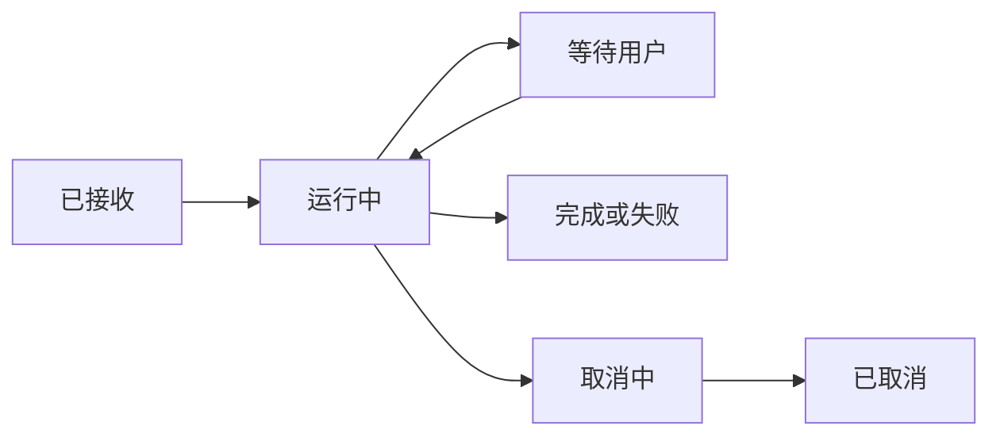

# Agent 运行时：组成与任务生命周期

Agent 运行时把模型交互、上下文、工具和控制方法组成一个能够接收任务并交付结果的程序。Harness 通常强调围绕模型的支撑设施：输入构造、能力执行、检查、交互和资源管理。它不是另一个模型，也不要求拆成多个服务。

---

## 一、单进程中的基本组成

| 部分 | 输入 | 产出 |
| --- | --- | --- |
| 输入处理 | 用户目标与附件 | 明确的任务范围 |
| 上下文构造 | 指令、历史和当前观察 | 模型请求 |
| 模型接口 | 请求 | 回答或动作提议 |
| 工具执行 | 经校验的名称和参数 | 观察、回执与产物 |
| 控制逻辑 | 决策、结果和预算 | 下一步或终止 |
| 完成检查 | 任务条件与证据 | 完成、部分完成或失败 |

这些是逻辑角色，可以存在于同一程序中。区分它们的价值在于说明数据和控制关系，而不是立即引入网络、消息队列或分布式部署。

<AgentRuntimeExplorer />

交互图用正常完成、工具失败和权限不足展示同一个运行过程的不同路径。模型建议与实际动作之间有检查，结束状态必须反映实际发生的事情。

---

## 二、一次任务从接收到交付

以「读取指定配置并解释端口」为例：

1. 接收目标，确定只读范围和需要解释的文件。
2. 初始化本次任务状态与资源预算。
3. 组织输入，模型提出读取动作。
4. 校验并执行，保存实际读取内容。
5. 将观察加入输入，生成解释。
6. 核对数值和来源，交付答案。
7. 结束任务，释放该任务拥有的临时资源。

这条路径不需要长期记忆或持久任务恢复。若目标只是解释用户已经贴出的配置，第 3、4 步甚至可以省去；运行时应支持这样的小任务，而不是强制每次都规划、搜索和反思。

---

## 三、运行对象不能混为一谈

| 对象 | 含义 | 生命周期 |
| --- | --- | --- |
| 会话 | 一组有顺序的交互记录 | 可跨多个任务 |
| 任务 | 用户希望取得的结果 | 从接受到终态 |
| 执行尝试 | 一次具体推进过程 | 失败后可产生新尝试 |
| 步骤 | 一个模型或工具操作 | 某次尝试内 |
| 进程 | 承载执行的系统资源 | 不必与任务一一对应 |

一个任务可因进程退出产生第二次尝试；一个长驻进程也可处理多个任务。会话仍存在，不代表任务还在运行；进程在线，也不代表某个任务成功。

应分别保存任务状态和自然语言回复。前者用于控制与界面同步，后者用于解释结果；不能靠搜索回复中有没有「完成」来推断终态。

---

## 四、状态与交互

图中等待不是失败，取消中也不是已经取消。状态应有明确进入条件：审批请求被保存后可进入等待；在途动作处理完并确认不再启动新动作后，才可报告取消完成。

用户新消息可能是补充资料、调整目标或新的独立任务。运行时应确定它在哪个步骤边界生效，并说明尚未影响哪些已经执行的操作。[人工控制](human-control.md)进一步讨论这些情况。

---

## 五、从单任务到持久运行

当系统承诺刷新界面或进程重启后仍可继续任务，就需要保存执行位置、结果和未确定动作。这与聊天历史的保存不同：恢复时关心某个副作用是否已经发生，以及哪些步骤可以继续。[任务恢复](persistence-recovery.md)展开相关语义。

多个任务同时运行时，再增加排队、执行所有权、资源配额和取消传播。只有明确这些对象与状态后，调度与服务化才有可解释的边界。

工程扩展应服务于实际承诺。例如「允许长任务跨重启继续」需要持久状态；没有这一要求的单次只读任务可以在失败后明确结束。长期运行的 Harness 实践提供了任务分阶段与外部产物协作的案例，不代表所有程序必须采用相同结构。[[29]](../references.md#source-anthropic-long-harness)

---

## 六、运行时的检查

沿一条任务轨迹检查每个边界：

- 输入是否属于用户目标，附件是否真正可读。
- 模型输出是否完整，工具参数是否通过检查。
- 状态是否依据实际观察推进。
- 等待、取消和失败是否能对用户解释。
- 完成是否有证据，资源是否被释放。

学习自检：为什么「模型请求成功」「工具返回成功」「任务完成」不能共享一个布尔值？它们对应不同对象，前一层成功只是后一层的输入条件之一。

---

## 参考资料与进阶阅读

- [[21] Harness 工程实践](../references.md#source-openai-harness)
- [[29] 长任务 Harness](../references.md#source-anthropic-long-harness)
- [人工控制](human-control.md) · [任务恢复](persistence-recovery.md)
- [调度与接入](scheduling-protocols.md) · [安全与隔离](security.md)
