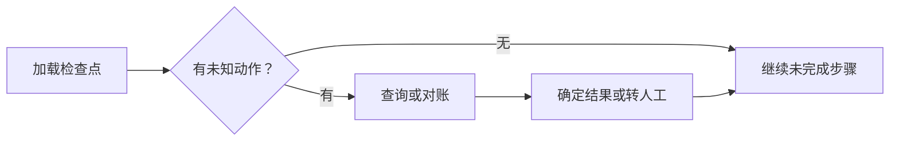

# 任务恢复：检查点、重放与副作用

任务恢复是在执行被中断后，依据保存的状态继续尚未完成的工作。保存聊天记录只恢复「曾经说过什么」，任务恢复还必须说明「动作是否发生、结果是否确定、应从哪里继续」。

---

## 一、需要保存什么

| 信息 | 恢复用途 |
| --- | --- |
| 任务目标与约束 | 确认仍要完成什么 |
| 当前执行位置 | 确定后续步骤 |
| 已完成步骤与结果 | 避免无依据重复 |
| 待执行或未知动作 | 进行查询、核对或人工决定 |
| 产物引用与版本 | 找到可继续使用的数据 |
| 程序与契约版本 | 判断旧状态能否继续解释 |

检查点是某个执行位置的状态快照，事件记录描述状态变化序列。二者可以组合：快照提供快速加载，后续事件补齐进度。普通日志可能缺失或采样，不应默认作为唯一恢复依据。

---

## 二、最关键的中断窗口

设任务需要在外部系统创建一条记录：

| 时刻 | 实际情况 | 重启后要判断 |
| --- | --- | --- |
| A | 已保存意图，尚未发送 | 是否仍允许执行 |
| B | 请求已发出，结果未返回 | 外部可能已执行 |
| C | 外部成功，本地未保存回执 | 不能仅凭缺回执再次创建 |
| D | 本地已保存成功回执 | 可继续后续步骤 |

B 和 C 是结果不确定的窗口。数据库里没有成功记录，不足以证明外部操作未发生。

图中查询可能仍无法确定结果；这时应保留等待或转人工状态，不能把未知强行改成失败后自动重试。

---

## 三、幂等与结果复用

幂等关注同一业务操作重复请求是否产生额外效果。常见方式是由外部服务接受稳定操作键，识别重复并返回原结果；它依赖服务端实现及键的作用域、有效期，不是客户端加一个字符串就成立。

复用已保存结果则是避免重新发出动作。它要求结果与当前任务、参数和版本匹配；不能把另一次读取的旧数据无条件当成当前事实。

跨本地存储与外部系统通常不存在一个天然的原子事务。若没有服务端去重、状态查询或其他协调机制，不能轻易承诺「恰好一次」。

---

## 四、恢复位置与重放

恢复方式可以是读取状态后继续、从节点起点重执行，或重新运行控制逻辑并复用已记录步骤结果。不同方式对确定性和副作用位置有不同要求。[[25]](../references.md#source-langgraph-persistence) [[46]](../references.md#source-langgraph-functional)

若重放按步骤序号匹配结果，修改控制结构可能使旧结果对应错误位置。更稳定的步骤标识和版本检查有助于发现不兼容，但也需要维护成本。

模型再次生成未必产生同样动作。历史决策若是恢复依据，应保存实际结果；重新生成属于新的尝试，不能被描述为精确重放。

---

## 五、恢复后的现实检查

停机期间权限可能撤销、文件可能变化、用户可能取消任务。恢复时要重新检查当前有效条件，不能因为过去批准过就永远继续。

补偿是用新动作抵消一部分旧效果，不等于时间倒流。删除刚创建的记录可能无法撤回已经发出的通知，必须说明可补偿范围。

学习自检：工具超时后程序重启，能否直接重试？先回答是否可能已执行、能否查状态、是否提供幂等语义，再决定下一步。

---

## 参考资料

- [[25] Persistence](../references.md#source-langgraph-persistence)
- [[46] Functional API 与重放](../references.md#source-langgraph-functional)
- [[47] 中断恢复](../references.md#source-langgraph-interrupts)
