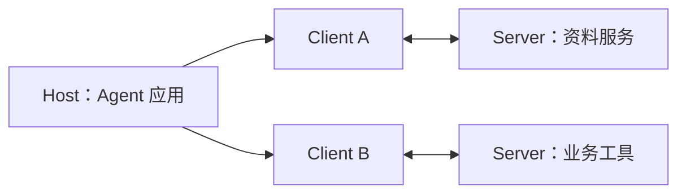

# MCP：能力发现与外部连接

Model Context Protocol（MCP）定义应用与能力提供方之间的协议，使工具、资源和提示能够以约定方式被发现和使用。它连接的是宿主与能力服务，不是一种模型消息角色，也不是完整的 Agent 控制流程。

以下用版本化的 2025-11-25 架构说明 Host、Client、Server 及基础对象；连接初始化和会话行为只适用于该版本，不将其视为所有后续版本的规则。[[77]](../references.md#source-mcp-architecture-202511)

---

## 一、Host、Client 与 Server

Host 管理模型交互、上下文和用户控制；Client 负责与对应 Server 通信；Server 提供具体能力。Host 可以连接多个服务，再选择本次请求需要暴露的工具或资料。

模型通常看到的是宿主整理后的工具说明，而不是直接维护所有协议连接。服务端宣称有某项能力，也不意味着宿主已经允许当前用户使用它。

---

## 二、三类基础对象

| 对象 | 核心含义 | 例子 |
| --- | --- | --- |
| Tools | 可请求执行的操作 | 搜索资料、查询订单 |
| Resources | 可读取的上下文对象 | 文档、资源内容 |
| Prompts | 可选用的提示模板 | 按指定格式分析资料 |

工具描述需要解释参数和结果；资源需要可定位和读取；提示模板需要说明所需输入。它们都可能最终影响模型上下文，但进入上下文的途径不同。

「发现」与「读取」也不同：得到资源列表，只代表知道有这些对象，不代表已经取得正文。工具列表同样只提供可调用能力，不代表动作已经执行。

---

## 三、从连接到一次工具结果

在上述版本中，先进行初始化与能力协商，再进入正常交互。之后可按如下过程理解：

1. 宿主取得能力目录。
2. 依据任务、身份和允许范围选择工具。
3. 把选中工具的说明交给模型。
4. 模型返回名称和参数。
5. 宿主校验并通过 Client 请求对应 Server 执行。
6. 把返回内容转换成模型可用的结果，保留错误和调用关联。

执行路径不因接入协议而免除参数校验。服务错误、工具业务失败和协议解析失败也应分别表示，避免把所有失败压成空文本。

---

## 四、目录变化与能力版本

工具目录可能变化：工具被移除、参数语义更新或用户权限撤销。模型作出选择时看到的是某个目录状态，执行时应验证该能力仍有效。

如果一个工具原来把 `timeout` 解释为秒，后来改为毫秒，即使字段类型未变也发生了语义不兼容。应拒绝不匹配的旧调用或使用匹配版本，而不是默默按新单位执行。

协议版本和工具业务版本是两条不同维度。能成功连接，不代表双方支持相同功能，更不代表工具结果含义一致。

---

## 五、安全与组合关系

远程返回的文本仍是资料，不得借工具结果注入新的高优先级指令。实际访问身份由应用授权体系决定，不能让模型提供任意凭据或把一个服务的令牌转给另一个服务。

MCP 可与 Skill 组合：Skill 告诉模型何时、怎样使用能力，MCP 提供发现与调用渠道。Plugin 可以包装一个连接器；宿主仍负责其生命周期、用户同意和撤销。

学习时应区分两层问题：协议是否可互操作，动作是否被授权且业务正确。前者成立不能推出后者。

---

## 学习检查与参考资料

若模型能列出工具却无法调用，可能缺少哪些环节？逐一检查宿主暴露、用户权限、参数匹配、服务可达性和实际结果，不要只用「MCP 已连接」判定能力可用。

- [[77] MCP 2025-11-25 架构与基础对象](../references.md#source-mcp-architecture-202511)
- [[37] 对应版本安全实践](../references.md#source-mcp-security-202511)
- [[35] 后续协议发布的历史阅读记录](../references.md#source-mcp-release)
