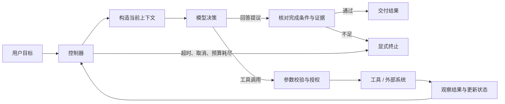
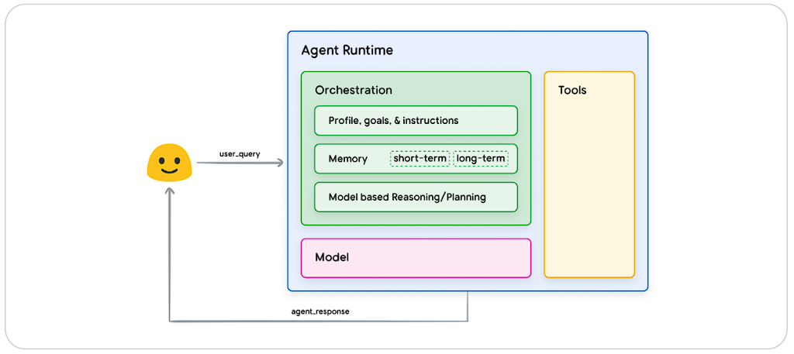

# Agent 系统：让模型在受控边界内完成任务

Agent 是围绕模型建立的受控决策闭环：观察状态、提出动作、校验授权、执行并读取结果，再判断是否继续。模型文本不是环境事实，工具调用也不是授权凭证。本页从这些接口而不是拟人化角色名称出发，解释 Workflow、记忆、规划与多 Agent 的关系。

<AgentRuntimeExplorer />



图中真正构成 Agent 的不是某一个模型，而是「决策—执行—观察—更新」闭环。检索、记忆或多 Agent 都是可选部件，不是定义成立的必要条件。

模型训练与 Agent 运行是两个层次。预训练、指令微调或工具调用训练会改变模型参数；Agent 执行任务时通常固定参数，只把工具结果作为新的上下文继续推理。把观察写进对话不等于模型在线学习，也不会自动在下一次独立任务中保留。

---

## Workflow 与 Agent 的边界

二者的差别在于谁决定控制流，而不在于是否使用 LLM。

| 形态 | 下一步由谁决定 | 适合的问题 | 主要风险 |
| --- | --- | --- | --- |
| 普通程序 | 代码 | 规则稳定、输入边界清楚 | 需求变化需要改代码 |
| LLM Workflow | 代码定义主流程，模型完成局部判断或生成 | 路径可枚举、需要语义能力 | 某一步输出不稳定 |
| Agent | 模型根据观察动态选择动作 | 路径无法预先枚举、需要探索环境 | 成本、终止性与副作用更难控制 |

这是一条连续谱。一个固定工作流可以在某一步调用 Agent；Agent 也可以把稳定子流程封装成单个工具。工程上应把确定部分留在代码中，只把需要语义判断或动态探索的决策交给模型。

---

## 运行时的五个部件



图中的长期记忆是可选扩展；它没有展开授权与完成验证，不能代替上方的执行边界图。

### 模型与决策接口

模型接收目标、可用工具、当前状态和最近观察，输出最终回答或结构化动作。运行时需要明确动作模式，例如：

```json
{
	"tool": "search_documents",
	"arguments": {
		"query": "causal mask",
		"limit": 5
	}
}
```

结构化接口把「模型想做什么」与「系统是否允许并执行」分开。模型生成调用并不等于调用已被授权；参数校验、用户身份、资源权限与副作用确认仍由运行时负责。

### 工具

工具把语言决策连接到可验证的操作，例如读取文件、查询数据库、调用内部 API 或运行测试。一个适合 Agent 的工具应当具有：

- 清楚的名称与单一职责；
- 可验证的输入模式和失败信息；
- 足够小的返回值，避免把无关数据重新塞回上下文；
- 明确的权限与副作用等级；
- 对重试是否安全的说明。

工具越多不代表能力越强。名称重叠、参数含糊或返回值过长，都会提高选择错误与上下文污染的概率。

MCP（Model Context Protocol）可以统一暴露工具、资源和提示等上下文能力，但它解决的是连接接口问题，不替代授权、业务校验、重试语义和运行时控制。

### 状态与上下文

「Memory」常把几种不同问题混在一起，实际应拆开：

| 状态 | 例子 | 生命周期 |
| --- | --- | --- |
| 对话上下文 | 当前请求、最近消息、工具结果 | 单次或多轮会话 |
| 任务状态 | 计划、已完成步骤、中间产物 | 一次任务 |
| 外部知识 | 文档库、代码库、数据库记录 | 独立维护 |
| 持久偏好 | 用户明确保存的配置 | 跨任务 |

RAG 是从外部知识中检索证据并放入当前上下文的技术，不等同于长期记忆，也不自动构成 Agent。持久状态只有在确实需要跨步骤恢复或跨任务复用时才值得引入；否则会增加一致性、过期、隐私与删除成本。

上下文构造需要在有限窗口中选择信息。当前目标、工具 schema、关键约束、最近观察和必要产物通常优先；重复日志和大段原始返回值可以保存在外部状态，只向模型提供摘要与可回查引用。摘要可能遗漏细节，因此关键数值、权限结果和工具错误码不应只保留为自由文本概括。

工具或检索返回的文本属于不可信数据。即使其中出现「忽略之前要求」或伪造的系统消息，也只能作为任务数据处理，不能获得新的指令优先级或工具权限。

### 控制器

控制器维护循环和停止条件，负责把模型输出转换成实际状态迁移。最小循环可以写成：

```text
RUN-AGENT(goal, tools, budget)
	state ← INITIALIZE(goal, budget)

	while not TERMINAL(state) do
		context ← BUILD-CONTEXT(state, tools)
		decision ← MODEL(context)
		state ← ACCOUNT-MODEL-COST(state, decision)

		if BUDGET-EXCEEDED-OR-CANCELLED(state) then
			return EXPLICIT-FAILURE(state)
		end if

		if decision.type = "final" then
			return CHECK-COMPLETION-AND-REPORT(state, decision.output)
		end if

		action ← VALIDATE-AND-AUTHORIZE(decision.action)
		observation ← EXECUTE(action)
		state ← UPDATE(state, action, observation)
	end while

	return EXPLICIT-FAILURE(state)
```

`CHECK-COMPLETION-AND-REPORT` 按任务验收条件区分已完成与未验证；授权校验失败不得进入 EXECUTE。工具必须受剩余 deadline/预算约束，UPDATE 计入工具成本。此处是控制流规格，不是已实现的安全运行时。

预算可以包含最大步骤数、token、时间、工具费用或副作用次数。达到预算时应返回可解释的终止状态，而不是继续无界循环。

### 一次任务怎样迁移状态

假设目标是「查询订单 A102 的物流状态并回复」，运行轨迹可以是：

| 步骤 | 当前状态 | 决策或观察 | 状态变化 |
| ---: | --- | --- | --- |
| 0 | 只有用户目标 | 选择只读工具 `get_order` | 产生待校验动作 |
| 1 | 待校验动作 | schema 校验通过，用户有读取权限 | 执行工具 |
| 2 | 工具执行中 | 返回 `status=shipped`、运单号与时间 | 保存结构化观察 |
| 3 | 已获得订单事实 | 判断完成条件已满足 | 生成基于观察的答复并终止 |

若第 2 步返回「订单不存在」，这也是有效业务结果，不应被当作系统异常无限重试；最终答复应说明无法找到订单。若返回超时，则是否重试取决于工具是否幂等、剩余预算和调用方约定。

工具失败可以按处理方式分类：

| 失败类型 | 示例 | 运行时处理 |
| --- | --- | --- |
| 参数无效 | 缺少订单号、类型错误 | 不执行，要求模型修正或向用户补充信息 |
| 权限拒绝 | 当前身份无权读取 | 停止该动作，不允许模型改写参数绕过 |
| 明确业务结果 | 订单不存在、余额不足 | 作为观察返回，由任务语义决定下一步 |
| 暂时性故障 | 限流、可确认的短暂不可用 | 仅在工具语义允许时有限重试 |
| 结果不确定 | 请求超时但外部操作可能已发生 | 先查询状态或交由用户确认，不能直接重复副作用 |

重试不是默认可靠性机制。只有工具提供幂等键、只读语义或可查询的完成状态时，自动重试才有明确边界。

### 观测与评估

系统至少要记录：模型请求、动作选择、工具参数、工具结果、状态变化、耗时、费用和终止原因。对敏感字段应在记录前脱敏。没有步骤级观测时，最终失败很难定位是检索、规划、工具还是模型输出造成的。

---

## 常用控制模式

### Router

模型只负责把请求分配给一个确定的处理器。它适合意图边界较清楚、流程本身稳定的系统，也是成本最低的 Agentic 模式之一。

### ReAct 循环

ReAct 的研究把推理与动作交错，使后续决策可以依据外部观察修正，而不是先生成一整套计划再不加检查地执行。论文的任务结果来自特定工具和环境，不能推出任何工具集合都可靠。

工程轨迹应保存决策结果、动作参数、观测与状态变化，不要求暴露或保存模型的完整内部推理。可审计性来自外部可验证事件，不能靠一段听起来合理的思考文本替代执行证据。

系统在动作与观察之间交替推进，适合下一步依赖环境反馈的探索任务。实现重点在保留可审计的动作依据、工具结果和状态变化，而非保存模型的长篇推理。

### Plan-and-Execute

计划最好描述可检查的中间结果。例如「查到订单状态后再决定是否查询物流」，比「认真分析订单」更能指导执行。若关键工具返回无权限，原计划不再有效，应暂停该动作而不是让模型尝试另一参数绕过边界。

Reflexion 研究把反馈转成文字记忆供后续尝试使用，其「学习」通常不更新模型权重。反馈可改进后续尝试，也可能总结错因；必须保留原始结果与独立验收，不能让自我反思成为成功标签。

规划器先生成步骤，执行器逐步实施。它适合任务可以分解但具体动作仍需模型参与的场景。计划不应被当作不可修改的合同；外部状态变化或关键假设失败时，应重新规划剩余部分，而不是机械执行旧步骤。

### 多 Agent

一个重要反例是多个 Agent 使用相同资料、相同模型并相互复述结论：表面上多人同意，实际上证据高度相关，不能当作独立验证。有效分工需要独立的信息或执行边界，以及合并时对冲突和来源的明确处理。

多 Agent 只有在任务可以真正隔离、需要并行上下文或角色间存在清晰接口时才有收益。若所有参与者共享同一上下文并串行调用同一模型，多 Agent 往往只增加通信、冲突解决和汇总成本。常见有效边界包括：

- 多个独立来源可并行调查；
- 子任务需要不同工具或权限；
- 独立执行结果可以用明确协议合并。

---

## 可靠性与安全边界

Agent 会把模型的不确定输出转化为真实动作，因此风险主要出现在执行边界：

- 对只读、可逆和有副作用的工具分级授权；
- 删除、付款、发布或外部通知等动作在执行前获取明确确认；
- 将外部内容视为不可信数据，防止其中的指令越过系统约束；
- 为工具设置超时，区分可重试错误与永久错误；
- 为循环设置步骤和费用上限，支持用户取消；
- 最终交付前验证目标条件，而不是把「模型说完成了」当作完成证据。

不要用笼统的「反思」调用掩盖缺少验收条件的问题。若成功可以由测试、查询结果、文件状态或结构化约束判断，应优先使用这些外部证据。

---

## 如何评估 Agent

端到端任务成功率是主指标，但不足以定位问题。至少应按链路拆分：

| 层次 | 典型指标 |
| --- | --- |
| 任务 | 成功率、部分完成率、不可逆错误数 |
| 决策 | 无效动作率、重复动作率、重新规划次数 |
| 工具 | 调用成功率、参数错误率、延迟、超时率 |
| 成本 | token、工具调用数、总时长、外部费用 |
| 安全 | 未授权动作、敏感数据暴露、确认绕过 |

评测任务应覆盖正常路径、工具失败、信息不足、权限拒绝和用户取消。只在所有工具均成功的理想环境中测试，会高估系统可用性。

验收应优先读取环境最终状态，而不是只判断最后回复是否听起来成功。例如创建记录的任务要检查记录是否存在且字段正确；修改文件的任务要检查内容和测试；只读查询则核对回复是否忠实于工具结果。

评测环境还要冻结工具版本、初始状态、权限和故障注入规则。对随机解码或非确定外部服务，应重复运行并报告任务级成功率区间。轨迹长度较短不一定更好：少一步但跳过验证可能降低成本，也可能增加不可逆错误。

---

## 设计顺序

1. 先定义完成条件和允许的副作用；
2. 用普通代码实现稳定、确定的控制流；
3. 把确实需要语义判断的步骤交给模型；
4. 为动作建立结构化接口、权限和停止条件；
5. 增加步骤级观测与任务级评估；
6. 只有在单 Agent 的上下文或并行能力形成明确瓶颈时，再引入多 Agent。

这个顺序使系统的自主性与任务不确定性匹配：路径越开放，越需要清楚的执行边界和可验证的终止条件。

---

## 开发笔记：从原理到实现

本页给出概念框架，[LLM 应用与 Agent 总览](./notes/index.md)在此之上展开从模型交互到运行系统的实现细节，按职责分为五组专题：

| 专题 | 覆盖内容 | 入口页 |
| --- | --- | --- |
| 模型交互 | 一次请求的输入、输出、协议与计算复用 | [LLM API 与消息接口](./notes/model/llm-api.md) |
| 上下文与记忆 | 信息的选择、检索、保存、召回和压缩 | [上下文工程](./notes/context/context-engineering.md) |
| 工具与能力扩展 | 从能力描述到实际执行与扩展生命周期 | [工具调用与执行网关](./notes/tools/tool-calling.md) |
| 控制流程与协作 | Workflow、ReAct、规划、委派与动态编排 | [Workflow 与流程控制](./notes/control/workflows.md) |
| 运行系统与质量 | 持续运行、恢复、调度、安全、评测与调优 | [Harness 架构与接口](./notes/runtime/harness-architecture.md) |

工程落地可从[产品实现索引](./notes/implementation-index.md)按项目反查专题，用[代码示例与实验](./notes/labs.md)核对实现不变量，并在[参考资料](./notes/references.md)确认来源与版本范围。

---

## 参考文献

- Yao, S. et al. (2023). [*ReAct: Synergizing Reasoning and Acting in Language Models*](https://arxiv.org/abs/2210.03629).
- Shinn, N. et al. (2023). [*Reflexion: Language Agents with Verbal Reinforcement Learning*](https://arxiv.org/abs/2303.11366).
- Anthropic. *Building Effective Agents*.
- Model Context Protocol. *Specification*.
