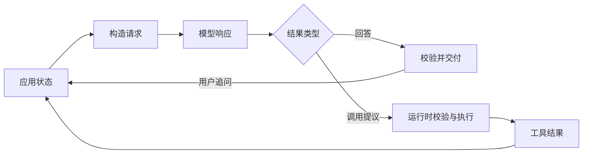

# 模型交互：应用接口与状态续接

模型交互是应用将任务与可用信息编码为请求、取得模型响应，并据此更新应用状态的过程。模型只处理当前调用可见的输入；工具是否执行、结果是否可信、后续是否再次调用，都由应用或模型服务的运行时决定。生成与缓存的内部机制见[模型生成原理](./model-internals.md)。

下文的 JSON 是**概念性数据结构**，用于说明协议语义，不是任何厂商 API 的可直接提交载荷。实际接口可能用 `messages`、`input`、`output` 或事件流表达相同关系；字段名、角色与状态值应按所选接口映射。

---

## 请求契约

一次请求至少要确定模型的输入、允许的输出以及本轮资源边界：

| 组成 | 作用 | 边界 |
| --- | --- | --- |
| 消息 | 按顺序提供指令、用户任务、已有回答与观察 | 只有实际提交或由服务端明确续接的内容可见 |
| 内容块 | 承载文本、图片等输入 | 文件路径或图片名称本身不等于文件内容 |
| 工具声明 | 告知模型可提议的动作及参数形式 | 声明不是工具实现或授权 |
| 输出契约 | 指定文本或结构化结果 | 格式约束不核实事实 |
| 生成控制 | 指定输出预算及接口支持的采样方式 | 上限不保证结果完整，参数支持依模型而异 |

若所需资料已直接给出，最小调用不需要工具或历史：

```json
{
	"messages": [{"role": "user", "content": "配置为 server.port = 8080。端口是多少？"}],
	"output": {"type": "text"}
}
```

一种概念性响应为 `{"status":"completed","items":[{"type":"text","value":"端口为 8080。"}]}`。应用先检查调用成功与结束状态，再消费文本；后续增加工具或历史，只是在相同交互边界上扩展请求和响应。

### 消息、角色与内容块

消息同时表达**来源**和**内容**。指令类消息约束回答范围；用户消息提出当前任务并提供资料；助手消息记录既有回答或调用；工具消息记录外部执行结果。某些接口细分 `system` 与 `developer`，另一些接口把指令作为独立字段；文本中的「System:」不会自动获得指令角色。

一条消息的内容可由有序内容块组成，例如：

```json
{
	"role": "user",
	"content": [
		{"type": "text", "value": "读取截图中的服务端口。"},
		{"type": "image", "value": "<实际传入的图片数据或可访问的图片引用>"}
	]
}
```

图片是否能被处理取决于模型与接口支持，以及图片是否真正上传或由服务端取得。若只提供本地路径字符串，模型不会因此读取该文件。多张图片需要明确顺序和指代；后续追问仍需确保相关图片或足以回答问题的观察处于可用输入中。

请求中的指令可说明任务、依据和输出要求，例如「仅根据已读取的配置提取 `server.port`；字段缺失则返回 null」。指令不能补回没有提交的资料，也不能代替运行时验证。

### 请求示例

用户只提供 `config.yaml` 路径，模型尚未看到文件。应用声明读取工具，并约束最终结果：

```json
{
	"messages": [
		{"role": "instruction", "content": "仅在读取成功后依据配置提取字段；工具失败时不要猜测。"},
		{"role": "user", "content": "读取 config.yaml，提取服务端口。"}
	],
	"tools": [{
		"name": "read_config",
		"description": "读取配置文件并返回文本。",
		"input_schema": {
			"type": "object",
			"properties": {"path": {"type": "string"}},
			"required": ["path"]
		}
	}],
	"output_schema": {
		"type": "object",
		"properties": {"port": {"type": ["integer", "null"]}},
		"required": ["port"]
	},
	"generation": {"max_output_tokens": 128}
}
```

`instruction`、`input_schema`、`output_schema` 等是示意字段。工具参数的模式与最终回答的模式是两份独立契约：前者描述模型能提出什么调用，后者描述应用希望消费什么结果。示例的 `port: null` 只表示**文件已读取但字段缺失**；读取失败须走错误分支，不得套用成功结果的 Schema。不同接口对同一轮的工具调用和结构化最终输出可能有不同约束，不能照搬这一对象直接调用。

---

## 响应语义

响应不必是单段文本。应用应先判断调用和生成是否完整，再按条目类型消费结果：

| 结果 | 所表达的事实 | 应用后续动作 |
| --- | --- | --- |
| 文本 | 模型生成了一段回答 | 按任务校验、呈现或继续处理 |
| 结构化结果 | 模型生成了符合约定结构的数据 | 解析、校验字段及事实来源 |
| 工具调用 | 模型提出工具名称与参数 | 检查工具、参数和权限后执行 |
| 拒绝 | 模型未提供正常业务结果 | 按拒绝分支处理 |
| 截断、过滤或中断 | 当前结果不完整或不可消费 | 明确失败原因，不视作正常完成 |

调用层的错误（例如网络或配额失败）与取得响应后的生成状态也不同。一次响应可以包含多个条目，某些接口还允许文本与工具调用并存，不能只读取第一个文本字段。生成正常结束仅说明本轮模型处理结束，不证明答案真实，更不证明外部动作成功。

结构化输出可由自然语言要求、JSON 语法约束或 Schema 约束实现，保证程度不同。即使 Schema 验证通过，`{"port":8080}` 仍可能与真实配置不符；必须区分**格式有效性**与**事实有效性**。参数 Schema 同样不能代替工具执行时的业务验证和授权。

### 工具调用与观察

对上述请求，模型可能先返回：

```json
{
	"status": "tool_calls",
	"items": [{
		"type": "tool_call",
		"id": "call-1",
		"name": "read_config",
		"arguments": {"path": "config.yaml"}
	}]
}
```

这是调用**提议**，不表示文件已读取。运行时应核对调用 ID、工具名称与参数，对允许的路径执行读取，再将结果作为观察交回。若工具失败，返回「读取失败」及原因，不应伪造空文件，更不能把错误推断为端口字段缺失。完整的校验、授权、副作用与重试语义见[工具调用机制](./tool-mechanics.md)。

这次调用之后，下一次请求需要保留原问题和模型的调用条目，并增加与调用 ID 对应的工具结果：

```json
[
	{
		"role": "assistant",
		"items": [{
			"type": "tool_call",
			"id": "call-1",
			"name": "read_config",
			"arguments": {"path": "config.yaml"}
		}]
	},
	{
		"role": "tool",
		"call_id": "call-1",
		"content": "server:\n  port: 8080\n  timeout_seconds: 30\n"
	}
]
```

这里的数组只是**在原请求的消息之后追加的条目**，并非可独立发送的完整请求。若响应含多个工具调用，需要逐个关联结果；有的模型还要求原样续接推理等非文本条目。完成续接后，模型才能依据配置内容生成 `{"port":8080}`。工具结果是观察数据，不因进入上下文而变成高优先级指令。

---

## 状态续接

**用户轮次与模型调用次数不是同一概念。** 一次用户提问可以先产生工具调用，再由工具结果触发第二次模型调用；相反，用户第二次追问通常需要新调用，但未必需要新工具。



图中回路更新的是应用可持有的历史、任务状态和观察；模型参数不会因为一次对话而改变。生成结果经校验后交付，也不自动成为下轮可信事实。

多轮可通过三种方式组织，其共同要求是下一次调用能获得正确的历史和指令：

| 续接方式 | 历史由谁管理 | 关键限制 |
| --- | --- | --- |
| 消息重放 | 应用保存并重新提交相关条目 | 不应假定只发送最新问题也能继承前文 |
| 响应链 | 服务端根据前一响应标识关联历史 | 需核实指令是否自动继承、是否重复提交历史 |
| 持久会话 | 服务端存储对话状态，应用追加新条目 | 需明确状态保留、可见范围和失效条件 |

例如第一轮读到 `timeout_seconds: 30`，第二轮用户问「若改成 60 呢？」属于假设，不能据此改写原配置；「刚才贴错，实际是 60」才是事实更正。历史中的助手回答可能有误，可信依据仍应追溯到用户提供的资料或工具观察。

对话变长时，输入必须受[上下文窗口](./model-internals.md#capacity)约束。如何从历史、记忆和知识中选择资料，见[Context 边界](./context-boundary.md)；如何裁剪与摘要，见[上下文压缩](./context-compression.md)。缓存复用不能替代这两项工作。

---

## 流式交付

非流式返回完整响应；流式返回一系列增量事件。两者的生成结果可以具有相同语义，但解析过程不同：

1. 按事件序号和条目 ID 汇集文本与调用参数，不将网络分包视为完整事件。
2. 在收到明确的完成信号后，解析结构化数据和工具参数；增量片段不一定是合法 JSON。
3. 对拒绝、截断、过滤、连接中断分别处理；已展示的部分文本不等于完整结果。
4. 有外部副作用的调用须等参数完整并通过运行时校验后再执行。

某些协议会先发送角色或空增量，再发送可见正文。因此首事件时间、首段可见文本时间与响应完成时间也应区分。流式使用户可能更早看到部分内容，但不保证任务更早完成。

---

## 资源与职责边界

消息、图片、工具说明、历史和工具结果都可能计入输入容量；输出预算还须容纳非可见的生成条目。`usage` 类字段表示实际计量，缓存命中和推理 Token 可能是输入、输出总量的细项，不能重复相加。容量、采样与缓存的机制见[模型生成原理](./model-internals.md)。

应用应分别记录请求状态、模型结束状态、工具执行结果与任务验收结果。例如「模型已生成调用」「工具已返回文件」「端口已核对」是三个不同断言。请求重试是否安全还取决于工具是否已执行；不能把模型调用重试与外部动作重放混为一谈。

不同服务对消息角色、工具调用、结构化输出、流式事件和会话状态的支持不一致。本文的示意对象只定义**需要表达的关系**，不定义统一的线上协议；实际实现须依据目标服务的接口约定映射和校验。OpenAI 的 [Function calling](https://developers.openai.com/api/docs/guides/function-calling)、[Structured outputs](https://developers.openai.com/api/docs/guides/structured-outputs) 与 [Conversation state](https://developers.openai.com/api/docs/guides/conversation-state) 可作为一组具体接口示例。

---

## 参考资料

- OpenAI. [Function calling](https://developers.openai.com/api/docs/guides/function-calling)：工具声明、调用条目与结果回传。
- OpenAI. [Structured model outputs](https://developers.openai.com/api/docs/guides/structured-outputs)：结构化输出约束。
- OpenAI. [Conversation state](https://developers.openai.com/api/docs/guides/conversation-state)：历史续接与服务端状态。
- OpenAI. [Images and vision](https://developers.openai.com/api/docs/guides/images-vision)：图文消息与视觉输入。

在线接口文档核验于 2026-09-26；示例结构是概念模型，不对应其具体字段或参数值。
