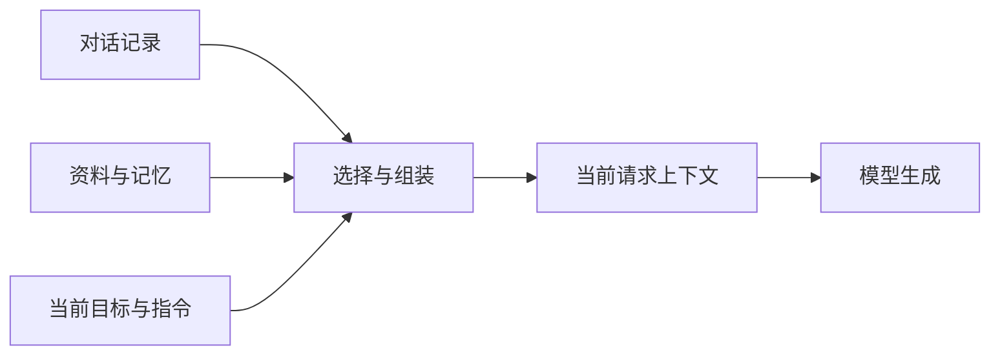

# 上下文管理：组织、存取与选择

上下文是一次生成中模型实际可用的信息。对话记录、知识库和长期记忆是信息来源，只有经过读取与选择、进入本次请求的部分，才构成本次上下文。保存了资料，不等于模型已经看到资料。

理解消息角色、用户追问和工具结果回填后，可以进一步研究：哪些信息应该长期保存，哪些应该在当前轮次出现，以及怎样保持它们的来源和完整性。

---

## 一、上下文的组成

| 信息 | 主要作用 | 组织时要保留的性质 |
| --- | --- | --- |
| 应用指令 | 规定任务角色、行为和输出要求 | 适用范围、版本、指令层级 |
| 当前用户消息 | 表达当前目标与新增约束 | 原意、附件、与此前目标的关系 |
| 历史交互 | 支持指代与过程连续性 | 顺序、角色、调用与结果关联 |
| 外部证据 | 提供文档、代码和环境事实 | 来源、位置、版本、读取时间 |
| 记忆 | 提供跨轮次或跨任务可复用信息 | 主体、作用域、有效性、来源 |
| 工具说明 | 告诉模型有哪些可选动作 | 能力含义、参数、使用条件 |

这些是信息的用途分类，不是新增的消息角色。同一段检索正文可以放入资料块或工具结果中；它的来源不会因为换了包装而变成应用指令。



图中的选择环节决定实际可见性。上下文工程的重点不是把来源全部连接起来，而是形成足以支持当前问题的输入。[[22]](../references.md#source-anthropic-context)

---

## 二、先组织资料，再分配长度

设用户问「配置里的超时是否已经改为 60 秒」。候选资料有旧聊天回答「30 秒」、用户的修改建议「改成 60」、新读取的配置「60 秒」。

| 资料 | 信息性质 | 能支持什么 |
| --- | --- | --- |
| 旧回答「30 秒」 | 历史转述 | 过去回答过什么 |
| 「改成 60」 | 用户意图 | 用户希望的修改 |
| 当前配置「60 秒」 | 当前观察 | 当前文件中的值 |

三者不能按多数投票决定结果，也不能把「希望修改」当成「已经修改」。组织时应显式区分意图、观察和推断，优先使用与问题匹配的当前证据。

一条证据可以用 `source`、`revision`、`location`、`observed_at` 和正文共同表示。时间靠后也不自动更权威：今天转载的旧说明仍可能过期；新环境的配置不能替代用户所问环境的配置。

资料选择依次考虑：

1. 当前身份是否有权读取。
2. 是否属于所问对象、环境和版本。
3. 是否包含支持结论所需的条件，而非只有相似词语。
4. 是否与其他材料重复或矛盾。
5. 在保留这些性质后，长度是否满足预算。

---

## 三、对话记录的保存与加载 {#conversation-storage}

会话记录保存交互事实；请求组装决定本轮使用哪些事实。二者分离后，既可以完整保存历史，也可以只发送其中必要的部分。

一条消息记录至少能定位「属于哪个会话、顺序是什么、谁说了什么」。附件和工具关联不能在序列化时丢失：

```json
{
	"conversation_id": "session-17",
	"message_id": "msg-5",
	"sequence": 5,
	"message": {
		"role": "tool",
		"tool_call_id": "call_config",
		"content": "server:\n  timeout_seconds: 60\n"
	},
	"source_revision": "config-r2"
}
```

`message_id` 标识记录，`tool_call_id` 关联模型请求执行的那一次调用，两者不能互换。图片可以存为受控附件引用，但加载时必须取回模型所需的图片内容，不能只把存储路径当作视觉输入。

### 保存过程

先记录用户提交的消息，再记录完整的模型输出和工具结果。流式文本可以临时展示；若保存部分结果，应明确标记未完成，不能冒充已完整结束的 assistant 消息。重复提交同一个消息 ID 时应识别重复，避免把一次操作保存成两轮。

### 加载过程

按会话权限读取记录，按照明确序号恢复顺序，取回需要的附件，检查调用与结果配对，再与当前有效指令和新消息共同组装。时间戳用于解释时间，不宜单独承担并发消息的全序关系。

若用户在旧消息处重新提问，应明确是在原会话追加，还是创建一个共享前缀的新分支。把两个分支的回答混成一条线性历史，会让互不相容的结论同时进入上下文。

加载聊天记录不会恢复已经启动的进程，也不意味着应重新执行历史工具调用。记录中的 tool 消息是过去的观察；需要最新事实时，应产生新的读取。

---

## 四、预算与选择

设上下文窗口为 $W$，预留输出预算为 $B_o$，请求的模板、工具说明等固定开销为 $B_f$，则可用于候选资料的预算上限为：

$$
B_{\mathrm{materials}} \leq W-B_o-B_f
$$

例如在一个假设窗口中，容量为 16,000 token，预留输出 3,000，固定开销 2,000，则资料最多占 11,000。这个算式是容量约束，不代表输入越接近上限越好。

选择时先锁定当前目标、必要约束和完整消息组，再分配其余预算。若一个工具调用及其结果合计较长，应整体保留、整体移出或转换为带来源的摘要，不能只按条数机械截断。

| 方法 | 保留依据 | 适用条件 | 主要损失 |
| --- | --- | --- | --- |
| 最近窗口 | 时间邻近 | 近期对话决定当前问题 | 早期约束和事实 |
| 选择性保留 | 与当前问题相关 | 有可解释的相关性判断 | 被误判无关的隐含依赖 |
| 摘要 | 语义概括 | 历史长且可压缩 | 精确措辞、数值或否定条件 |
| 按需回查 | 可定位原始资料 | 来源仍可访问 | 额外调用和等待 |
| 状态重建 | 结构化事实和约束 | 状态记录可信 | 原始对话中的细节 |

这些方法可以组合。例如「固定约束 + 历史摘要 + 最近完整消息组 + 当前证据」，而不是在全部历史和只保留最后一句之间二选一。

---

## 五、历史、检索和记忆的关系

历史回答「我们此前讨论了什么」，检索回答「有哪些与当前问题相关的资料」，长期记忆回答「哪些经筛选的信息值得跨任务复用」。

同一事实可能在三处出现，需要按来源去重。将一条错误回答写入记忆后再次检索到它，并不构成两个独立证据。涉及当前运行值、权限或已完成动作时，旧记忆不能替代新观察。

- [RAG 与代码检索](rag-retrieval.md)：怎样找到并组织证据。
- [长期记忆](conversation-memory.md)：怎样决定写入、召回、更新与删除。
- [上下文压缩](compaction.md)：怎样在缩短输入的同时保留任务所需信息。

---

## 六、学习检查

给定一个含 100 条消息的会话，用户只追问最近一次工具结果：

1. 保存时是否应删除前 90 条？不必。保存范围与发送范围是两个决定。
2. 能否只发送最后一条 tool 消息？应先检查所采用消息协议的关联要求，保留调用与结果关系。
3. 摘要写着「准备修改」，能否回答「已经修改」？不能，意图和执行事实不同。
4. 输入缩短一半是否代表优化成功？还需检查指代、约束、证据覆盖和任务表现。

评价可以同时报告必要信息覆盖率、来源可回查比例、消息组完整性、输入长度和后续任务成功率。单独比较 token 数不足以说明管理方法的质量。

---

## 参考资料

- [[8] 对话状态](../references.md#source-openai-state)
- [[22] 上下文工程](../references.md#source-anthropic-context)
- [[24] 记忆与会话状态](../references.md#source-langgraph-memory)
