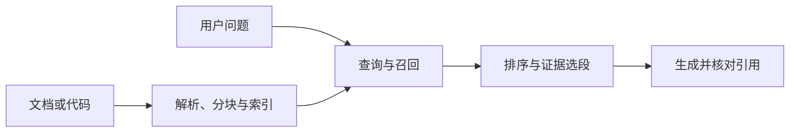

# RAG 与代码检索

检索增强生成把外部资料检索出来，作为当前模型输入的证据。它不要求改变模型参数，也不要求使用 Agent：一次固定的检索与生成即可构成一种应用方式。原始 RAG 论文研究检索器与生成器的组合；本章讨论更广义的资料检索、证据组装与回答过程。[[23]](../references.md#source-rag-paper)

---

## 一、从资料到回答

索引阶段决定哪些资料可被发现，在线阶段决定本次找到什么、送入什么。模型只能依据最终选段作答，不能因为搜索命中过某个文档，就假设它读过该文档全部内容。

离线处理需要保留来源标识、版本、位置和访问范围。扫描图片、表格和代码的结构也属于信息：若解析丢掉表头或函数归属，后续排序不能凭空恢复它们。

---

## 二、资料表示与分块

固定长度分块容易控制大小，但可能把条件和结论切开。按标题、段落、表格或代码符号分块更接近语义边界，仍需为过长单元设置拆分方式。

| 方法 | 优点 | 需要注意 |
| --- | --- | --- |
| 固定长度 | 大小稳定 | 语义断裂 |
| 结构分块 | 保留章节或函数语义 | 结构不规则、块长不均 |
| 重叠分块 | 保留边缘上下文 | 重复召回、索引增大 |
| 小块召回后扩展父段 | 命中精确且可补条件 | 扩展后的预算 |

一条选段可包含 `source`、`revision`、`location` 和 `content`。代码应能指出文件、符号及当前内容版本；含未提交改动的工作区不能只靠提交号确定内容。

---

## 三、召回、融合与重排序

关键词检索擅长定位标识符、错误码和配置键；向量检索利用表示空间寻找语义相关资料。向量接近是相关性信号，不是事实或权限证明。

混合召回合并两类候选。不同检索器的原始分数未必可比，可以按排名融合。设 $r_j(d)$ 是文档 $d$ 在第 $j$ 个列表中的名次，$k>0$ 是平滑常数，则一种倒数排名融合形式为：

$$
\operatorname{RRF}(d)=\sum_{j:d\in L_j}\frac{1}{k+r_j(d)}
$$

文档只在实际出现的列表中贡献得分。这个方法解决的是排序尺度不一致，不负责验证正文。比如两个列表都把同一文档排前列，它会获得较高得分；多个来源实际复制同一段文字时，还需去重，不能视为独立证据。

重排序进一步评估问题与候选片段的匹配程度。扩大候选数可能增加覆盖，也会增加延迟与噪声。最终选择需要检查条件是否完整，而不只是截取前几个高分项。

---

## 四、一个证据组装例子

问题是「服务超时为什么是 60 秒」。检索找到：

| 来源 | 内容 | 能支持的结论 |
| --- | --- | --- |
| 配置版本 r2 | `timeout_seconds: 30` | 文件声明值为 30 |
| 部署说明 v3 | 环境变量可覆盖文件配置 | 存在覆盖机制 |
| 当前运行观察 | 环境变量值为 60 | 当前环境的覆盖值为 60 |

前两项只能提出可能原因，第三项才支持当前环境中的具体判断。如果没有当前观察，回答应保留不确定性，而不是把部署说明里的示例值当作实际值。

生成后检查引用是否来自实际选段，以及引用是否支持该句结论。引用位置真实存在，只满足可定位性，不等于论断成立。

---

## 五、代码检索的两类任务

理解型任务如「解释请求如何进入处理器」，通常需要定义、调用者、相关测试和配置的组合。可以从精确符号搜索开始，再扩展调用关系。

覆盖型任务如「是否所有旧函数调用都迁移了」，要求枚举约定范围中的候选并核对。Top-k 相似片段不能证明没有遗漏。需要明确源码、测试、生成文件是否都在范围内，再用精确搜索或语法结构检查。

代码索引可能落后于工作区。用于解释和修改前，应读取目标当前内容；旧片段可以帮助定位，但不能无检查地成为覆盖文件的依据。

---

## 六、检索评价与生命周期

设一条查询的标注相关集合为 $R$，召回前 $k$ 项为 $D_k$：

$$
\operatorname{Recall@k}=\frac{|R\cap D_k|}{|R|}
$$

它衡量已标注相关资料的覆盖，不衡量最终答案是否正确。对于没有相关资料的查询，分母为零，应单独评估拒答或缺证据处理，而不是直接套公式。

可分三层实验：

1. 检索层：正确来源是否被召回、是否进入最终选段。
2. 生成层：固定提供正确证据，检查是否忠实作答。
3. 端到端：完整链路的正确性、引用支持和总延迟。

资料更新或删除时，应同步更新索引和派生缓存；访问权限变化后仍要在返回资料前检查当前权限。搜索出无权访问的正文后再要求模型保密，不是有效访问控制。

---

## 学习检查与参考资料

解释为什么「检索到了」「模型看到了」「答案引用了」「引用支持结论」是四个不同判断。再说明，代码全覆盖检查为什么不能只采用相似度排序。

- [[23] 原始 RAG 论文](../references.md#source-rag-paper)
- [[20] 工具返回信息的设计](../references.md#source-anthropic-tools)
- [检索评估](../../../evaluation/retrieval-evaluation.md)
