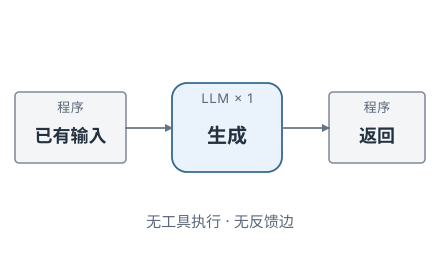
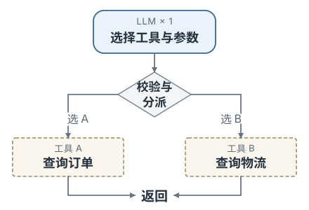
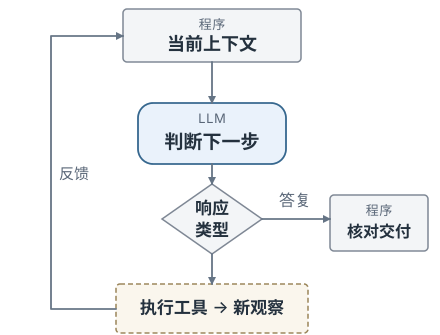
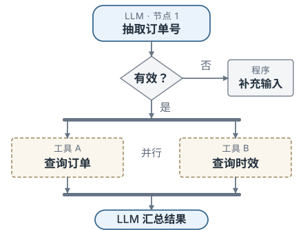

# Agent 执行范式总览

把大语言模型接入真实任务时，程序结构会随复杂度变化：有的只调用一次模型，有的让模型选择工具，有的把多步流程固定在代码里，有的让模型自己决定下一步，甚至由多个执行者协作。这些做法可以归纳为几种范式：单次生成、工具调用、多轮对话、ReAct、Workflow、Agent 与多 Agent。

区分这些范式，主要看两条线索：**后续步骤由谁决定**（代码、用户还是模型），以及**执行结果是否作为新的观察回填给模型**。带着这两个问题看每一种范式。

下列流程图中，矩形表示程序处理，圆角节点表示模型调用，虚线节点表示工具执行，菱形表示分支，返回上游的箭头表示观察反馈；各图只展示一种典型实现，实际调用次数以执行路径为准。

---

## 常见执行范式

### 单次生成

最小的用法是一次性调用：程序把指令、问题和已有资料组织成输入，调用模型一次，拿到响应后处理并结束。整个过程没有工具动作，也没有把结果再送回模型——因此没有反馈回路。

<div class="notes-figure notes-figure--mode">




</div>

它适合「资料已经齐全、只差一次生成」的任务：摘要、分类、改写、抽取、按给定内容作答。这类任务的正确性主要取决于输入是否完整、指令是否明确。

响应里可以同时包含文本、结构化内容和推理相关条目；程序先判断响应是否完整，再按类型处理。**完成与否要看任务是否产出了所需结果**——结构化数据或外部动作，文本只是其中一种形式。缺资料时就需要工具或检索，于是进入下面的范式。

**下一步由谁决定**：程序。**观察反馈**：无。**结束依据**：本次响应处理完毕。

### 工具调用

当任务需要读取外部信息或执行动作时，让模型输出一个「调用哪个工具、传什么参数」的结构化请求；程序据此校验、分派并执行，再把结果交回流程。工具调用是把「语言决策」连接到「可验证操作」的接口。

<div class="notes-figure notes-figure--mode">




</div>

图中是最简单的一步：模型只负责「选工具 + 给参数」，程序按名称分派到一个已授权工具，执行后直接展示结果（两条工具路径二选一）。如果把工具结果再回填给模型继续判断，就自然过渡到后面的循环范式。

一个必须守住的边界：**模型生成的是「调用提议」，是否授权与执行由程序决定**。一个适合模型使用的工具，至少要有清晰的名称与单一职责、可校验的参数模式、明确的权限与副作用等级，以及足够小的返回值（避免把无关数据塞回上下文）。程序在执行前完成参数校验、身份与权限、副作用确认。

还有两点风险：工具的价值在于契约清晰，名称重叠、参数含糊或返回过长都会提高选错工具和污染上下文的概率；工具或检索返回的文本属于不可信数据，只按数据处理——其中出现的「忽略之前的指令」也保持数据身份，不获得指令优先级或权限。

**下一步由谁决定**：模型提议，程序校验并执行。**观察反馈**：单步可不回填，回填即进入多步。**结束依据**：结果直接交付，或回填后继续。

### 多轮对话

多轮对话关注的是**信息在多次请求之间的连续性**：上一轮的响应被保存为历史，下一轮构造输入时选取相关历史，再一起发给模型。它说明已有信息怎样用于下一轮；每一轮都由用户的新输入触发。

<div class="notes-figure notes-figure--wide">


</div>

这里要分清几种常被混为一谈的「记忆」：保存的消息历史、本轮实际发送的上下文、结构化任务状态、长期记忆，以及 KV Cache。前几者处理信息的保存与使用，KV Cache 处理模型计算的复用，两者相互独立。历史会随轮次增长，因此实际发送时通常要做选择、裁剪或摘要。

**下一步由谁决定**：用户。**观察反馈**：无自动循环，历史可包含此前的工具消息。**结束依据**：每轮响应处理完毕。

### ReAct（推理与行动循环）

ReAct 把推理和行动交错起来：模型依据当前上下文提出一个动作，程序校验并执行，把新的观察写回上下文，模型再据此决定下一步——如此循环，直到给出答复或触发停止条件。与「先生成一整套计划再不加检查地执行」不同，ReAct 的每一步都可以根据外部观察修正。

<div class="notes-figure notes-figure--mode">




</div>

图中左侧的反馈回路是这一范式的核心：工具执行产生的观察返回上下文，触发下一次判断；「答复提议」则走另一条分支进入验证与交付。模型可以第一步就直接作答，也可以多次经过工具反馈循环。

工程上应保存可审计的轨迹——决策结果、动作参数、观察、状态变化；可审计性来自这些外部可验证的事件。这条循环之所以有用，靠的是每一步都有真实观察参与。

**下一步由谁决定**：模型（在预算与权限边界内）。**观察反馈**：有，通常回填观察。**结束依据**：给出满足任务的答复，或达到预算/显式停止。

### 预定义工作流（Workflow）

Workflow 走另一个极端：控制流由**代码或预定义任务图**规定，模型只在其中完成局部的判断或生成。步骤、条件分支、并行与循环都是预先定义好的，不由模型逐轮决定。

<div class="notes-figure notes-figure--mode">




</div>

图示的例子：抽取订单号 → 校验 → 通过后并行查询订单与时效 → 汇总生成；订单号无效时走预定义的澄清分支。这类结构在「路径可枚举、需求稳定」时最可靠，因为确定的部分留在代码里，只把需要语义能力的步骤交给模型。

**判定是不是 Agent，看「下一步由谁决定」**：Workflow 的路径由代码固定，即使有循环、多个模型节点或重试，仍是 Workflow。Workflow 里可以在某个节点调用一个 Agent，Agent 也可以把一段稳定子流程封装成单个工具，二者可以组合。

**下一步由谁决定**：代码 / 任务图。**观察反馈**：路径预定义。**结束依据**：到达约定终点。

### Agent（自主智能体）

把「由模型自主决定控制流」这件事一般化，就得到 Agent：一个围绕目标运行的**决策—执行—观察—更新**闭环。定义 Agent 的是这条闭环，以及运行时对它施加的边界。ReAct 是这条闭环的一种典型循环策略，先规划再执行（plan-and-execute）是另一种；检索、长期记忆或多执行者都是可选部件。

Workflow 与 Agent 是一条连续谱，差别在于**谁决定控制流**：

| 形态 | 下一步由谁决定 | 适合的问题 | 主要风险 |
| --- | --- | --- | --- |
| 普通程序 | 代码 | 规则稳定、输入边界清楚 | 需求变化要改代码 |
| LLM Workflow | 代码定义主流程，模型完成局部判断 | 路径可枚举、需要语义能力 | 某一步输出不稳定 |
| Agent | 模型依据观察动态选择动作 | 路径开放、需要探索 | 成本、终止性与副作用更难控制 |

一个最小的控制循环可以写成：

```
RUN-AGENT(goal, tools, budget)
	// 初始化任务状态与预算
	state ← INITIALIZE(goal, budget)

	while not TERMINAL(state) do
		context ← BUILD-CONTEXT(state, tools)
		decision ← MODEL(context)
		state ← ACCOUNT-COST(state, decision)

		if BUDGET-EXCEEDED-OR-CANCELLED(state) then
			return EXPLICIT-FAILURE(state)
		end if

		if decision.type = "final" then
			return CHECK-COMPLETION(state, decision.output)
		end if

		action ← VALIDATE-AND-AUTHORIZE(decision.action)
		observation ← EXECUTE(action)
		state ← UPDATE(state, action, observation)
	end while

	return EXPLICIT-FAILURE(state)
```

让这条闭环真正可用的，是它周围的约束：

- **结构化动作接口**：把「模型想做什么」与「系统是否允许并执行」分开，由系统决定是否授权。
- **授权与副作用分级**：只读、可逆、有副作用的动作区别对待；删除、付款、发布等在执行前需明确确认。
- **预算与终止**：为步骤数、token、时间、费用或副作用设上限，达到即返回可解释的终止状态。
- **任务验收**：交付前用环境的最终状态判断是否完成——测试是否通过、记录是否写入、字段是否正确。

**下一步由谁决定**：模型（受预算与权限约束）。**观察反馈**：有，以观察驱动下一步。**结束依据**：通过任务验收，或显式失败/停止。

### 多 Agent（多智能体协作）

多 Agent 描述的是**执行者的组织**：由协调者把任务、上下文和结果分配给多个各自拥有独立上下文与循环的 Agent，最后合并并验证。协调者可以是固定程序，也可以是一个主 Agent。

<div class="notes-figure notes-figure--wide">


</div>

它与「同一轮并行调用两个工具」不同——后者仍在一个上下文里。多 Agent 的收益来自**真正隔离的信息或执行边界**：多个独立来源可并行调查、子任务需要不同工具或权限、独立结果可用明确协议合并。

一个重要反例：多个 Agent 使用相同资料、相同模型并相互复述结论，表面上「多人同意」，实际证据高度相关，独立性存疑。多个执行者可以共用同一模型；真正的收益来自隔离的信息或执行边界，任务覆盖、重复工作、通信开销和结果冲突都需要单独验证。

**下一步由谁决定**：协调者 + 各 Agent 各自的循环。**观察反馈**：各自上下文内回填。**结束依据**：子任务合并并通过验收。

---

## 范式对照

| 范式 | 下一步由谁决定 | 观察反馈回路 | 典型结束依据 |
| --- | --- | --- | --- |
| 单次生成 | 程序 | 无 | 本次响应处理完毕 |
| 工具调用 | 模型提议，程序执行 | 单步无 / 回填则有 | 结果直接交付或回填后继续 |
| 多轮对话 | 用户 | 无（历史可含工具消息） | 每轮响应处理完毕 |
| ReAct | 模型（受约束） | 有 | 给出答复或达到预算 |
| Workflow | 代码 / 任务图 | 路径预定义 | 到达约定终点 |
| Agent | 模型（受约束） | 有 | 通过任务验收或显式停止 |
| 多 Agent | 协调者 + 各自循环 | 各自上下文内 | 子任务合并并验收 |

**判断是不是 Agent，看应用暴露并管理的控制逻辑。** HTTP 请求数或模型调用次数不构成判据——一次服务请求可能在服务端使用托管工具，一个 Workflow 也可能多次调用模型。

---

## 容易混淆的区别

| 容易混淆的对象 | 判断方法 |
| --- | --- |
| 一次用户轮次与一次模型调用 | 一轮用户请求中可以有工具回填后的多次生成 |
| 对话历史与当前上下文 | 历史是来源，当前上下文是实际发送的信息 |
| 工具调用与工具执行 | 前者是动作提议，后者才产生观察或副作用 |
| Workflow 与 Agent | 看后续路径由谁决定：代码固定还是模型动态选择 |
| 生成结束与任务完成 | 前者是模型结果状态，后者需要任务验收 |

---

## 参考文献

- Yao, S. et al. (2023). [*ReAct: Synergizing Reasoning and Acting in Language Models*](https://arxiv.org/abs/2210.03629).
- Shinn, N. et al. (2023). [*Reflexion: Language Agents with Verbal Reinforcement Learning*](https://arxiv.org/abs/2303.11366).
- Anthropic (2024). [*Building Effective Agents*](https://www.anthropic.com/engineering/building-effective-agents).
