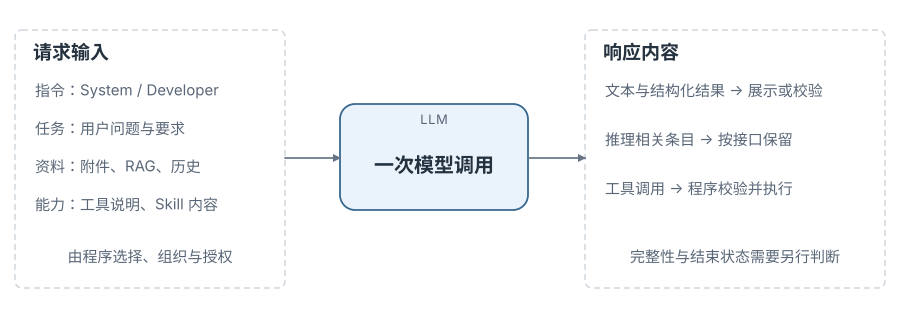
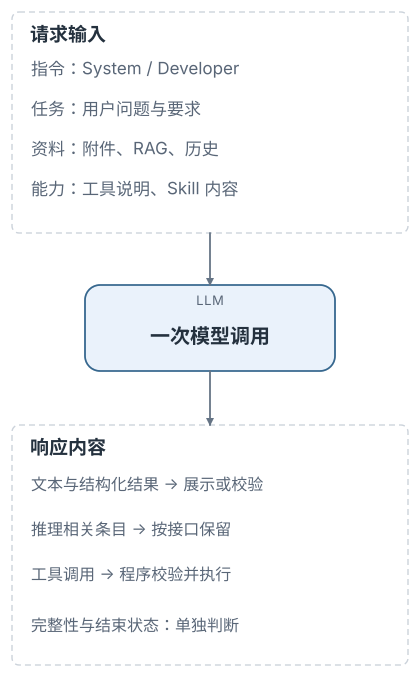
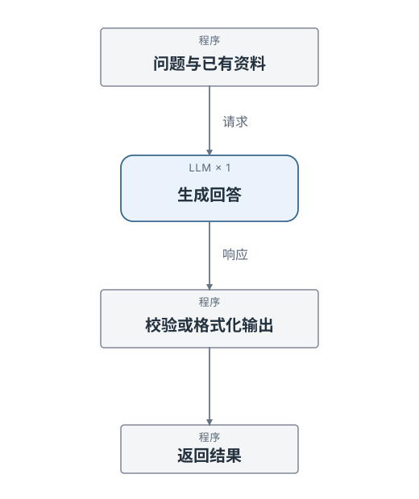
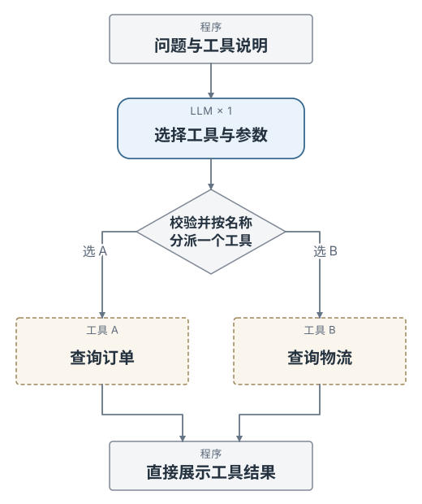
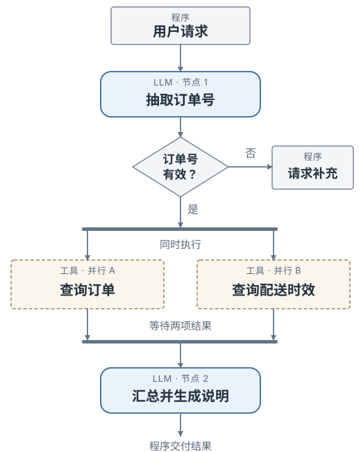
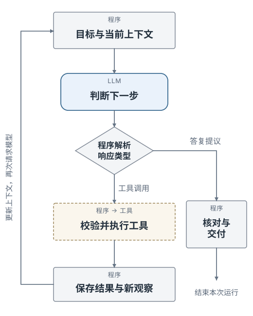
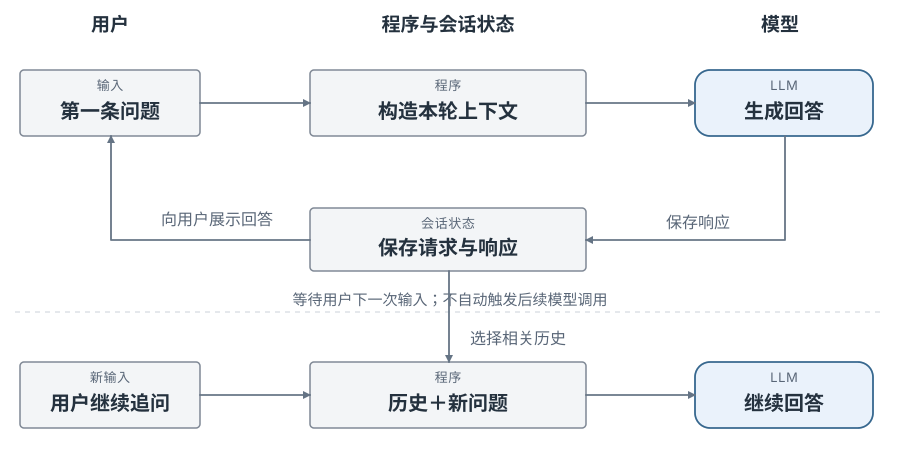
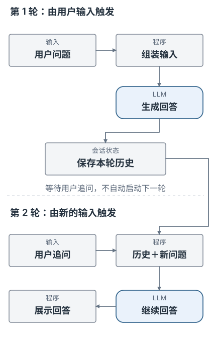
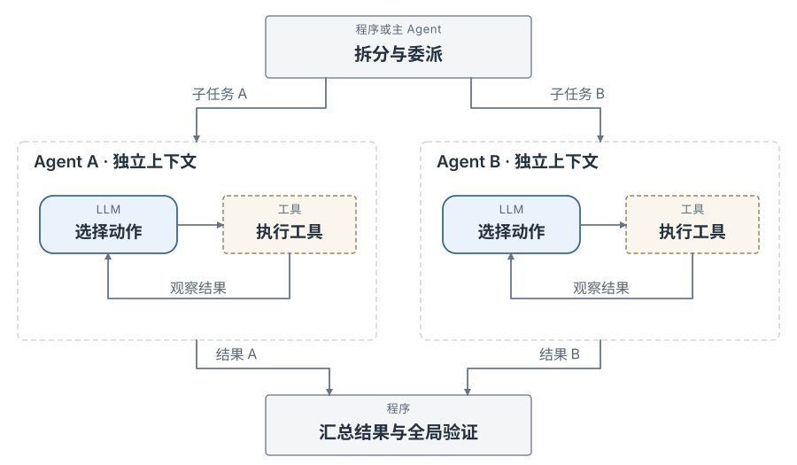
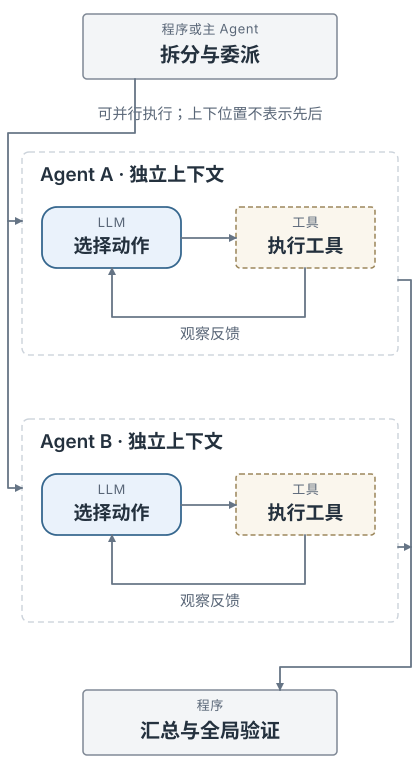

# LLM 应用与 Agent 总览

LLM 应用可以只调用一次模型，也可以由程序组织多个步骤，或让模型依据工具结果继续决定动作。它们复用相同的输入、输出和工具能力，区别主要在**后续步骤由谁决定、执行结果是否反馈给模型**。

总览说明交互、控制与协作的关系；五组专题分别展开实现细节。专题是知识分类，不要求程序按五个模块或服务部署。

---

## 1. 模型交互

最小调用是「程序准备输入 → 模型生成响应 → 程序处理结果」。用户已经提供足够资料时，一次生成就可以完成解释、摘要、分类或抽取，不需要先建立 Agent。[[1]](references.md#source-openai-text)

<div class="notes-figure notes-figure--wide">





</div>

### 1.1 输入组成

输入分为四类：**指令**是 System／Developer 指令，**任务**是用户问题与要求，**资料**是附件、RAG 与相关历史，**能力**是工具说明与 Skill 内容。这四类都由程序选择、组织与授权，是逻辑分类，不是所有 API 都具有的同名字段。

工具描述不会执行函数，Skill 正文不会自动取得权限。MCP 是程序连接外部工具、资源等能力的协议，不是一种与 system／user 并列的消息角色。它发现的工具说明、读取的资料，可以由宿主选择后放入请求。[[2]](references.md#source-openai-functions) [[40]](references.md#source-skills-spec)

### 1.2 输出处理

响应中可以**同时**存在文本、结构化内容、推理相关条目和工具调用，不是从中四选一。程序先判断响应是否完整，再按类型处理：文本用于展示或业务校验；推理相关数据按原生接口保留或使用；工具调用进入执行网关。拥有一段文本，不代表没有待执行调用，也不代表任务已经完成。[[11]](references.md#source-openai-reasoning) [[2]](references.md#source-openai-functions)

<details>
<summary>最小示例：一次文本生成</summary>

这是 OpenAI Python SDK 的原生调用示例，需要安装 SDK 并提供凭据和账号可用模型；阅读此页面不会发起请求。该示例未进行真实 API 联调。[[1]](references.md#source-openai-text)

```python
import os
from openai import OpenAI

client = OpenAI(timeout=30.0, max_retries=0)
response = client.responses.create(
    model=os.environ["OPENAI_MODEL"],
    instructions="仅根据用户提供的配置，用一句话说明服务端口。",
    input="server:\n  port: 8080\n",
)
if response.status != "completed":
    raise RuntimeError(f"响应未完成：{response.status}")
print(response.output_text)
```

这个例子没有声明工具，只取出文本。含工具或多类型条目的请求需要使用完整响应处理。传输层的重试与后续 Agent 步骤不是同一个概念。

</details>

---

## 2. 控制流程

以下四图比较的是**应用怎样安排后续动作**，不是四个互斥的产品类型，也不是成熟度排名。单次生成和单次工具执行可以看作很小的预定义流程；复杂系统也可以在 Workflow 的一个节点中运行 Agent。多轮对话与多 Agent 分别讨论信息连续性和执行者组织。[[3]](references.md#source-anthropic-agents)

图中矩形表示程序处理，圆角蓝色节点表示模型调用，虚线边框节点表示工具执行；菱形表示分支，横条表示并行分派或汇合，**返回上游的箭头表示观察反馈**。各图展示一种典型实现，实际调用次数以执行路径为准。

<!-- mode-comparison:start -->
<!-- mode:direct -->
### 2.1 单次生成

程序提供问题和已有资料，调用模型一次，处理响应后结束。没有外部工具动作，也没有观察反馈。

<div class="notes-figure notes-figure--portrait">



</div>

**控制主体**：程序规定调用和结束。**结果去向**：展示给用户或交给业务代码。**示例**：用户给出订单记录，模型生成进度说明。

<!-- mode:tool -->
### 2.2 单次工具执行

模型选择工具和参数；程序按调用名称校验、分派，执行后直接展示结果。图中 A、B 是**选一条**，不是同时执行。[[2]](references.md#source-openai-functions)

<div class="notes-figure notes-figure--portrait">



</div>

**控制主体**：模型决定局部动作，程序规定执行后结束。**结果去向**：订单卡片等程序输出，不再送回模型。**示例**：一次调用选择查询订单或查询物流。

<!-- mode:workflow -->
### 2.3 预定义工作流（Workflow）

代码规定抽取、校验、查询和汇总的流程。图中既有条件分支，也有两个工具的并行分派与汇合；这些路径和判断规则由程序预先定义。[[3]](references.md#source-anthropic-agents)

<div class="notes-figure notes-figure--portrait">



</div>

**控制主体**：代码或预定义任务图。**结果去向**：约定的后续节点。**示例**：抽取订单号，校验通过后同时查询订单和配送时效，最后生成说明。

Workflow 也可以包含程序规定的重试、校验与循环；有循环、有多个模型节点，都不能单独用来判断它是不是 Agent。图中的正常路径调用模型两次，但不是所有 Workflow 的固定次数。

<!-- mode:agent -->
### 2.4 观察驱动循环（Agent Loop）

模型根据当前上下文提出动作；程序校验并执行工具，将观察写回上下文，再由模型决定下一步。图中左侧的**反馈回路**是这一模式的关键。[[48]](references.md#source-react-paper)

<div class="notes-figure notes-figure--portrait">



</div>

**控制主体**：模型依据观察提出下一步，程序保留权限、预算和停止边界。**结果去向**：进入下一次模型输入。**示例**：订单信息不足时进一步查询物流，再根据实际结果决定是否需要更多信息。

Agent 可以第一步直接回答，也可以多次使用工具。图中的“核对与交付”不代表存在万能验证器；代码修改、事实问答与普通聊天需要不同的完成检查。

<!-- mode-comparison:end -->

### 2.5 控制语义对照

| 判断维度 | 单次生成 | 单次工具执行 | 预定义 Workflow | Agent Loop |
| --- | --- | --- | --- | --- |
| 后续主路径 | 调用后返回 | 执行选定工具后返回 | 代码或图中的规则 | 模型依据新观察选择，宿主约束执行 |
| 工具结果是否回填模型 | 无工具结果 | 此例不回填 | 按流程需要回填 | 通常回填以支持后续判断 |
| 分支与循环 | 此例没有 | 按工具名称选择路径 | 可有预设分支、循环与并行 | 可反复观察、选择动作或结束 |
| 结束依据 | 本次响应处理完毕 | 工具结果可直接交付 | 到达约定终点 | 提出答复并满足任务的结束条件，或显式停止 |
| 重点阅读 | [模型接口](model/llm-api.md)、[输出](model/outputs.md) | [工具调用](tools/tool-calling.md) | [Workflow](control/workflows.md) | [Agent Loop](control/react-loop.md)、[Planning](control/reasoning-planning.md) |

**不要用 HTTP 请求数或模型调用数定义 Agent。** 一个模型服务请求可能在服务端使用托管工具；一个预定义工作流也可能调用模型很多次。本页对照的是应用暴露并管理的控制逻辑。[[3]](references.md#source-anthropic-agents) [[2]](references.md#source-openai-functions)

---

## 3. 会话与协作

### 3.1 多轮对话：信息的连续性

多轮对话说明已有信息怎样用于下一轮，并不说明系统会自主执行下一轮。下面每轮都由用户触发：第一轮响应保存为历史，第二轮收到追问后，再选择相关历史并请求模型。[[8]](references.md#source-openai-state)

<div class="notes-figure notes-figure--wide">





</div>

保存的消息历史、本轮发送的上下文、结构化任务状态、长期记忆和 KV Cache 分属不同职责。前四者处理信息的保存与使用，KV Cache 处理模型计算的复用；会话能继续，不意味着缓存一定命中。

### 3.2 多 Agent：执行者的组织

多 Agent 描述如何分配任务、上下文和结果，而不是第五种固定的控制流程。下面的两个工作者分别拥有自己的上下文和执行循环；这与“同一轮并行执行两个工具”不同。协调者可以是预定义程序，也可以是一个主 Agent。[[3]](references.md#source-anthropic-agents)

<div class="notes-figure notes-figure--wide">





</div>

执行者数量不等于模型数量：同一模型可以服务不同的工作者上下文。拆分也不天然提高质量；任务覆盖、重复工作、通信开销和结果冲突仍需验证。

### 3.3 控制方式与执行者数量

| 控制方式 | 一个执行上下文 | 多个隔离执行上下文 |
| --- | --- | --- |
| 预定义代码或任务图 | 固定生成、工具流程、校验流程 | 固定流程向多个工作者分派任务 |
| 模型按观察逐步决策 | 单 Agent Loop | 主 Agent 动态委派子 Agent |
| 模型生成编排程序，再执行程序 | 脚本组合工具和单个工作者 | 脚本组织多个工作者、分支、并行与汇总 |

第三行是 [Dynamic Workflows 与代码编排](control/dynamic-workflows.md) 的研究范围。生成编排程序和执行编排程序是两个阶段；不能把“多 Agent”“动态编排”“并行工具调用”当作同义词。具体宿主语义仍需按文档版本核验。[[56]](references.md#source-cc-workflows)

---

## 4. 专题结构

五组专题按职责组织，不是五个串行阶段，也不是必须部署的五个服务。一个实际请求往往同时涉及其中几组。

<!-- topic-map:start -->
### 模型交互

负责一次请求的表示、响应解析与计算复用，不决定整个任务下一步如何推进。

[LLM API 与消息接口](model/llm-api.md) · [模型输出与结构化结果](model/outputs.md) · [流式响应与模型适配](model/streaming.md) · [KV Cache 与请求缓存](model/kv-cache.md)

### 上下文与记忆

负责选择、组织、检索、保存和更新模型可用的信息；保存的数据不必全部进入下一轮请求。

[提示工程](context/prompt-engineering.md) · [上下文工程](context/context-engineering.md) · [RAG 与代码检索](context/rag-retrieval.md) · [会话状态与长期记忆](context/conversation-memory.md) · [上下文压缩](context/compaction.md)

### 工具与能力扩展

负责将能力说明连接到实际执行，并管理远端接入、操作知识与扩展生命周期。

[工具调用与执行网关](tools/tool-calling.md) · [执行环境](tools/execution-environments.md) · [MCP 与外部连接器](tools/mcp-connectors.md) · [Skills](tools/skills.md) · [Hooks、Plugins 与扩展管理](tools/hooks-plugins.md)

### 控制流程与协作

负责组织调用、步骤、计划与执行者；Workflow、Loop 和多 Agent 在这里对照，而不重复底层 API。

[Workflow 与流程控制](control/workflows.md) · [ReAct 与 Agent Loop](control/react-loop.md) · [Reasoning 与 Planning](control/reasoning-planning.md) · [多 Agent 协作](control/subagents-multi-agent.md) · [Dynamic Workflows](control/dynamic-workflows.md)

### 运行系统与质量

负责实现与运行管理：人工控制、恢复、调度、安全、观测、评测、性能及发布。基础校验和权限从工具执行时就需要，不是到这一组才开始考虑。

[Harness 架构](runtime/harness-architecture.md) · [人工交互](runtime/human-control.md) · [故障恢复](runtime/persistence-recovery.md) · [任务调度](runtime/scheduling-protocols.md) · [安全](runtime/security.md) · [可观测性](runtime/observability.md) · [评测](runtime/evaluation.md) · [性能与成本](runtime/performance-cost.md) · [版本发布](runtime/versioning-release.md)
<!-- topic-map:end -->

交叉主题采用单一主归属：输出页解释调用字段，工具页解释执行准入，Loop 页解释结果如何推动下一步；Memory 页解释保留与召回什么，恢复页解释怎样可靠保存和重建。其他页面通过链接衔接，不重复一套定义。

---

## 5. 阅读索引

### 5.1 基础阅读路径

先读 [模型接口](model/llm-api.md) 与 [响应处理](model/outputs.md)，再读 [Prompt](context/prompt-engineering.md)／[Context](context/context-engineering.md) 和 [工具调用](tools/tool-calling.md)；需要组织多次调用时，进入 [Workflow](control/workflows.md) 与 [Agent Loop](control/react-loop.md)。这是建议的知识依赖，不要求连续读完整套笔记。

### 5.2 开发问题索引

| 查阅内容 | 主页面 | 关联页面 |
| --- | --- | --- |
| 响应截断、参数流错配、续接失败 | [流式响应与模型适配](model/streaming.md) | [模型输出](model/outputs.md) |
| 提示效果不稳定、资料遗漏或过期 | [提示工程](context/prompt-engineering.md)、[上下文工程](context/context-engineering.md) | [RAG](context/rag-retrieval.md)、[评测](runtime/evaluation.md) |
| 缓存未命中、历史增长、压缩失真 | [缓存](model/kv-cache.md)、[压缩](context/compaction.md) | [性能与成本](runtime/performance-cost.md) |
| 工具重试、权限、插件更新与在途调用 | [工具执行](tools/tool-calling.md)、[扩展管理](tools/hooks-plugins.md) | [故障恢复](runtime/persistence-recovery.md) |
| 子任务遗漏、协作冲突、动态编排恢复 | [多 Agent](control/subagents-multi-agent.md)、[Dynamic Workflows](control/dynamic-workflows.md) | [任务调度](runtime/scheduling-protocols.md) |

按产品寻找源码对照，使用 [产品实现索引](implementation-index.md)；运行本地示例，使用 [代码示例与实验](labs.md)。产品案例是相应机制的实现切片，不是独立的功能排行榜。

<details>
<summary>资料版本与代码范围</summary>

技术结论的适用范围以 [来源记录](references.md) 所列的日期、版本和阅读范围为准，不代表所有产品的现行能力。Python 原生 API 示例、教学伪代码与可运行实验分别标明。图中的执行过程是说明控制语义的模拟，不会调用模型、读取真实订单或启动 Agent。

</details>
