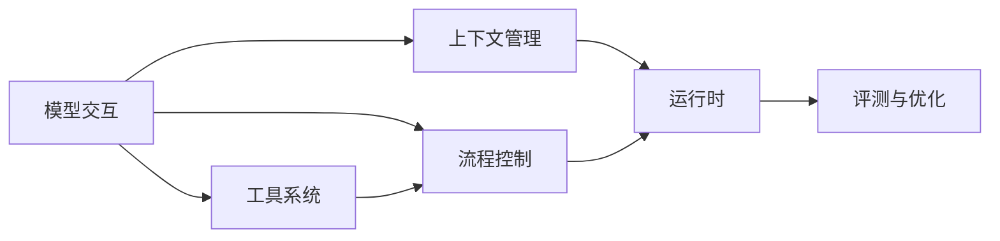

# Agent 学习总览

模型交互提供理解与生成能力，工具提供观察和操作环境的能力，控制流程把多次调用组织成任务。上下文管理、运行时与评测分别补足信息组织、持续执行和质量判断。

这些是知识层次，不要求程序拆成六个服务，也不要求最小 Agent 具备检索、长期记忆或多执行者。

---

## 一、知识关系与阅读顺序

图中模型交互是起点；上下文与工具可以分别学习。最小 Workflow 和 Agent Loop 只需要模型与基础工具知识，不以 RAG、记忆或 MCP 为前提。各章都有必要检查，最后一个模块再系统展开评测。

### 1. 模型交互

[模型交互：Prompt、生成与多轮对话](model/llm-api.md)连续讲清单次输入输出、用户多轮和工具结果回传，最后解释 token、采样、窗口与缓存。

### 2. 上下文管理与优化

[主文：组织、存取与选择](context/context-engineering.md)承接已有的消息对象，说明资料怎样保存、读取和进入当前输入。

- [RAG 与代码检索](context/rag-retrieval.md)
- [长期记忆](context/conversation-memory.md)
- [上下文压缩](context/compaction.md)

### 3. 工具系统与能力扩展

[主文：契约、执行与结果](tools/tool-calling.md)把基础工具往返推广为可组合能力集合。

- [执行环境](tools/execution-environments.md)
- [MCP 与外部连接](tools/mcp-connectors.md)
- [Skills 与操作知识](tools/skills.md)
- [Hooks 与 Plugins](tools/hooks-plugins.md)

### 4. 流程控制与 Agent 方法

[主文：Workflow 与 Agent Loop](control/workflows.md)先说明步骤、依赖和状态，再比较预定义路径与观察驱动循环。

- [规划与计划修订](control/reasoning-planning.md)
- [多 Agent 协作](control/subagents-multi-agent.md)
- [动态代码编排](control/dynamic-workflows.md)

### 5. Agent 运行时与工程化

[主文：组成与任务生命周期](runtime/harness-architecture.md)从单进程、单任务出发，说明输入、执行、交互、交付与资源释放。

- [人工控制](runtime/human-control.md)
- [任务恢复](runtime/persistence-recovery.md)
- [调度与接入](runtime/scheduling-protocols.md)
- [安全与隔离](runtime/security.md)

### 6. 评测、可观测性与优化

[主文：评测与实验设计](quality/evaluation.md)建立评价对象、评分方法、样例集和对照实验。

- [可观测性与故障诊断](quality/observability.md)
- [性能与成本](quality/performance-cost.md)
- [版本、回归与发布](quality/versioning-release.md)

---

## 二、需要贯穿理解的区别

| 容易混淆的对象 | 判断方法 |
| --- | --- |
| 一次用户轮次与一次模型调用 | 一轮用户请求中可以有工具回填后的多次生成 |
| 对话历史与当前上下文 | 历史是来源，当前上下文是实际发送的信息 |
| 工具调用与工具执行 | 前者是动作提议，后者才产生观察或副作用 |
| Workflow 与 Agent Loop | 比较后续路径由谁决定，而不是调用次数 |
| 聊天加载与任务恢复 | 前者恢复交互记录，后者还处理执行位置和动作状态 |
| 生成结束与任务完成 | 前者是模型结果状态，后者需要任务验收 |

这些区别用于帮助理解完整过程，不应成为拆散基础能力的理由。例如多轮用户消息和工具结果回填都在模型交互主文中闭合。

---

## 三、配套阅读

- [练习与实验](labs.md)：每个模块的过程推演与参考分析。
- [实现案例阅读索引](implementation-index.md)：学完概念后定位版本化案例。
- [参考资料](references.md)：一手资料、研究论文及历史核验范围。
- [旧版归档](../archive/catalog.md)：重写前的正文与参考代码。
