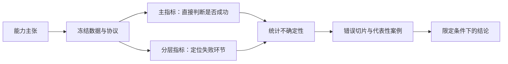

# 评估：把能力主张变成可检验问题

评估将能力主张转成可重复的试验：固定任务与数据，选择成功判据，控制推理协议，最后报告不确定性和失败。它贯穿学习全过程，不是模型讲完后附加的排行榜；表示、概率、检索、生成和长上下文分别需要不同证据。

---

## 从主张选择证据

| 能力主张 | 评估主题 | 至少同时报告 |
| --- | --- | --- |
| 「更会预测文本」 | [语言模型评估](./language-model-evaluation.md) | tokenization、负对数似然或 PPL、测试域 |
| 「向量空间更有结构」 | [向量表示分析](./embedding-geometry.md) | 下游任务、邻域/聚类诊断及稳定性 |
| 「更容易找到相关内容」 | [检索评估](./retrieval-evaluation.md) | Recall@K、排序指标、延迟与候选规模 |
| 「生成答案更好」 | [生成评估](./generation-evaluation.md) | 任务完成度、事实/忠实性、人工或模型评审协议 |
| 「真正支持长上下文」 | [长上下文评估](./long-context-evaluation.md) | 长度×位置曲线、复杂整合任务、延迟与显存 |

---

## 评估顺序

先写一句可以被否定的主张，例如「在冻结问题集和相同候选库中，提高前 10 条文档的证据覆盖，且查询 p95 不超过预算」。这比「检索更强」明确，因为它规定了对象、分母与成本。对应实验还应保存每个问题的结果，允许定位总体平均掩盖的回归。

1. 写清目标行为和不能接受的失败；
2. 固定数据切分、推理配置与资源预算；
3. 选择与目标行为直接对应的主指标；
4. 用分层指标定位改进发生在哪一环；
5. 检查分布偏移、污染、位置偏差和评审一致性；
6. 最后才汇总为模型或系统结论。

检索增强生成需要同时读[检索评估](./retrieval-evaluation.md)与[生成评估](./generation-evaluation.md)；Agent 还需要观察任务成功率、工具错误、步骤成本与可恢复性，不能只评最后一段文本。

测试集、评分脚本、prompt、模型版本和运行配置共同构成评估产物。任何一项变化都可能使分数失去直接可比性。结论应写明适用数据、推理协议和资源预算，而不是把一次实验结果概括成无条件能力标签。
