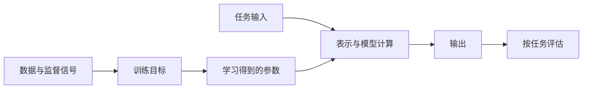

# 学习问题与分类：目标、结构和系统不是同一层

「自监督」「生成式」「Decoder-only」「MoE」「RAG」分别回答不同问题，不能放进同一个互斥分类表。理解一种方法，应先确定它要预测什么、训练信号来自哪里、信息如何传播，以及使用时是否依赖外部系统。

---

## 从一个任务拆出六个维度

以「根据资料回答问题」为例，可以分别检查：

| 维度 | 要回答的问题 | 这个任务中可能的选择 |
| --- | --- | --- |
| 任务与输出 | 最终需要什么结果 | 文本答案、引用、拒答或工具动作 |
| 表示 | 原始对象如何进入计算 | 子词 ID、上下文化 token、文档向量 |
| 学习信号 | 什么决定一次预测好不好 | 下一 token、问答示例、相关文档对、偏好比较 |
| 结构与机制 | 条件信息如何影响输出 | 因果 Transformer、Cross-Attention、门控 FFN |
| 适配方式 | 哪些参数会改变 | 全量微调、LoRA；也可能完全不更新参数 |
| 系统与评估 | 如何获取证据并检验结果 | 检索、重排、生成、引用核验与工具执行 |

一个系统可以同时使用这些选择：文档侧是双编码器检索，生成侧是使用 GQA 的 Decoder-only 模型，参数通过 LoRA 适配，运行时由固定 Workflow 调用。它们并不互相排斥。

图中训练目标影响参数，参数参与前向计算，评价标准检验输出。改动其中一处不会自动改变其他几处：换 Attention 机制不等于换训练目标，换评分指标也不等于模型已针对该指标训练。

---

## 监督、自监督、无监督与强化学习

这些名称主要描述学习信号的来源，而不是网络的外形。

| 范式 | 信号怎样产生 | 例子 | 容易误解的边界 |
| --- | --- | --- | --- |
| 监督学习 | 样本带有目标值或类别 | 问答微调、文本分类 | 标签可以来自人工，也可以由程序或其他模型生成 |
| 自监督学习 | 从数据自身构造输入和目标 | 下一 token 预测、掩码恢复 | 不需要逐条人工标注，不等于没有标签、损失或数据偏差 |
| 无监督学习 | 不依赖外部任务标签寻找结构 | 聚类、密度估计 | 自监督常被归入广义无监督，术语边界依文献而异 |
| 强化学习 | 用动作后得到的奖励优化策略 | 按任务结果或奖励模型评分优化生成 | 关键是策略与回报，不是必须有机器人或人实时打分 |

例如原句「猫在睡觉」可以构造输入「猫在」、目标「睡觉」。这是自监督的来源、监督式的交叉熵计算，两种描述并不矛盾。反向传播的完整过程见[神经网络训练基础](./neural-network-basics.md)。

还要区分「偏好数据」与「训练算法」。同一组优选/劣选回答可以用于训练奖励模型，也可以用于直接偏好优化；有偏好标签并不能说明训练一定执行了在线强化学习。不同方法在生成采样、参考策略和优化目标上有区别，不能只用「对齐」一词代替计算定义。

---

## 判别、生成与表示学习

::: info 符号与约定
$x$ 是输入，$y$ 是目标，$w_t$ 是第 $t$ 个 token，$T$ 是长度，$f_\theta$ 是参数为 $\theta$ 的编码器。以下概率均指模型定义的分布，不等同于真实世界事实的概率。
:::

判别建模通常直接学习标签的条件分布，例如：

$$
P_\theta(y\mid x),\qquad y\in\{\text{正面},\text{负面}\}
$$

生成建模关注数据的分布或生成过程。自回归文本模型将可变长序列分解为：

$$
P_\theta(w_{1:T}\mid x)
=\prod_{t=1}^{T}P_\theta(w_t\mid w_{<t},x)
$$

两式都有条件概率，但任务接口不同：分类在规定标签中选择，文本生成持续产生 token，直到终止条件成立。不能仅凭是否出现 $P(y\mid x)$ 就判断一个模型「不是生成式」。BERT 的掩码恢复目标也不能直接等同于标准的从左到右序列概率，详见 [BERT](../model/bert.md)。

表示学习输出向量 $f_\theta(x)$。其训练可能来自生成、分类或对比目标，使用时却只取隐藏表示。向量不是默认归一化的概率，也不一定天然适合相似度检索；[文本嵌入](../representation/text-embedding.md)解释了为什么还需要池化、训练目标和相似度约定。

一个简单的反例是「猫追狗」与「狗追猫」：词袋计数完全相同，但事件角色不同。是否保留词序、是否区分角色、是否把两句话拉近，是表示结构与任务监督共同决定的；「压成向量」本身没有回答这些问题。

---

## 三种 Transformer 接口与两种独立的稀疏性

Encoder-only、Decoder-only 与 Encoder-decoder 首先是信息可见性和输入输出组织方式：

| 接口 | 可见信息 | 典型读出 | 不是结构必然保证的事 |
| --- | --- | --- | --- |
| Encoder-only | 输入内双向读取 | 分类头、逐 token 标签、池化向量 | 普通池化向量一定适合检索 |
| Decoder-only | 常见语言建模使用因果前缀 | 下一 token 分布 | 因果预测一定忠实于事实 |
| Encoder-decoder | 源端双向编码；目标端因果读取并访问源端 | 条件生成序列 | 必须使用 RNN，或只能翻译 |

原始 Transformer、BERT 与 T5 分别展示了完整 Encoder-decoder、双向预训练编码器和统一 text-to-text 接口。具体可见性与目标见[Transformer](../model/transformer.md)、[BERT](../model/bert.md)与[Seq2Seq](../model/seq2seq.md)；名称是架构约定，不是所有未来变体必须遵守的限制。

「稀疏」也必须指定对象：

- [稀疏注意力](../mechanism/sparse-attention.md)减少 token 之间的连接；
- [MoE](../mechanism/moe.md)只为一个 token 选择部分专家参数；
- [GQA](../mechanism/attention-head-sharing.md)共享 KV 头，本身不减少可见 token 的连接；
- 权重量化减少数值表示位宽，不等于连接或参数变成稀疏。

所以一个模型可以同时采用滑动窗口 Attention、GQA、MoE 和低精度权重。比较成本时，应分别计算注意力连接、激活参数、KV cache 与权重存储。

---

## 预训练、微调与上下文学习

| 阶段或方法 | 参数是否更新 | 新信息保存在哪里 | 一次请求结束后的含义 |
| --- | --- | --- | --- |
| 预训练 | 是 | 模型参数 | 学到的统计模式保留，但不是逐条可靠存档 |
| 全量微调 | 是 | 被更新的模型参数 | 适配效果随权重版本保存 |
| LoRA | 是，但只训练选定增量 | 低秩适配参数 | 需加载正确适配器或合并权重 |
| In-context learning | 通常否 | 当前输入及运行时状态 | 示例不会因此永久写入模型参数 |
| 检索增强 | 检索与生成时通常否 | 外部索引及本次检索上下文 | 更新索引与更新模型是两种操作 |

「看了文档就学会了」可能只是本次条件分布发生变化，并非训练。缓存相同前缀可以复用计算，也不是新一轮学习。RAG 原论文研究了检索器与生成器结合的训练与推理；今天系统中常用的「先检索再拼接上下文」是更宽泛的工程用法，不能反推所有 RAG 都联合训练。

---

## 用一次失败找到需要改进的层

若问答系统答错「猫追狗时谁在追」，不要直接得出「模型太小」：

1. 原始文本是否被错误清洗或截断？检查 [Tokenization](../representation/tokenization.md) 与输入构造。
2. 正确资料是否进入候选集？检查[向量检索](../representation/vector-retrieval.md)及 Recall。
3. 重排是否丢掉正确文档？检查[检索评估](../evaluation/retrieval-evaluation.md)。
4. 证据进入上下文后，模型是否混淆主客体？检查[生成评估](../evaluation/generation-evaluation.md)与位置、长度切片。
5. 回答正确但实际动作错误？检查 [Agent](../agent/index.md) 的参数校验、权限与工具结果。

这种拆分把「增加数据」「换机制」「扩大模型」「修系统」转成可检验的选择，而不是互相替代的口号。

---

## 参考文献

- Vaswani, A. et al. (2017). [*Attention Is All You Need*](https://arxiv.org/abs/1706.03762). §3 定义 Encoder-decoder 和子层结构，不能把原版等同于所有现代 Transformer。
- Devlin, J. et al. (2019). [*BERT: Pre-training of Deep Bidirectional Transformers for Language Understanding*](https://aclanthology.org/N19-1423/). §3 区分预训练与下游微调，说明 MLM 和 NSP 的信号来源。
- Raffel, C. et al. (2020). [*Exploring the Limits of Transfer Learning with a Unified Text-to-Text Transformer*](https://jmlr.org/papers/v21/20-074.html). 比较目标、架构与迁移配方；统一输出形式不代表任务评价标准相同。
- Lewis, P. et al. (2020). [*Retrieval-Augmented Generation for Knowledge-Intensive NLP Tasks*](https://arxiv.org/abs/2005.11401). 定义参数记忆与非参数检索记忆的组合，区分序列级和 token 级文档边缘化。
