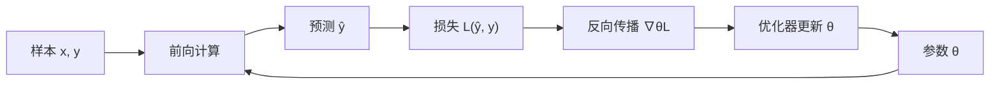

# 神经网络训练基础：从前向计算到参数更新

神经网络由可训练参数控制一组复合函数。训练并不是把正确答案存进某一行参数，而是计算当前预测如何出错，再沿依赖关系调整参数，使许多样本共享的计算更符合目标。本页从可手算的前向与导数出发，连接 batch、优化器和泛化；张量执行与低精度分别在相邻基础页展开。

::: info 符号与约定
沿用[数学与符号约定](./math-notation.md)。$x,y,\hat{y}$ 分别表示输入、监督目标和预测；$W,b$ 是层参数；$z,h$ 是中间状态；$\ell$ 表示局部损失，$\mathcal{L}$ 表示聚合损失；$\theta$ 表示全部待优化参数，$\eta$ 表示学习率，$\mathcal{B}$ 表示一个 mini-batch 样本集合。
:::



---

## 前向计算是一张有向无环图

最基本的神经网络层先做仿射变换，再做非线性变换：

$$
z = Wx+b,\qquad h=\phi(z)
$$

其中 $x\in\mathbb{R}^{d_{\text{in}}}$，$W\in\mathbb{R}^{d_{\text{out}}\times d_{\text{in}}}$，$b,z,h\in\mathbb{R}^{d_{\text{out}}}$。矩阵 $W$ 决定输入特征如何组合，激活函数 $\phi$ 让多层组合不再退化为单个线性映射。

多个算子首尾相接后形成计算图。每个节点保存前向值，每条边表示依赖关系；反向传播只是对这张图应用链式法则。

常见激活函数承担不同约束：

| 激活 | 形式 | 典型用途 |
| --- | --- | --- |
| Sigmoid | $\sigma(z)=1/(1+e^{-z})$ | 二分类输出、门控值 |
| Tanh | $\tanh(z)$ | 需要有界且以 0 为中心的状态 |
| ReLU | $\max(0,z)$ | 经典前馈网络 |
| GELU / SiLU | 平滑门控 | 现代 Transformer 与大模型 |

激活函数不是越复杂越好。它必须与网络深度、初始化、归一化和目标函数共同工作。

---

## logits、概率与损失

分类模型最后一层通常输出 logits，即尚未归一化的实数分数。对 $C$ 类分类，softmax 将 $z\in\mathbb{R}^C$ 转成概率：

$$
p_i=\frac{e^{z_i}}{\sum_{j=1}^{C}e^{z_j}}
$$

若真实类别为 $y$，单样本交叉熵为：

$$
\mathcal{L}=-\log p_y
$$

它会惩罚模型给真实类别分配低概率。softmax 与交叉熵组合后，对 logits 的梯度具有简洁形式：

$$
\frac{\partial\mathcal{L}}{\partial z_i}=p_i-\mathbb{1}[i=y]
$$

因此，真实类的 logit 会被推高，其他类的 logit 会按当前概率被压低。语言模型的下一 token 预测，本质上是在每个位置重复这类词表分类。

回归任务不需要 softmax，常直接最小化均方误差：

$$
\mathcal{L}=\frac{1}{N}\sum_{i=1}^{N}(\hat{y}_i-y_i)^2
$$

损失函数定义了「什么算错」，并不等于最终业务指标。例如，较低的语言模型损失不保证事实正确，仍需专门的[生成评估](../evaluation/generation-evaluation.md)。

---

## 反向传播就是局部导数的复用

设一个标量参数 $w$ 通过中间量 $z$ 影响损失：

$$
w\longrightarrow z(w)\longrightarrow \mathcal{L}(z)
$$

链式法则给出：

$$
\frac{\partial\mathcal{L}}{\partial w}
=
\frac{\partial\mathcal{L}}{\partial z}
\frac{\partial z}{\partial w}
$$

计算图从输出向输入逆序遍历。每个算子只需要知道两件事：上游传来的梯度，以及自身输出对输入的局部导数。若一个值沿多条路径影响损失，各路径梯度相加。

对线性层 $z=Wx+b$，设上游梯度为 $g_z=\partial\mathcal{L}/\partial z$，则：

$$
\frac{\partial\mathcal{L}}{\partial W}=g_zx^\top,\qquad
\frac{\partial\mathcal{L}}{\partial b}=g_z,\qquad
\frac{\partial\mathcal{L}}{\partial x}=W^\top g_z
$$

第一项用于更新本层参数，第三项继续把误差信号传给前一层。这种局部复用是自动微分框架能够处理大型网络的基础。

### 一个单参数例子

考虑 $\hat{y}=wx$ 与平方损失 $\mathcal{L}=\tfrac{1}{2}(\hat{y}-y)^2$。取 $x=2$、$y=6$、$w=1$：

$$
\hat{y}=2,\qquad \mathcal{L}=8
$$

梯度为：

$$
\frac{\partial\mathcal{L}}{\partial w}
=(\hat{y}-y)x=(2-6)\times2=-8
$$

若学习率 $\eta=0.1$，梯度下降更新：

$$
w\leftarrow w-\eta\frac{\partial\mathcal{L}}{\partial w}=1.8
$$

新参数使预测从 2 变为 3.6，向目标 6 靠近。梯度的符号决定方向，绝对值决定当前局部斜率。

---

## 从单样本到 mini-batch

实际训练通常对一个 mini-batch 求平均损失：

$$
\mathcal{L}_{\mathcal{B}}(\theta)
=
\frac{1}{|\mathcal{B}|}
\sum_{(x,y)\in\mathcal{B}}
\ell(f_\theta(x),y)
$$

一个训练步可写为：

```text
TRAIN-STEP(batch, θ, optimizer)
	optimizer.ZERO-GRAD()
	ŷ ← FORWARD(batch.x, θ)
	loss ← MEAN-LOSS(ŷ, batch.y)
	gradients ← BACKWARD(loss, θ)
	θ ← optimizer.UPDATE(θ, gradients)
	return loss, θ
```

整个数据集被遍历一次称为一个 epoch。batch 越大，梯度估计通常越稳定并更适合并行硬件，但需要更多显存，也可能改变优化与泛化行为。

最基本的随机梯度下降更新为：

$$
\theta_{t+1}=\theta_t-\eta g_t
$$

其中 $g_t$ 是当前 batch 的梯度估计。Momentum 用移动方向抑制震荡；Adam 为不同参数维护一阶、二阶矩估计。优化器改变更新轨迹，但不能修复错误的数据、目标函数或模型接口。

梯度清零必须发生在下一次反向传播之前，因为多数自动微分框架默认把新梯度累加到参数已有的梯度缓冲区。显式梯度累积则会有意连续处理多个 micro-batch，累积到约定次数后再执行一次参数更新；它改变有效 batch 大小，但不会减少前向和反向的总计算量。

一个完整训练任务包含多个层级：

| 层级 | 含义 |
| --- | --- |
| Sample | 一条输入与监督目标 |
| Batch | 一次前向与反向共同处理的样本集合 |
| Step | 优化器执行一次参数更新 |
| Epoch | 训练数据被遍历一轮 |

训练日志必须区分 batch loss、按 token 或样本归一化后的 loss，以及跨 step 的移动平均。不同 batch 大小、序列长度或梯度累积设置下，未经归一化的数值不能直接比较。

### Adam 的状态为什么影响下一步

SGD 只用当前梯度决定更新；Adam 还维护梯度的一阶与二阶移动统计。令 $g_t$ 为当前梯度，初始 $m_0=v_0=0$，衰减系数 $\beta_1,\beta_2\in[0,1)$，稳定分母的小常数 $\epsilon>0$：

$$
m_t=\beta_1m_{t-1}+(1-\beta_1)g_t,\qquad
v_t=\beta_2v_{t-1}+(1-\beta_2)g_t^2
$$

平方逐元素进行。由于零初始化使早期统计偏小，使用 $\hat{m}_t=m_t/(1-\beta_1^t)$、$\hat{v}_t=v_t/(1-\beta_2^t)$ 修正，再更新：

$$
\theta_{t+1}=\theta_t-\eta\frac{\hat{m}_t}{\sqrt{\hat{v}_t}+\epsilon}
$$

历史梯度尺度参与分母，因此不同参数的实际步长不同。一阶、二阶矩的存在解释了训练内存和检查点为何不止权重。Kingma 与 Ba 的论文贡献是这一自适应更新及其分析和实验，不是所有任务默认配置都最优的保证。

AdamW 将权重衰减与自适应梯度更新分开；在 loss 中添加 $L_2$ 惩罚与所有优化器下的权重衰减并非一概相同。使用哪种更新应写清，否则同一学习率与同一「衰减系数」仍不能复现实验。

---

## 训练为什么会不稳定

深层或长序列模型会反复相乘局部雅可比矩阵。若这些矩阵的典型尺度持续小于 1，梯度会消失；持续大于 1，梯度会爆炸。RNN 尤其容易受这一问题影响，因为相同递归权重沿时间反复使用。

常见手段各自处理不同原因：

| 手段 | 主要作用 |
| --- | --- |
| 合理初始化 | 控制前向激活和反向梯度的初始尺度 |
| LayerNorm / BatchNorm | 稳定中间分布 |
| 残差连接 | 提供较短的信号与梯度路径 |
| 梯度裁剪 | 限制异常大的更新 |
| 学习率预热与衰减 | 控制训练不同阶段的步长 |
| 门控结构 | 调节状态保留与遗忘，例如 LSTM |

这些方法不能机械叠加。只有观察到相应的激活、梯度或损失问题时，才应据此调整。

---

## 优化成功不等于泛化成功

训练损失下降只说明模型越来越适合训练样本。真正关心的是它对未参与参数更新的数据是否仍然有效。

| 现象 | 训练集表现 | 验证集表现 | 常见解释 |
| --- | --- | --- | --- |
| 欠拟合 | 差 | 差 | 模型、特征、训练时间或优化不足 |
| 正常拟合 | 持续改善 | 同步改善后趋稳 | 模型学到可迁移规律 |
| 过拟合 | 继续改善 | 停滞或恶化 | 模型开始记忆训练集特有模式 |
| 分布偏移 | 好 | 在新域显著下降 | 训练与使用环境不同 |

正则化不是单一算法名称。权重衰减约束参数规模，Dropout 随机屏蔽中间特征，数据增强扩大有效样本变化，早停根据验证集选择训练时刻。它们处理的失效原因不同，需要结合训练—验证曲线和目标场景判断。

数据量增加也不自动修复问题。如果新增数据带有相同标签噪声、偏见或泄漏，模型可能更稳定地学习错误规律。应同时检查样本来源、切分单位、重复内容和目标定义。

---

## 训练、验证与推理

- 训练集产生梯度并更新参数；
- 验证集选择超参数、停止时机与模型版本；
- 测试集用于最终泛化估计；无偏解释还依赖独立、具有代表性的采样及没有测试集调参；
- 推理阶段固定参数，只执行前向计算和必要的解码或检索。

数据泄漏会让测试指标失去意义。Dropout、数据增强等只在训练期启用的行为，也必须在验证和推理时切换到对应模式。

推理通常还会关闭梯度记录，减少中间激活保存和显存占用；这不会改变模型参数，只改变执行方式。批量推理提高吞吐，单样本或小 batch 更关注延迟。自回归模型还包含解码循环与缓存，检索模型则可能把文档向量离线计算、只在线编码查询，因此「一次前向」的系统边界因任务而异。

推荐用以下闭环理解一次实验：


掌握这条训练闭环后，可以继续阅读 [RNN](../model/rnn.md) 中的时间反向传播、[Transformer](../model/transformer.md) 中的残差主干，或 [Embedding](../representation/embedding.md) 中的查表参数如何获得梯度。

---

## 参考文献

- Rumelhart, D. E., Hinton, G. E., and Williams, R. J. (1986). [*Learning Representations by Back-propagating Errors*](https://doi.org/10.1038/323533a0).
- Goodfellow, I., Bengio, Y., and Courville, A. (2016). [*Deep Learning*](https://www.deeplearningbook.org/).
- Kingma, D. P., and Ba, J. (2015). [*Adam: A Method for Stochastic Optimization*](https://arxiv.org/abs/1412.6980).
- Loshchilov, I. and Hutter, F. (2019). [*Decoupled Weight Decay Regularization*](https://arxiv.org/abs/1711.05101). 区分自适应优化器中的正则梯度与解耦衰减。
