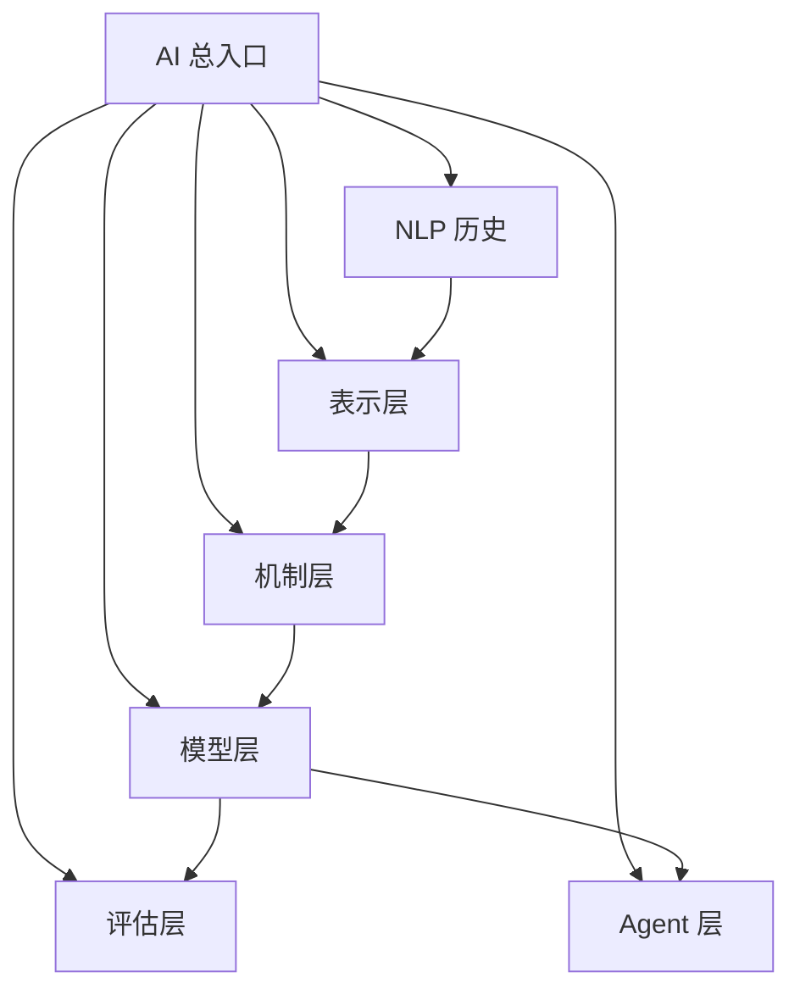

# AI 文档总览：从阅读地图到专题入口

`ai/` 目录的目标，不是堆叠彼此独立的长文，而是组织成一套可分层阅读的知识体系。当前目录主要沿 5 条主线展开：

- 表示：离散对象如何进入连续空间；
- 机制：模型内部的通用计算模块如何工作；
- 模型：完整模型如何组织表示、机制、训练与推理；
- 评估：如何衡量表示质量、语言建模质量与泛化能力；
- Agent：模型如何与工具、检索、规划和工作流结合。

如果先建立整体结构，可以把阅读地图概括为：

---

## 目录结构

| 目录 | 主要问题 | 适合什么时候读 |
| --- | --- | --- |
| [ai/nlp](./nlp/history.md) | 建立历史主线与方法演化关系 | 想先建立整体框架时 |
| [ai/representation](./representation/index.md) | 表示是什么、如何学习、如何用于检索与对齐 | 想理解 embedding 与表示学习时 |
| [ai/mechanism](./mechanism/index.md) | attention、位置机制、LoRA、MoE 等通用机制 | 想理解模块级原理时 |
| [ai/model](./model/index.md) | N-Gram、RNN、Transformer、BERT、GPT 等完整模型 | 想系统理解某个模型时 |
| [ai/evaluation](./evaluation/index.md) | 如何评估语言模型与向量表示 | 想比较方法优劣时 |
| [ai/agent](./agent/index.md) | Agent 系统的结构、规划、工具与工作流 | 想从模型走向系统时 |

---

## 推荐阅读顺序

### 路线一：从历史到现代大模型

1. [NLP 历史](./nlp/history.md)
2. [Embedding](./representation/embedding.md)
3. [Attention](./mechanism/attention.md)
4. [Self-Attention](./mechanism/self-attention.md)
5. [Transformer](./model/transformer.md)
6. [BERT](./model/bert.md)
7. [GPT](./model/gpt.md)

### 路线二：从表示到检索

1. [Embedding](./representation/embedding.md)
2. [word2vec](./representation/word2vec.md)
3. [向量表示分析](./evaluation/embedding-geometry.md)
4. [语言模型评估](./evaluation/language-model-evaluation.md)

### 路线三：从序列模型到 Transformer

1. [N-Gram](./model/n-gram.md)
2. [NPLM](./model/nplm.md)
3. [RNN](./model/rnn.md)
4. [LSTM](./model/lstm.md)
5. [Seq2Seq](./model/seq2seq.md)
6. [Attention](./mechanism/attention.md)
7. [Transformer](./model/transformer.md)

### 路线四：从模型到 Agent 系统

1. [GPT](./model/gpt.md)
2. [LoRA](./mechanism/lora.md)
3. [MoE](./mechanism/moe.md)
4. [Agent Arch](./agent/arch.md)

---

## 阅读原则

为了避免在长文之间来回跳转，建议按下面的层级理解：

- 先读总览型文档，建立问题地图；
- 再读机制型文档，理解关键模块；
- 最后读模型型文档，理解这些机制如何组合成完整系统。

当前目录中，一些主题仍在后续治理中逐步拆分。阅读时可优先把下列文档当作总入口：

- [NLP 历史](./nlp/history.md)
- [表示层索引](./representation/index.md)
- [机制层索引](./mechanism/index.md)
- [模型层索引](./model/index.md)

---

## 维护约定

后续新增或修改 `ai/` 目录文档时，建议优先遵守以下原则：

- 一篇文档只回答一个主问题；
- 公共机制只在一个主文档中完整展开；
- 其他文档保留最小必要摘要，并通过链接指向主文档；
- 当单篇文档超过合理篇幅时，优先考虑拆成“主文档 + 专题文档”。

这套总览页的作用，就是让整套 AI 文档从“单篇阅读”逐步走向“体系阅读”。
