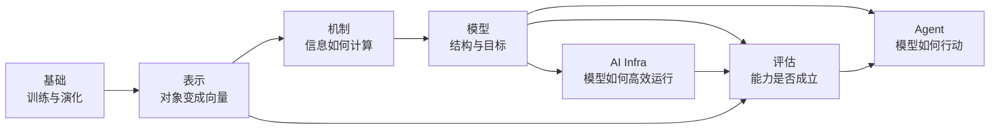

# 人工智能

人工智能系统可以沿七个彼此衔接的层次理解：学习所需的基础、数据的表示方式、信息处理机制、完整模型架构、训推基础设施、能力评估方法，以及模型参与实际任务的 Agent 系统。

```mermaid
flowchart LR
	F["基础\n训练与演化"] --> R["表示\n对象变成向量"]
	R --> M["机制\n信息如何计算"]
	M --> A["模型\n结构与目标"]
	A --> I["AI Infra\n模型如何高效运行"]
	A --> E["评估\n能力是否成立"]
	A --> G["Agent\n模型如何行动"]
	I --> E
	R --> E
	E --> G
```

这张图表达的是依赖关系，不是强制顺序。已有深度学习基础的读者可以直接进入模型；准备搭建检索或 Agent 系统时，则可从表示或评估反向补齐前置知识。

---

## 知识分区

| 分区 | 核心问题 | 起点 |
| --- | --- | --- |
| [基础](./foundations/index.md) | 数学符号如何阅读，神经网络如何学习，NLP 方法为何演化到 Transformer | [数学与符号约定](./foundations/math-notation.md) |
| [表示](./representation/index.md) | 离散对象如何进入连续空间并形成可比较的几何结构 | [Embedding](./representation/embedding.md) |
| [机制](./mechanism/index.md) | Attention、位置、稀疏路由和低秩适配如何计算 | [Attention](./mechanism/attention.md) |
| [模型](./model/index.md) | 从 N-gram 到 Transformer 与状态空间模型，完整建模对象如何变化 | [模型地图](./model/index.md) |
| [AI Infra](./infra/index.md) | GPU、通信、训练和推理 Runtime 如何把模型变成可运行系统 | [AI Infra 总览](./infra/index.md) |
| [评估](./evaluation/index.md) | 概率、检索、生成和长上下文能力如何被可靠测量 | [评估设计](./evaluation/index.md) |
| [Agent](./agent/index.md) | 如何把模型、工具、状态和控制流组成可执行系统 | [Agent 系统](./agent/index.md) |

---

## 六条阅读路线

### 语言模型主线

[NLP 方法演化](./foundations/nlp-history.md) → [N-gram](./model/n-gram.md) → [NPLM](./model/nplm.md) → [RNN](./model/rnn.md) → [LSTM](./model/lstm.md) → [Seq2Seq](./model/seq2seq.md) → [Transformer](./model/transformer.md) → [BERT](./model/bert.md) / [GPT](./model/gpt.md)

这条路线关注上下文如何从固定窗口、递归状态演化为全局交互，以及训练目标如何从任务专用转向预训练。

### 表示与检索主线

[Embedding](./representation/embedding.md) → [word2vec](./representation/word2vec.md) → [文本嵌入](./representation/text-embedding.md) → [向量检索](./representation/vector-retrieval.md) → [检索评估](./evaluation/retrieval-evaluation.md)

这条路线把「向量是什么」「向量如何学到」「向量怎样部署」「系统怎样验收」分开处理。

### 长上下文与系统主线

[Self-Attention](./mechanism/self-attention.md) → [位置表示](./mechanism/positional-encoding.md) → [长上下文](./mechanism/long-context.md) → [稀疏注意力](./mechanism/sparse-attention.md) / [状态空间模型](./model/state-space-model.md) → [长上下文评估](./evaluation/long-context-evaluation.md) → [Agent 系统](./agent/index.md)

这条路线同时检查能力与代价，避免把名义窗口长度、理论复杂度或工具数量直接等同于系统效果。

### 推理框架岗位主线

[Tokenization](./representation/tokenization.md) → [Transformer](./model/transformer.md) → [Tensor 与内存](./foundations/tensor-and-memory.md) → [GPU 执行](./infra/accelerator/gpu-architecture.md) → [性能模型](./infra/accelerator/performance-model.md) → [Prefill 与 Decode](./infra/inference/prefill-decode.md) → [KV Cache](./infra/inference/kv-cache-management.md) → [Batch 调度](./infra/inference/batching-scheduling.md) → [推理框架](./infra/inference/frameworks.md) → [实验与项目](./infra/labs/index.md)

这条路线优先覆盖推理引擎岗位的完整数据面。读者应同步完成 CPU 模拟实验；具备 GPU 后再补 CUDA/Triton、NCCL 和目标框架性能证据。

### 训练框架主线

[神经网络训练基础](./foundations/neural-network-basics.md) → [数值计算](./foundations/numerical-computing.md) → [Collective](./infra/distributed/collectives.md) → [训练循环与内存](./infra/training/memory-and-loop.md) → [混合精度](./infra/training/mixed-precision.md) → [训练并行](./infra/training/parallelism.md) → [Checkpoint](./infra/training/checkpoint-and-recovery.md) → [训练框架](./infra/training/frameworks.md) → [训练性能](./infra/training/performance.md)

这条路线用状态归属与通信解释 DDP、FSDP、ZeRO、TP、PP、CP 和 EP，避免只记配置项。

### 检索增强与 Agent 主线

[文本嵌入](./representation/text-embedding.md) → [向量检索](./representation/vector-retrieval.md) → [检索评估](./evaluation/retrieval-evaluation.md) → [GPT](./model/gpt.md) → [生成评估](./evaluation/generation-evaluation.md) → [Agent 系统](./agent/index.md)

这条路线把外部证据、语言生成和真实动作分成独立接口。检索到文档不代表回答忠实，模型输出工具调用也不代表动作已经授权或成功执行。

---

## 理解框架

- 完整模型由表示、机制、训练目标和推理接口共同定义；
- 方法演化描述各类模型之间的因果关系，公式与推演解释具体计算过程；
- 指标必须结合数据集、切分方式和任务边界理解，单个分数不是模型能力的完整结论；
- 复杂度通常描述主导项，实际性能仍受批量大小、硬件、kernel 与内存访问影响。
