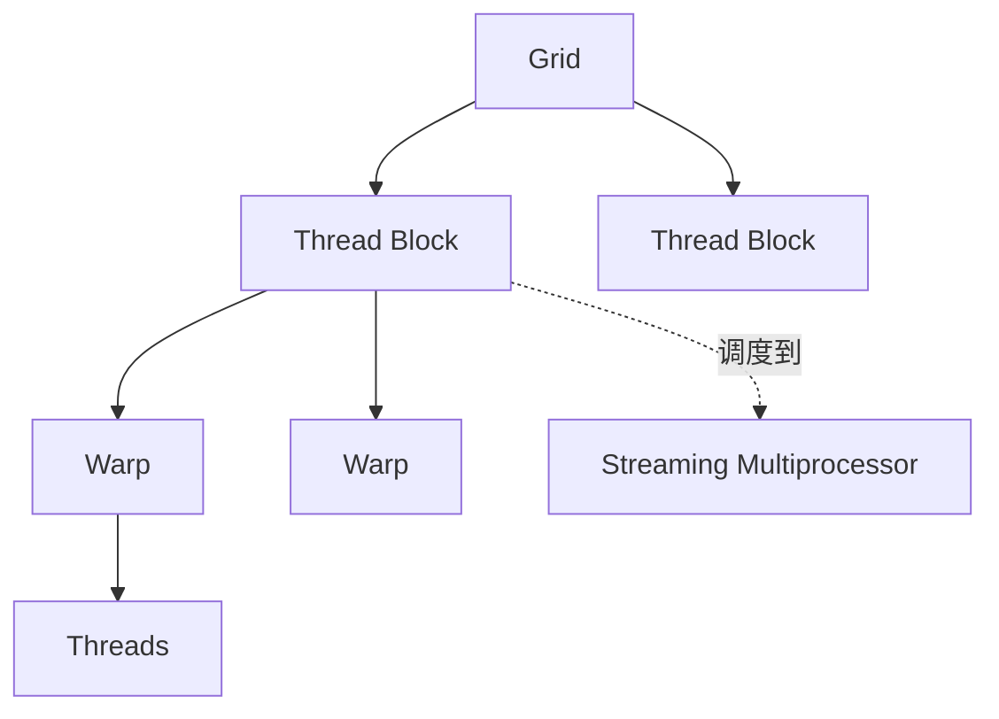

# GPU 执行与存储层级

GPU 通过大量并行线程隐藏运算和内存等待。一个 kernel 是否高效，不只取决于总 FLOPs，还取决于线程如何成组执行、数据是否合并访问、工作集放在哪一层存储，以及每个 SM 能同时驻留多少工作。

---

## 执行层级

- Grid 是一次 kernel launch 的全部 block；
- Block 被调度到一个 SM，并在结束前留在该 SM；
- Warp 是硬件共同发射指令的线程组；
- 不同架构的资源上限不同，不能把某一代 GPU 的寄存器或 Shared Memory 数值写成通用常数。

同一 Warp 中线程走不同分支时，路径可能被分批执行，称为分支分歧。它不表示结果错误，但会降低有效并行度。

---

## 存储层级

| 层级 | 作用域 | 特征 | 典型用途 |
| --- | --- | --- | --- |
| Register | thread | 最快、容量有限 | 标量、中间累加 |
| Shared Memory | block | 软件管理、低延迟 | tile 复用、归约 |
| L1/L2 Cache | SM/设备 | 硬件缓存 | 重用 global load |
| HBM/Global Memory | 设备 | 容量大、延迟高 | 权重、激活、KV cache |
| Host Memory | CPU | 经 PCIe/NVLink 访问 | 输入、权重 staging、offload |

高效 kernel 通常把 HBM 数据分块搬入 Shared Memory 或寄存器，在片上多次复用后再写回。若每个元素只做少量运算便被丢弃，性能更可能受内存带宽限制。

Global Memory 访问应尽量 coalesced，即相邻线程访问相邻地址。非连续 stride、随机索引和不规则路由会增加内存事务。Shared Memory 也存在 bank 组织，冲突会把本可并行的访问串行化。

---

## Occupancy 不是最终目标

Occupancy 描述一个 SM 上活跃 Warp 相对上限的比例。寄存器、Shared Memory、block 大小和硬件上限共同约束驻留数量。

高 Occupancy 有助于隐藏延迟，但不保证更快。过度减少寄存器可能引发 spill 到本地内存；增加更多 Warp 也无法修复低效访存或多余计算。应以端到端 kernel 时间、吞吐和资源计数器验证。

---

## AI 算子的映射

- GEMM 用分层 tiling 复用 A、B 矩阵；
- Softmax 和 Norm 需要行内归约；
- Attention 同时包含 GEMM、Softmax 与分块 KV 访问；
- Decode 中小 batch 的矩阵向量或窄 GEMM 可能难以填满 GPU；
- MoE 先路由和重排 token，再运行分组 GEMM，容易受不均衡影响。

分析算子时，应先写出线程负责的输出元素、每个元素读取的数据、跨线程共享的数据和同步点。

---

## CPU 对照

CPU 的对应概念是 core、hardware thread、SIMD、cache line、L1/L2/L3 与 NUMA。CPU 通常用少量强核和大 cache 优化低延迟与复杂控制流；GPU 用更多执行单元优化规则数据并行。

无 GPU 时可以在 CPU 上研究 cache blocking、SIMD、线程扩展和 NUMA，但不能据此推断 Warp 分歧、Shared Memory 或 Tensor Core 行为。

## 参考资料

- NVIDIA. [CUDA C++ Programming Guide](https://docs.nvidia.com/cuda/cuda-c-programming-guide/).
- NVIDIA. *GPU Architecture Whitepapers*.
