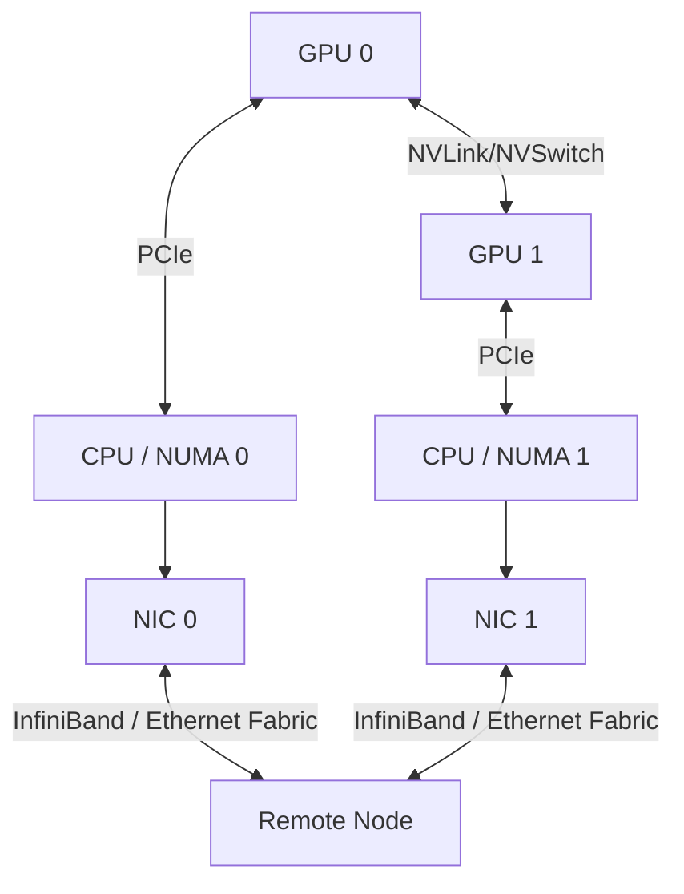

# 拓扑与网络：通信经过哪些链路

同一个 Collective 在单机 NVLink、多机 InfiniBand 或普通以太网上可能表现完全不同。拓扑分析的核心是画出 GPU、CPU、NIC 和交换设备之间的物理路径，而不是只记录「有几张卡」。

---

## 分层拓扑

数据路径可能经过 GPU peer link、PCIe switch、CPU interconnect、NIC 和网络交换机。错误的 GPU/NIC affinity 会让流量绕过更慢路径或跨 NUMA 节点。

---

## 关键技术

- GPUDirect P2P 允许 GPU 之间更直接地访问或复制；
- GPUDirect RDMA 让 NIC 与 GPU memory 直接传输，减少主机 staging；
- RDMA 降低 CPU 参与和复制，但仍需正确注册内存与管理队列；
- NVLink/NVSwitch 提供节点内高带宽互联，具体带宽随硬件代际和拓扑变化；
- InfiniBand 与 RoCE 都可支持 RDMA，但拥塞、无损网络和运维模型不同。

技术名称不能代替实测。应分别测量单向带宽、双向带宽、Collective 带宽、延迟和并发竞争。

---

## 并行策略如何使用拓扑

高频、细粒度的 Tensor Parallel 通信通常优先放在最快的节点内互联；Pipeline Parallel 跨 stage 传输的频率与消息形状不同，可以延伸到节点间；Data Parallel 的梯度同步可通过 bucket 与反向计算重叠。

MoE 的 AllToAll 对全局带宽和负载均衡敏感。上下文并行还会按序列切分 Attention 状态。最优映射取决于模型、序列长度、并发和拓扑，不存在固定的「先 TP 后 PP」万能配置。

---

## CPU 路线

CPU 集群可以研究 NUMA、NIC affinity、TCP/RDMA、MPI 和层次化 Collective。在只有单机时，可通过多个进程和限制带宽/延迟验证调度与通信模型。GPU Direct 和 NVLink 行为必须在相应硬件上补测。

通用网络前置知识见 [IP](../../../fundamentals/network/ip.md)、[TCP](../../../fundamentals/network/tcp.md)和[网络基础](../../../fundamentals/network/network.md)。

## 参考资料

- NVIDIA. *GPUDirect RDMA Documentation*.
- NVIDIA. *NVLink and NVSwitch Technical Overview*.
