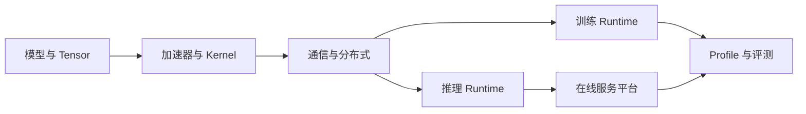

# AI Infra：把模型变成可训练、可推理的系统

AI Infra 研究模型如何在有限的计算、内存、网络和可靠性预算内运行。模型公式给出「算什么」，Infra 继续回答「数据放在哪里、由谁调度、怎样跨设备、如何测量，以及失败时发生什么」。

这条链路不是单向依赖。模型的 GQA、MoE、量化和位置机制会反向改变缓存、通信与 kernel；集群拓扑和延迟目标也会影响并行策略与模型选择。

---

## 知识分区

| 分区 | 核心问题 | 起点 |
| --- | --- | --- |
| [加速器](./accelerator/index.md) | GPU/CPU 怎样执行 Tensor 算子，瓶颈来自计算还是数据移动 | [GPU 执行与存储层级](./accelerator/gpu-architecture.md) |
| [分布式](./distributed/index.md) | Tensor 怎样跨设备切分、归约和交换 | [Collective](./distributed/collectives.md) |
| [训练 Runtime](./training/index.md) | 参数、梯度、优化器、数据和 Checkpoint 怎样协同 | [训练循环与内存](./training/memory-and-loop.md) |
| [推理 Runtime](./inference/index.md) | 请求、KV cache、Batch 和解码怎样被调度 | [请求生命周期](./inference/request-lifecycle.md) |
| [服务平台](./platform/index.md) | 模型怎样部署、路由、扩缩容和观测 | [部署与路由](./platform/deployment-and-routing.md) |
| [实验与项目](./labs/index.md) | 如何用可复现证据把知识变成工程能力 | [实验路线](./labs/index.md) |

岗位方向、里程碑和可交付证据见[AI Infra 岗位能力路线](./job-readiness.md)。

---

## 岗位路线

### 推理引擎与性能

[Tensor 与内存](../foundations/tensor-and-memory.md) → [性能模型](./accelerator/performance-model.md) → [CUDA 与 Kernel](./accelerator/cuda-and-kernels.md) → [Prefill 与 Decode](./inference/prefill-decode.md) → [KV Cache 管理](./inference/kv-cache-management.md) → [Batch 调度](./inference/batching-scheduling.md) → [推理框架](./inference/frameworks.md)

### 训练框架

[数值计算](../foundations/numerical-computing.md) → [Collective](./distributed/collectives.md) → [训练循环与内存](./training/memory-and-loop.md) → [混合精度](./training/mixed-precision.md) → [并行策略](./training/parallelism.md) → [训练框架](./training/frameworks.md)

### Serving 与平台

[请求生命周期](./inference/request-lifecycle.md) → [API 与可靠性](./inference/api-observability-reliability.md) → [部署与路由](./platform/deployment-and-routing.md) → [GPU Fleet 与容量](./platform/fleet-and-capacity.md) → [服务实验](./labs/framework-serving-labs.md)

---

## 学习完成的证据

「读完」不以页面数量衡量。一个具备入门岗位能力的读者，应能完成以下闭环：

- 从模型配置推导参数、KV 和训练状态显存；
- 依据 shape、FLOPs 与数据移动判断计算、带宽或通信瓶颈；
- 解释 DP、TP、PP、CP、EP、FSDP 和 ZeRO 的状态归属与 Collective；
- 追踪一条请求从 Tokenization 到 Streaming 的状态变化；
- 设计连续批处理、Paged KV 与过载保护的基本数据结构；
- 使用 profile 证据而不是单一吞吐数字提出优化；
- 给出包含质量、延迟、吞吐、容量和失败语义的上线方案。

实验可先使用 CPU 验证语义与系统结构，再在有 GPU 时补齐硬件性能证据。CPU 结果不能外推为 GPU 加速结论。

---

## 覆盖范围与来源

本分区以《[Transformer 架构：从直觉到实现](https://waylandz.com/llm-transformer-book/)》正文 32 章和附录 A、B、C 作为主题覆盖检查：模型基础回链到 `ai/` 既有页面，手写 Model/Train/Inference 转化为实验规格，FlashAttention、KV Cache、量化、MoE、后训练、Scaling 与解码进一步扩展为训推系统专题。完整章节来源可在[作者仓库](https://github.com/WaylandZhang/llm-transformer-book)核对。

该书用于建立直觉和检查知识面；算法结论优先引用原始论文，框架行为使用官方文档与锁定版本源码，性能结论只来自记录完整环境的可复现实验。
