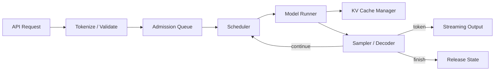

# 推理 Runtime

推理 Runtime 把「下一 token 概率」组织成有期限、有状态、可取消的服务。学习顺序是请求生命周期、两种执行阶段、KV 所有权、调度，再进入 kernel、量化、分布式和平台。后面的优化都应能解释它改变了哪一项时间或状态，而不是仅记住特性名称。

---

## 核心专题

| 页面 | 核心问题 |
| --- | --- |
| [请求生命周期](./request-lifecycle.md) | 一条请求经历哪些状态，取消和失败如何传播 |
| [Prefill 与 Decode](./prefill-decode.md) | 两阶段的计算、内存和延迟特征有何不同 |
| [KV Cache 管理](./kv-cache-management.md) | KV 怎样分块、分配、共享、回收和计量 |
| [Batch 与调度](./batching-scheduling.md) | 不同长度请求怎样共同占用 iteration |
| [Attention Kernel](./attention-kernels.md) | Flash、Paged 与 Decode Attention 分别优化什么 |
| [量化](./quantization.md) | 权重、激活和 KV 如何低精度部署并验证质量 |
| [解码与推测执行](./decoding-and-speculation.md) | logits 如何变为 token，怎样减少串行目标模型步数 |
| [分布式推理](./distributed-inference.md) | TP、PP、DP、EP 如何映射到在线请求 |
| [前缀缓存与 PD 分离](./cache-and-disaggregation.md) | 跨请求复用与阶段拆分何时值得引入 |
| [模型服务特性](./model-serving-features.md) | LoRA、MoE、多模态和结构化输出增加哪些状态 |
| [API、可观测性与可靠性](./api-observability-reliability.md) | 怎样定义外部契约、过载与失败语义 |
| [基准测试与容量](./benchmarking-capacity.md) | 怎样建立可比较的延迟、吞吐和成本证据 |
| [推理系统排障](./troubleshooting.md) | 如何从症状定位到请求、Runtime、Kernel 或通信 |
| [框架案例](./frameworks.md) | vLLM、SGLang、TensorRT-LLM、llama.cpp、Dynamo 如何分层 |

---

## 推理框架岗位检查表

完成本分区后，应能：

- 从模型配置计算单 token KV 字节并估算并发；
- 解释请求为何在 Prefill、Decode、队列或 CPU 前端受限；
- 设计 block-based KV allocator 和 continuous batching scheduler；
- 说明 chunked prefill、prefix cache、speculative decoding 与 PD 分离的收益条件；
- 使用 TTFT、TPOT、Goodput 和尾延迟比较配置；
- 追踪一个请求经过至少一个主流框架的关键对象；
- 描述取消、OOM、worker 失败和部分输出后的外部语义；
- 用 CPU 模拟器验证调度与内存不变量，再在 GPU 上补 kernel 和吞吐证据。
