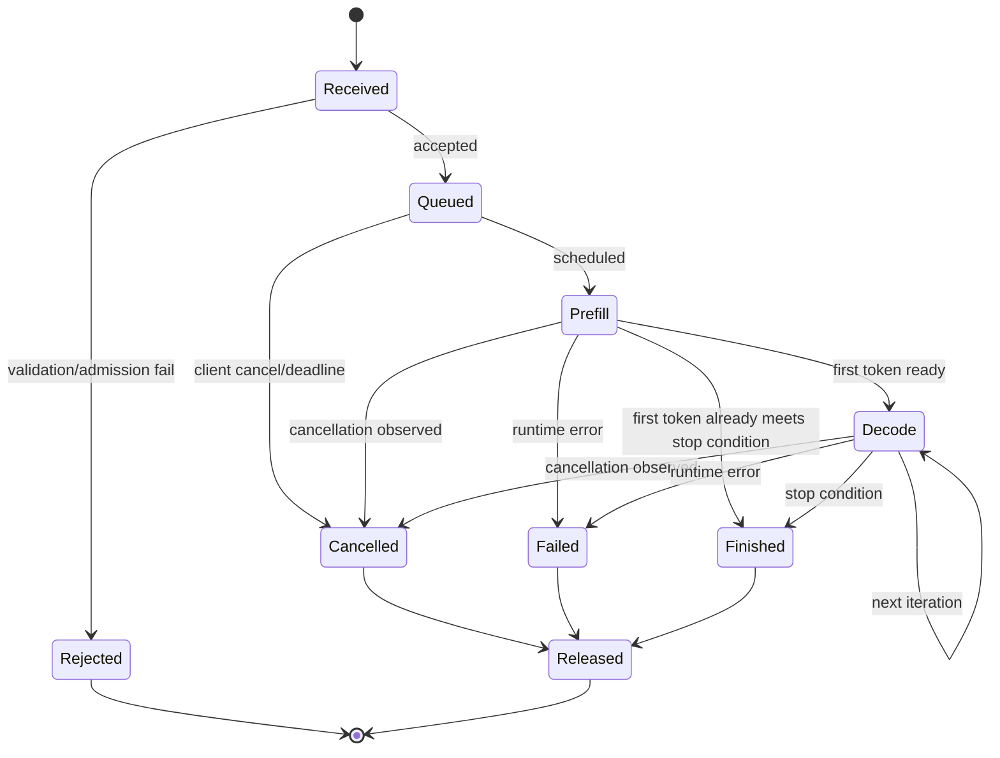

# 推理请求生命周期

生成请求不是一次无状态矩阵乘，而是一段持有缓存、随机数和输出进度的执行过程。请求被接收、被准入、产生首 token、达到停止条件和释放资源，是五个不同事件；把它们合并成一个「成功」标志，会使超时、取消与指标失去明确语义。

---

## 状态机

取消信号不能保证立即停止已经提交到 GPU 的 kernel，但 Runtime 应在安全边界停止后续调度、停止流式发送并释放 KV。资源释放必须幂等，避免正常结束、超时和 worker 错误同时触发 double free。

---

## 接收与验证

可以用请求 `R` 的三个游标理解执行：已提交的模型输入位置、已经确认生成的 token 数、已经发送给客户端的字节数。三者不会总是同步增长。一个 token 可能尚不能解码成完整字符，GPU 也可能已经提交下一轮，而客户端刚发来取消。

因此取消应在可识别的安全点阻止后续调度，并等待必要的在途工作结束后回收其存储。仅从 waiting 队列删除请求，不代表 running 状态和 KV 也已经释放；直接回收仍被 kernel 读取的块则可能污染另一个请求。

重复的终止信号应该汇入同一个释放状态迁移。幂等释放不是「多次 free 没关系」，而是第二次及后续通知不再重复执行已完成的资源回收。对此可在 CPU 模拟中让完成、取消和失败以不同顺序到达，检查资源总数守恒。

进入 GPU 队列前应完成：

- 模型、adapter、tokenizer 和聊天模板选择；
- 输入 tokenization 与长度校验；
- 最大输出、停止条件和解码参数校验；
- 租户配额、请求 deadline 与权限；
- multimodal 输入大小和预处理边界；
- 当前 KV、队列与模型容量的 admission decision。

将不可执行请求提前拒绝，比让其占用部分 KV 后在模型内部 OOM 更容易提供稳定语义。

---

## Runtime 状态

每个序列至少需要：

| 状态 | 用途 |
| --- | --- |
| request/sequence ID | 关联日志、流和资源 |
| input/output token IDs | 模型输入与返回内容 |
| position/length | 构造位置和停止条件 |
| KV block table | 定位每层历史 KV |
| sampling state | RNG、penalty、stop matcher |
| scheduling metadata | 优先级、deadline、阶段、抢占信息 |
| output cursor | 流式 detokenization 与发送进度 |

状态应区分请求级与序列级：beam search 或多候选采样会让一个请求包含多个序列，并共享部分前缀 block。

---

## Streaming 与背压

客户端断开不等于模型的任务完成，重试同一 HTTP 请求也不等于续接同一采样状态。若系统未提供恢复协议，应把已输出部分内容后的故障明确返回，避免后台重新生成一段不同文本却伪装成连续流。

生成 token 后通常先增量 detokenize，再写入网络。慢客户端可能形成背压。可选择有界输出 buffer，超过边界后暂停、取消或断开；无限 buffer 会把网络慢请求转成进程内存风险。

一旦部分内容已发送，内部透明重试可能产生重复或分叉文本。默认更清晰的语义是返回流中错误并释放状态；只有协议提供幂等游标且客户端支持恢复时，才考虑续传。

---

## CPU 路线

整个状态机、tokenization、队列、sampling、streaming 和取消都可用 mock model 在 CPU 上实现和测试。CPU 版本可以把一次模型 iteration 模拟为固定或按 token 数变化的耗时，用于验证资源生命周期和背压；GPU 环境再替换 model runner。

---

## 参考资料

- vLLM. [Architecture Overview](https://docs.vllm.ai/en/latest/design/arch_overview/).
- NVIDIA TensorRT-LLM. *Executor API*.
