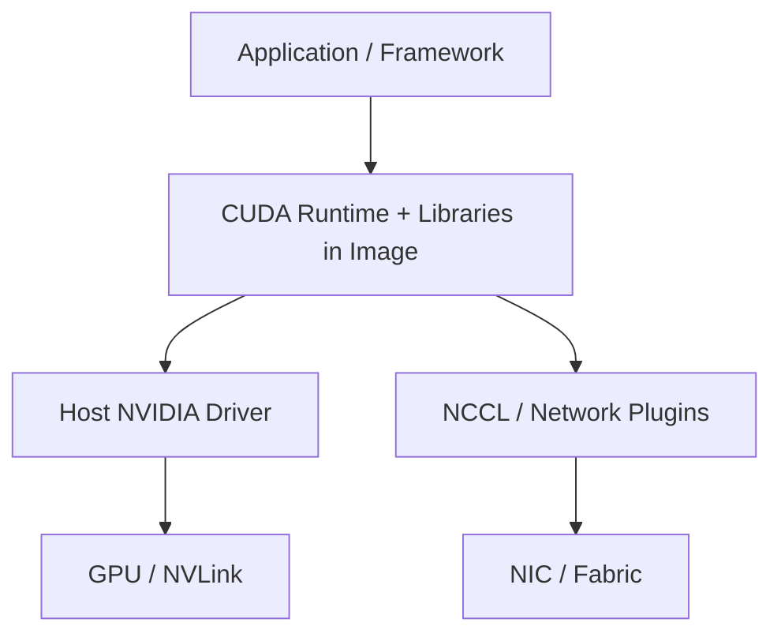

# GPU 容器与 Kubernetes

GPU 容器共享宿主机内核和驱动，通过设备节点与用户态 CUDA 库访问加速器。镜像中的框架、CUDA runtime 与宿主驱动必须兼容；「镜像能启动」不表示 NCCL、RDMA、拓扑和性能路径已经正确。

---

## 软件栈边界

发布时应记录镜像 digest、framework、CUDA/NCCL、driver 最低版本、GPU 架构和网络插件。不要用可变 tag 作为唯一复现标识。

---

## Kubernetes 资源

Device Plugin 或 Dynamic Resource Allocation 向 Pod 暴露 GPU。调度还要考虑：

- GPU 型号与显存；
- 同机 GPU 拓扑和 NVLink island；
- CPU、主机内存、NUMA 与 NIC affinity；
- 本地模型缓存与磁盘带宽；
- MIG/共享 GPU 的隔离与性能边界；
- 多 Pod gang scheduling 和启动顺序。

仅申请 `nvidia.com/gpu: 8` 不能保证 8 张设备之间具有目标互联，也不能保证多机网络已经配置 RDMA。

---

## 健康检查

| 检查 | 应回答的问题 |
| --- | --- |
| Startup | 权重是否加载、所有 rank 是否建立、预热是否完成 |
| Readiness | 是否可以接收新请求，KV/队列是否处于安全范围 |
| Liveness | 进程是否失去进展且需要重启 |

Liveness 不应因一次慢 Prefill 或满负载误杀进程。Readiness 可以在过载、模型切换或 worker group 不完整时撤销，而不必立即重启。

---

## CPU 路线

CPU-only Kubernetes 可以验证镜像、Deployment/StatefulSet、Service、配置、探针、滚动发布和监控。将 model worker 替换为 mock 或小型 CPU engine。GPU device、driver、NCCL 和拓扑检查需要在 GPU 节点补测。

## 参考资料

- NVIDIA. *Container Toolkit Documentation*.
- Kubernetes. *Schedule GPUs*.
