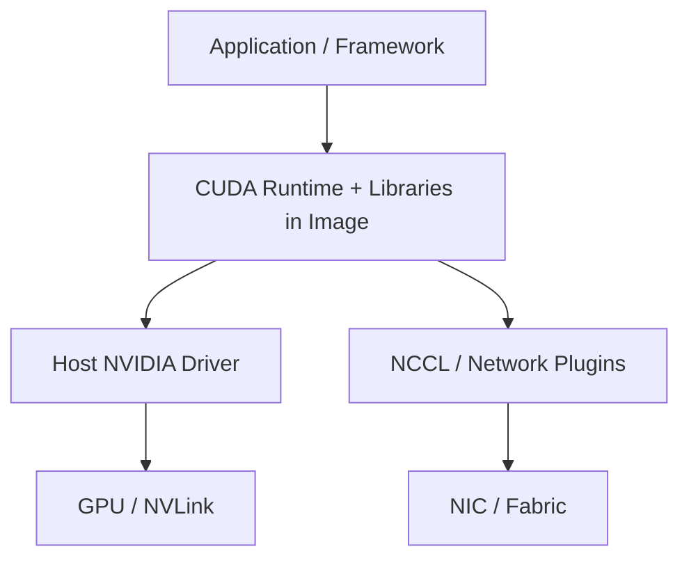

# GPU 容器与 Kubernetes

容器封装用户态程序，不封装一套独立 GPU 硬件与宿主驱动。镜像、驱动、设备暴露和网络插件共同组成执行环境；Kubernetes 再把资源需求映射到节点。本页讲部署边界，不把某个安装命令当成跨版本规范。

---

## 软件栈边界

发布时应记录镜像 digest、framework、CUDA/NCCL、driver 最低版本、GPU 架构和网络插件。不要用可变 tag 作为唯一复现标识。

---

## Kubernetes 资源

资源申请首先告诉调度器「需要几份可分配资源」，不是「按指定拓扑挑出最快设备」。若模型必须使用同一互联域，需由节点标签、资源描述和调度策略共同约束；实际方法依集群版本与插件而定。

多个 Pod 各自可调度，不代表整个分布式作业同时可用。若一部分 rank 已启动并等待另一部分，资源可能被长期占用却没有训练进度。Gang scheduling 保护的是组级启动条件，不是普通单 Pod 健康探针能替代的能力。

Device Plugin 或 Dynamic Resource Allocation 向 Pod 暴露 GPU。调度还要考虑：

- GPU 型号与显存；
- 同机 GPU 拓扑和 NVLink island；
- CPU、主机内存、NUMA 与 NIC affinity；
- 本地模型缓存与磁盘带宽；
- MIG/共享 GPU 的隔离与性能边界；
- 多 Pod gang scheduling 和启动顺序。

仅申请 `nvidia.com/gpu: 8` 不能保证 8 张设备之间具有目标互联，也不能保证多机网络已经配置 RDMA。

---

## 健康检查

启动慢、暂时过载和进程失去进展不能共用同一失败阈值。Startup 保护正常初始化，readiness 决定是否接新请求，liveness 才决定是否重启；把队列满当作进程死亡会引发重启—重新加载—更过载的反馈。

| 检查 | 应回答的问题 |
| --- | --- |
| Startup | 权重是否加载、所有 rank 是否建立、预热是否完成 |
| Readiness | 是否可以接收新请求，KV/队列是否处于安全范围 |
| Liveness | 进程是否失去进展且需要重启 |

Liveness 不应因一次慢 Prefill 或满负载误杀进程。Readiness 可以在过载、模型切换或 worker group 不完整时撤销，而不必立即重启。

---

## CPU 路线

CPU-only Kubernetes 可以验证镜像、Deployment/StatefulSet、Service、配置、探针、滚动发布和监控。将 model worker 替换为 mock 或小型 CPU engine。GPU device、driver、NCCL 和拓扑检查需要在 GPU 节点补测。

---

## 参考资料

- NVIDIA. [*Container Toolkit Documentation*](https://docs.nvidia.com/datacenter/cloud-native/container-toolkit/latest/).
- Kubernetes. [*Schedule GPUs*](https://kubernetes.io/docs/tasks/manage-gpus/scheduling-gpus/).
