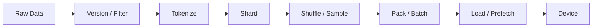

# 训练数据管线

训练数据管线把原始样本转换为可确定恢复的 token batch。其性能目标不是让 CPU 单独达到最高吞吐，而是让加速器持续获得符合训练语义的数据，同时保留样本版本、顺序和断点位置。

---

## 数据生命周期

离线 tokenize 可减少训练时 CPU 开销，但会把 tokenizer 版本固化到数据制品；在线 tokenize 更灵活，却增加运行时波动。无论选择哪种方式，都应记录数据版本、过滤规则、tokenizer 与模板。

---

## Packing 与 Padding

固定长度 padding 实现简单，但短样本会产生大量无效 token。Packing 把多个样本拼入一个训练序列，提高有效 token 比例。它需要明确：

- 样本间是否允许 Attention；
- loss mask 是否跨越文档边界；
- EOS 与 position ID 如何设置；
- 分布式 rank 是否重复或漏掉样本；
- 长样本截断策略。

「每秒序列数」不能比较不同 packing 配置，应报告每秒训练 token、有效 token 比例和实际 loss token 数。

---

## 并行加载与背压

DataLoader worker、预取队列、page-locked memory 和异步 H2D copy 可以重叠 I/O、CPU 预处理与 GPU 计算。队列太浅会让 GPU 等待，太深则增加主机内存并扩大故障时未确认的数据范围。

诊断应区分：存储读取、解压、tokenize、collate、主机复制和设备等待。只看 GPU utilization 无法确定数据阶段的具体瓶颈。

---

## 确定性恢复

若承诺从 Checkpoint 继续时不重复、不跳过训练 token，需要保存或重建：

- 当前 epoch/样本游标；
- shard 与 rank 映射；
- shuffle RNG 状态；
- packing buffer；
- 动态过滤或采样器状态。

保存这些状态会增加协议复杂度。若训练目标只要求统计等价而非逐样本精确恢复，应明确采用更简单的恢复语义和可接受重复范围。

---

## CPU 路线

本专题几乎可以完全在 CPU 上验证：使用本地文件、多进程 worker 和分布式 sampler，测量吞吐、内存、重复/遗漏与恢复。GPU 只用于进一步验证 H2D overlap 和设备等待。

## 参考资料

- PyTorch. *Data Loading and Processing Tutorial*.
- NVIDIA. *DALI Documentation*.
