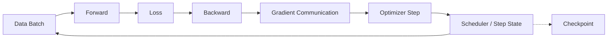

# 训练 Runtime

训练 Runtime 将同一数学目标展开为数据、计算、通信与状态更新。本分区按「单次更新 → 数值与数据 → 分片执行 → 恢复 → 性能」组织；后训练和 Scaling 则改变工作负载与资源目标。先把一个小模型的更新解释清楚，再扩大设备数。

---

## 主题地图

| 页面 | 核心问题 |
| --- | --- |
| [训练循环与内存](./memory-and-loop.md) | 参数、激活、梯度和优化器状态何时存在 |
| [混合精度](./mixed-precision.md) | 不同状态使用何种 dtype，怎样检测数值失败 |
| [数据管线](./data-pipeline.md) | 样本怎样被切分、打包、加载和恢复 |
| [并行策略](./parallelism.md) | DP、TP、PP、CP、EP、FSDP、ZeRO 怎样组合 |
| [Checkpoint 与恢复](./checkpoint-and-recovery.md) | 哪些状态必须一致保存，失败后保证什么语义 |
| [训练框架](./frameworks.md) | PyTorch、Megatron-Core、DeepSpeed 等如何映射到统一概念 |
| [后训练 Runtime](./post-training-runtime.md) | SFT、偏好优化和在线生成训练增加哪些系统组件 |
| [Scaling 与资源预算](./scaling-and-compute.md) | 参数、训练 token、FLOPs、时间和成本如何连接 |
| [训练性能](./performance.md) | 怎样测量 MFU、吞吐、通信与 Straggler |

推荐先在单进程 CPU 或单 GPU 上理解状态生命周期，再使用多进程 CPU 验证 Collective 和分片语义，最后进入多 GPU 性能测试。

---

## 如何判断已经读懂

给出一个变长文本 batch，能说清哪些 token 参与 loss、梯度如何归一化、累积多少次才更新、每种状态的 dtype 与归属，以及恢复后下一条数据从哪里来。再把计算、通信和检查点写入放到同一时间线上，才足以解释训练速度，而不是只背诵并行缩写。
