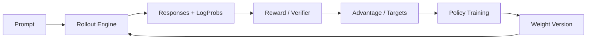

# 后训练 Runtime

后训练仍建立在 Transformer 训练与推理之上，但不同算法会额外引入参考模型、奖励模型、生成 worker、经验数据和多阶段同步。系统设计应从算法需要的数据流出发，而不是把 RLHF 简化成另一种 loss。

---

## 工作负载类型

| 阶段 | 主要计算 | 额外状态或服务 |
| --- | --- | --- |
| SFT | teacher-forced forward/backward | 指令数据、loss mask |
| DPO/偏好优化 | chosen/rejected 多次前向与反向 | reference log-prob 或参考模型 |
| Reward Model | 序列评分训练 | 偏好对、标量 head |
| 在线 RL | 生成、奖励、优势估计、策略更新 | rollout worker、旧策略、经验数据 |
| Distillation | 教师生成或 logits 与学生训练 | 教师服务、缓存或离线数据 |

SFT 的系统形态最接近预训练。DPO 增加成对序列和参考概率。在线 RL 在生成与训练之间建立闭环：推理引擎产生 rollout，训练器消费经验并更新权重，二者的吞吐必须匹配。

---

## 生成—训练闭环

需要定义权重版本语义：rollout 使用哪个策略版本，训练 batch 是否允许混合版本，更新如何传给推理 worker。频繁同步降低陈旧度却消耗网络和暂停时间；宽松同步提高吞吐，但算法必须容忍 off-policy 数据。

在没有明确算法契约和质量证据时，不应默认引入复杂的增量权重协议或持久 rollout cache。可以先采用离线批次、显式版本和失败即重跑的简单边界。

---

## 推理模型的系统影响

长思维链和采样多条候选会增加输出 token、KV cache 和 rollout 方差；验证器可能增加 CPU 或 GPU 服务；按结果过滤会让有效训练 token 比例下降。规划容量时应记录：

- 每 prompt 的候选数量；
- 输出长度分布和提前终止率；
- reward/verification 延迟；
- 生成 token 到训练 token 的转化率；
- 权重更新与 rollout 的版本差。

---

## CPU 路线

小模型可以在 CPU 上验证 SFT、DPO loss、rollout 数据结构、版本字段和队列背压。在线 RL 的系统拓扑也可用 mock model 模拟。真实生成与训练吞吐、低精度 kernel 和多 GPU 权重同步仍需 GPU 环境。

## 参考文献

- Ouyang, L. et al. (2022). *Training Language Models to Follow Instructions with Human Feedback*.
- Rafailov, R. et al. (2023). *Direct Preference Optimization*.
- Shao, Z. et al. (2024). *DeepSeekMath: Pushing the Limits of Mathematical Reasoning in Open Language Models*.
