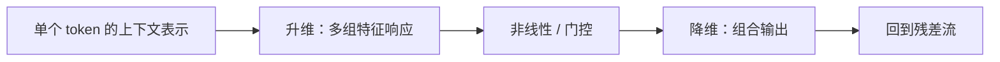

# 前馈网络与门控激活

Attention 在 token 之间搬运信息，前馈网络在每个 token 内重组通道。对大多数 Decoder-only 模型，FFN 包含大规模矩阵乘，是参数量和训练 FLOPs 的重要来源；MoE 则把其中一部分替换成条件激活的专家。

::: info 符号与约定
$x\in\mathbb{R}^{d_{\text{model}}}$ 是一个 token 的列向量，$d_{\text{ff}}$ 是中间维度，$n$ 是本次一起计算的 token 总数；$\phi$ 是逐元素激活，$\odot$ 表示逐元素乘法。批量矩阵用 token 作为行，因此批量式中的权重需要相应转置。
:::

---

## 逐位置 MLP

基础形式为：

$$
\operatorname{FFN}(x)=W_2\phi(W_1x+b_1)+b_2
$$

这里 $W_1\in\mathbb{R}^{d_{\text{ff}}\times d_{\text{model}}}$，$W_2\in\mathbb{R}^{d_{\text{model}}\times d_{\text{ff}}}$。忽略 bias，一层 FFN 参数量为 $2d_{\text{model}}d_{\text{ff}}$。

对 $n$ 个 token 组成的行矩阵 $X$，忽略 bias，记中间激活为 $U=\phi(XW_1^\top)$，两次投影可以视为：

$$
XW_1^\top:\ [n,d_{\text{model}}]\rightarrow[n,d_{\text{ff}}],
\qquad
UW_2^\top:\ [n,d_{\text{ff}}]\rightarrow[n,d_{\text{model}}]
$$

训练或 Prefill 的 $n$ 较大，容易形成高效 GEMM；单请求 Decode 的 $n$ 很小，更可能受到权重读带宽和 kernel launch 影响。

「逐位置」意味着同一层对所有 token 使用同一组权重，而不是每个位置一个 MLP。设输出为 $Y$，独立 FFN 中 $Y_i$ 只依赖 $X_i$，不会直接读取 $X_j$。但 $X_i$ 可以已经包含上一层 Attention 汇集的上下文，因此「不混合位置」不等于「不知道上下文」。

如果移除非线性，两次线性投影会合成为 $W_2W_1x$，扩大的中间层并没有带来两层非线性表达能力。升维的作用是产生多种特征响应，激活改变哪些响应以及响应强度，降维再把它们组合回残差流所需的宽度。

这张图是一条 token 的通道计算，不是 token 间的 Attention 图。完整位置见 [Transformer Block](../model/transformer.md)。

---

## 激活与门控

ReLU、GELU 和 SiLU 提供不同非线性。门控 FFN 常写为：

$$
\operatorname{GatedFFN}(x)
=
W_o\left(\phi(W_gx)\odot W_ux\right)
$$

当 $\phi$ 使用 SiLU 时通常称为 SwiGLU。门控形式有三个投影，因此不能在相同 $d_{\text{ff}}$ 下直接与两投影 FFN 比较参数量；实际模型常调整中间维度，使总参数或计算接近目标预算。

<FeedForwardExplorer />

其中 $W_g,W_u\in\mathbb{R}^{d_{\text{ff}}\times d_{\text{model}}}$，$W_o\in\mathbb{R}^{d_{\text{model}}\times d_{\text{ff}}}$。门分支产生调制系数，up 分支产生被调制的特征；两者来自同一个输入，但权重独立。

| 名称 | 激活或门函数 | 应怎样理解 |
| --- | --- | --- |
| ReLU | $\max(0,a)$ | 截断负响应 |
| GELU | $a\Phi(a)$，$\Phi$ 为标准正态分布 CDF | 按输入值平滑调节响应，不是随机丢弃 |
| GLU | $\sigma(a)$，$\sigma(a)=1/(1+e^{-a})$ | 原始 sigmoid 门乘另一线性分支 |
| GEGLU | $\operatorname{GELU}(a)$ | 用 GELU 替代 sigmoid 门 |
| SwiGLU | $\operatorname{SiLU}(a)=a\sigma(a)$ | 用 SiLU 调制另一分支 |

SwiGLU 的门值不是概率：可以为负，也可以大于 1，因此不能机械解释为「保留百分之多少」。门控 FFN 也没有 LSTM 的跨时间细胞状态；它调制当前 token 的特征，而不是决定历史记忆保留多久。

激活函数名称也不足以确定实现。需要检查 bias、维度取整、并行切分、量化粒度，以及门和值分支是否融合计算。

### 一个可手算的门控路径

假设对某个输入，已得到门投影 $W_gx=(0,2)$、up 投影 $W_ux=(3,-1)$，输出投影暂取单位矩阵。则：

$$
\operatorname{SiLU}(0)=0,\qquad
\operatorname{SiLU}(2)=\frac{2}{1+e^{-2}}\approx1.762
$$

逐元素乘后得到 $(0,-1.762)$。第一路虽有 up 响应 3，仍被门压为 0；第二路保留符号并放大幅度。梯度可回传两条分支，但部分分量可能为零，例如第一路对 up 分量的局部导数就是 0。

令 $a=W_gx$、$b=W_ux$、$u=\phi(a)\odot b$，则各分量满足：

$$
\frac{\partial u_i}{\partial a_i}=\phi'(a_i)b_i,\qquad
\frac{\partial u_i}{\partial b_i}=\phi(a_i)
$$

这说明门分支的学习取决于被调制特征，特征分支的学习也取决于门响应；「两次投影再相乘」引入了输入依赖的特征交互。

### 等参数比较，而非只替换函数名

假设普通 FFN 中间维度为 $4d_{\text{model}}$，参数量为 $8d_{\text{model}}^2$。令门控中间维度为 $d_{\text{gate}}$，其参数量为 $3d_{\text{model}}d_{\text{gate}}$，等参数要求：

$$
d_{\text{gate}}=\frac{8}{3}d_{\text{model}}
$$

这是理想预算，实际还需为硬件或并行分片取整。按一次乘加记 2 FLOPs、忽略 bias 和激活，普通与门控 FFN 分别约需 $4nd_{\text{model}}d_{\text{ff}}$ 和 $6nd_{\text{model}}d_{\text{gate}}$ FLOPs。相同中间宽度下门控多出约一半投影工作量；等参数宽度下主矩阵乘工作量接近。

Shazeer 的 2020 年论文在近似匹配参数和计算预算的 T5 类实验中比较 GLU 变体，观察到部分门控形式优于 ReLU/GELU 基线。它支持的是该实验配方中的设计选择，而不是证明 SwiGLU 对所有数据、初始化和预算都最优。

---

## Tensor Parallel 切分

第一层投影可以按输出通道切分，每个 rank 得到部分中间维；第二层按输入通道读取局部结果，随后用 AllReduce 或 ReduceScatter 合并输出。这样中间大激活不必完整复制到每个设备。

门控 FFN 要让 gate 与 up 投影采用一致切分，否则逐元素乘无法在本地完成。MoE 还会按 token 路由到专家，详见 [MoE](./moe.md) 与[训练并行策略](../infra/training/parallelism.md)。

---

## 融合与量化

常见优化包括：

- 合并 gate/up 投影；
- 把 bias、激活和逐元素乘融合；
- 选择适合形状的 GEMM tile；
- 量化权重并在 kernel 中融合反量化；
- 对 Decode 合并多个请求，增大 token batch。

优化必须保留形状与数值语义。对低精度门控网络，还应检查激活离群值和 scale 是否导致某一分支饱和。

CPU 可以用 BLAS 或 oneDNN 验证 FFN 形状、门控公式、量化误差和 batch 对吞吐的影响；GPU 才能验证 Tensor Core、HBM 和特定融合 kernel 的收益。

---

## 参考文献

- Hendrycks, D. and Gimpel, K. (2016). [*Gaussian Error Linear Units*](https://arxiv.org/abs/1606.08415). GELU 定义与激活比较。
- Shazeer, N. (2020). [*GLU Variants Improve Transformer*](https://arxiv.org/abs/2002.05202). 门控 FFN 公式、缩减中间宽度的公平比较和 T5 类预训练/微调实验。
