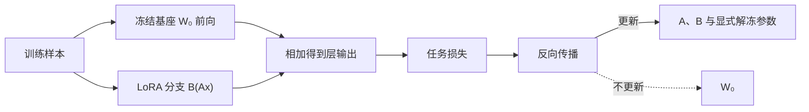

# LoRA：用低秩增量适配预训练权重

LoRA（Low-Rank Adaptation）冻结预训练权重，只学习一个低秩更新。它减少可训练参数、优化器状态与任务检查点大小；基座模型的前向接口不变。

<LoRAParameterExplorer />

::: info 符号与约定
沿用[数学与符号约定](../foundations/math-notation.md)。$W_0$ 是冻结基座权重，$\Delta W$ 是任务增量；$A\in\mathbb{R}^{r\times d_{\text{in}}}$、$B\in\mathbb{R}^{d_{\text{out}}\times r}$ 是低秩矩阵，$r$ 是 rank，$\alpha$ 是缩放系数；$x,y$ 是线性层输入与输出。
:::

---

## 低秩参数化

对线性层：

$$
y=W_0x,\qquad W_0\in\mathbb{R}^{d_{\text{out}}\times d_{\text{in}}}
$$

全量微调直接学习同形状的 $\Delta W$。LoRA 将其约束为：

$$
\Delta W=\frac{\alpha}{r}BA
$$

其中：

$$
A\in\mathbb{R}^{r\times d_{\text{in}}},\qquad
B\in\mathbb{R}^{d_{\text{out}}\times r},\qquad
r\ll\min(d_{\text{in}},d_{\text{out}})
$$

前向计算变为：

$$
y=W_0x+\frac{\alpha}{r}B(Ax)
$$

可训练参数从 $d_{\text{out}}d_{\text{in}}$ 降为 $r(d_{\text{in}}+d_{\text{out}})$。节省比例取决于目标层形状和选中的层数，而不是只由 rank 决定。

例如一个 $4096\times4096$ 线性层，全量更新包含：

$$
4096^2=16\,777\,216
$$

个可训练权重。取 $r=8$ 时，LoRA 只训练：

$$
8\times4096+4096\times8=65\,536
$$

个参数，约为全量矩阵的 $0.39\%$。前向时 $A$ 先把 4096 维输入压到 8 维，$B$ 再映射回 4096 维；低秩分支限制的是更新方向数量，不是基座层的输入输出维度。

---

## 初始化与梯度

常见初始化令 $B=0$、随机初始化 $A$。训练开始时 $\Delta W=0$，模型行为与基座一致；第一步 $B$ 能获得梯度，随后非零的 $B$ 再使 $A$ 获得有效梯度。

$\alpha/r$ 控制增量尺度。增大 $r$ 同时增加容量和参数量；若缩放规则不变，rank 变化也会改变输出幅度。调参时应把 rank、$\alpha$、学习率和目标模块一起比较。

低秩是假设与约束，不保证任意任务更新都具有 rank $r$。rank 太小会欠拟合，过大则逐渐失去参数高效优势。

训练数据和损失与全量微调可以完全相同，差别只在参数更新范围：

冻结参数不保存梯度和优化器状态，但前向仍要读取基座权重，反向也要通过该算子把梯度传给 LoRA 分支和更早的可训练层。LoRA 降低训练显存，不表示基座计算从图中消失。

---

## 插到哪些层

Transformer 中常见目标包括：

- Attention 的 $W_Q,W_K,W_V,W_O$；
- FFN 的输入、输出或门控投影；
- 任务头或多模态连接器中的线性层。

只适配 query/value 是早期常见配置，不是普遍最优规则。任务需要改变注意力匹配、值表示还是 FFN 特征变换，决定了更合适的目标模块。Embedding、归一化与输出头是否训练也应显式记录。

---

## 合并与多适配器服务

部署单个适配器时，可以预先合并：

$$
W_{\text{merged}}
=
W_0+\frac{\alpha}{r}BA
$$

合并后推理不再执行额外低秩分支。若同一基座动态切换多个任务适配器，则保留分支并在请求级选择；这节省基座副本，却增加批处理、缓存与版本管理复杂度。

检查点应记录基座模型版本、目标模块、rank、$\alpha$、训练精度和 tokenizer。只保存 $A,B$ 而缺少这些元数据，无法可靠复现行为。

| 部署方式 | 计算路径 | 适合场景 | 主要代价 |
| --- | --- | --- | --- |
| 合并权重 | 只执行 $W_{\text{merged}}x$ | 单一、稳定适配器 | 切换任务需重新合并或加载 |
| 保留分支 | 同时执行 $W_0x$ 与 $B(Ax)$ | 多租户动态切换 | 额外 kernel、批处理分组与适配器缓存 |

合并通常可以通过减去原增量恢复基座，但反复以低精度原地合并和拆分可能积累舍入误差。更稳妥的做法是保留不可变基座权重，从它生成部署副本。

---

## LoRA 与 QLoRA

LoRA 讨论的是更新的低秩参数化；QLoRA 进一步把冻结基座以低精度量化形式存储，并在量化权重之上训练 LoRA 参数。二者解决不同内存来源：

| 方法 | 基座权重 | 可训练参数 | 主要节省 |
| --- | --- | --- | --- |
| 全量微调 | 通常高精度 | 全部权重 | 无 |
| LoRA | 冻结，精度可选 | 低秩矩阵 | 梯度、优化器与检查点 |
| QLoRA | 冻结并量化 | 低秩矩阵 | 再减少基座权重显存 |

量化误差、计算 kernel 和反量化路径会影响 QLoRA 的速度与质量；它不是把 LoRA 公式改成另一种 rank 分解。

QLoRA 前向会以量化形式读取 $W_0$，在计算 kernel 中按需要恢复到计算精度；反向梯度穿过这次线性计算，但不会更新量化基座，只更新 LoRA 和其他显式解冻参数。优化器状态的节省来自可训练参数少，基座权重显存的进一步下降来自量化，两者应分开核算。

---

## 该怎样比较

参数量只是一个维度。LoRA 方案还应报告：

- 与全量微调、冻结特征基线的任务质量；
- 峰值训练显存、吞吐和总训练时间；
- 合并前后的推理延迟；
- 不同 rank 与目标模块的消融；
- 多适配器并发时的显存和批处理效率。

训练数据、损失和任务定义仍决定最终能力。LoRA 只改变参数更新方式，不会补偿低质量监督或错误评测。

---

## 参考文献

- Hu, E. J. et al. (2022). *LoRA: Low-Rank Adaptation of Large Language Models*.
- Dettmers, T. et al. (2023). *QLoRA: Efficient Finetuning of Quantized LLMs*.
- Zhang, Q. et al. (2023). *AdaLoRA: Adaptive Budget Allocation for Parameter-Efficient Fine-Tuning*.
