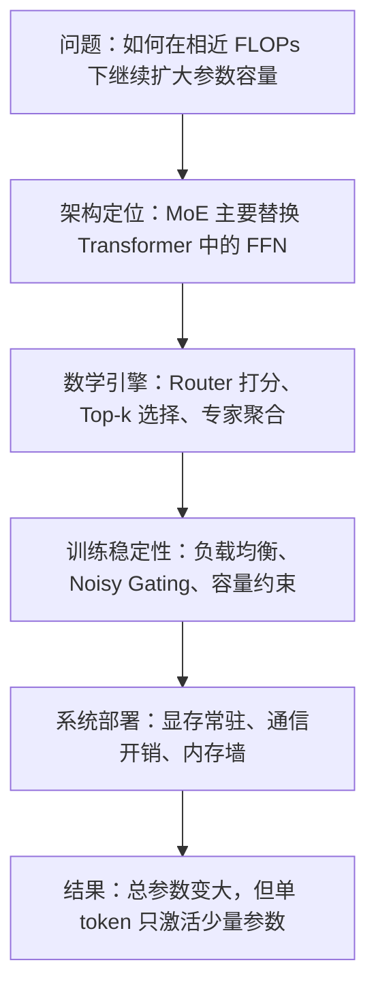

# MoE：以稀疏激活扩展 Transformer 的参数容量

> 相关文献：
> - Jacobs, Jordan, Nowlan, and Hinton (1991)：提出 mixture of experts 的早期思想，用门控网络在多个子网络之间分配输入。
> - Shazeer et al. (2017)：提出稀疏门控 MoE，使超大参数模型中的条件计算成为可扩展实践。
> - Lepikhin et al. (2020)：在 GShard 中将 MoE 引入大规模 Transformer 训练。
> - Fedus, Zoph, and Shazeer (2021)：在 Switch Transformer 中用 top-1 路由简化训练与系统实现。
> - Du et al. (2022)：在 GLaM 中进一步展示 top-2 稀疏路由的有效性。

## 0. 路线图与符号约定

如果把这篇文档压缩成一条主线，那么 MoE 的问题可以概括为：

1. 稠密 FFN 的参数容量扩展成本太高。
2. 因此，把一个 FFN 改写成多个专家，并让路由器只激活少数几个。
3. 但稀疏路由会带来训练不稳定、负载不均与部署复杂度。
4. 所以，MoE 不仅是一个数学公式，也是一个系统工程方案。

下图给出全文的阅读路线：

本文统一使用如下记号：

| 符号 | 含义 |
| --- | --- |
| $x_t\in\mathbb{R}^d$ | 第 $t$ 个 token 进入 MoE 子层前的隐藏状态 |
| $y_t\in\mathbb{R}^d$ | 第 $t$ 个 token 经过 MoE 子层后的输出 |
| $T$ | 当前 micro-batch 中 token 数 |
| $N$ | 专家数量 |
| $E_i(\cdot)$ | 第 $i$ 个专家对应的前馈网络 |
| $W_r\in\mathbb{R}^{d\times N}$ | 路由器参数矩阵 |
| $W_{\mathrm{noise}}\in\mathbb{R}^{d\times N}$ | 噪声门控中控制噪声幅度的参数矩阵 |
| $r_t\in\mathbb{R}^N$ | 第 $t$ 个 token 的路由 logits |
| $p_t\in\mathbb{R}^N$ | 第 $t$ 个 token 对各专家的路由概率 |
| $\epsilon_t\in\mathbb{R}^N$ | 从标准正态分布采样的噪声向量 |
| $S_t$ | 第 $t$ 个 token 被选中的专家集合 |
| $k$ | 每个 token 激活的专家数 |
| $\tilde{p}_{t,i}$ | 在被选中专家上重新归一化后的门控权重 |
| $m_{t,i}$ | 指示变量，若 token $t$ 被路由到专家 $i$，则为 $1$ |
| $C$ | 单个专家的容量上限 |
| $\mathrm{cf}$ | capacity factor，容量因子 |

核心公式索引如下：

1. 稠密 FFN：
$$
\mathrm{FFN}(x_t)=W_2\sigma(W_1x_t)
$$

2. 专家网络：
$$
E_i(x_t)=W_{2,i}\sigma(W_{1,i}x_t)
$$

3. 路由概率：
$$
r_t=x_tW_r,\qquad p_t=\mathrm{softmax}(r_t)
$$

4. 稀疏聚合：
$$
y_t=\sum_{i\in S_t}\tilde{p}_{t,i}E_i(x_t)
$$

5. 负载均衡损失：
$$
L_{\mathrm{lb}}=N\sum_{i=1}^{N}\bar{p}_i\bar{m}_i
$$

6. 专家容量：
$$
C=\left\lceil \mathrm{cf}\cdot\frac{kT}{N}\right\rceil
$$

---

## 1. MoE 要解决什么问题

### 1.1 稠密 FFN 的扩容瓶颈

标准 Transformer 中，attention 负责建模 token 与 token 之间的关系，而 FFN 负责对每个位置做逐 token 的非线性变换：

$$
\mathrm{FFN}(x_t)=W_2\sigma(W_1x_t)
$$

如果想继续提升模型容量，最直接的办法是把 FFN 做得更宽或更深。但这会带来一个直接后果：**参数量、前向计算量与显存占用会一起上升。**

MoE 的出发点正是打破这种强绑定关系。它希望做到的是：

- 模型内部拥有更多参数；
- 但单个 token 在一次前向时只使用其中一小部分；
- 从而在相近 FLOPs 下继续扩大主干网络容量。

这就是所谓的**条件计算（conditional computation）**：不是让所有输入都经过同一套参数，而是根据输入内容动态决定“谁来处理这个 token”。

### 1.2 为什么 MoE 主要替换 FFN

MoE 很少直接替换 attention，而主要替换 FFN，原因有 3 个：

- attention 的核心任务是建模位置之间的交互，FFN 更接近逐 token 的局部变换；
- FFN 往往占据 Transformer 中相当大的一部分参数量，把稀疏性放在这里更直接；
- FFN 按位置独立计算，更容易做 token 到专家的分发与并行。

因此，MoE 更准确的定位是：**对 Transformer 中“逐位置非线性变换”这一部分做稀疏化扩展。**

### 1.3 在 Transformer block 中的位置

一个常见的 pre-LN MoE block 可写成：

$$
\tilde{h}_t=h_t+\mathrm{MHA}(\mathrm{LN}(h_t))
$$

$$
h_t'=\tilde{h}_t+\mathrm{MoE}(\mathrm{LN}(\tilde{h}_t))
$$

这表明 MoE 通常继承了普通 FFN 的位置：

- attention 子层之后；
- 残差连接内部；
- 与 LayerNorm、dropout 等组件共同组成标准 Transformer block。

因此，MoE Transformer 并不是“整个网络都由专家组成”，而是在若干层中把稠密 FFN 替换为稀疏专家层。

| 子层 | Dense Transformer | MoE Transformer |
| --- | --- | --- |
| Attention | 通常保持不变 | 通常保持不变 |
| FFN | 单个共享前馈层 | 多个专家 + 路由器 |
| 参数激活方式 | 全量激活 | 按 token 稀疏激活 |
| 主要收益 | 实现简单 | 参数容量更大 |

---

## 2. 数学引擎：token 如何被送往少数专家

### 2.1 从一个 FFN 到一个专家池

MoE 的第一步，是把原本共享的一套 FFN 改写成 $N$ 个彼此独立的专家：

$$
E_i(x_t)=W_{2,i}\sigma(W_{1,i}x_t),\qquad i=1,2,\dots,N
$$

这些专家在结构上通常相同，但参数互不共享。于是，模型不再只有一套“所有 token 共用”的前馈变换，而是拥有一个专家池。

但如果每个 token 都跑完全部 $N$ 个专家，那么计算量反而会急剧增加。因此，MoE 的关键不只是“并联多个 FFN”，而是“并联多个 FFN 后，再做稀疏选择”。

### 2.2 Router 如何给专家打分

对每个 token，路由器先计算它在各个专家上的打分：

$$
r_t=x_tW_r
$$

再通过 softmax 得到路由概率：

$$
p_t=\mathrm{softmax}(r_t)
$$

其中：

- $r_t$ 是未归一化偏好；
- $p_{t,i}$ 表示 token $t$ 被分配给专家 $i$ 的相对倾向；
- $W_r$ 是专门用于路由的可学习参数。

如果直接把 softmax 结果代回输出：

$$
y_t=\sum_{i=1}^{N}p_{t,i}E_i(x_t)
$$

那么每个 token 仍然要经过全部专家。这样得到的是一个“稠密专家集成”，而不是真正的稀疏激活。

### 2.3 Top-k 稀疏激活

为得到真正的稀疏性，系统只保留得分最高的 $k$ 个专家：

$$
S_t=\mathrm{TopK}(p_t,k)
$$

由于 softmax 是单调变换，很多实现也直接在 logits 上做 top-k，结果在排序上等价。常见设置有两类：

- **top-1 路由**：每个 token 只进入一个专家，计算最省，实现更简单；
- **top-2 路由**：每个 token 进入两个专家，表达更平滑，训练通常更稳。

对被选中的专家，通常需要再次归一化权重：

$$
\tilde{p}_{t,i}=
\frac{p_{t,i}}{\sum_{j\in S_t}p_{t,j}},
\qquad i\in S_t
$$

从实现角度，也常写成“先掩码，再 softmax”：

$$
\hat{r}_{t,i}=
\begin{cases}
r_{t,i}, & i\in S_t \\
-\infty, & i\notin S_t
\end{cases}
$$

$$
\tilde{p}_t=\mathrm{softmax}(\hat{r}_t)
$$

因为 $e^{-\infty}=0$，未被选中的专家权重自然变为 0。

### 2.4 Noisy Gating：训练早期的探索机制

仅靠 top-k 路由，模型在训练初期很容易因为随机初始化而过早偏向少数专家。为此，部分实现会在 logits 上加入一个可学习尺度的高斯噪声：

$$
r_t^{\mathrm{noisy}}=x_tW_r+\epsilon_t\odot \mathrm{softplus}(x_tW_{\mathrm{noise}})
$$

其中 $\epsilon_t\sim\mathcal{N}(0,I)$，$\odot$ 表示逐元素乘法。`softplus` 的作用是保证噪声尺度为正。

它的作用不是让推理阶段保持随机，而是在训练阶段提供额外探索：

- 静态得分暂时较低的专家，也有机会进入 top-k；
- 更多专家能在训练早期接收到 token；
- 路由器不容易过早固化到极少数专家上。

因此，Noisy Gating 可以理解为一种面向路由学习的“探索机制”。

### 2.5 专家输出如何聚合

当稀疏路由完成后，第 $t$ 个 token 的输出写为：

$$
y_t=\sum_{i\in S_t}\tilde{p}_{t,i}E_i(x_t)
$$

这个公式有 3 个关键含义：

- 对单个 token 来说，真正参与计算的只有 $k$ 个专家；
- 专家输出不是简单投票，而是按门控权重加权求和；
- 输出维度与输入一致，因此可以无缝接回残差连接与后续层。

若采用 top-1 路由，上式可退化为：

$$
y_t=E_{i^\ast}(x_t),\qquad i^\ast=\arg\max_i p_{t,i}
$$

这也是 Switch Transformer 所采用的核心简化思路。

---

## 3. 训练引擎：如何避免路由塌缩

### 3.1 负载不均为何会自我强化

MoE 的难点不在于“路由公式能不能写出来”，而在于“路由会不会稳定地学起来”。如果完全放任路由器根据当前得分选择最优专家，训练很容易出现正反馈：

一旦这条链条形成，就会出现典型的专家饥饿问题：

- 少数专家过载；
- 大量专家长期不被调用；
- 路由器逐渐塌缩为“只信任固定少数专家”。

### 3.2 负载均衡损失如何定义

为了抑制这种现象，训练时通常会在主任务损失之外，再加入负载均衡损失。

先定义两个批次级统计量：

$$
\bar{p}_i=\frac{1}{T}\sum_{t=1}^{T}p_{t,i},
\qquad
\bar{m}_i=\frac{1}{T}\sum_{t=1}^{T}m_{t,i}
$$

其中：

- $\bar{p}_i$ 表示专家 $i$ 平均被路由器偏好的程度；
- $\bar{m}_i$ 表示专家 $i$ 实际接收到 token 的频率。

在部分论文，尤其是 Switch Transformer 中，也常把它们写成：

$$
P_i=\bar{p}_i,\qquad f_i=\bar{m}_i
$$

若理想状态是绝对均衡，那么每个专家应分到的 token 比例就是：

$$
\frac{1}{N}
$$

负载均衡项的常见写法为：

$$
L_{\mathrm{lb}}=N\sum_{i=1}^{N}\bar{p}_i\bar{m}_i
$$

总损失则写为：

$$
L=L_{\mathrm{task}}+\alpha L_{\mathrm{lb}}
$$

其中 $\alpha$ 用于调节“主任务优化”和“路由均衡约束”之间的相对权重。实践中它通常远小于 1，因为模型的首要目标仍然是完成主任务，而不是单纯追求平均分配。

### 3.3 为什么理想均衡时损失接近 1

当分配接近均匀时，

$$
\bar{p}_i\approx \bar{m}_i\approx \frac{1}{N}
\quad\Longrightarrow\quad
L_{\mathrm{lb}}\approx N\sum_{i=1}^{N}\frac{1}{N}\cdot\frac{1}{N}=1
$$

而当少数专家既被路由器持续偏好，又吞下了大多数 token 时，它们对应的 $\bar{p}_i\bar{m}_i$ 会同时增大，损失也会升高。

因此，这个损失项约束的不是“形式上每个专家都出现过”，而是：

- 路由器的偏好分布不能过于尖锐；
- 实际派发结果也不能长期集中到少数专家；
- 两种集中现象不能彼此强化。

### 3.4 为什么不能只看实际分配频率

一个自然问题是：既然目标是均衡，为什么不直接用 $\bar{m}_i$ 与 $\frac{1}{N}$ 的偏差，比如方差，来定义损失？

关键原因在于可导性。$\bar{m}_i$ 来自 top-k 之后的离散分派结果，而“token 是否被送到专家 $i$”本质上是指示变量 $m_{t,i}\in\{0,1\}$ 的硬选择。这类离散操作通常不可导，单独依赖它时，梯度无法稳定回传到路由器参数 $W_r$。

相比之下，$\bar{p}_i$ 来自 softmax 概率，是连续且可导的。把 $\bar{p}_i$ 与 $\bar{m}_i$ 组合起来，本质上是在“离散派发结果”之外，再附加一条可微的概率通道，使负载均衡目标能够通过反向传播真实地影响路由器学习方向。

这也是为什么负载均衡损失不能只统计“最后分了多少”，还必须统计“模型原本有多想分给这个专家”。

### 3.5 专家容量与 Token Dropping

即便有负载均衡损失，在某个具体 batch 上，各专家接收到的 token 数依然会有波动。为了让 GPU 上的并行计算形状保持稳定，系统通常会给每个专家设置固定容量：

$$
C=\left\lceil \mathrm{cf}\cdot\frac{kT}{N}\right\rceil
$$

其中：

- $T$ 是当前批次 token 数；
- $kT$ 是总的专家访问次数；
- $\frac{kT}{N}$ 是平均到每个专家的理想负载；
- $\mathrm{cf}$ 是容量因子，用于给平均负载预留缓冲区。

不同实现有时会写成 `round`、`ceil` 或与分布式切分相关的变体，但核心含义一致：先估计理想平均负载，再乘容量因子，为每个专家分配固定大小的 buffer。

当某个专家超过容量时，常见处理方式包括：

- 丢弃溢出的 token；
- 把溢出 token 送往次优专家；
- 让溢出 token 走残差旁路。

如果把 $\mathrm{cf}$ 严格设为 $1.0$，就等于系统假设每个 batch 的路由都能几乎完美均衡。这在真实训练中通常过于理想化。一旦出现轻微不均，超出容量的 token 就会成为溢出项；若实现采用 token dropping 或残差旁路，这些 token 虽然还能继续流向下一层，但会错过当前 MoE 层的专家变换，相当于没有参与这层专家学习。

因此，很多工程实现宁可接受略低一些的硬件填充率，也会把 $\mathrm{cf}$ 设为 $1.1$、$1.25$ 甚至更高，以换取更低的丢弃率和更稳的训练行为。

---

## 4. 系统引擎：为什么 MoE 算得少但仍然难部署

### 4.1 总参数量与活跃参数量不是一回事

MoE 最容易被误解的一点是：既然每个 token 只激活少数专家，部署时是否只需要为“活跃参数”留显存？

答案通常是否定的。MoE 的确让**单步计算量**接近活跃参数规模，但这并不意味着**显存占用**也能只按活跃参数计算。以 Mixtral 8x7B 为代表的模型就体现了这一点：总参数量远大于单 token 实际参与计算的参数量。

因此，MoE 的硬件画像可以概括为：

- 显存容量主要按总参数规模约束；
- 单步计算量主要按活跃参数规模约束；
- 两者并没有随着稀疏激活而同时下降。

### 4.2 为什么专家参数通常必须常驻显存

自回归推理是逐 token 进行的。如果每次路由器选完专家后，系统才从普通内存把这些专家权重临时搬到显存，那么 PCIe 或 NVLink 的传输延迟很快就会吞掉所有计算收益。

因此，在低延迟推理场景下，完整专家参数通常需要预先常驻 GPU 显存，而不是依赖按 token 动态搬运。

这个过程可以粗略理解为：

这也是为什么 MoE 虽然“算得少”，却依然“吃显存”。

### 4.3 推理瓶颈为什么常常是内存带宽

进一步看，MoE 推理阶段的主要瓶颈往往不是纯粹的浮点算力，而是显存带宽。原因在于：

- 单 token 解码时 batch 很小；
- 矩阵乘法的并行度有限；
- 每一步都要把当前激活专家的大量权重从显存读入计算核心。

若活跃参数以 FP16 存储，那么仅 13B 级别的活跃参数就对应约 26GB 数据。相比之下，现代 GPU 的计算核心往往能更快地完成乘加运算，真正拖慢速度的反而是“数据送不进来”。

这正是所谓的**内存墙（memory wall）**：不是不能算，而是数据到达计算单元的速度跟不上。于是，在大型 MoE 推理中，HBM 带宽、跨卡通信、参数布局与 token dispatch 策略，往往会比理论 TFLOPS 更直接地决定实际吞吐与延迟表现。

因此，MoE 的“便宜”更准确地说是：**在相近 FLOPs 下提供更高参数容量**，而不是保证在所有硬件环境里都比稠密模型延迟更低。

---

## 5. 一个最小推演例子

假设某个 MoE 子层有 4 个专家，采用 top-2 路由。对 3 个 token，路由器给出的概率如下：

| token | $p_{t,1}$ | $p_{t,2}$ | $p_{t,3}$ | $p_{t,4}$ | 选中专家 |
| --- | --- | --- | --- | --- | --- |
| $t_1$ | 0.60 | 0.25 | 0.10 | 0.05 | $E_1,E_2$ |
| $t_2$ | 0.15 | 0.70 | 0.10 | 0.05 | $E_2,E_1$ |
| $t_3$ | 0.05 | 0.10 | 0.20 | 0.65 | $E_4,E_3$ |

对被选中专家重新归一化后：

| token | 归一化后的门控权重 | 输出形式 |
| --- | --- | --- |
| $t_1$ | $\tilde{p}_{1,1}=0.706,\ \tilde{p}_{1,2}=0.294$ | $y_1=0.706E_1(x_1)+0.294E_2(x_1)$ |
| $t_2$ | $\tilde{p}_{2,2}=0.824,\ \tilde{p}_{2,1}=0.176$ | $y_2=0.824E_2(x_2)+0.176E_1(x_2)$ |
| $t_3$ | $\tilde{p}_{3,4}=0.765,\ \tilde{p}_{3,3}=0.235$ | $y_3=0.765E_4(x_3)+0.235E_3(x_3)$ |

这个例子说明了 3 点：

- 不同 token 会落到不同专家组合上；
- 即便共享同一个 MoE 层，不同 token 的有效计算路径也不相同；
- 专家专长不是人工指定的，而是在训练中由路由与任务目标共同形成的。

若进一步观察大量训练样本，常会看到某些专家逐渐对特定输入分布形成统计偏好，例如代码样式、结构化模式、长距离依赖或某些领域表达。但这种“专长”通常不是离散标签，而更像连续的概率分工。

---

## 6. 常见变体、优势与关系

### 6.1 常见变体

| 变体 | 核心做法 | 特点 |
| --- | --- | --- |
| Top-1 MoE | 每个 token 只选 1 个专家 | 计算最省，实现简单 |
| Top-2 MoE | 每个 token 选 2 个专家 | 表达更平滑，训练常更稳 |
| 带共享专家的 MoE | 路由专家外再保留始终激活的共享 FFN | 兼顾通用能力与特化能力 |
| 更细粒度路由 | 对 token 分组、分层，或使用更复杂门控 | 灵活性更高，实现更复杂 |

### 6.2 与稠密 FFN 的对比

| 方面 | 稠密 FFN | MoE |
| --- | --- | --- |
| 单 token 激活参数 | 固定且全量 | 稀疏且随输入变化 |
| 总参数扩展方式 | 直接加宽或加深 | 增加专家数 |
| 训练稳定性 | 相对更高 | 需额外路由约束 |
| 系统复杂度 | 相对较低 | 显著更高 |
| 专门化能力 | 依赖统一参数内部分工 | 更容易形成专家分工 |

### 6.3 优势与局限

MoE 的主要优势在于：

- **参数容量更高**：可在相近 FLOPs 下容纳更多参数；
- **计算更稀疏**：单 token 只激活少量专家；
- **更易形成分工**：不同专家可能学到不同子分布模式；
- **可扩展性更强**：是现代超大模型继续扩容的重要路线之一。

MoE 的主要局限在于：

- **负载不均衡**：路由器容易偏向少数专家；
- **训练不稳定**：路由塌缩、专家饥饿更常见；
- **系统通信成本高**：跨设备 dispatch 可能成为瓶颈；
- **部署复杂度高**：参数切分、缓存与调度都更难；
- **利用率受 batch 影响**：小 batch 更容易暴露并行效率问题。

因此，MoE 的挑战往往不在公式是否成立，而在“路由是否稳定”和“系统是否跟得上”。

### 6.4 与相关机制的关系

MoE 常被误解为“另一种 attention”或“整个 Transformer 的替代品”，但更准确的关系如下：

| 相关对象 | 关系 | 关键区别 |
| --- | --- | --- |
| Dense Transformer | MoE 是其稀疏化扩展 | 主要改造 FFN，而非完全重写 block |
| Self-Attention | 二者分工不同 | attention 建模 token 间关系，MoE 建模逐 token 的稀疏变换 |
| Sparse Attention | 都利用稀疏性 | Sparse Attention 稀疏的是位置交互，MoE 稀疏的是参数激活 |
| 检索增强模型 | 都试图提升容量 | 检索增强使用外部知识库，MoE 使用内部专家参数库 |
| LoRA | 方向正交 | LoRA 强调低成本适配，MoE 强调主干网络的条件计算 |

相关专题：

- [Transformer](../model/transformer.md)
- [Self-Attention](./self-attention.md)
- [LoRA](./lora.md)

---

## 7. 小结

MoE 的核心思想，是把原本所有 token 共享的一套稠密前馈变换，改写成“路由器为每个 token 选择少数专家、再按权重聚合输出”的条件计算过程。它最重要的价值，在于把模型的**总参数规模**与**单次前向激活计算量**部分解耦。

但 MoE 并不是“只多加几个 FFN”这么简单。它真正完整的形态，同时包含了：

- 数学层面的 top-k 稀疏路由与专家聚合；
- 训练层面的负载均衡、Noisy Gating 与容量控制；
- 系统层面的显存常驻、通信成本与内存带宽瓶颈。

因此，在现代 Transformer 中，MoE 更像是一种**扩容主干网络容量的架构策略**。它的价值在于让模型“存得更多、每步算得更少”；它的难点则在于，如何让这种稀疏性在训练与部署中都真正落地。
