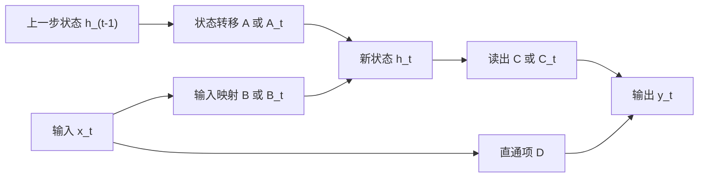

# State Space Model：用隐状态递推描述序列动力学

> 相关文献：
> - Kalman (1960)：把状态空间方法系统化，用隐状态描述动态系统演化。
> - Gu, Goel, and Ré (2022)：提出 S4，把结构化状态空间模型引入长序列深度学习。
> - Gupta et al. (2022)：讨论 SSM 的卷积实现与高效训练。
> - Gu and Dao (2023)：提出 Mamba，以 selective SSM 强化输入相关的动态选择能力。

## 路线图、符号约定与公式索引

本文把状态空间模型（State Space Model, SSM）视为一种**序列机制**来讲解，而不是作为控制理论或某一篇模型论文的专门综述。全文主线如下：

1. 先说明 SSM 为什么要引入「状态」；
2. 再从连续时间微分方程出发，得到离散时间递推；
3. 然后说明递推如何展开成卷积，以及它与 RNN 的关系；
4. 再解释矩阵 $A,B,C,D$、谱稳定性、HiPPO 与长记忆的关系；
5. 随后引入 selective SSM 与 Mamba 的具体公式；
6. 最后讨论其能力边界、视觉与多模态扩展、混合架构和与线性注意力的关系。

本文统一使用教学记号。控制理论、S4、S5、Mamba 等文献中的原始符号并不完全一致；若后文提到某一变体，会单独说明差异来源。

符号如下：

| 符号 | 含义 |
| --- | --- |
| $x_t\in\mathbb{R}^{d_{\mathrm{in}}}$ | 第 $t$ 个时间步的输入 |
| $h_t\in\mathbb{R}^{N}$ | 第 $t$ 个时间步的隐状态 |
| $y_t\in\mathbb{R}^{d_{\mathrm{out}}}$ | 第 $t$ 个时间步的输出 |
| $A\in\mathbb{R}^{N\times N}$ | 连续时间状态转移矩阵 |
| $B\in\mathbb{R}^{N\times d_{\mathrm{in}}}$ | 输入到状态的映射矩阵 |
| $C\in\mathbb{R}^{d_{\mathrm{out}}\times N}$ | 状态到输出的读出矩阵 |
| $D\in\mathbb{R}^{d_{\mathrm{out}}\times d_{\mathrm{in}}}$ | 输入到输出的直通项 |
| $\Delta$ | 离散采样步长 |
| $\Delta_t$ | 第 $t$ 个时间步的输入相关步长 |
| $\bar{A},\bar{B}$ | 离散化后的状态转移与输入矩阵 |
| $\bar{A}_t,\bar{B}_t$ | 第 $t$ 个时间步的离散状态转移与输入矩阵 |
| $K_\tau$ | 卷积视角下的第 $\tau$ 个核系数 |
| $\lambda_i$ | 矩阵 $A$ 或 $\bar{A}$ 的特征值 |

核心公式索引如下：

1. 连续时间线性状态空间方程：
$$
\dot{h}(t)=Ah(t)+Bx(t),\qquad y(t)=Ch(t)+Dx(t)
$$

2. 零阶保持离散化：
$$
h_t=\bar{A}h_{t-1}+\bar{B}x_t,\qquad y_t=Ch_t+Dx_t
$$

3. 离散矩阵与连续矩阵的关系：
$$
\bar{A}=e^{\Delta A},\qquad
\bar{B}=\left(\int_0^\Delta e^{\tau A}\,d\tau\right)B
$$

4. 递推展开式：
$$
h_t=\bar{A}^t h_0+\sum_{i=1}^{t}\bar{A}^{t-i}\bar{B}x_i
$$

5. 卷积核形式：
$$
K_\tau=C\bar{A}^{\tau}\bar{B},\qquad
y_t=\sum_{i=1}^{t}K_{t-i}x_i+Dx_t
$$

6. 选择性 SSM 的典型写法：
$$
\bar{A}_t=e^{\Delta_t A},\qquad
h_t=\bar{A}_t h_{t-1}+\bar{B}_t x_t,\qquad
y_t=C_t h_t + D x_t
$$

下面这张概览图先给出整体结构：



---

## 定义与问题背景

状态空间模型的核心思想是：**不直接把整段历史原样保存，而是用一个随时间演化的隐状态，把过去对未来有用的信息压缩成动态系统内部的“状态”。**

若用更直观的话来描述，SSM 可以看成一个“自带动态记忆的系统”：它不断接收当前输入，把历史影响压缩进内部状态，再由这个状态决定当前输出。这个思想最初并不是为自然语言处理提出的，而来自控制论、信号处理和时间序列分析，例如轨迹跟踪、传感器滤波、机械系统响应和天气演化等连续动态问题。

如果把序列建模问题写得更直白一些，SSM 试图回答的是：

- 当前时刻系统内部应该记住什么；
- 这个记忆在没有新输入时会如何自然演化；
- 新输入到来时，旧记忆应该如何被更新；
- 最终又该如何从当前状态读出输出。

从这个角度看，SSM 与 RNN 有亲缘关系，因为两者都维护一个递推状态；但 SSM 更强调**状态演化的线性动力学结构**，即把「记忆如何衰减、传播、振荡、混合」显式交给矩阵 $A$ 控制。

一个最简单的标量例子可以说明这种直觉。设：

$$
h_t=\alpha h_{t-1}+\beta x_t
$$

其中：

- 若 $|\alpha|$ 很小，系统更偏向短记忆；
- 若 $|\alpha|$ 接近 1，过去信息会保留更久；
- 若 $\alpha<0$，状态还可能出现符号翻转；
- 若把标量推广到矩阵，不同方向就可以有不同时间尺度。

因此，SSM 的重点不是“有一个隐状态”这么简单，而是：**这个隐状态被放进一个可分析的动力学系统中。**

---

## 从连续时间到离散时间

### 连续时间状态方程

很多神经网络实现最终都写成离散递推：

$$
h_t=\bar{A}h_{t-1}+\bar{B}x_t
$$

但 SSM 的原始思想来自连续时间系统。先从连续方程出发的好处是，我们可以把系统的本体解释得更清楚：

- $A$ 决定系统在没有输入时如何自发演化；
- $B$ 决定外部输入如何注入状态；
- $C$ 决定如何从内部状态读取输出；
- $D$ 决定输入是否直接绕过状态，形成捷径。

标准连续时间线性状态空间模型写为：

$$
\dot{h}(t)=Ah(t)+Bx(t),\qquad y(t)=Ch(t)+Dx(t)
$$

其中 $\dot{h}(t)$ 是状态对时间的导数，表示“状态变化率”。这条方程的含义可以拆开看：

- $Ah(t)$：旧状态自身的演化趋势；
- $Bx(t)$：当前输入带来的外部驱动；
- $Ch(t)$：从内部状态提取可见输出；
- $Dx(t)$：输入的即时直通贡献。

若借用一个简单的机械系统类比：

- $x(t)$ 可以理解为当前施加的外力或控制信号；
- $h(t)$ 可以理解为系统内部的速度、位置、能量分布等隐藏变量；
- $y(t)$ 则对应外部可观测量；
- $A,B,C,D$ 则共同规定了系统“如何记忆、如何响应、如何输出”。

### 无输入时系统在做什么

若暂时忽略输入，即令 $x(t)=0$，则有：

$$
\dot{h}(t)=Ah(t)
$$

其解为：

$$
h(t)=e^{tA}h(0)
$$

这说明矩阵指数 $e^{tA}$ 决定了状态随时间的自然传播方式。若把 $A$ 对角化为：

$$
A=V\Lambda V^{-1},\qquad \Lambda=\mathrm{diag}(\lambda_1,\dots,\lambda_N)
$$

则：

$$
e^{tA}=Ve^{t\Lambda}V^{-1}
$$

而

$$
e^{t\Lambda}=\mathrm{diag}(e^{t\lambda_1},\dots,e^{t\lambda_N})
$$

因此，每个特征方向都会按自己的时间常数演化：

- 若 $\mathrm{Re}(\lambda_i)<0$，该方向会衰减；
- 若 $\mathrm{Re}(\lambda_i)=0$，该方向可能保持或纯振荡；
- 若 $\mathrm{Re}(\lambda_i)>0$，该方向会增长，系统可能失稳。

这也是为什么 SSM 文献中会非常关注 $A$ 的谱性质。它直接决定模型到底是短记忆、长记忆，还是数值不稳定。

### 连续时间解的积分形式

连续系统的解还可以写成：

$$
h(t)=e^{tA}h(0)+\int_0^t e^{(t-\tau)A}B\,x(\tau)\,d\tau
$$

这个式子已经非常接近卷积思想了。它表示：

- 初始状态 $h(0)$ 会经由 $e^{tA}$ 传播到当前；
- 历史输入 $x(\tau)$ 会被一个依赖时间差 $(t-\tau)$ 的核加权后累积到当前状态。

也就是说，SSM 从连续时间层面就天然带有“历史输入经过一个动力学核过滤后影响当前”的结构。

### 为什么必须离散化

文本、音频帧、图像 patch、传感器采样值，最终都以离散序列形式喂给模型。因此，连续时间方程要先变成离散更新式，才能进入真正的训练与推理流程。

更具体地说，连续世界中的状态方程含有导数 $\dot{h}(t)$，而计算机真正能处理的是一步一步的有限计算；大语言模型面对的也不是连续时间信号，而是离散的 token 序列。为了让模型能在第 $t$ 步、第 $t+1$ 步这样的离散位置上更新状态，就必须引入采样步长 $\Delta$，把连续时间系统变成离散时间系统。

最常见的离散化视角，是假设在每个采样区间内输入保持常值，即零阶保持（zero-order hold）。在这种设定下，连续系统：

$$
\dot{h}(t)=Ah(t)+Bx(t)
$$

可转为：

$$
h_t=\bar{A}h_{t-1}+\bar{B}x_t,\qquad y_t=Ch_t+Dx_t
$$

其中：

$$
\bar{A}=e^{\Delta A}
$$

$$
\bar{B}=\left(\int_0^\Delta e^{\tau A}\,d\tau\right)B
$$

这里的 $\Delta$ 是采样步长。它的意义非常重要：即便连续矩阵 $A$ 固定，只要采样步长不同，离散后的 $\bar{A}$ 也会不同。

可以把这个过程理解为：连续录像被切成一帧一帧的画面，系统不再问“此刻瞬间变化率是多少”，而是改问“从上一个采样点走到下一个采样点后，状态变成什么”。

---

## 递推、卷积与 RNN 关系

### 离散递推的动力学含义

离散递推式

$$
h_t=\bar{A}h_{t-1}+\bar{B}x_t
$$

可以直接理解为：

- 先用 $\bar{A}$ 把上一步状态搬运到当前；
- 再用 $\bar{B}$ 把当前输入注入状态；
- 最后用 $C$ 把状态投影到输出空间。

若只考虑标量情况：

$$
h_t=\bar{a}h_{t-1}+\bar{b}x_t
$$

那么：

- 当 $|\bar{a}|<1$ 时，旧状态会逐步衰减；
- 当 $|\bar{a}|$ 接近 1 时，系统有更长记忆；
- 当 $|\bar{a}|>1$ 时，状态可能爆炸。

矩阵情形只是把这种一维直觉推广到多维子空间上。

### 为什么离散化后会让人想到 RNN

观察离散更新式：

$$
h_t=\bar{A}h_{t-1}+\bar{B}x_t
$$

它的结构与最经典的循环神经网络非常相似。若把简单 RNN 写成：

$$
h_t=\phi(W_h h_{t-1}+W_x x_t+b)
$$

那么两者的共同点是：

- 都依赖上一步状态 $h_{t-1}$；
- 都接收当前输入 $x_t$；
- 都通过递推更新当前状态 $h_t$。

两者的关键差别在于：

- RNN 通常依赖非线性激活函数 $\phi$；
- 线性时不变 SSM 的核心扫描骨架是线性的；
- SSM 更强调从连续动力系统推导离散递推，并进一步利用线性结构做解析展开。

也正因为这个线性结构，SSM 才能够从“看起来像 RNN 的递推器”，进一步转化为“可并行训练的卷积系统”。

### 一个最基本的扫描算法

状态空间模型的离散前向传播，可以写成最直接的递推过程：

```text
STATE-SPACE-SCAN(x_1, x_2, ..., x_n, A_bar, B_bar, C, D, h_0)
    h_0 ← h_0
    for t ← 1 to n do
        h_t ← A_bar h_(t-1) + B_bar x_t
        y_t ← C h_t + D x_t
    end for
    
    return y_1, y_2, ..., y_n
```

这段伪代码很短，但已经包含了 SSM 的核心本质：**它是一种线性递推扫描器。**

### 递推为什么能展开成卷积

离散递推：

$$
h_t=\bar{A}h_{t-1}+\bar{B}x_t
$$

若继续向前代入，可得：

$$
h_t=\bar{A}^t h_0+\sum_{i=1}^{t}\bar{A}^{t-i}\bar{B}x_i
$$

不过，为了更直观看出卷积结构，先把前几步直接手工展开。为简洁起见，设初始状态 $h_0=0$，并先忽略直通项 $D x_t$。

第 1 步：

$$
h_1=\bar{B}x_1,\qquad y_1=C\bar{B}x_1
$$

第 2 步：

$$
h_2=\bar{A}\bar{B}x_1+\bar{B}x_2,\qquad
y_2=C\bar{A}\bar{B}x_1+C\bar{B}x_2
$$

第 3 步：

$$
h_3=\bar{A}^2\bar{B}x_1+\bar{A}\bar{B}x_2+\bar{B}x_3
$$

$$
y_3=C\bar{A}^2\bar{B}x_1+C\bar{A}\bar{B}x_2+C\bar{B}x_3
$$

这时就能看出，当前输出其实是在把历史输入分别乘上一组由 $C,\bar{A},\bar{B}$ 决定的系数，再做加权求和。这已经是因果卷积的典型模式。

推广到一般时间步：

$$
y_t=Ch_t+Dx_t=C\bar{A}^t h_0+\sum_{i=1}^{t}C\bar{A}^{t-i}\bar{B}x_i+Dx_t
$$

若先忽略初始状态项，则卷积核可定义为：

$$
K_\tau=C\bar{A}^{\tau}\bar{B}
$$

于是：

$$
y_t=\sum_{i=1}^{t}K_{t-i}x_i+Dx_t
$$

这已经是标准的一维因果卷积形式了。换句话说，**线性递推 SSM 既可以按状态扫描理解，也可以按卷积核过滤理解。**

### 卷积等价为什么重要

卷积等价有两个关键后果：

- 从**推理视角**看，可以按时间步维护状态，代价通常是线性的；
- 从**训练视角**看，在某些线性时不变设定下，可以先构造整条卷积核，再并行做卷积。

这正是深度 SSM 相比传统 RNN 很重要的一点。它既保留了递推记忆结构，又在训练时获得了更强的并行实现空间。

不过，上述卷积形式严格依赖于系统是**线性时不变（LTI）**的，也就是：

- $A,B,C,D$ 不随时间步变化；
- 这些矩阵也不依赖当前输入内容。

一旦参数变成时间相关或输入相关，例如写成 $\bar{A}_t,\bar{B}_t,C_t$，系统就不再是固定卷积核，而更接近“内容相关的动态递推”。

---

## 记忆机制：矩阵、谱与 HiPPO

### A、B、C、D 分别在做什么

在四个核心矩阵里，$A$ 最像系统的“记忆骨架”。它不直接决定当前输入是什么，而决定旧状态如何传给未来。若反复观察

$$
h_t=\bar{A}h_{t-1}+\bar{B}x_t
$$

就会发现，历史信息之所以能跨越很多时间步传递，靠的正是 $\bar{A}$ 被一遍遍乘上去。因此：

- 若 $\bar{A}$ 的作用过弱，历史很快衰减，系统会“健忘”；
- 若 $\bar{A}$ 的作用过强甚至失稳，状态会爆炸；
- 只有当 $\bar{A}$ 的谱结构被精心控制时，系统才能稳定地记住长历史。

其余三个矩阵的角色可以概括为：

- $B$：当前输入如何写入状态；
- $C$：当前状态如何被读取成输出；
- $D$：当前输入是否直接旁路到输出。

若用“记忆系统”类比：

- $A$ 决定旧记忆怎样保留、衰减或传播；
- $B$ 决定新信息写入多少；
- $C$ 决定从记忆库里读出什么；
- $D$ 决定是否给输入保留一条快捷通路。

### 记忆长度、稳定性与谱结构

SSM 是否能建模长程依赖，本质上取决于状态对历史输入的响应能否在较长时间跨度上保留下来。观察卷积核：

$$
K_\tau=C\bar{A}^{\tau}\bar{B}
$$

若 $\bar{A}$ 的特征值模长都远小于 1，则 $\bar{A}^{\tau}$ 会很快衰减，长距离影响迅速消失；若某些特征值模长接近 1，则这些方向能够保留更久的历史信息。

因此，“长记忆”在 SSM 中不是一个抽象形容词，而是谱半径与时间尺度的直接结果。

若特征值是复数：

$$
\lambda=a+ib
$$

则对应项近似表现为：

$$
e^{t\lambda}=e^{at}e^{ibt}
$$

这表示系统可以同时具有：

- $e^{at}$ 带来的衰减或增长；
- $e^{ibt}$ 带来的振荡频率。

这也是为什么某些 SSM 对周期性、振动型、波形型序列特别自然。它们并不是通过显式“记住整个历史”，而是通过状态的频率结构保留模式。

### 为什么需要 HiPPO 与结构化参数化

如果把 $A$ 当成一个完全自由的普通矩阵，理论上当然也能训练，但会面临两个老问题：

- 长时间反复乘法后容易数值不稳；
- 很难让有限维状态真正高质量地概括整段历史。

S4 一类结构化 SSM 的一个关键进展，就是引入 HiPPO（High-order Polynomial Projection Operator）相关构造，把“如何用有限维状态持续逼近整个过去信号”这件事变成一个有明确数学目标的问题。

HiPPO 的直觉可以概括为：**不用逐点记住全部历史，而是在线维护一组基函数展开系数，让这些系数始终近似表示到当前时刻为止的整段输入历史。**

更准确地说，它是在做一种在线函数投影：把历史信号投影到一组正交基之上，并持续更新这些投影系数。若把历史信号看成一条不断延长的函数曲线，那么隐藏状态 $h_t$ 可以理解为：

- 不是原始历史样本本身；
- 而是这段历史在某组基函数上的压缩表示。

这里也要明确边界：

- 不是所有 SSM 都直接等于 HiPPO；
- 更准确的说法是，HiPPO 为 S4 一类结构化 SSM 提供了构造和初始化连续时间 $A$ 的重要思路；
- 后续模型会在此基础上再做离散化、结构化近似和可训练参数调整。

由于 HiPPO / 结构化 SSM 的核心强项是持续压缩整段历史的整体轮廓，因此它天然更贴合：

- 音频波形；
- 生理电信号；
- 传感器数据；
- 其他连续变化、具有平滑趋势或频率结构的序列。

而自然语言更离散、跳跃、更强调“内容选择”而不是“平滑拟合全部历史”，这也是为什么早期固定参数 SSM 在文本任务上并不天然占优。

---

## 从 LTI-SSM 到 Selective SSM

### 为什么固定参数 SSM 不够

线性时不变 SSM 的强项是高效和长记忆，但弱项也很明显：它对所有输入位置使用同一套固定动力学规则，内容选择能力不足。

对文本来说，这个弱点尤其明显。自然语言既离散又稀疏，并不是每个 token 都值得被同等强度地写入状态。像语气词、停顿词、格式符号这类低信息量输入，理想情况下应该被弱化；而实体名、关键词、结构边界等高信息量输入，则应被更强地写入状态。

### Selective SSM 的核心公式

为缓解这个问题，selective SSM 会让部分参数依赖输入，例如：

$$
\bar{A}_t=e^{\Delta_t A},\qquad
h_t=\bar{A}_t h_{t-1}+\bar{B}_t x_t,\qquad y_t=C_t h_t + D x_t
$$

这里需要特别注意：

- 在 Mamba 的典型写法里，连续时间矩阵 $A$ 通常仍是共享参数；
- 但离散化步长 $\Delta_t$、输入写入项 $B_t$、读出项 $C_t$ 会依赖当前输入；
- 因而真正随内容变化的，是离散后的更新行为，而不是把整个连续时间动力学完全换掉。

这意味着，系统可以根据当前 token 动态改变“保留多少旧状态、写入多少新输入、读出哪些状态方向”。

若用一个极端直觉来理解：

- 当某个输入几乎应被忽略时，希望 $\bar{A}_t$ 更接近单位映射，而 $\bar{B}_t$ 更接近 0；
- 当某个输入很重要时，希望系统增大写入强度，让新信息显著进入状态；
- 读出矩阵 $C_t$ 还可以决定当前更应该从状态的哪些方向提取信息。

这正是 selective mechanism 与固定 LTI-SSM 的根本差别：后者像固定滤波器，前者则更像带内容门控的动态滤波器。

### 为什么动态选择会让卷积技巧失效

前面把 SSM 展开成卷积时，隐藏着一个关键前提：卷积核必须是时间平移不变的。也就是说，系统在第 10 步和第 1000 步使用的是同一套固定规则，因此我们才能写出：

$$
K_\tau=C\bar{A}^{\tau}\bar{B}
$$

并把整段序列一次性改写为固定核卷积。

但在 selective SSM 里，更新规则变成了：

$$
h_t=\bar{A}_t h_{t-1}+\bar{B}_t x_t
$$

这里的 $\bar{A}_t,\bar{B}_t,C_t$ 都可能随输入变化。于是：

- 第 $t$ 步使用的更新规则不再等于第 $t+1$ 步；
- 历史输入对当前输出的影响，不再能用同一个固定核模板描述；
- 前面那个一次性并行卷积公式就不能原样套用。

因此，selective SSM 的选择能力并不是“免费”得到的。它打破了线性时不变结构，也就失去了直接依赖固定卷积核训练的那条捷径。

### Mamba 如何把并行性拿回来

这正是 Mamba 最关键的工程与算法创新之一。它没有继续强行把 selective SSM 写成固定卷积，而是转向 **selective scan**。

直观地说，状态更新虽然不再对应固定卷积核，但它仍然保持了“沿序列做前缀累计更新”的递推结构。对这类结构，可以利用并行前缀扫描（parallel prefix scan）的思想，把长序列拆成若干局部段，在树状合并过程中并行组合中间结果，而不必完全退回最朴素的逐 token 串行训练。

更形式化地看，Mamba 利用的是状态更新所诱导出的关联组合结构：每一段子序列都可以被压缩成一个“等效状态变换”，不同段之间再按顺序合并。这样做虽然不再是固定卷积，但仍然允许相当程度的并行化。

只有算法层面的 scan 还不够。Mamba 的另一个重点，是把 selective scan 做成硬件友好的 fused kernel，实现上尽量：

- 减少中间张量在高带宽显存与计算核心之间的来回搬运；
- 把关键中间状态尽量留在更靠近计算单元的高速片上存储中；
- 通过 kernel fusion 和重计算策略降低显存读写压力。

因此，更准确的说法不是“选择性 SSM 仍然像以前那样靠卷积并行”，而是：**它失去了固定卷积，却通过并行扫描与硬件感知实现，重新拿回了大部分训练并行性。**

---

## Mamba：具体公式与工作原理

### 从 selective SSM 到 Mamba block

前面的 selective SSM 已经给出了 Mamba 的核心递推骨架，但完整的 Mamba block 还不止这一条状态更新公式。它实际上把以下几部分组合在一起：

- 输入投影；
- 局部因果卷积；
- 选择性状态空间扫描；
- 门控；
- 输出投影。

因此，Mamba 不是“把普通 SSM 直接拿来堆叠”，而是围绕 selective SSM 组织起一个完整的神经网络块。

若设输入 token 表示为：

$$
u_t\in\mathbb{R}^{d_{\mathrm{model}}}
$$

则 Mamba block 的目标是输出同维度表示：

$$
o_t\in\mathbb{R}^{d_{\mathrm{model}}}
$$

中间通常先把通道维扩展到：

$$
d_{\mathrm{inner}}=\mathrm{expand}\cdot d_{\mathrm{model}}
$$

这样可以给状态空间层和门控留出更大的内部表示空间。

### Mamba block 的数据流

Mamba 首先把输入投影到两个分支：

$$
[x_t^{(0)};z_t]=W_{\mathrm{in}}u_t+b_{\mathrm{in}}
$$

其中：

- $x_t^{(0)}$ 是送入 SSM 主干的内容分支；
- $z_t$ 是后续门控分支。

随后，对内容分支做一个短程的 depthwise causal convolution：

$$
x_t=\mathrm{SiLU}\big(\mathrm{Conv1d}_{\mathrm{causal}}(x^{(0)})_t\big)
$$

它的作用不是替代长程建模，而是先在局部窗口内混合近邻信息。可以把它理解为：

- 卷积负责很短范围的局部模式抽取；
- selective SSM 负责更长范围的状态传播。

接下来，Mamba 从当前内容表示 $x_t$ 中动态生成 selective SSM 所需参数。教学上可以写为：

$$
B_t=W_B x_t,\qquad C_t=W_C x_t
$$

$$
r_t=W_{\Delta}^{(\mathrm{in})}x_t,\qquad
\Delta_t=\mathrm{softplus}\left(W_{\Delta}^{(\mathrm{out})}r_t+b_\Delta\right)
$$

这里把 $\Delta_t$ 写成两步，是因为在实际实现中，Mamba 通常会先把 $x_t$ 投影到一个较低秩中间表示 $r_t$，再映射回通道维度，以降低参数量和计算量。

在实现层面，Mamba 不直接裸学一个任意的连续时间矩阵 $A$，而常采用类似下面的参数化思路：

$$
A=-\exp(A_{\log})
$$

这里指数与负号的组合有明确动机：

- $\exp(A_{\log})$ 保证相关量为正；
- 前面的负号使连续时间特征值落在负半轴附近；
- 这有助于让无输入时的动力学更偏向稳定衰减，而不是指数爆炸。

有了共享的连续时间矩阵 $A$ 与输入相关的 $\Delta_t$ 之后，Mamba 在每个时间步构造离散转移：

$$
\bar{A}_t=\exp(\Delta_t A)
$$

对于输入项，教学上可以写成：

$$
\bar{B}_t\approx \Delta_t B_t
$$

更严格地说，这只是零阶保持离散化在实现中的一种常见简写直觉；真正实现时会把 $\Delta_t$、$B_t$ 与输入 $x_t$ 一起组织进 selective scan 内核中完成更新。

于是，Mamba 的核心递推可以写为：

$$
h_t=\bar{A}_t h_{t-1}+\bar{B}_t x_t
$$

$$
\tilde{y}_t=C_t h_t
$$

再加上跳连项：

$$
y_t=\tilde{y}_t + D x_t
$$

最后，输出不会直接拿 $y_t$ 作为 block 结果，而是先用另一条分支 $z_t$ 做调制：

$$
\hat{y}_t=y_t\odot \mathrm{SiLU}(z_t)
$$

再映射回模型维度：

$$
o_t=W_{\mathrm{out}}\hat{y}_t+b_{\mathrm{out}}
$$

### 一个更接近实现的整体公式

把上面几步压缩到一起，可以把单层 Mamba block 概括为：

$$
[x^{(0)}_t;z_t]=W_{\mathrm{in}}u_t+b_{\mathrm{in}}
$$

$$
x_t=\mathrm{SiLU}\big(\mathrm{Conv1d}_{\mathrm{causal}}(x^{(0)})_t\big)
$$

$$
r_t=W_{\Delta}^{(\mathrm{in})}x_t,\qquad
\Delta_t=\mathrm{softplus}\left(W_{\Delta}^{(\mathrm{out})}r_t+b_\Delta\right)
$$

$$
B_t=W_B x_t,\qquad C_t=W_C x_t
$$

$$
\bar{A}_t=\exp(\Delta_t A),\qquad
h_t=\bar{A}_t h_{t-1}+\bar{B}_t x_t
$$

$$
o_t=W_{\mathrm{out}}\left((C_t h_t + D x_t)\odot \mathrm{SiLU}(z_t)\right)+b_{\mathrm{out}}
$$

这组公式已经足以概括 Mamba 的主干机制。

### 为什么 \Delta_t 是选择性的关键开关

若模型把某个输入判断为低信息量，例如无关标点或冗余虚词，那么它可以让：

$$
\Delta_t\approx 0
$$

这时：

$$
\bar{A}_t=\exp(\Delta_t A)\approx I
$$

而输入写入项也会相应变弱。于是递推近似变成：

$$
h_t\approx h_{t-1}
$$

也就是“旧记忆几乎原样保留，当前输入几乎被忽略”。

反过来，若模型认为当前 token 很重要，它可以增大 $\Delta_t$ 并调整 $B_t,C_t$，从而：

- 让旧记忆适度衰减；
- 为新信息腾出更多状态容量；
- 让状态读出更聚焦于当前所需的信息方向。

因此，Mamba 的选择性并不是抽象口号，而是被明确写进了 $\Delta_t,B_t,C_t$ 这些输入相关参数中。

### Mamba 的推理增长方式

若只讨论**自回归推理**，两者的增长方式应区分为内存与单步计算：

- Transformer 需要维护随上下文长度增长的 KV cache，因此缓存内存通常随序列长度近似线性增长；
- Transformer 在生成第 $t$ 个 token 时，需要与前面缓存的历史位置交互，单步注意力计算通常也随上下文长度增长；
- Mamba 每层只需维护固定大小的卷积状态与 SSM 状态，因此状态内存对上下文长度近似为常数级；
- Mamba 每步只做一次局部卷积更新与一次状态更新，因此单步递推代价对上下文长度也近似为常数级。

但若讨论**训练或整段 prefilling**，则应注意：

- Transformer 的全序列 attention 代价常表现为平方级；
- 固定 LTI-SSM 可借助卷积并行；
- Mamba 的 selective SSM 虽不能直接用固定卷积，但仍通过 selective scan 获得线性扩展与较强并行性。

因此，不能简单把所有阶段都概括成同一个复杂度结论；更准确的做法，是分别讨论训练、prefill 与自回归生成。

---

## 能力边界、扩展与演进方向

### 固定状态压缩的边界

SSM 的一大优势，是把很长的历史压缩进固定大小的状态 $h_t$。但同一件事也意味着它存在天然边界：**固定维度状态本质上是一种有损压缩。**

设序列长度不断增长，而状态维度 $N$ 固定，则模型必须不断做取舍：

- 哪些信息保留得更久；
- 哪些信息被快速遗忘；
- 哪些细节只保留抽象轮廓，而不保留逐 token 原样副本。

这与 Transformer 的显式历史缓存很不一样。attention 可以在推理时继续访问历史 token 的 key / value，而 SSM 更多是在维护“历史的压缩摘要”。

当任务更依赖“压缩后的整体趋势”时，SSM 往往表现自然；但当任务要求对历史细节做近乎逐项可恢复的访问时，固定状态压缩就更容易吃亏，例如：

- needle-in-a-haystack 一类超长上下文检索；
- 精确复制、逐字复现、格式保真；
- 需要对很久之前某个局部片段做高精度随机访问的任务；
- 强依赖离散符号位置与精确边界的场景。

Mamba 通过 $\Delta_t,B_t,C_t$ 的动态选择，显著改善了“所有 token 被同等处理”的问题，但它并没有改变一个根本事实：

- 状态维度仍然有限；
- 每一步更新仍然在压缩历史；
- 旧信息是否还能保留，依赖后续大量更新的持续传递。

因此，选择性机制能够让模型更聪明地决定“什么值得记、什么该忘”，却不能把固定状态变成无限容量的精确外部存储。

### 视觉与多模态扩展

“SSM 会压缩历史”并不意味着它就**不能**用 connector 处理多模态。更准确地说：

- 连接器负责把不同模态的表示映射到统一隐藏空间；
- SSM 主干负责对拼接后的序列继续做状态建模；
- 真正的难点不在 connector 能不能接，而在接入后的序列结构是否容易被 SSM 有效建模。

因此，视觉特征先经过视觉编码器，再经过一个 MLP 或线性 connector 投影到语言维度，然后与文本 token 拼接送入 Mamba，这条路线在技术上完全可行。

多模态 SSM 更棘手的问题通常有两个：

- 图像和视频不是天然的一维因果序列；
- SSM 的固定状态压缩对二维空间细节更敏感。

对二维图像来说，单向扫描会带来明显偏置：

- 先看到的区域更容易在长路径后被遗忘；
- 二维局部邻域在一维展开后可能被打散；
- 远距离空间关系不一定能被某一条单向路径稳定保留。

这也是为什么视觉 Mamba 一类模型会引入：

- 双向扫描；
- 多向扫描；
- 行列交叉扫描；
- 局部窗口扫描；
- 分层下采样。

一种常见做法，是把同一张图像按多个方向展开成若干序列。每条路径各自经过 SSM 处理后，再：

1. 把不同方向的输出重新映射回原图对应位置；
2. 对同一空间位置来自不同方向的特征做求和、拼接或线性融合；
3. 再把融合结果重塑回二维特征图，送入下一层。

除了多向扫描，另一条很自然的思路就是借助卷积和下采样来减轻 SSM 的负担：

- 卷积先提取局部二维邻域模式；
- 池化或 patch merging 缩短序列长度；
- 更短的有效序列再交给 SSM 做长程传播。

因此，很多视觉 SSM 并不是“完全排斥卷积”，而是把卷积当作局部空间归纳偏置，把 SSM 当作长程建模主干。两者并不冲突，反而经常是互补关系。

目前较典型的两条路线可以概括为：

- **纯视觉主干路线**：例如 Vision Mamba / Vim 这类工作，重点解决“如何把 2D 视觉结构改写成适合 SSM 的扫描与融合形式”；
- **多模态主干路线**：例如 VL-Mamba 这类工作，重点解决“如何用视觉编码器 + connector + 视觉 selective scan，把视觉 token 与文本 token 一起交给 Mamba 主干处理”。

### 工业界挑战与混合架构

尽管 Mamba 在长上下文推理效率、状态内存占用和吞吐上非常有吸引力，但短期内它很难完全取代 Transformer。原因并不只是“生态惯性”，而是它在能力边界与工业成熟度上都仍有现实约束。

最核心的两类挑战是：

- **精准记忆瓶颈**：固定状态压缩让 Mamba 更擅长总结与筛选，但不天然擅长逐项保留全部历史细节；
- **规模化与生态壁垒**：Transformer 已经积累了成熟的训练配方、注意力内核、推理系统和超大规模验证经验。

在很多真实工业任务中，模型并不只是要“理解长文大意”，而是要在很长上下文里完成精确定位、精确复制和精确调用。例如：

- 从十几万字合同中提取某个特定条款；
- 在超长日志里定位唯一一次异常码；
- 在上下文学习中严格模仿 few-shot 示例格式；
- 在长代码上下文中做高保真引用和补全。

正因为 Mamba 与 attention 各有长短，一个非常自然的方向就是混合架构：

- 用 Mamba 层承担大部分长序列压缩与高吞吐扫描；
- 用较少的 attention 层保留显式检索与局部精确回忆能力。

这类思路并不只是工程折中，而是越来越像一种机制分工：

- Mamba 更像高效的长程状态推进器；
- attention 更像低频但高精度的内容检索器。

Jamba 的核心结论不是“简单交替就一定最好”，而是：**少量 attention 层穿插在较多 Mamba 层之间，往往能在质量与效率之间取得更好的平衡。**

在 Jamba 论文的一个代表性配置中，作者采用了每 8 层中约 1 层 attention、其余多层为 Mamba 的比例。这说明：

- 不需要把每一层都做成 attention；
- 也不一定要做严格 1:1 交替；
- 更常见的是“多层 Mamba + 少量 attention 的稀疏插入”。

在这种混合模型里，只有 attention 层需要维护标准 KV cache；Mamba 层只维护固定大小状态。因此，若忽略实现常数差异，**KV cache 的主导占用大致与 attention 层占比成正比**。

### 与线性注意力模型的关系

Mamba、RWKV、RetNet 这些路线虽然内部机制不同，但目标高度一致：都希望同时满足两点：

- 训练阶段尽可能保留并行性；
- 推理阶段尽可能把单步代价与状态内存压到接近常数级。

如果从思想来源上区分，这几类模型的侧重点并不相同：

- **RWKV**：从 attention / RNN 混合视角出发，把计算改写成既可并行训练、又可递推推理的形式；
- **RetNet**：从 retention 机制出发，强调 parallel、recurrent、chunkwise recurrent 三种等价计算视角；
- **Mamba / selective SSM**：从连续时间状态空间动力学出发，通过输入相关离散化获得选择性记忆。

一个简要对比如下：

| 特性 | RWKV / RetNet 一类线性注意力 | Mamba 一类现代 SSM |
| --- | --- | --- |
| 理论来源 | attention / retention 的重写与递推化 | 连续时间状态空间系统与离散化 |
| 训练并行性 | 通过并行表示或 chunkwise 表示获得 | 通过 selective scan 与硬件感知实现获得 |
| 推理形态 | 可写成递推状态更新 | 本质上就是状态递推 |
| 记忆组织方式 | 更接近加权累积、核化或衰减式保留 | 更接近输入相关的状态动力学更新 |
| 长历史处理 | 常依赖衰减核、保留核或递推累积 | 常依赖选择性写入、选择性遗忘与状态传播 |

很多线性注意力模型会让历史影响随着距离增长而逐步衰减。这个思想本身并不弱，但它更像是一种**相对平滑、持续的时间折损**。而 Mamba 的 selective SSM 更强调：

- 当前输入是否重要；
- 若重要，应写入多少；
- 若不重要，是否几乎保持原状态不动。

因此，二者可以粗略理解为：

- 线性注意力更接近“历史影响随时间连续衰减”；
- selective SSM 更接近“根据当前内容主动决定记住还是忽略”。

---

## 一个最小推演例子

考虑一个最简单的一维离散 SSM：

$$
h_t=0.8h_{t-1}+x_t,\qquad y_t=h_t
$$

并设初始状态 $h_0=0$，输入序列为：

$$
x_1=1,\quad x_2=0,\quad x_3=0,\quad x_4=2
$$

逐步计算可得：

| 时间步 | 输入 $x_t$ | 状态更新 | 输出 $y_t$ |
| --- | --- | --- | --- |
| $t=1$ | $1$ | $h_1=0.8\times 0+1=1$ | $1$ |
| $t=2$ | $0$ | $h_2=0.8\times 1+0=0.8$ | $0.8$ |
| $t=3$ | $0$ | $h_3=0.8\times 0.8+0=0.64$ | $0.64$ |
| $t=4$ | $2$ | $h_4=0.8\times 0.64+2=2.512$ | $2.512$ |

这个例子说明了三件事：

- 第一个输入脉冲并不会立刻消失，而会通过系数 $0.8$ 持续留在状态中；
- 没有新输入时，系统会按自身动力学逐步衰减；
- 第四步的新输入并不是从零开始计算，而是叠加在已有记忆之上。

若把它写成卷积形式，则核为：

$$
K_0=1,\qquad K_1=0.8,\qquad K_2=0.8^2,\qquad K_3=0.8^3,\dots
$$

因此：

$$
y_4=K_3x_1+K_2x_2+K_1x_3+K_0x_4
=0.8^3\cdot 1+0+0+2
=2.512
$$

这正好与递推结果一致。于是我们可以直观看到：**状态递推与因果卷积只是同一机制的两种观察角度。**

---

## 小结

状态空间模型的核心计算思想，是用一个随时间演化的隐状态，把历史输入压缩进动力系统内部，再通过状态转移、输入注入和输出读出完成序列建模。其主线可以概括为：

1. 连续时间方程 $\dot{h}(t)=Ah(t)+Bx(t)$ 描述状态如何自然演化并受输入驱动；
2. 通过离散化得到 $h_t=\bar{A}h_{t-1}+\bar{B}x_t$，这是神经网络里真正执行的递推；
3. 把递推展开后，可得到 $K_\tau=C\bar{A}^{\tau}\bar{B}$ 形式的因果卷积核；
4. 因而 SSM 同时具有“状态扫描”和“卷积实现”两种视角；
5. 现代 deep SSM 与 selective SSM 则在这条主线上加入结构化参数化与输入相关选择机制。

在现代模型中，SSM 通常承担的是沿序列维度传播和压缩历史信息的角色。它最独特的地方，不在于“也有隐状态”，而在于把记忆机制明确写成了一个可分析、可离散化、可并行化的动力学系统。

## Ref

- Kalman, R. E. (1960). A New Approach to Linear Filtering and Prediction Problems.
- Gu, A., Goel, K., and Ré, C. (2022). Efficiently Modeling Long Sequences with Structured State Spaces.
- Gupta, A., Gu, A., and Berant, J. (2022). The Annotated S4.
- Gu, A. and Dao, T. (2023). Mamba: Linear-Time Sequence Modeling with Selective State Spaces.
- Zhu, L. et al. (2024). Vision Mamba: Efficient Visual Representation Learning with Bidirectional State Space Model.
- He, Y. et al. (2024). VL-Mamba: Exploring State Space Models for Multimodal Learning.
- Lieber, O. et al. (2024). Jamba: A Hybrid Transformer-Mamba Language Model.
- Peng, B. et al. (2023). RWKV: Reinventing RNNs for the Transformer Era.
- Sun, Y. et al. (2023). Retentive Network: A Successor to Transformer for Large Language Models.
