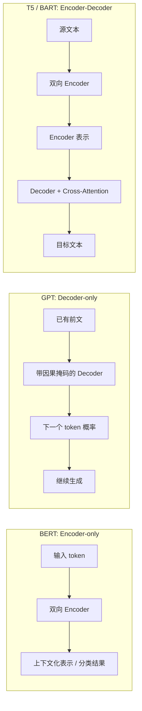
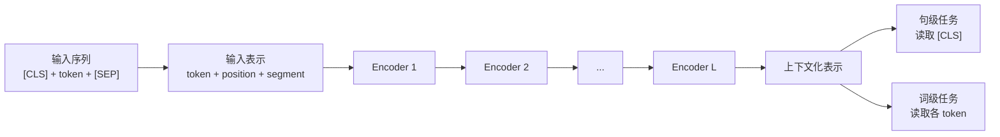

# BERT：基于双向编码器预训练的语言表示模型

> 相关文献：
> - Devlin et al. (2019)：提出 BERT，通过双向 Transformer 编码器预训练显著提升多项 NLP 基准。
> - Peters et al. (2018)：ELMo 率先展示上下文化表示对 NLP 的显著价值，为 BERT 铺路。
> - Liu et al. (2019)：提出 RoBERTa，系统分析并强化 BERT 的训练策略。
> - Clark et al. (2020)：分析 BERT 中不同注意力头与层的语言学行为，帮助理解其内部机制。

## 符号约定与核心公式

本文统一使用以下记号：

| 符号 | 含义 |
| --- | --- |
| $X=(x_1,\dots,x_n)$ | 输入 token 序列 |
| $\tilde{X}$ | 对输入做 mask 后的序列 |
| $Z$ | 由 token、position、segment embedding 相加得到的输入矩阵 |
| $Q,K,V$ | self-attention 中的查询、键、值矩阵 |
| $W^Q,W^K,W^V$ | 由输入表示映射到 $Q,K,V$ 的可学习参数矩阵 |
| $W^O$ | 多头注意力输出投影矩阵 |
| $d_{\text{model}}$ | 隐藏表示维度 |
| $d_k,d_v$ | 单个注意力头中 key / value 的维度 |
| $h$ | 注意力头数 |
| $h_t^{(l)}$ | 第 $l$ 层中位置 $t$ 的隐藏表示 |
| $H^{(L)}$ | 最后一层的整段输出表示 |
| $C$ | 原始 BERT 论文中 $[CLS]$ 位置的最终隐藏向量记号 |
| $[CLS]$ | 用于句级任务聚合的特殊 token |
| $[SEP]$ | 用于分隔句子或片段的特殊 token |
| $[MASK]$ | 预训练时用于遮蔽词的特殊 token |
| $P(x_t\mid \tilde{X})$ | 给定遮蔽上下文预测原 token 的条件概率 |
| $\mathcal{L}_{MLM}$ | Masked Language Modeling 损失 |
| $\mathcal{L}_{NSP}$ | Next Sentence Prediction 损失 |

本文核心公式索引：

1. BERT 输入表示：
$$
z_t = e_t + p_t + s_t
$$

2. Transformer 编码器堆叠：
$$
H^{(L)}=\mathrm{Encoder}^{(L)}(\cdots \mathrm{Encoder}^{(1)}(Z)\cdots)
$$

3. 单头缩放点积注意力：
$$
\mathrm{Attention}(Q,K,V)=\mathrm{softmax}\left(\frac{QK^\top}{\sqrt{d_k}}\right)V
$$

4. 多头注意力：
$$
\mathrm{MultiHead}(X)=\mathrm{Concat}(\mathrm{head}_1,\dots,\mathrm{head}_h)W^O
$$

5. 前馈网络：
$$
\mathrm{FFN}(x)=W_2\,\phi(W_1x+b_1)+b_2
$$

6. MLM 目标：
$$
\mathcal{L}_{MLM}=-\sum_{t\in \mathcal{M}}\log P(x_t\mid \tilde{X})
$$

7. 句级分类：
$$
\hat{y}=\mathrm{softmax}(W C + b)
$$

8. 预训练总损失：
$$
\mathcal{L}=\mathcal{L}_{MLM}+\mathcal{L}_{NSP}
$$

## 阅读导引

为便于建立整体理解，本文按如下层次组织：

1. **模型定位与架构差异**：说明 BERT 相对于 GPT、T5 / BART 等 Transformer 路线的结构特点与任务分工；
2. **编码器主干与数学机制**：依次展开输入表示、self-attention、多头注意力、残差连接、层归一化、前馈网络及复杂度；
3. **预训练、微调与推理**：说明 MLM / NSP、任务头设计、微调机制与推理方式；
4. **能力边界与历史位置**：总结其优势、局限与在 NLP 演化史中的意义；
5. **扩展阅读**：讨论 BERT 变体、句向量方法，以及与 LLM、多模态系统的关系。

---

## 模型定位与双向建模假设

BERT 的全称是 Bidirectional Encoder Representations from Transformers，由 Google 在 2018 年提出。它被普遍视为自然语言处理发展中的关键里程碑之一，因为它系统化地证明了：基于深层双向预训练的语言表示，可以显著提升阅读理解、问答、自然语言推断等多类任务的效果。

在 BERT 出现之前，许多语言模型主要采用单向建模方式，例如严格从左到右预测下一个词，或从右到左建模序列。这类方法能够捕获部分上下文信息，但难以在同一时刻同时利用目标词左侧与右侧的语义线索。BERT 的核心突破正在于其双向性：它通过遮蔽语言建模，使模型在预测被遮蔽词时能够联合利用前后文，从而获得更精确的上下文化表示。

一个直观例子是词语「苹果」。在「吃了一个苹果，很甜」中，它更可能表示水果；而在「苹果发布了新款芯片」中，它更可能表示科技公司。BERT 的目标，正是让模型依据完整上下文区分这些语义差异，而不是为「苹果」分配一个在所有语境下都相同的静态向量。下文将从这一思想出发，进一步说明其输入表示、预训练目标与微调范式。

从结构上看，BERT 是一种基于 **Transformer 编码器** 的预训练语言表示模型。它的核心目标，不是直接作为翻译或生成模型逐词输出文本，而是先在大规模语料上学习强大的上下文化表示，再将这些表示迁移到下游任务中。

它相对于早期词向量与单向语言模型的关键进步在于：

- 不再为每个词分配一个固定静态向量，而是生成**依赖上下文的动态表示**；
- 不再只从左到右或右到左读文本，而是通过遮蔽预测实现**双向上下文建模**；
- 不再为每个任务单独设计复杂结构，而是以“预训练 + 微调”的统一范式适配多种 NLP 任务。

BERT 通常建立在以下假设之上：

- **上下文化表示假设**：同一个词在不同上下文中的表示应当不同；
- **双向条件建模假设**：理解语言时，左侧和右侧上下文都很重要；
- **预训练迁移假设**：在大规模无标注语料上学到的表示，可以迁移到标注较少的任务中；
- **编码优先假设**：对于理解类任务，高质量句子表示往往比自回归生成更重要。

例如，「bank」在「river bank」和「open a bank account」中含义不同。BERT 试图通过双向上下文，让这两个位置生成不同的内部表示，而不是像静态 embedding 那样共用一个词向量。

### BERT 与其他 Transformer 架构的核心差异

最初的 Transformer 是一个完整的 encoder-decoder 结构：编码器负责理解源序列，解码器负责在条件约束下逐步生成目标序列。后续 NLP 模型的发展，很大程度上正是围绕“保留哪一半结构、如何约束注意力方向”展开的。BERT 的特殊之处，在于它**彻底保留了编码器、抛弃了解码器**，从而把模型能力集中到“表示与理解”而不是“自回归生成”上。

可以先用下表概括三条典型路线：

| 模型家族 | 采用的架构 | 注意力方向 | 核心特点 | 擅长任务 |
| --- | --- | --- | --- | --- |
| **BERT** | Encoder-only | 双向可见 | 侧重表示学习与语义理解 | 分类、抽取、匹配、阅读理解 |
| **GPT** | Decoder-only | 单向因果 | 侧重逐 token 生成 | 对话、续写、代码生成 |
| **T5 / BART** | Encoder-Decoder | 编码器双向，解码器单向 | 兼顾理解与条件生成 | 翻译、摘要、改写 |

若用结构图表示三者差异，则可以概括为：

这种差异最根本地体现在 self-attention 的可见性约束上。对 BERT 而言，编码器中的注意力通常可写为：

$$
\mathrm{Attention}_{\text{BERT}}(Q,K,V)
=
\mathrm{softmax}\left(\frac{QK^\top + M_{\text{pad}}}{\sqrt{d_k}}\right)V
$$

其中 $M_{\text{pad}}$ 只负责屏蔽 padding 位置，而不会阻止当前位置看到“未来 token”。因此，BERT 在处理第 $t$ 个位置时，可以同时访问左侧和右侧上下文，这正是它进行深度双向建模的结构基础。

而在 GPT 一类 decoder-only 模型中，注意力必须满足因果约束。若记因果 mask 为 $M_{\text{causal}}$，则：

$$
\mathrm{Attention}_{\text{GPT}}(Q,K,V)
=
\mathrm{softmax}\left(\frac{QK^\top + M_{\text{causal}}}{\sqrt{d_k}}\right)V
$$

其中

$$
(M_{\text{causal}})_{ij}=
\begin{cases}
0, & j \le i \\
-\infty, & j > i
\end{cases}
$$

这意味着第 $i$ 个位置只能看到自己以及左侧已经出现的 token，而无法直接访问右侧“未来信息”。也正因此，GPT 天然适合建模：

$$
P(x_1,\dots,x_n)=\prod_{t=1}^{n}P(x_t\mid x_{<t})
$$

即按顺序不断预测下一个词。

相比之下，BERT 的预训练更接近条件恢复问题。它并不直接分解整句联合概率，而是围绕被遮蔽位置学习：

$$
P(x_t\mid \tilde{X})
$$

因此，BERT 更像是“把整段文本先读懂，再回答问题”；GPT 更像是“基于已有上文，继续把后文写出来”。二者虽然都建立在 Transformer 之上，但目标函数、注意力可见性和输出方式并不相同。

对于 T5、BART 一类 encoder-decoder 模型，则可以把两条路线结合起来理解：编码器先用双向注意力理解输入，解码器再在因果 mask 约束下逐步生成输出，并通过 cross-attention 读取编码器表示。也就是说，它们既保留了 BERT 式的输入理解能力，也保留了 GPT 式的序列生成能力，只是结构更完整、训练与推理链条也更复杂。

从应用选择角度看，这种差异会直接决定模型更适合做什么。若目标是情感分析、实体抽取、语义匹配或检索重排序，BERT 这类 encoder-only 架构通常更自然；若目标是自动续写、对话生成、代码补全或开放式写作，则 decoder-only 架构更合适；若任务本身要求“输入一段文本，再生成另一段文本”，如翻译、摘要、改写，则 encoder-decoder 结构往往更匹配。

若把问题具体化为“给作家做自动续写小说工具”，则底层逻辑通常更应选择 GPT 一类 decoder-only 架构，而不是 BERT。原因在于续写任务本质上要求模型不断建模：

$$
P(x_{t+1}\mid x_{\le t})
$$

也就是在看到已有文本后，持续预测下一个最可能出现的 token。BERT 虽然能够深度理解整段输入，但它的训练目标主要是恢复被遮蔽词、学习上下文化表示，并不天然擅长按时间顺序生成长文本；相反，decoder-only 架构正是围绕自回归生成设计的，因此在连贯续写、风格延续、情节展开和长段文本生成上更符合任务本身的数学结构。

换言之，BERT 更适合回答“这段文字是什么意思”或“这句话属于哪一类”，而 GPT 更适合回答“这段文字接下来应该怎么写”。这正是二者在架构选择上的决定性分工。

---

## 表示构造与编码器主干

BERT 的主干是多层 Transformer Encoder。它没有自回归解码器，也不以生成整段输出为首要目标，而是通过堆叠编码器得到高质量上下文化表示。

从结构上看，BERT 可以理解为“输入表示层 + 多层编码器主干 + 任务输出头”的组合。其中真正承担语义理解核心工作的，是中间反复堆叠的 Transformer Encoder。

### 输入表示：token、位置与句段三类 embedding

BERT 的输入表示由三部分相加构成：

$$
z_t = e_t + p_t + s_t
$$

若把整段输入写成矩阵形式，则可写为：

$$
Z = E + P + S \in \mathbb{R}^{n\times d_{\text{model}}}
$$

其中：

- $e_t$：token embedding，表示当前词或子词本身；
- $p_t$：position embedding，表示当前位置；
- $s_t$：segment embedding，表示当前 token 属于句子 A 还是句子 B。

这意味着 BERT 输入的不只是“词是什么”，还包括：

- 词在序列中的位置；
- 词属于哪一个句段。

在原始 BERT 中，输入常写作：

$$
[CLS]\ \text{句子A}\ [SEP]\ \text{句子B}\ [SEP]
$$

其中：

- `[CLS]` 用于聚合整段输入的句级表示；
- `[SEP]` 用于分隔不同句子或片段。

从数学上看，position embedding 的作用是打破纯集合式输入的置换不变性。若没有位置项 $P$，self-attention 对输入 token 的重排会缺乏足够约束，模型将更难区分「我吃苹果」与「苹果吃我」这类词项相同但顺序不同的句子。BERT 采用的是**可学习的绝对位置编码**，即为每个位置分配一个可训练向量，并与 token embedding 直接相加后送入编码器。

### 编码器堆叠

BERT 由多层 Transformer Encoder 堆叠而成：

$$
H^{(L)}=\mathrm{Encoder}^{(L)}(\cdots \mathrm{Encoder}^{(1)}(Z)\cdots)
$$

其中 $Z$ 表示整段输入矩阵；若按 Devlin et al. (2019) 的原始记号，$[CLS]$ 位置最后一层的向量通常记为 $C$。

每一层 encoder 内部包含：

- multi-head self-attention；
- feed-forward network；
- residual connection；
- layer normalization。

由于使用的是编码器而非解码器，BERT 中的 self-attention 不使用因果掩码，因此每个位置都可以同时访问左右两侧上下文。这正是其“双向”特性的结构基础。

若做直观类比，每一层编码器都可以看作一个专注于阅读理解的分析单元。它并不负责“写出”下一个词，而是负责在整句范围内分析每个词与其他词之间的关系，不断更新各位置的内部表示。经过多层堆叠后，模型得到的不再是孤立词项，而是融合了句法关系、语义角色与局部语境的上下文化表示。

若记第 $l-1$ 层输入为 $H^{(l-1)}\in\mathbb{R}^{n\times d_{\text{model}}}$，则单层 encoder 可以抽象写为：

$$
\hat{H}^{(l)}=\mathrm{LN}\Big(H^{(l-1)}+\mathrm{MHA}(H^{(l-1)})\Big)
$$

$$
H^{(l)}=\mathrm{LN}\Big(\hat{H}^{(l)}+\mathrm{FFN}(\hat{H}^{(l)})\Big)
$$

其中 $\mathrm{MHA}$ 表示 multi-head attention，$\mathrm{FFN}$ 表示逐位置前馈网络，$\mathrm{LN}$ 表示 layer normalization。这个形式揭示了 BERT 编码器的基本计算链：先做注意力信息聚合，再做非线性特征变换，并在每一步都通过残差连接保留原始信息与稳定梯度传播。

### 自注意力机制：从线性阅读到全局建模

传统递归模型通常按序列顺序逐步处理句子，因此较远位置之间的信息交互路径较长。自注意力机制则不同：当 BERT 处理某个位置 $x_t$ 时，它会同时参考序列中的所有位置，并根据相关性为不同词分配不同权重，从而形成该位置的新表示。

在矩阵形式下，给定输入表示 $H\in\mathbb{R}^{n\times d_{\text{model}}}$，首先通过三组线性变换得到：

$$
Q = HW^Q,\quad K = HW^K,\quad V = HW^V
$$

其中

$$
W^Q\in\mathbb{R}^{d_{\text{model}}\times d_k},\quad
W^K\in\mathbb{R}^{d_{\text{model}}\times d_k},\quad
W^V\in\mathbb{R}^{d_{\text{model}}\times d_v}
$$

对第 $t$ 个位置而言，其 query 向量 $q_t$ 会与所有位置的 key 向量做点积，形成原始相关性分数：

$$
e_{tj}=q_t^\top k_j
$$

把所有位置同时写成矩阵形式，就得到注意力分数矩阵：

$$
E = QK^\top \in \mathbb{R}^{n\times n}
$$

其中第 $t$ 行第 $j$ 列元素刻画了“位置 $t$ 对位置 $j$ 的关注强度”。在线性代数上，这一本质上是向量间的点积相似度计算；若写成几何形式，则

$$
q_t^\top k_j = \|q_t\|\,\|k_j\|\cos\theta_{tj}
$$

因此分数较大通常意味着二者在投影空间中的方向更一致，即 query 所携带的需求特征与 key 所编码的可匹配特征更契合。

随后，BERT 使用缩放点积注意力：

$$
\mathrm{Attention}(Q,K,V)=\mathrm{softmax}\left(\frac{QK^\top}{\sqrt{d_k}}\right)V
$$

这个公式可以拆解为四个连续步骤：

1. 计算打分矩阵 $QK^\top$；
2. 用 $\sqrt{d_k}$ 对分数进行缩放；
3. 对每一行做 softmax，得到注意力权重矩阵 $A$；
4. 用 $A$ 对 $V$ 做加权求和，得到新的上下文化表示。

其中

$$
A=\mathrm{softmax}\left(\frac{QK^\top}{\sqrt{d_k}}\right),\quad
A_{tj}=\frac{\exp(e_{tj}/\sqrt{d_k})}{\sum_{m=1}^n \exp(e_{tm}/\sqrt{d_k})}
$$

由此可知，每个 $A_{tj}$ 都满足 $A_{tj}\ge 0$ 且 $\sum_j A_{tj}=1$，因此它可以解释为位置 $t$ 在聚合信息时分配给位置 $j$ 的注意力权重。

缩放项 $\sqrt{d_k}$ 的作用，是抑制高维点积在数值上的快速增大。若不做缩放，随着 $d_k$ 增大，$q_t^\top k_j$ 的方差往往也会增大，softmax 容易进入过度尖锐的饱和区域，导致梯度过小、训练不稳定。

这意味着模型在理解一个词时，不必只依赖它左边已经读过的内容，而是可以在同一层中综合全句线索。例如在句子「这只鼠标很不好用，因为老鼠咬断了它的线」中，「鼠标」与「不好用」「线」之间的关联，会帮助模型判断这里更接近计算机外设；而「老鼠」与「咬断」之间的关联，则会激活生物实体意义。于是，虽然二者字形接近甚至同属相关词汇，但在上下文化表示空间中会被区分开来。

若用前述「苹果」例子进一步说明，句子「他一边啃着苹果，一边敲击着苹果电脑」中，两个「苹果」虽然共享相同字面形式，但其注意力焦点并不相同：

| 位置 | 更可能关注的上下文线索 | 更可能形成的语义解释 |
| --- | --- | --- |
| 第一个「苹果」 | 「啃着」 | 水果 |
| 第二个「苹果」 | 「敲击着」「电脑」 | 品牌或设备 |

这正体现了 BERT 的核心思想：词义不是预先固定的，而是在上下文交互过程中被动态构造出来的。

### 多头注意力：并行观察不同关系

BERT 中使用的并不是单一注意力，而是 multi-head self-attention。所谓“多头”，可以理解为模型在同一层中并行使用多组不同的投影参数，从多个角度同时观察句内关系。某些注意力头可能更敏感于动词和施事者之间的联系，某些头可能更关注修饰关系、指代关系或局部搭配。

形式化地说，第 $i$ 个注意力头可写为：

$$
\mathrm{head}_i=\mathrm{Attention}(Q_i,K_i,V_i)
$$

其中

$$
Q_i = HW_i^Q,\quad K_i = HW_i^K,\quad V_i = HW_i^V
$$

最终，多头注意力把所有头的输出拼接后，再投影回模型维度：

$$
\mathrm{MultiHead}(H)=\mathrm{Concat}(\mathrm{head}_1,\dots,\mathrm{head}_h)W^O
$$

其中

$$
W_i^Q,W_i^K\in\mathbb{R}^{d_{\text{model}}\times d_k},\quad
W_i^V\in\mathbb{R}^{d_{\text{model}}\times d_v},\quad
W^O\in\mathbb{R}^{hd_v\times d_{\text{model}}}
$$

若采用 BERT-Base 的典型设置，则 $d_{\text{model}}=768$，$h=12$，因此每个头常取 $d_k=d_v=64$；BERT-Large 中常见设置则为 $d_{\text{model}}=1024$，$h=16$。

这种设计的重要意义在于：模型不必把所有关系都压缩进一次单一的相似度计算，而是能够把不同类型的语言线索分配给不同注意力头并行建模，最后再把这些结果综合起来。于是，同一个词的最终表示往往同时编码了词汇搭配、句法依赖、语义角色与篇章线索，这也是 BERT 能在多种理解任务上表现强劲的重要结构原因。

从表达能力上看，多头机制相当于让模型在不同子空间中同时学习多种关系。若单头注意力更像“用一副镜头看全句”，多头注意力则更接近“同时使用多副焦距不同的镜头”来观察语言结构。

### 残差连接、层归一化与前馈网络

注意力层输出之后，BERT 并不会立刻进入下一层，而是先经过残差连接与层归一化。设注意力子层输出为 $\mathrm{MHA}(H)$，则第一步更新为：

$$
\hat{H}=\mathrm{LN}\big(H+\mathrm{MHA}(H)\big)
$$

残差连接的作用，是让子层学习“在原表示基础上做增量修正”，而不是每次都重新构造整套表示。这能够显著缓解深层网络中的梯度消失与信息退化问题。

随后，每个位置会独立通过同一个前馈网络：

$$
\mathrm{FFN}(x)=W_2\,\phi(W_1x+b_1)+b_2
$$

在 BERT 中，$\phi$ 通常取 GELU 激活函数：

$$
\mathrm{GELU}(x)=x\,\Phi(x)
$$

其中 $\Phi(x)$ 是标准正态分布的累积分布函数。与 ReLU 相比，GELU 对小幅负值和小幅正值的处理更平滑，因此在 Transformer 系列模型中被广泛采用。

前馈网络输出后，再执行一次残差与层归一化：

$$
H'=\mathrm{LN}\big(\hat{H}+\mathrm{FFN}(\hat{H})\big)
$$

需要注意的是，FFN 虽然对每个位置独立作用，但其参数在所有位置共享。因此，注意力层主要负责跨位置的信息交换，而 FFN 更像是在每个位置上做非线性特征重组与通道变换。二者配合后，单层 encoder 才既能“看全局关系”，又能“提炼局部表示”。

若把单层 Encoder 的数学过程写成更完整的流水线，则可概括为：

$$
Z^{(0)} = E + P + S
$$

$$
Q^{(l)} = H^{(l-1)}W^{Q},\quad
K^{(l)} = H^{(l-1)}W^{K},\quad
V^{(l)} = H^{(l-1)}W^{V}
$$

$$
A^{(l)}=\mathrm{softmax}\left(\frac{Q^{(l)}{K^{(l)}}^\top}{\sqrt{d_k}}\right)
$$

$$
M^{(l)} = A^{(l)}V^{(l)}
$$

$$
\hat{H}^{(l)}=\mathrm{LN}\Big(H^{(l-1)}+M^{(l)}W^O\Big)
$$

$$
F^{(l)} = W_2\,\mathrm{GELU}(W_1\hat{H}^{(l)}+b_1)+b_2
$$

$$
H^{(l)}=\mathrm{LN}\Big(\hat{H}^{(l)}+F^{(l)}\Big)
$$

这个公式链清楚地展示了 BERT 单层编码器的三重功能：注意力矩阵 $A^{(l)}$ 负责在序列维度上聚合信息，FFN 负责在特征维度上做非线性重组，而两次 `Add & Norm` 则负责保持优化稳定性与信息可传递性。

若进一步展开 LayerNorm，对某个位置的隐藏向量 $x\in\mathbb{R}^{d_{\text{model}}}$，其均值和方差分别为：

$$
\mu = \frac{1}{d_{\text{model}}}\sum_{i=1}^{d_{\text{model}}}x_i,\qquad
\sigma^2=\frac{1}{d_{\text{model}}}\sum_{i=1}^{d_{\text{model}}}(x_i-\mu)^2
$$

于是层归一化可写为：

$$
\mathrm{LN}(x)=\gamma\odot\frac{x-\mu}{\sqrt{\sigma^2+\epsilon}}+\beta
$$

其中 $\gamma,\beta\in\mathbb{R}^{d_{\text{model}}}$ 为可学习参数，$\odot$ 表示按元素乘法。与 batch normalization 不同，LayerNorm 是对单个样本内部特征做归一化，因此更适合长度可变、批量分布波动较大的序列建模任务。

### 为什么 FFN 需要非线性

FFN 中最关键的并不只是“两层线性变换”，而是其中间的非线性激活函数 GELU。若把它去掉，则

$$
\mathrm{FFN}(x)=(xW_1+b_1)W_2+b_2
$$

展开后可得：

$$
\mathrm{FFN}(x)=x(W_1W_2)+b_1W_2+b_2
$$

若记

$$
W' = W_1W_2,\qquad b' = b_1W_2+b_2
$$

则上式可化简为：

$$
\mathrm{FFN}(x)=xW'+b'
$$

这说明去掉 GELU 后，两层线性映射在数学上仍然等价于一个单一仿射变换。换言之，不论再堆多少这种“无线性激活”的 FFN，其表达能力都无法真正突破线性变换的范畴。语言中的歧义消解、组合语义、否定、讽刺、长距离依赖等现象本质上都具有显著非线性，因此若缺少 GELU 这类非线性环节，模型就难以学习复杂决策边界。

也正因如此，在 BERT 中，self-attention 与 FFN 实际承担的是互补角色：前者决定“去哪里看”，后者决定“看完之后如何做非线性加工”。两者缺一不可。

### Attention Mask 与可见性控制

虽然 BERT 的 self-attention 不使用自回归模型中的因果掩码，但它在工程实现中通常仍会使用 **padding mask**，以避免模型把注意力分配给纯填充位置。若记 mask 矩阵为 $M\in\mathbb{R}^{n\times n}$，则注意力可写为：

$$
\mathrm{Attention}(Q,K,V;M)=\mathrm{softmax}\left(\frac{QK^\top + M}{\sqrt{d_k}}\right)V
$$

其中常见约定为：

$$
M_{ij}=
\begin{cases}
0, & \text{若位置 } j \text{ 可见} \\
-\infty, & \text{若位置 } j \text{ 被屏蔽}
\end{cases}
$$

由于 softmax 会把极小值压到接近 0，因此被 mask 的位置几乎不会对输出产生贡献。对 BERT 而言，这种 mask 主要用于忽略补齐 token，而不是限制“未来词不可见”。也正因此，BERT 的双向性与 GPT 的单向自回归性在公式层面可以通过 mask 机制清楚区分出来。

### 复杂度与参数规模

从计算代价看，self-attention 最核心的开销来自分数矩阵 $QK^\top$ 与权重矩阵 $A$ 的构造。若序列长度为 $n$，隐藏维度为 $d_{\text{model}}$，则单层 self-attention 的主要时间复杂度可近似理解为：

$$
O(n^2 d_{\text{model}})
$$

其显式存储的注意力矩阵规模为：

$$
A\in\mathbb{R}^{n\times n}
$$

因此空间复杂度中最敏感的部分通常是：

$$
O(n^2)
$$

这正是 BERT 在长文本场景下面临显著成本压力的根本原因。与 RNN 类模型的逐步线性传播相比，Transformer 虽然并行性更强，但在序列变长时要为任意两位置之间的交互支付二次代价。

若进一步看参数规模，忽略偏置和 layer normalization 的较小项，单层 encoder 的主要参数量可粗略分解为：

- 注意力投影部分：$W^Q,W^K,W^V,W^O$，合计约为 $4d_{\text{model}}^2$；
- 前馈网络部分：$W_1,W_2$，合计约为 $2d_{\text{model}}d_{\text{ff}}$。

于是，单层 encoder 的主体参数量可近似写为：

$$
N_{\text{layer}}\approx 4d_{\text{model}}^2 + 2d_{\text{model}}d_{\text{ff}}
$$

在 BERT 这类标准 Transformer 编码器中，通常有 $d_{\text{ff}}\approx 4d_{\text{model}}$，因此：

$$
N_{\text{layer}}\approx 12d_{\text{model}}^2
$$

这说明当隐藏维度增大时，参数量会近似按平方增长；而当层数 $L$ 增加时，总参数量又会近似线性叠加。这也是从 BERT-Base 扩展到 BERT-Large 时，模型规模和训练成本都会明显上升的原因。

### BERT-Base 与 BERT-Large

原始 BERT 论文中最常用的两种配置如下：

| 模型 | 层数 $L$ | 隐藏维度 $d_{\text{model}}$ | 头数 $h$ | 前馈维度 $d_{\text{ff}}$ | 近似参数量 |
| --- | --- | --- | --- | --- | --- |
| **BERT-Base** | 12 | 768 | 12 | 3072 | 110M |
| **BERT-Large** | 24 | 1024 | 16 | 4096 | 340M |

若用前面的近似公式估算，仅 encoder 主干部分就已经相当可观。以 BERT-Base 为例，单层主干参数量约为：

$$
4\times 768^2 + 2\times 768\times 3072 \approx 7.08\times 10^6
$$

12 层累计后约为：

$$
12\times 7.08\times 10^6 \approx 8.50\times 10^7
$$

再加上词表 embedding、pooler 与任务相关输出层后，就会接近常见的约 110M 参数量。类似地，BERT-Large 由于层数更深、宽度更大，其总参数量会显著提高到约 340M。由此可见，BERT-Large 的性能优势并不是“免费”获得的，而是以更高的显存、算力与训练时间为代价换来的。

### WordPiece 分词与输入长度约束

BERT 在进入 embedding 层之前，并不是直接以“自然词”为最小单位处理文本，而是先经过 **WordPiece** 分词。其基本思想，是用较小规模的子词词表覆盖尽可能多的词形变化，从而在词表大小与未登录词处理能力之间取得平衡。

例如，英文词 `playing` 可能被切分为：

$$
\text{playing}\rightarrow [\text{play},\ \text{##ing}]
$$

其中前缀 `##` 表示该子词通常接续在前一个子词之后。这样做的优点在于：

- 高频词可以作为完整词直接保留；
- 低频词可以拆成较稳定的子词组合；
- 新词、复合词或形态变化词不必全部单独进入词表。

从建模角度看，BERT 实际处理的是 token 序列而不是“空格分隔词序列”。因此，输入长度限制约束的也是 token 数而非原始单词数。若句子被分成更多子词，则可容纳的原始文本长度也会相应缩短。

原始 BERT 的最大序列长度通常设为 512 个 token。若单句或句对编码后超过这一长度，常见处理方式包括：

- 截断超出部分；
- 对长文档滑动切窗；
- 先切分段落，再分别编码。

这也是为什么 BERT 在长文档阅读、长上下文检索等任务中往往需要额外的分段策略或长上下文改造模型。

### 预训练目标：Masked Language Modeling

BERT 不能直接像自回归语言模型那样做“根据前文预测下一个词”，因为那会破坏双向可见性。为此，它使用 MLM（Masked Language Modeling）目标：先随机遮住部分 token，再让模型根据其余上下文预测被遮住的原词。

从直观上看，MLM 可以理解为一种“完形填空式”训练。模型读到的不是完整原句，而是带有空缺的句子；它必须通过左右文线索推断缺失位置最合理的词。也正因为如此，BERT 学到的不是单向续写能力，而是围绕上下文进行语义判别和歧义消解的能力。

其损失形式可写为：

$$
\mathcal{L}_{MLM}=-\sum_{t\in \mathcal{M}}\log P(x_t\mid \tilde{X})
$$

其中 $\mathcal{M}$ 是被选中做 mask 的位置集合，$\tilde{X}$ 是遮蔽后的输入。

这一目标的作用是：

- 让模型在看到左右文的前提下恢复局部缺失；
- 强迫中间表示编码丰富语义与句法信息；
- 让预训练聚焦于“理解上下文”，而不是仅做单向续写。

例如，若输入句子为「她把书放在了桌子的 `[MASK]` 里」，模型会同时利用左侧的「书」「放在」和右侧的「里」来推断该位置更可能是「抽屉」而不是其他词。再如句子「今天气温很低，出门要戴 `[MASK]`」，模型则会结合「气温很低」「出门」等线索，倾向于预测「围巾」「手套」等语义上更合理的词。通过大量这类训练样本，BERT 会逐渐学会把词义判断建立在上下文而不是词面本身之上。

从训练信号角度看，MLM 的关键并不在于“猜中一个词”本身，而在于逼迫隐藏层持续编码局部搭配、语法结构、实体关系与语义场景。换言之，被恢复出来的词只是外部任务形式，真正沉淀下来的是中间层中的上下文化表示能力。

若把前文的 self-attention 计算过程代入 MLM，可以更清楚地看到 BERT 是如何“猜词”的。设句子为「我今天去果园摘了几个 `[MASK]`，又红又甜」，当模型处理 `[MASK]` 所在位置时，该位置当前层的隐藏状态会先映射成 query 向量 $q_{\text{mask}}$。随后，它会与上下文中诸如「果园」「红」「甜」等词对应的 key 向量做点积：

$$
e_{\text{mask},j}=q_{\text{mask}}^\top k_j
$$

若这些上下文词与水果语义高度相关，则它们会在注意力矩阵中获得较大分数。经过 softmax 之后，模型得到针对 `[MASK]` 位置的注意力分布：

$$
\alpha_{\text{mask},j}=\frac{\exp(e_{\text{mask},j}/\sqrt{d_k})}{\sum_m \exp(e_{\text{mask},m}/\sqrt{d_k})}
$$

接着，`[MASK]` 位置的新表示会由所有 value 向量加权求和得到：

$$
h_{\text{mask}}'=\sum_{j=1}^{n}\alpha_{\text{mask},j}v_j
$$

若「果园」「红」「甜」对应的权重较高，则 $h_{\text{mask}}'$ 就会吸收更多与水果类别、颜色属性和口感特征有关的信息。经过多层编码器反复更新后，这个位置的最终隐藏表示会被送入词表分类器，输出在整个词表上的概率分布：

$$
P(x_t=w\mid \tilde{X})=\mathrm{softmax}(W_{\text{vocab}}h_t^{(L)}+b_{\text{vocab}})
$$

于是，像「苹果」「桃子」这类与上下文更一致的词会得到更高概率，而与语境明显不符的词概率会被压低。若预测结果与真实 token 不一致，误差就会通过反向传播更新 attention 权重、投影矩阵和输出分类器参数，使模型在下一次遇到类似上下文时更容易聚焦正确线索。

在原始 BERT 的实现中，被选中参与 MLM 的位置并不会全部直接替换成 `[MASK]`，而是采用著名的 **80/10/10** 策略。设共有约 15% 的 token 被抽中作为预测目标，则：

- 其中约 80% 被真正替换成 `[MASK]`；
- 其中约 10% 被替换成一个随机 token；
- 其中约 10% 保持原词不变。

这一策略的目的，是缓解预训练与推理之间的分布不一致问题。若训练时所有目标位置都替换为 `[MASK]`，模型会过度依赖这一特殊标记；但在下游微调和真实推理时，输入通常并不包含 `[MASK]`。通过让一部分目标词保持原样或替换为随机词，BERT 被迫学习更稳健的上下文表示，而不是简单把“看到 `[MASK]`”当作唯一信号。

若把这一过程形式化地写成目标集合 $\mathcal{M}$ 上的条件预测，则模型真正优化的是：

$$
\mathcal{L}_{MLM}=-\sum_{t\in \mathcal{M}}\log P(x_t\mid \tilde{X})
$$

其中需要注意，$\tilde{X}$ 虽然是“被扰动后的输入”，但监督标签始终是原始 token $x_t$ 本身，而不是替换后的表面输入。这一点保证了模型学习目标始终是恢复原始语义内容。

### 预训练目标：Next Sentence Prediction

原始 BERT 还引入了 NSP（Next Sentence Prediction）任务，用于判断句子 B 是否为句子 A 的真实下一句。其目的在于让模型学习句间关系，尤其是服务问答与自然语言推断等任务。

若把 MLM 看作词级理解训练，那么 NSP 更接近句级关系训练。它要求模型不仅识别句子内部每个词的含义，还要判断两个句子在篇章层面是否自然衔接。

在实现上，常用 `[CLS]` 位置的最终表示进行句级分类：

$$
\hat{y}=\mathrm{softmax}(W h_{[CLS]} + b)
$$

预训练总损失写为：

$$
\mathcal{L}=\mathcal{L}_{MLM}+\mathcal{L}_{NSP}
$$

后续研究发现 NSP 并非始终必要，但它在 BERT 原始设计中代表了一种重要思路：**不仅学词级表示，也学句级关系表示**。

例如，句子 A 为「小王拿起雨伞走出了门」，若句子 B 为「外面正在下大雨」，那么它们在语义与篇章上具有较强连续性；若句子 B 改成「三角形的内角和等于 180 度」，虽然语法上依旧是合法句子，但与句子 A 的衔接关系就十分薄弱。NSP 试图让 `[CLS]` 聚合出的句级表示具备区分这类“自然延续”与“随机拼接”的能力。

若进一步用更直观的训练样本来理解 NSP，可以把它看成一个句间逻辑判断游戏。模型会看到两句话，例如：

- 句子 A：「因为今天外面下着大暴雨」
- 句子 B：「所以我决定留在家里看书」

或另一组不连贯样本：

- 句子 A：「虽然这部电影的特效非常华丽」
- 句子 B：「光合作用是植物制造养分的过程」

在编码时，这两句话会被组织为同一个输入序列：

$$
[CLS]\ A\ [SEP]\ B\ [SEP]
$$

由于 BERT 的 self-attention 允许句子 A 与句子 B 中的 token 在所有层中相互作用，因此连词、事件、因果结构和主题一致性都会共同影响最终的 `[CLS]` 表示。若句子之间具有顺承、因果或转折上的合理联系，则 $C=h_{[CLS]}^{(L)}$ 更容易落在“语义连续”的区域；若两句只是随机拼接，则这一表示会更偏向“不连续”类别。

把这一过程形式化后，NSP 本质上是一个二分类任务。若标签 $y\in\{0,1\}$ 分别表示 `NotNext` 与 `IsNext`，则可写为：

$$
\hat{y}=\mathrm{softmax}(W_{\text{NSP}}C+b_{\text{NSP}})
$$

$$
\mathcal{L}_{NSP}=-\sum_{c\in\{0,1\}} y_c\log \hat{y}_c
$$

因此，MLM 主要训练模型恢复局部缺失并掌握词级上下文，而 NSP 则进一步训练模型利用整段输入中的句间关系进行句级判断。二者结合后，BERT 便从一个只有结构的编码器，逐渐转变为具备通用语言理解能力的预训练模型。

### 统一范式与任务接口

BERT 最具影响力的地方之一，不只是具体网络，而是其工作流程：

1. 在海量无标注文本上做自监督预训练；
2. 把预训练好的参数作为初始化；
3. 在下游任务上用较小改动进行微调。

这种流程之所以重要，在于它把“先学通用语言知识，再适配具体任务”变成了标准做法。模型在预训练阶段积累的，并不是某一个固定任务的标签规则，而是语义、句法、搭配、篇章衔接等更底层的语言知识；到了微调阶段，只需用较少标注数据，就能把这些能力快速转化为具体任务性能。

这一范式使大量 NLP 任务都可以统一到相似接口下：

| 任务类型 | 常用读取方式 | 典型输出 |
| --- | --- | --- |
| **句子分类** | 读取 `[CLS]` 表示 | 情感分类、主题分类 |
| **句对判断** | 输入句子 A/B，读取 `[CLS]` | 自然语言推断、语义匹配 |
| **序列标注** | 读取每个 token 的表示 | 命名实体识别、词性标注 |
| **抽取式问答** | 预测答案起止位置 | 阅读理解 |

### 下游任务头的数学形式

从表示学习角度看，BERT 微调的核心思想很简单：先用编码器得到隐藏状态

$$
H^{(L)}=[h_1^{(L)},\dots,h_n^{(L)}]
$$

再根据任务类型，从中读取适当的表示并接上轻量输出层。不同任务之间最主要的差别，通常不在 BERT 主干本身，而在“如何读取隐藏状态”和“如何定义损失函数”。

对于句子级分类任务，最常见的做法是读取 `[CLS]` 对应表示 $C=h_{[CLS]}^{(L)}$，再接 softmax 分类器：

$$
\hat{y}=\mathrm{softmax}(WC+b)
$$

若进一步写成交叉熵损失，则可表示为：

$$
\mathcal{L}_{\text{cls}}=-\sum_{c=1}^{K} y_c\log \hat{y}_c
$$

其中 $K$ 为类别数，$y$ 为 one-hot 标签。

若任务是最常见的二分类情感分析，例如判断一句评论是“正向好评”还是“负向差评”，则通常有 $K=2$。这时可以把分类头写得更具体一些。设 $C\in\mathbb{R}^{d_{\text{model}}}$，则可引入：

$$
W_{\text{sent}}\in\mathbb{R}^{d_{\text{model}}\times 2},\qquad
b_{\text{sent}}\in\mathbb{R}^{2}
$$

先通过线性映射得到两个类别的原始分数（logits）：

$$
z = CW_{\text{sent}} + b_{\text{sent}}
$$

再经过 softmax 得到概率分布：

$$
p=\mathrm{softmax}(z),\qquad
p=(p_{\text{neg}},p_{\text{pos}})
$$

其中 $p_{\text{neg}}+p_{\text{pos}}=1$。若 $p_{\text{pos}}>p_{\text{neg}}$，则模型判为正向；反之则判为负向。这个例子很好地说明了微调的本质：底层 BERT 负责把整句压缩为具有语义判别力的句向量 $C$，而顶层任务头只需把它映射到当前任务所需的类别空间中即可。

对于句对分类任务，例如自然语言推断或语义匹配，输入通常组织为：

$$
[CLS]\ A\ [SEP]\ B\ [SEP]
$$

然后仍使用同一个句级向量 $C$ 做分类：

$$
\hat{y}_{AB}=\mathrm{softmax}(W_{AB}C+b_{AB})
$$

这说明句对任务并不一定需要额外复杂结构；BERT 借助 self-attention 已经可以在编码阶段让句子 $A$ 与句子 $B$ 充分交互。

对于序列标注任务，通常直接对每个位置的隐藏状态分别分类。若第 $t$ 个位置的输出为 $h_t^{(L)}$，则：

$$
\hat{y}_t=\mathrm{softmax}(W_{\text{tok}}h_t^{(L)}+b_{\text{tok}})
$$

整个序列的损失可写为各位置损失之和：

$$
\mathcal{L}_{\text{seq}}=-\sum_{t=1}^{n}\sum_{c=1}^{K} y_{t,c}\log \hat{y}_{t,c}
$$

这正对应命名实体识别、词性标注等任务。某些实现会在顶层再接 CRF 以显式建模标签转移约束，但 BERT 本身最基础的做法就是逐 token 分类。

对于抽取式问答，常见做法是对每个位置分别预测其作为答案起点和终点的概率。若共享同一个编码输出 $H^{(L)}$，则可写为：

$$
s_t = w_s^\top h_t^{(L)},\qquad e_t = w_e^\top h_t^{(L)}
$$

进一步经过 softmax 得到起点与终点分布：

$$
P_{\text{start}}(t)=\frac{\exp(s_t)}{\sum_{j=1}^{n}\exp(s_j)},\qquad
P_{\text{end}}(t)=\frac{\exp(e_t)}{\sum_{j=1}^{n}\exp(e_j)}
$$

训练时通常最小化正确起点和终点位置的负对数似然：

$$
\mathcal{L}_{\text{QA}}=-\log P_{\text{start}}(t_s)-\log P_{\text{end}}(t_e)
$$

其中 $t_s,t_e$ 分别为真实答案的起始和结束位置。由此可见，BERT 在阅读理解中并不是“生成答案”，而是在上下文中“指出答案 span 在哪里”。

如果任务是检索重排序或相关性判断，也可以把查询与文档拼接输入：

$$
[CLS]\ q\ [SEP]\ d\ [SEP]
$$

再输出一个相关性分数：

$$
\hat{r}=\sigma(w_r^\top C+b_r)
$$

其中 $\sigma(\cdot)$ 为 sigmoid 函数。这样的 cross-encoder 结构通常精度较高，因为查询与文档能在所有层中直接交互；但它也更昂贵，因为每个候选文档都必须和查询一起重新编码。

---

## 训练与使用流程

BERT 的使用流程通常分为预训练与下游微调两个阶段。

### 预训练阶段

预训练的典型步骤为：

1. 从大规模文本中构造输入序列；
2. 对部分 token 做遮蔽，形成 $\tilde{X}$；
3. 输入 BERT 编码器，得到每个位置的上下文化表示；
4. 在被遮蔽位置上预测原 token；
5. 可选地同时做 NSP 句级分类；
6. 反向传播更新全部参数。

这一步的核心不是学某个具体任务标签，而是学一套具有广泛可迁移性的语言表示。

从功能上看，预训练阶段并不要求模型立刻完成某个具体任务，而是先让它形成较强的通用语言理解能力。

从原始论文设置看，BERT 的预训练语料主要来自 BooksCorpus 与 English Wikipedia。前者提供较长、连贯的自然语言叙事文本，后者则提供覆盖面更广的百科知识与说明性文本。把二者结合起来，有助于模型同时学习篇章连续性、实体知识、常见表达和跨主题语义模式。

工程上，预训练样本通常还需要经历如下处理：

- 先用 WordPiece 把文本切成子词 token；
- 按最大长度限制组织成单句或句对样本；
- 添加 `[CLS]`、`[SEP]`、segment id 与 position id；
- 再对选中的目标位置应用 MLM 扰动策略。

因此，BERT 的预训练并不是“把原始文本直接喂进模型”这么简单，而是一整套围绕输入构造、目标设计与批量组织展开的训练流水线。

### 微调阶段

在下游任务中，BERT 常见微调流程如下：

1. 载入预训练参数；
2. 在顶层接一个小型任务头，如分类层或 span 预测层；
3. 用任务数据继续训练全部参数或大部分参数；
4. 在验证集上选择超参数并评估效果。

这一阶段的关键优势是：即使下游数据集不大，模型也能借助预训练中积累的语言知识获得较强性能。

从学习过程角度看，微调之所以有效，是因为此时模型并不是从随机参数出发重新学习语言，而是在一个已经具备通用语言常识的参数空间附近做小幅更新。换言之，预训练阶段已经让 BERT 学会了大量可迁移的先验知识，例如常见词义、句法模式、实体关系、篇章衔接和上下文消歧规则；微调阶段要做的，只是把这些一般性知识重新组织成对当前任务最有用的判别边界。

这也是“预训练 + 微调”相对于“从零开始监督训练”的决定性优势之一。若只依赖几千条带标签样本从头训练，模型更容易记住训练集中的表面模式，从而产生过拟合；而经历大规模预训练的 BERT 往往已经形成较稳健的表示基础，因此即使标注数据较少，也更容易保留对未见样本的泛化能力。严格地说，微调并不是凭空创造新知识，而是把预训练中获得的广泛语言知识迁移、压缩并对齐到具体任务目标上。

若用优化视角表述，可以把预训练参数记为 $\theta_{\text{pre}}$，下游任务参数记为 $\theta$，则微调本质上是在 $\theta_{\text{pre}}$ 附近最小化任务损失：

$$
\theta^*=\arg\min_{\theta}\mathcal{L}_{\text{task}}(\theta)
$$

其中初始化满足

$$
\theta_0=\theta_{\text{pre}}
$$

相比随机初始化，这种做法通常会带来更快收敛、更稳定训练以及更好的样本效率。

在这一过程中，底层的 BERT 主干通常保持基本一致，变化的主要是顶层任务头以及相应损失函数。

从工程上看，微调又可以粗略分为两类：

- **全参数微调**：更新 BERT 主干与任务头的全部参数；
- **参数高效微调**：冻结大部分主干，仅训练少量新增参数或低秩更新。

前者通常效果直接、实现简单，但显存与存储成本较高；后者则更适合多任务部署或资源受限场景。以后者为例，若把某一层线性映射写为 $W$，LoRA 一类方法常将参数更新近似写为低秩分解：

$$
W' = W + \Delta W,\qquad \Delta W = BA
$$

其中 $A\in\mathbb{R}^{r\times d}$、$B\in\mathbb{R}^{k\times r}$，且秩 $r$ 远小于原矩阵维度。这样就可以在不显著增加参数量的前提下，为不同任务学习各自的小规模适配模块。

因此，微调并不是重新训练一个全新模型，而是在保留预训练成果的前提下，对表示空间和任务边界做针对性适配。这也是 BERT 能在多种任务上用较少标注数据快速达到较强效果的根本原因。

### 推理阶段

推理时，BERT 一般一次性编码整段输入，而不是自回归逐词生成。这使它在理解类任务中具有良好并行性。

典型用法包括：

- 读 `[CLS]` 做整句分类；
- 读每个 token 的向量做序列标注；
- 读上下文段落表示做检索或重排序；
- 读起止位置分布做抽取式问答。

这一点也再次说明，BERT 的主要优势在于**理解与表示**，而不是开放式生成。

### 层级表示与内部机制

从经验研究与可解释性分析角度看，BERT 不同层学到的表示并不完全相同，而是呈现出一定的层级分工。较浅层往往更接近词形、局部搭配与短程句法线索；中间层常更有利于编码依存关系、短语结构和较稳定的语义模式；较高层则更容易吸收任务相关信息，并把整段输入压缩为适合分类、推断或问答的高层表示。

若把某一层第 $t$ 个位置的表示记为 $h_t^{(l)}$，则常见的“探针”思路，是用一个简单线性分类器测试这层表示是否已经显式包含某类语言信息。例如，可写为：

$$
\hat{y}_{t}^{(l)}=\mathrm{softmax}(W_{\text{probe}}h_t^{(l)}+b_{\text{probe}})
$$

若一个很简单的 probe 就能在某层上较好恢复词性、句法角色或实体边界，则通常说明这类信息已经在该层表示中较容易被线性读取出来。需要强调的是，这类结论更多是经验性的表征分析，而不是严格的功能隔离；不同任务、语料和模型变体上，最佳层位并不总是完全相同。

对于 token 级表示和句级表示，也可以做更细致的区分。设最终层输出为

$$
H^{(L)}=[h_1^{(L)},\dots,h_n^{(L)}]
$$

则：

- token 级任务通常直接读取某个位置的 $h_t^{(L)}$；
- 句级任务常读取 $C=h_{[CLS]}^{(L)}$；
- 句向量任务有时也会采用平均池化
$$
\bar{h}=\frac{1}{n}\sum_{t=1}^{n} h_t^{(L)}
$$
作为整句表示。

这说明 `[CLS]` 并不是“天然就等于最佳句向量”，而是一种在预训练与微调中被专门塑造成句级聚合接口的特殊位置。对于分类任务，`[CLS]` 往往足够有效；但在语义检索、相似度计算等场景中，平均池化或专门训练的句向量方法有时会更稳定，这也是后续 SBERT、SimCSE 等工作的动机之一。

从注意力头角度看，不同头也常呈现一定功能偏好。经验上，有些头更倾向于关注分隔符、标点或局部搭配，有些头更容易捕捉主谓关系、修饰关系或指代联系，还有些头会在句对输入中承担跨句对齐作用。这并不意味着每个头都对应单一、固定、可命名的语言规则，而是说明 multi-head attention 的确为模型提供了在多个子空间中并行建模不同关系的能力。

也正因为 BERT 的内部表示具有这种“层间递进 + 多头分工”的特征，实践中经常会出现如下现象：

- 不是所有任务都必须只读最后一层；
- 不同任务对层表示的偏好并不一致；
- 微调过程本身会重新塑造高层表示，使其更贴合当前任务目标。

因此，把 BERT 理解为“输出一个固定 embedding 的黑盒”是不够准确的。更精确的理解是：BERT 提供的是一组随层数逐步演化的上下文化表示，而任务效果很大程度上取决于我们如何读取、池化和微调这些表示。

---

## 案例推演：遮蔽词如何被恢复

考虑句子：

$$
[\text{他},\ \text{在},\ \text{河边},\ \text{坐在},\ \text{bank},\ \text{上}]
$$

假设预训练时把 `bank` 遮蔽：

$$
[\text{他},\ \text{在},\ \text{河边},\ \text{坐在},\ [MASK],\ \text{上}]
$$

BERT 会让被遮蔽位置同时读取左右上下文：

- 左侧有「河边」「坐在」；
- 右侧有「上」；
- 这些词共同暗示这里更可能是“河岸”而不是“银行”。

| 步骤 | 输入或状态 | BERT 内部在做什么 | 结果 |
| --- | --- | --- | --- |
| 1 | 原句进入模型 | token、位置、句段 embedding 相加 | 形成基础输入表示 |
| 2 | `bank` 被替换为 `[MASK]` | 模型无法直接看到目标词 | 必须依赖上下文恢复 |
| 3 | 多层双向 self-attention | `[MASK]` 位置同时读取左右词信息 | 聚合「河边」「坐在」「上」等线索 |
| 4 | MLM 预测头输出分布 | 候选词在词表上竞争 | “bank=河岸”对应词义概率更高 |
| 5 | 微调到下游任务时 | 复用这些上下文化表示 | 帮助完成分类、问答或标注 |

这个例子体现了 BERT 的关键机制：

- 一个词的表示不再固定不变；
- 表示依赖双向上下文；
- 预训练目标推动模型学习可迁移的语义与句法结构。

---

## 优势、局限与训练要点

BERT 之所以有效，是因为它把“语言表示学习”从静态词向量推进到了深层上下文化表示，并用大规模预训练把这种表示泛化到多任务场景中。

它的主要优势包括：

- **上下文化能力强**：同一词在不同语境中可得到不同表示；
- **双向建模充分**：适合理解类任务中的语义判别；
- **迁移能力强**：预训练参数可服务多种下游任务；
- **统一接口好**：许多任务只需在顶层加简单输出头；
- **并行编码效率高**：相较递归模型，更适合大规模训练。

但它也有明显局限：

- **不擅长开放式生成**：因为不是自回归解码架构；
- **`[MASK]` 带来预训练-推理不一致**：真实文本中通常没有 `[MASK]`；
- **长文本代价高**：编码长度受 self-attention 二次复杂度限制；
- **预训练成本高**：需要大规模语料与算力支持。

训练中的典型难点包括：

- 掩码比例、batch size、训练步数等超参数对效果影响明显；
- 大模型容易受优化稳定性和显存限制影响；
- 若数据清洗不充分，预训练语料中的偏差会被表示学习放大；
- 下游微调在小数据集上可能出现不稳定和方差较大的问题。

常见缓解手段包括：

- 改进预训练配方，如动态 masking、更长训练、更大 batch；
- 使用 RoBERTa、ALBERT、DeBERTa 等变体改善效率或效果；
- 在参数高效微调中使用 Adapter、LoRA、Prefix Tuning 等方法；
- 对长文本场景采用稀疏 attention 或分块编码模型。

---

## 扩展阅读：相关模型与后续发展

BERT 的影响并未停留在编码器预训练本身。围绕其上下文化表示能力，后续发展很快扩展到句向量检索、相似度学习、检索增强生成，以及多模态建模等方向。以下内容在主题上已经部分超出 BERT 本体，但有助于理解其后续技术谱系与应用延伸。

### BERT 直接变体：从训练配方到结构改造

在 BERT 提出之后，研究者很快发现，模型效果不仅取决于“是否使用双向 Transformer 编码器”，也与预训练配方、参数组织方式、位置建模方法和判别目标密切相关。于是，一系列直接建立在 BERT 路线上的变体相继出现，它们大体分别回答了四类问题：

- 训练得更充分，是否能显著超过原始 BERT；
- 在尽量不损失效果的情况下，能否把参数做得更省；
- 是否可以改进位置与内容的交互方式；
- 是否能用更高效的预训练目标替代 MLM。

下表可先给出一个总览：

| 模型 | 主要改动 | 试图解决的问题 | 典型特点 |
| --- | --- | --- | --- |
| **RoBERTa** | 强化训练配方，移除 NSP，使用动态 masking | 原始 BERT 是否训练不足 | 更强的预训练规模与稳定性 |
| **ALBERT** | 参数共享、embedding 分解 | 降低参数量与显存占用 | 更轻量、更易扩展层数 |
| **DeBERTa** | disentangled attention、相对位置建模 | 提升内容与位置信息建模能力 | 编码更精细，效果常更优 |
| **ELECTRA** | 替换 MLM 为 replaced token detection | 提高预训练样本效率 | 判别式预训练更高效 |

#### RoBERTa：把 BERT 训练得更彻底

RoBERTa 的核心结论之一是：原始 BERT 并不一定是“架构受限”，而很可能是“训练配方仍有提升空间”。因此，RoBERTa 并未大幅改动编码器主干，而是重点调整了训练策略，例如：

- 移除 NSP 目标；
- 使用更大 batch 与更长训练；
- 使用更多训练数据；
- 采用动态 masking，而不是固定遮蔽模式。

从思想上看，RoBERTa 说明了一个重要事实：BERT 的成功并不只来自结构设计，也来自大规模预训练本身。而一旦预训练数据量、训练步数和超参数足够充分，单纯优化训练配方就可以带来可观收益。它也间接推动了后续社区对“预训练 recipe”本身的系统重视。

#### ALBERT：在更少参数下保留表示能力

ALBERT 的主要目标不是单纯追求更高分，而是提高参数效率。其代表性做法包括：

- 对词表 embedding 做低维分解；
- 在不同 Transformer 层之间共享参数。

若原始 embedding 矩阵可写为

$$
E\in\mathbb{R}^{|\mathcal{V}|\times d_{\text{model}}}
$$

则 ALBERT 将其拆为两个较小矩阵的乘积：

$$
E \approx E_1E_2,\qquad
E_1\in\mathbb{R}^{|\mathcal{V}|\times d_e},\quad
E_2\in\mathbb{R}^{d_e\times d_{\text{model}}}
$$

其中 $d_e$ 通常远小于 $d_{\text{model}}$。这样可以显著减少词表相关参数量。再结合跨层参数共享，ALBERT 能在维持较深网络的同时降低存储成本。其启发在于：BERT 的性能并不完全依赖“每一层都拥有独立参数”，合理的参数复用也可以保留较强表示能力。

#### DeBERTa：解耦内容与位置

前文提到，标准 BERT 通常直接把 token embedding 与 position embedding 相加后送入注意力层。DeBERTa 则进一步提出：内容信息与位置信息未必应当在输入处简单混合，而可以在注意力计算中以更细致的方式分别建模。

其核心思想之一是 disentangled attention。若粗略表述，注意力分数不再只由内容向量之间的相互作用决定，而会同时考虑内容到内容、内容到位置等多种关系项。于是，模型能更明确地区分“这个词本身是什么”和“这个词相对另一个词处在什么位置”。从表示学习角度看，这使得位置信息不再只是被动叠加，而是更直接参与相关性计算，因此在许多理解任务上往往能带来更细粒度的结构建模能力。

#### ELECTRA：不再只做完形填空

ELECTRA 的出发点是：MLM 在训练时只对被 mask 的少数位置产生直接监督，因此样本利用率并不高。为此，ELECTRA 采用一种替换词检测（replaced token detection）思路。它先用一个较小的生成器为被遮蔽位置生成替代词，再让主判别器判断每个位置的 token 是“原始真实词”还是“被替换词”。

若判别器对第 $t$ 个位置输出“该 token 为真实词”的概率为 $D(h_t)$，标签为 $r_t\in\{0,1\}$，则其损失可写为逐位置二分类：

$$
\mathcal{L}_{\text{RTD}}
=
-\sum_{t=1}^{n}
\Big(
r_t\log D(h_t)+(1-r_t)\log(1-D(h_t))
\Big)
$$

与 MLM 相比，这种目标让几乎所有位置都能参与监督，因此在相同计算预算下往往更高效。ELECTRA 的重要意义在于，它提醒我们：BERT 路线并不意味着必须始终沿用 MLM，编码器预训练目标本身也可以被重新设计。

#### 这些变体说明了什么

若把这些工作放在一起看，可以发现它们分别从不同维度推动了 BERT 路线的演化：

- RoBERTa 强调“训练配方很重要”；
- ALBERT 强调“参数组织方式很重要”；
- DeBERTa 强调“位置信息与注意力建模方式很重要”；
- ELECTRA 强调“预训练目标本身也可以重构”。

因此，BERT 的历史意义不只在于提出了一个具体模型，更在于开辟了一条可持续改进的编码器预训练路线。后续许多工作并不是抛弃 BERT，而是在它奠定的框架上不断重新思考：哪些部分是真正关键的，哪些部分还有更优设计空间。

### Sentence-BERT：面向句向量检索的双编码器改造

原生 BERT 虽然适合理解句对关系，但若直接用于大规模相似度检索，往往面临两个问题：交叉编码成本高，直接取 `$[CLS]`` 或平均池化得到的句向量又未必足够适合余弦相似度比较。Sentence-BERT（SBERT）因此把 BERT 改造成双编码器（bi-encoder）句向量模型。

若句子编码函数记为 $f(\cdot)$，则：

$$
u=f(A),\qquad v=f(B),\qquad
\operatorname{sim}(u,v)=\frac{u^\top v}{\lVert u\rVert\lVert v\rVert}
$$

这样，文档句向量可以预先离线编码并建立索引，在线阶段只需编码查询句即可完成近邻检索。其意义在于：BERT 奠定了上下文化编码器的表示基础，而 SBERT 进一步把这种表示组织成更适合检索、聚类和召回的句向量空间。

### Whitening 与 SimCSE：句向量空间的后处理与再训练

即使使用 BERT 或 SBERT，句向量空间仍常出现**各向异性**问题，即大量向量挤压在少数主方向附近，导致余弦相似度区分度不足。围绕这一问题，常见改进可分为后处理与再训练两类。

#### Whitening：基于线性变换的后处理

Whitening（白化）是一种纯后处理方法。若原始句向量为 $x$，样本均值为 $\mu$，协方差矩阵为 $\Sigma$，则白化后的向量可写为：
$$
\hat{x}=W(x-\mu)
$$
其中 $W$ 通常由协方差矩阵导出。它的优点是实现简单、无需重新训练；局限则在于，本质上仍是几何分布修正，而不是显式语义监督。

#### SimCSE：基于对比学习的句向量优化

SimCSE 则从训练目标层面直接塑造句向量空间。若句子 $i$ 的两次编码结果分别记为 $h_i$ 与 $h_i^+$，则其 InfoNCE 形式目标可写为：
$$
\mathcal{L}_i
=
-\log
\frac{\exp(\operatorname{sim}(h_i,h_i^+)/\tau)}
{\sum_{j}\exp(\operatorname{sim}(h_i,h_j)/\tau)}
$$
其中 $\tau$ 为温度参数。它的核心优点，是直接在训练阶段拉近正样本、推远负样本，通常比纯后处理更适合语义检索与相似度任务。

#### 两者的关系与使用场景

Whitening 与 SimCSE 并不是互斥关系，而是针对同一问题的两种不同层次解法：

| 方法 | 性质 | 是否需要训练 | 主要作用 |
| --- | --- | --- | --- |
| **Whitening** | 后处理线性变换 | 否 | 快速改善向量分布与相似度区分度 |
| **SimCSE** | 对比学习微调 | 是 | 从训练目标上塑造更适合检索的句向量空间 |

若目标是快速验证现有编码器能否用于相似度检索，Whitening 往往是低成本起点；若目标是构建高质量语义检索、聚类或 RAG 召回系统，则 SimCSE 一类专门句向量训练方法通常更值得优先考虑。

---

## 扩展阅读：向 LLM 与多模态的延伸

本节不再展开 BERT 本体的细节，而只概括其在后续系统形态中的两条主要延伸：一条是通向检索、RAG 与生成式 LLM 的系统分工，另一条是通向多模态表示学习与统一感知建模。

### 从编码器到检索系统

BERT 的一个重要后续影响，是推动了“编码表示 -> 相似度匹配 -> 精排判断”这一类检索系统范式。沿着这条路线，常见模型形态可以粗略区分为：

- **Bi-Encoder**：查询与文档分别编码，再做向量相似度比较；
- **Cross-Encoder**：查询与文档联合编码，再直接输出相关性分数；
- **Reranker**：通常由 Cross-Encoder 承担，对召回候选做精排。

若查询 $q$ 与文档 $d$ 分别编码为向量 $u,v$，则 Bi-Encoder 的基本形式为：

$$
u=f(q),\qquad v=f(d),\qquad \operatorname{score}(q,d)=u^\top v
$$

它的优点是文档向量可预编码，适合大规模召回。Cross-Encoder 则把二者拼成：

$$
[CLS]\ q\ [SEP]\ d\ [SEP]
$$

再直接输出：

$$
\hat{r}(q,d)=\sigma\big(w_r^\top h_{[CLS]}^{(L)}+b_r\big)
$$

这种联合建模方式虽然更昂贵，但对方向性、限定条件与细粒度语义关系更敏感。例如，面对「巴西旅客去美国需要签证吗」这类查询，BERT 类 Cross-Encoder 可以同时建模出发地、目的地与问句约束，而不仅仅依赖关键词重合。

从系统设计角度看，后续很多 RAG 与搜索系统都延续了这一分层思路：先用向量模型完成召回，再用更强的交互模型做精排或阅读。

### 与生成式 LLM 的关系

BERT 所代表的是 encoder-only 的表示学习路线，而当代生成式 LLM 更多沿着 decoder-only 或 encoder-decoder 路线发展。二者共享 Transformer 这一计算框架，但优化目标并不相同：

- BERT 更强调“把输入文本编码成高质量上下文化表示”；
- 生成式 LLM 更强调“根据已有上下文继续生成后续 token”。

因此，在现代系统中，二者更常是互补关系而不是替代关系。一个典型例子是 RAG：表示模型负责把相关内容找回来，生成模型负责在给定上下文上组织、推理并输出答案。

### 向多模态表示学习的延伸

若把 BERT 视为“文本上下文化表示”的关键里程碑，那么多模态模型则可以看作这一思路向图像、音频、视频等感知输入的扩展。其共同点在于：

- 都依赖 token 或连续表示序列；
- 都依赖深层 Transformer 做联合建模；
- 都把高质量内部表示视为迁移、匹配与推理的基础。

但多模态系统额外要解决的问题是：如何把异构输入映射到统一或可对齐的表示空间。围绕这一目标，常见路线包括：

- **多模态 LLM**：把视觉或音频特征映射成可与文本 token 共同建模的表示；
- **多模态 embedding**：把文本、图像等映射到共享向量空间，用于跨模态检索与匹配。

若图像编码器与文本编码器输出分别为 $z_{\text{img}}$ 与 $z_{\text{text}}$，则跨模态 embedding 常希望匹配样本满足较高相似度：

$$
\operatorname{sim}(z_{\text{img}},z_{\text{text}})
$$

这一路线说明，BERT 的长期影响并不只停留在文本分类或问答任务上，而是进一步推动了“统一表示学习”这一更广泛的思想：先把输入编码到高质量表示空间，再围绕这些表示完成检索、推理与生成。

---

## 历史位置与范式意义

BERT 的历史位置非常关键：它标志着 NLP 从“任务特定模型设计”大规模转向“统一预训练表示 + 微调”的时代。

在它之前，主流路径大致包括：

- 静态词向量，如 word2vec、GloVe；
- RNN / LSTM 编码器；
- Seq2Seq 与 attention 架构；
- ELMo 这类基于双向语言模型的上下文化表示。

BERT 相对这些方法的突破主要在于：

- 用 Transformer 编码器替代递归编码器；
- 用 MLM 实现深度双向预训练；
- 把预训练迁移范式系统化并在大量任务上验证有效。

可以用下表概括其位置：

| 模型 | 表示类型 | 上下文方向 | 主干结构 | 典型用途 |
| --- | --- | --- | --- | --- |
| **word2vec / GloVe** | 静态词向量 | 无真正上下文化 | 浅层目标或矩阵分解 | 词表示初始化 |
| **ELMo** | 上下文化表示 | 双向，但分开建模后融合 | BiLSTM | 表示增强 |
| **BERT** | 深层上下文化表示 | 真正双向 | Transformer Encoder | 理解类任务主干 |
| **Sentence-BERT** | 句级上下文化表示 | 通常继承 BERT 的双向编码 | Siamese / Bi-Encoder | 语义检索、聚类、召回 |
| **GPT** | 上下文化表示 + 生成能力 | 单向自回归 | Transformer Decoder | 文本生成与少样本迁移 |

因此，BERT 不只是一个效果好的模型，更是一个阶段性范式：先在海量文本上学语言表示，再把这套表示迁移到各种具体任务。

---

## 总结

BERT 的最关键思想，是利用双向 Transformer 编码器和遮蔽语言模型目标，在大规模文本上学习可迁移的上下文化语言表示。

在模型演化史上，它继承了 embedding、attention、Transformer 编码器与预训练思想，但把这些元素组织成了一个极具普适性的表示学习框架。后续的大量 NLP 模型，无论是改进编码器预训练，还是转向更强的生成式大模型，都直接建立在 BERT 开启的“预训练时代”之上。
