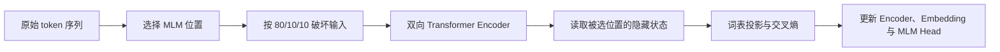

# BERT：用双向 Encoder 预训练文本表示

BERT 是 Encoder-only Transformer。它通过掩码语言建模让每个 token 同时读取左右上下文，再将预训练参数微调到分类、标注、抽取式问答等任务。它的核心产物是上下文化表示，不是自回归生成器。

<LanguageModelObjectiveExplorer initial-mode="mlm" />

::: info 符号与约定
沿用[数学与符号约定](../foundations/math-notation.md)。$x_i$ 是原 token，$\tilde{X}$ 是破坏后的输入，$\mathcal{M}$ 是被选中参与 MLM 损失的位置集合；$z_i$ 是初始输入向量，$h_i$ 是上下文化状态，$H=[h_1,\ldots,h_n]$；$\mathcal{L}_{\text{MLM}}$ 是掩码语言建模损失。
:::

---

## 输入表示

原始 BERT 使用 WordPiece 分词。每个位置的初始向量由三部分相加：

$$
z_i=e_{\text{token},i}+e_{\text{segment},i}+e_{\text{position},i}
$$

- token embedding 表示词片；
- segment embedding 区分句子 A/B；
- learned position embedding 表示绝对位置。

序列以特殊聚合 token 开始，句子边界使用分隔 token。Padding mask 阻止补齐位置参与 Attention。完整输入经过多层双向 Transformer Encoder，得到 $H=[h_1,\ldots,h_n]$。

---

## Masked Language Modeling

若直接让双向 Encoder 预测当前位置原 token，它可以复制输入。BERT 随机选择一部分位置集合 $\mathcal{M}$，破坏其输入并只在这些位置计算恢复损失：

$$
\mathcal{L}_{\text{MLM}}
=
-\sum_{i\in\mathcal{M}}
\log P(x_i\mid \tilde{X})
$$

原始配方选择 15% token，其中 80% 替换为 mask token、10% 替换为随机 token、10% 保持不变。后两种情况减轻预训练只见特殊 mask 的偏差。

双向可见不代表目标位置的答案仍在输入中；被选位置已经被破坏，模型必须利用左右文恢复它。

### 一条 MLM 样本怎样形成

假设分词后的原句为：

```text
[CLS] 他 坐 在 河岸 边 [SEP]
```

若「河岸」被选为预测位置，并落入 80% 的 mask 分支，模型输入与监督为：

| 项目 | 内容 |
| --- | --- |
| 模型输入 | `[CLS] 他 坐 在 [MASK] 边 [SEP]` |
| 参与 MLM 损失的位置 | `[MASK]` 所在位置 |
| 该位置的真实目标 | `河岸` |
| 可利用的上下文 | 左侧「他 坐 在」与右侧「边」 |

Encoder 会为所有位置产生隐藏状态，但 MLM 交叉熵只在被选集合 $\mathcal{M}$ 上计算。没有被选中的「他、坐、在、边」提供上下文，不直接产生 MLM 预测损失。

如果一个 batch 共有 1000 个有效 token，按原始比例期望约选择 150 个预测位置，其中约 120 个替换为 `[MASK]`、15 个换成随机 token、15 个保持原 token。实际数量由随机采样决定，并不要求每个 batch 恰好满足比例。

训练时的完整信息流为：


```mermaid
flowchart LR
	T["原始 token 序列"] --> S["选择 MLM 位置"]
	S --> C["按 80/10/10 破坏输入"]
	C --> E["双向 Transformer Encoder"]
	E --> H["读取被选位置的隐藏状态"]
	H --> V["词表投影与交叉熵"]
	V --> U["更新 Encoder、Embedding 与 MLM Head"]
```

随机替换分支迫使模型判断输入 token 是否与上下文一致；保持不变分支则让部分被监督位置在输入外观上与下游文本一致。无论输入怎样处理，监督目标始终是原 token。

---

## Next Sentence Prediction

原始 BERT 还使用 Next Sentence Prediction（NSP），判断句子 B 是否在语料中紧随句子 A。其目的是提供句间关系信号，但后续工作表明，移除 NSP、调整样本构造与训练更久也能获得更好结果。因此 NSP 是原始训练配方，不是 Encoder-only 预训练的必要定义。

---

## 任务微调

预训练后可在顶部增加小型任务头，并端到端更新参数：

| 任务 | 读取方式 | 输出 |
| --- | --- | --- |
| 文本分类 | 聚合 token 或池化表示 | 类别分布 |
| 序列标注 | 每个 token 的 $h_i$ | 逐位置标签 |
| 抽取式问答 | 每个 $h_i$ | 答案起止位置 |
| 句对分类 | 拼接输入的聚合表示 | 蕴含、相似等标签 |

直接用预训练 BERT 的聚合状态做余弦检索通常不是最优句向量。双编码器检索需要专门的池化与对比目标，见[文本嵌入](../representation/text-embedding.md)。

微调不是先冻结 BERT、只训练任务头的同义词。标准做法通常让任务损失同时更新任务头和预训练主干；在数据很少或资源受限时也可以冻结部分层，但这会改变适配能力。

例如抽取式问答会为每个 token 的 $h_i$ 计算「作为答案起点」和「作为答案终点」的两个分数。训练时真实起止位置提供交叉熵；推理时在满足起点不晚于终点等约束的候选区间中选择联合得分高的答案。BERT 只编码一次输入，不逐 token 生成答案文本。

---

## 推理过程由任务头定义

BERT 推理通常遵循四步：

1. 使用与预训练或微调一致的 tokenizer 构造 token、segment、position 与 padding mask；
2. 整段输入一次通过双向 Encoder，得到所有 $h_i$；
3. 任务头读取聚合位置、逐 token 状态或成对表示；
4. 将 logits 转为类别、标签、答案区间或向量。

分类任务读取一次前向结果即可结束；序列标注同时输出所有 token 标签；句向量模型对 token 状态池化后再归一化；抽取式问答选择输入中的区间。这些接口都不需要 GPT 式的自回归循环和 KV cache。

MLM Head 也可以在推理时填补 mask，但多个 mask 位置默认是基于同一份破坏输入同时预测的。若逐个填入再重新编码，后一个位置会看到前一个预测结果，这是一种额外解码策略，不是 BERT 预训练目标自动规定的生成过程。

---

## BERT 家族沿哪些轴演化

| 路线 | 代表 | 主要改动 |
| --- | --- | --- |
| 训练配方 | RoBERTa | 去除 NSP、更多数据、更长训练与动态 mask |
| 参数共享 | ALBERT | 分解 embedding，跨层共享参数 |
| 预训练目标 | ELECTRA | 判别哪些 token 被生成器替换 |
| 位置与解耦 | DeBERTa | 内容与相对位置分开建模 |
| 句向量 | Sentence-BERT | 双塔与相似度目标 |

这些模型不是沿单一「版本号」递增，而是分别修改数据、目标、参数组织或使用接口。比较时应明确改动轴，不把训练配方收益误写成架构收益。

---

## 使用边界

BERT 适合需要完整输入后再判断的任务。它的双向 Attention 不满足从左到右生成的因果约束，若用于生成需要另接 Decoder 或改变 mask 与训练目标。

主要限制包括：

- 预训练 mask 与无 mask 下游输入存在差异；
- learned absolute position 限制直接扩长；
- 全局 Self-Attention 在长序列上成本高；
- 预训练知识会过时并继承语料偏差；
- MLM 分数和下游任务质量不能简单等同。

---

## 参考文献

- Devlin, J. et al. (2019). *BERT: Pre-training of Deep Bidirectional Transformers for Language Understanding*.
- Liu, Y. et al. (2019). *RoBERTa: A Robustly Optimized BERT Pretraining Approach*.
- Clark, K. et al. (2020). *ELECTRA: Pre-training Text Encoders as Discriminators Rather Than Generators*.
- He, P. et al. (2021). *DeBERTa: Decoding-enhanced BERT with Disentangled Attention*.
