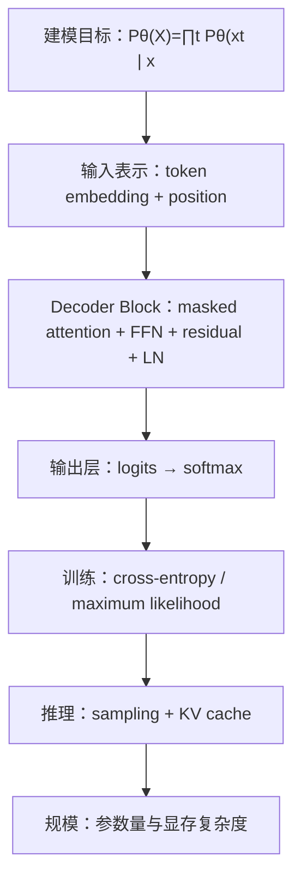

# GPT：基于 Decoder-only Transformer 的自回归语言模型

<TransformerBlockExplorer />

> 相关文献：
> - Radford et al. (2018)：提出 GPT，展示基于 Transformer Decoder 的统一生成式预训练框架。
> - Radford et al. (2019)：提出 GPT-2，证明更大规模语言模型具有更强的零样本生成能力。
> - Brown et al. (2020)：提出 GPT-3，系统展示大模型的上下文学习与少样本泛化现象。
> - Ouyang et al. (2022)：提出 InstructGPT，展示指令微调与人类反馈优化对对话能力的提升。

GPT 的数学本质，不是“会聊天”，而是学习一个离散序列上的条件概率族。给定 token 序列

$$
X=(x_1,x_2,\dots,x_T)
$$

GPT 试图逼近的目标是

$$
P_\theta(X)=\prod_{t=1}^{T}P_\theta(x_t\mid x_{<t})
$$

也就是说，它把“生成一段文本”分解为一连串更小的问题：在只看见左侧前缀的条件下，下一个 token 的概率分布是什么。整个 Decoder-only Transformer 的所有矩阵运算，最终都服务于这个目标。

为统一叙述，本文主要采用现代 GPT 类模型中更常见的 **pre-LN** 写法展开，同时用最标准的 **masked self-attention + FFN + residual + LayerNorm** 骨架组织内容。原始 GPT、GPT-2 / GPT-3 与后续 LLaMA 类模型在位置编码、激活函数、是否共享输出层权重等实现上并不完全相同，但共享同一条数学主线。

---

## 0. 路线图与符号约定

若把整篇文档压缩成一条主线，那么 GPT 的内部逻辑可以概括为：

1. 把文本离散化为 token 序列。
2. 把 token 映射到向量空间，并注入位置信息。
3. 用带因果掩码的 Decoder block 逐层构造前缀的上下文化表示。
4. 把最后隐藏状态投影到词表，得到下一个 token 的概率分布。
5. 用最大似然训练，在推理时自回归地逐 token 解码。

下图给出全文的阅读路线：



本文统一使用如下记号：

| 符号 | 含义 |
| --- | --- |
| $X=(x_1,\dots,x_T)$ | 一个 token 序列 |
| $x_{<t}$ | 位置 $t$ 之前的前缀 |
| $|V|$ | 词表大小 |
| $u_t\in\mathbb{R}^{|V|}$ | 位置 $t$ 的 one-hot token 向量 |
| $U\in\mathbb{R}^{T\times |V|}$ | 序列的 one-hot 矩阵表示 |
| $d_{\mathrm{model}}$ | 模型隐藏维度 |
| $d_k,d_v$ | 单头 attention 中 key / value 的维度 |
| $h$ | 注意力头数 |
| $L$ | Transformer block 层数 |
| $E\in\mathbb{R}^{|V|\times d_{\mathrm{model}}}$ | token embedding 矩阵 |
| $W_P\in\mathbb{R}^{T_{\max}\times d_{\mathrm{model}}}$ | 位置参数矩阵 |
| $P\in\mathbb{R}^{T\times d_{\mathrm{model}}}$ | 当前序列对应的位置矩阵 |
| $H^{(\ell)}\in\mathbb{R}^{T\times d_{\mathrm{model}}}$ | 第 $\ell$ 层输出矩阵 |
| $Q,K,V$ | query、key、value 矩阵 |
| $M\in\mathbb{R}^{T\times T}$ | 因果掩码矩阵 |
| $A$ | attention 权重矩阵 |
| $W_{\mathrm{out}}\in\mathbb{R}^{d_{\mathrm{model}}\times |V|}$ | 输出投影矩阵 |
| $o_t\in\mathbb{R}^{|V|}$ | 位置 $t$ 的词表 logits |
| $p_\theta(\cdot\mid x_{<t})$ | 模型输出的条件概率分布 |
| $\mathcal{L}_{\mathrm{LM}}$ | 语言模型损失 |
| $\theta$ | 全部可训练参数 |

本文会反复用到以下核心公式：

1. 自回归分解：
$$
P_\theta(X)=\prod_{t=1}^{T}P_\theta(x_t\mid x_{<t})
$$

2. 输入表示：
$$
H^{(0)}=UE+P
$$

3. 单头 masked attention：
$$
\mathrm{Attn}(Q,K,V)=\mathrm{softmax}\left(\frac{QK^\top}{\sqrt{d_k}}+M\right)V
$$

4. 多头注意力：
$$
\mathrm{MHA}(X)=\mathrm{Concat}(\mathrm{head}_1,\dots,\mathrm{head}_h)W^O
$$

5. 前馈网络：
$$
\mathrm{FFN}(x)=W_2\phi(W_1x+b_1)+b_2
$$

6. 现代常见的 pre-LN block：
$$
U^{(\ell)}=H^{(\ell-1)}+\mathrm{MHA}(\mathrm{LN}(H^{(\ell-1)}))
$$

$$
H^{(\ell)}=U^{(\ell)}+\mathrm{FFN}(\mathrm{LN}(U^{(\ell)}))
$$

7. 输出层：
$$
O=H^{(L)}W_{\mathrm{out}}
$$

8. 语言模型损失：
$$
\mathcal{L}_{\mathrm{LM}}=-\sum_{t=1}^{T}\log P_\theta(x_t\mid x_{<t})
$$

---

## 1. 建模目标：GPT 学的到底是什么

### 1.1 从联合分布到条件分布

GPT 的出发点是概率论中的链式法则。对任意离散序列分布，都有：

$$
P(X)=P(x_1)P(x_2\mid x_1)\cdots P(x_T\mid x_{<T})
$$

也就是：

$$
P(X)=\prod_{t=1}^{T}P(x_t\mid x_{<t})
$$

这一步本身没有任何神经网络成分，它只是把整体生成问题拆成一串局部条件分布。真正困难的地方在于，这些条件分布无法靠显式计数表存下，于是需要用共享参数的函数逼近器来近似：

$$
f_\theta:x_{<t}\mapsto P_\theta(\cdot\mid x_{<t})
$$

这里输入是前缀，输出是整个词表上的概率分布。GPT 所做的事，就是把这个函数实现成一个深层的 Decoder-only Transformer。

### 1.2 为什么训练目标是最大似然

给定训练语料

$$
\mathcal{D}=\{X^{(1)},\dots,X^{(N)}\}
$$

最大似然目标为：

$$
\max_\theta \sum_{n=1}^{N}\log P_\theta(X^{(n)})
$$

代入自回归分解后得到：

$$
\max_\theta \sum_{n=1}^{N}\sum_{t=1}^{T_n}\log P_\theta(x_t^{(n)}\mid x_{<t}^{(n)})
$$

等价地，也可以写成最小化负对数似然：

$$
\mathcal{L}_{\mathrm{NLL}}(\theta)
=-\sum_{n=1}^{N}\sum_{t=1}^{T_n}\log P_\theta(x_t^{(n)}\mid x_{<t}^{(n)})
$$

这就是语言模型训练里的 cross-entropy loss。由于真实标签是 one-hot 分布，交叉熵与负对数似然在这里完全等价。

### 1.3 为什么训练样本会“整体右移一位”

若原始序列为：

$$
[x_1,x_2,\dots,x_T]
$$

则训练时常构造成：

- 输入：$[\text{BOS},x_1,x_2,\dots,x_{T-1}]$
- 目标：$[x_1,x_2,\dots,x_T]$

因此，模型在位置 $t$ 接收到的是左侧前缀，而监督信号是当前位置应预测的真实 token。这就是 **teacher forcing**：训练时前缀来自真实数据，而不是模型自己刚采样出来的输出。

### 1.4 困惑度只是平均负对数似然的指数化

若平均每个 token 的负对数似然为：

$$
\bar{\mathcal{L}}=\frac{1}{T}\mathcal{L}_{\mathrm{LM}}
$$

则困惑度定义为：

$$
\mathrm{PPL}=\exp(\bar{\mathcal{L}})
$$

PPL 越低，说明模型在平均意义下把概率质量压得越集中，对真实下一个 token 的预测越好。

---

## 2. 前向传播第一步：从离散 token 到输入矩阵

### 2.1 Tokenization 决定了模型实际处理的离散对象

GPT 并不直接处理“词”或“句子”的抽象意义，而是处理 tokenizer 产生的离散 token。若 tokenizer 把文本映射成 id 序列：

$$
(i_1,i_2,\dots,i_T),\qquad i_t\in\{1,2,\dots,|V|\}
$$

则每个 token 都可以写成 one-hot 向量 $u_t$。将整段序列按行堆叠，就得到：

$$
U\in\mathbb{R}^{T\times |V|}
$$

### 2.2 Token embedding 是 one-hot 与矩阵的乘法

设 token embedding 矩阵为：

$$
E\in\mathbb{R}^{|V|\times d_{\mathrm{model}}}
$$

则第 $t$ 个 token 的 embedding 写为：

$$
e_t=u_tE
$$

整段序列的 embedding 矩阵写为：

$$
H_{\mathrm{token}}=UE\in\mathbb{R}^{T\times d_{\mathrm{model}}}
$$

这与工程实现中的“查表”完全等价。因为 one-hot 向量只有一维为 1，所以矩阵乘法的结果，本质上就是从 $E$ 中选出对应那一行。

若词表大小为

$$
|V|=50257
$$

隐藏维度为

$$
d_{\mathrm{model}}=768
$$

则：

$$
E\in\mathbb{R}^{50257\times 768}
$$

这就是常说的 `50257 × 768`。它表示词表中每个离散 token 都对应一个 768 维稠密向量。

### 2.3 位置编码用来打破 attention 的顺序对称性

如果只有 token embedding，而没有任何位置信号，那么 self-attention 只知道“有哪些 token”，却不知道“谁在前谁在后”。因此必须把位置信息显式写入输入表示。

若采用原始 GPT 中常见的**可学习绝对位置向量**，设位置参数矩阵为：

$$
W_P\in\mathbb{R}^{T_{\max}\times d_{\mathrm{model}}}
$$

对于长度为 $T$ 的序列，取出前 $T$ 行组成位置矩阵：

$$
P\in\mathbb{R}^{T\times d_{\mathrm{model}}}
$$

于是初始输入表示为：

$$
H^{(0)}=UE+P
$$

逐位置写开就是：

$$
h_t^{(0)}=u_tE+W_P[t]
$$

这对应于“token 语义向量 + 位置向量”的逐元素相加。

对于原始 GPT，这种可学习位置向量是常见写法。对于后续一些模型，位置机制也可能变成正余弦位置编码或 RoPE，但它们改变的是“位置信息如何注入”，而不是 GPT 的自回归建模本质。

### 2.4 词嵌入与输出层常常共享权重

若输出投影矩阵写为：

$$
W_{\mathrm{out}}\in\mathbb{R}^{d_{\mathrm{model}}\times |V|}
$$

则一个常见技巧是 **weight tying**：

$$
W_{\mathrm{out}}=E^\top
$$

这样做既能减少参数量，也让“输入空间”和“输出词表空间”在几何上保持更紧密的联系。

---

## 3. Decoder Block：GPT 的核心计算单元

GPT 的主干是一串只含解码器的 Transformer block。若采用现代 GPT 类模型中更常见的 pre-LN 写法，则第 $\ell$ 层可写为：

$$
U^{(\ell)}=H^{(\ell-1)}+\mathrm{MHA}(\mathrm{LN}(H^{(\ell-1)}))
$$

$$
H^{(\ell)}=U^{(\ell)}+\mathrm{FFN}(\mathrm{LN}(U^{(\ell)}))
$$

这说明每一层都在做两件事：

- 通过 masked self-attention 让每个位置从可见前缀中读取相关信息。
- 通过 FFN 对每个位置做共享参数的非线性重写。

从数据流角度看，attention 的矩阵主线可以先用下图建立整体理解：

<AttentionMathFlow />

### 3.1 单头 masked self-attention

设某一层输入为

$$
X\in\mathbb{R}^{T\times d_{\mathrm{model}}}
$$

先做三组线性投影：

$$
Q=XW^Q,\qquad K=XW^K,\qquad V=XW^V
$$

其中：

$$
W^Q,W^K\in\mathbb{R}^{d_{\mathrm{model}}\times d_k},\qquad
W^V\in\mathbb{R}^{d_{\mathrm{model}}\times d_v}
$$

因此：

$$
Q\in\mathbb{R}^{T\times d_k},\qquad
K\in\mathbb{R}^{T\times d_k},\qquad
V\in\mathbb{R}^{T\times d_v}
$$

然后构造打分矩阵：

$$
S=\frac{QK^\top}{\sqrt{d_k}}+M
$$

这里：

$$
QK^\top\in\mathbb{R}^{T\times T}
$$

其中每个元素 $S_{ij}$ 表示“位置 $i$ 对位置 $j$ 的注意力打分”。

再对每一行做 softmax：

$$
A_{ij}=\frac{\exp(S_{ij})}{\sum_{m=1}^{T}\exp(S_{im})}
$$

最终输出为：

$$
O=AV
$$

第 $i$ 行输出 $o_i$ 就是所有 value 向量的加权和。

### 3.2 为什么要除以 $\sqrt{d_k}$

若 $q_i$ 和 $k_j$ 的各分量独立、均值为 0、方差为 1，则点积

$$
q_i^\top k_j=\sum_{m=1}^{d_k}q_{i,m}k_{j,m}
$$

的方差大致与 $d_k$ 成正比：

$$
\mathrm{Var}(q_i^\top k_j)\approx d_k
$$

当 $d_k$ 较大时，未经缩放的打分很容易让 softmax 进入饱和区，使梯度过小、训练不稳定。除以 $\sqrt{d_k}$ 的作用，就是把 logits 的尺度压回更可控的范围内。

### 3.3 因果掩码把“不能偷看未来”写进结构

GPT 不是双向编码器，而是严格的自回归模型。因此在预测位置 $i$ 时，只允许它访问位置 $1$ 到 $i$，不能访问未来 token。

这通过因果掩码矩阵实现：

$$
M_{ij}=
\begin{cases}
0, & j\le i \\
-\infty, & j>i
\end{cases}
$$

于是 softmax 中未来位置会被压成 0：

$$
e^{-\infty}=0
$$

在实际代码里，$-\infty$ 常用极小负数近似，例如 $-10^9$，但数学含义不变。

下面这个交互组件可以直观看到 mask 如何改变可见范围：

<MaskPositionExplorer />

### 3.4 多头注意力不是简单重复，而是子空间分工

单头 attention 的表达能力有限，因此 GPT 通常使用多头注意力。对第 $r$ 个头：

$$
\mathrm{head}_r=
\mathrm{Attn}(XW_r^Q,XW_r^K,XW_r^V)
$$

再把所有头拼接后投影回模型维度：

$$
\mathrm{MHA}(X)=\mathrm{Concat}(\mathrm{head}_1,\dots,\mathrm{head}_h)W^O
$$

多头的意义不在于“把同一个运算重复很多遍”，而在于让不同头在不同线性子空间中学习不同类型的相关性。例如：

- 有的头更偏向近邻语法依赖。
- 有的头更偏向长距离指代。
- 有的头更偏向分隔符、列表结构或代码括号配对。

### 3.5 FFN 负责逐位置的非线性重写

Attention 负责跨位置的信息交互，但每个 token 还需要在本地做通道混合与非线性变换。最基础的前馈网络写为：

$$
\mathrm{FFN}(x)=W_2\phi(W_1x+b_1)+b_2
$$

其中：

$$
W_1\in\mathbb{R}^{d_{\mathrm{model}}\times d_{\mathrm{ff}}},\qquad
W_2\in\mathbb{R}^{d_{\mathrm{ff}}\times d_{\mathrm{model}}}
$$

它对每个位置独立作用，但参数在所有位置共享。

若写成早期 GPT 中常见的形式，则常见表达为：

$$
\mathrm{FFN}(x)=\mathrm{GELU}(xW_1+b_1)W_2+b_2
$$

其中 GELU 的精确定义为：

$$
\mathrm{GELU}(x)=x\Phi(x)
$$

这里 $\Phi(x)$ 是标准正态分布的累积分布函数。它可以理解为一种平滑的、带概率意味的门控。

一些现代大模型则常把 FFN 换成门控 MLP，例如 SwiGLU：

$$
\mathrm{SwiGLU}(x)=\bigl((xW_a)\odot \mathrm{swish}(xW_b)\bigr)W_c
$$

具体非线性形式可以变化，但 FFN 在 GPT 中的角色很稳定：**在 attention 聚合之后，对每个位置做更强的局部特征重组。**

### 3.6 残差连接与 LayerNorm 让深层网络可训练

LayerNorm 的标准写法为：

$$
\mathrm{LN}(h)=\gamma\odot \frac{h-\mu}{\sqrt{\sigma^2+\epsilon}}+\beta
$$

其中 $\mu,\sigma^2$ 是在特征维上计算的均值与方差，$\gamma,\beta$ 是可学习参数。

残差连接写为：

$$
y=x+F(x)
$$

它在反向传播中的关键意义是：根据链式法则，

$$
\frac{\partial y}{\partial x}=I+\frac{\partial F(x)}{\partial x}
$$

这意味着梯度除了沿复杂非线性支路传播，还额外拥有一条恒等映射路径。

若完全去掉残差连接，在几十层甚至近百层网络中，反向传播需要连续乘上很多层 Jacobian：

$$
\frac{\partial \mathcal{L}}{\partial x^{(1)}}
=
\frac{\partial \mathcal{L}}{\partial x^{(L)}}
\left(\prod_{\ell=2}^{L}\frac{\partial x^{(\ell)}}{\partial x^{(\ell-1)}}\right)
$$

当这些导数矩阵的谱范数长期小于 1 时，梯度会迅速衰减；长期大于 1 时，又可能爆炸。因此，超深层网络最典型的风险就是**梯度消失**与**梯度爆炸**。残差连接并不能从数学上保证梯度永不衰减，但它显著改善了深层训练的可行性。

如果用很多教材中更常见的 **Add & Norm** 写法来表示，则子层也常写成：

$$
\mathrm{Output}=\mathrm{LN}(x+\mathrm{Sublayer}(x))
$$

这对应 **post-LN**。而现代大模型实现里更常见的是 **pre-LN**：

$$
\mathrm{Output}=x+\mathrm{Sublayer}(\mathrm{LN}(x))
$$

二者共享同一个残差骨架，只是 LayerNorm 放在子层前还是子层后的差别。pre-LN 在深层训练中通常更稳定，因此现代 GPT 中更常见。

---

## 4. 从隐藏状态到词表概率

经过 $L$ 层 block 后，得到最终隐藏状态矩阵：

$$
H^{(L)}\in\mathbb{R}^{T\times d_{\mathrm{model}}}
$$

输出层把它映射回词表空间：

$$
O=H^{(L)}W_{\mathrm{out}}
$$

其中：

$$
W_{\mathrm{out}}\in\mathbb{R}^{d_{\mathrm{model}}\times |V|},\qquad
O\in\mathbb{R}^{T\times |V|}
$$

逐位置写开就是：

$$
o_t=h_t^{(L)}W_{\mathrm{out}}+b
$$

再经过 softmax，就得到下一个 token 的概率分布：

$$
P_\theta(x_t=v\mid x_{<t})
=\frac{\exp(o_{t,v})}{\sum_{u\in V}\exp(o_{t,u})}
$$

这说明 GPT 并不是“直接输出一个词”，而是先输出一个 $|V|$ 维实数向量，再把它解释为词表上的离散概率分布。

### 4.1 输出矩阵的形状如何确定

若最后一层隐藏状态矩阵为：

$$
H_{\mathrm{final}}\in\mathbb{R}^{n\times 768}
$$

而词表大小为：

$$
|V|=50257
$$

那么为了得到每个位置对 50257 个词的得分，输出矩阵必须满足：

$$
H_{\mathrm{final}}W_{\mathrm{out}}\in\mathbb{R}^{n\times 50257}
$$

因此：

$$
W_{\mathrm{out}}\in\mathbb{R}^{768\times 50257}
$$

这就是常说的 `768 × 50257`。

若使用前文提到的 weight tying，则：

$$
W_{\mathrm{out}}=E^\top
$$

因为

$$
E\in\mathbb{R}^{50257\times 768}
$$

所以它的转置恰好满足输出层所需形状。

### 4.2 交叉熵损失与梯度

若真实标签在位置 $t$ 上对应 one-hot 向量 $y_t$，模型预测为

$$
\hat{y}_t=\mathrm{softmax}(o_t)
$$

则位置级交叉熵损失为：

$$
\mathcal{L}_t=-\sum_{j=1}^{|V|}y_{t,j}\log \hat{y}_{t,j}
$$

因为 $y_t$ 是 one-hot，上式等价于：

$$
\mathcal{L}_t=-\log \hat{y}_{t,x_t}
$$

整段序列损失就是：

$$
\mathcal{L}_{\mathrm{LM}}=\sum_{t=1}^{T}\mathcal{L}_t
$$

softmax 与交叉熵组合后，最经典的梯度结果是：

$$
\frac{\partial \mathcal{L}_t}{\partial o_t}=\hat{y}_t-y_t
$$

这意味着：

- 若某个错误 token 的预测概率过高，则对应梯度为正，优化会压低它。
- 若真实 token 的预测概率不够高，则对应梯度为负，优化会抬高它。

随后，这个梯度会沿着输出层、FFN、残差连接、LayerNorm、attention 以及 embedding 一路反向传播，更新整套参数 $\theta$。

### 4.3 一个最小推演：从前缀到下一个 token

考虑前缀：

$$
[\text{我},\ \text{喜欢},\ \text{吃}]
$$

假设最后位置某一注意力头的未掩码原始打分为：

$$
[0.8,\ 1.6,\ 1.1,\ 2.3]
$$

其中第 4 个位置代表未来 token，因此被因果掩码改写为：

$$
[0.8,\ 1.6,\ 1.1,\ -\infty]
$$

softmax 后可得到近似权重：

$$
[0.22,\ 0.49,\ 0.29,\ 0]
$$

若前三个可见位置的 value 向量分别为 $v_1,v_2,v_3$，则该头输出为：

$$
o=0.22v_1+0.49v_2+0.29v_3
$$

多头拼接、输出投影、FFN 和后续层继续处理后，最后得到当前位置隐藏状态。假设输出层在候选 token $\{\text{苹果},\text{面条},\text{米饭}\}$ 上给出的 logits 为：

$$
[2.4,\ 1.2,\ 0.3]
$$

则 softmax 概率近似为：

$$
[0.70,\ 0.21,\ 0.09]
$$

于是模型更倾向于输出「苹果」。这个例子体现了 GPT 的真实工作方式：它不是靠规则模板生成，而是在连续向量空间里用一连串矩阵运算逼近条件概率分布。

---

## 5. 训练闭环：误差如何传回整张网络

### 5.1 小批量训练的矩阵形式

若一个 mini-batch 中共有 $B$ 条序列，每条长度补齐到 $T$，则输入张量可记为：

$$
X\in\mathbb{N}^{B\times T}
$$

训练时通常还需要 padding mask，使补齐位置不参与损失。于是批量损失常写为：

$$
\mathcal{L}
=-\sum_{b=1}^{B}\sum_{t=1}^{T}m_{b,t}\log P_\theta(x_{b,t}\mid x_{b,<t})
$$

其中 $m_{b,t}\in\{0,1\}$ 指示该位置是否为有效 token。

### 5.2 参数在所有位置共享更新

GPT 的一个关键特点是：同一个 $W^Q,W^K,W^V,W_1,W_2$ 会同时服务于不同句子、不同位置、不同语境。因此单个 batch 中各位置产生的误差信号，会共同更新同一套参数。

从优化角度看，训练本质上就是：

$$
\theta\leftarrow \theta-\eta \nabla_\theta \mathcal{L}
$$

实践中常用 AdamW 这一类优化器，但它们只是更新规则的具体实现；真正定义 GPT 学什么的，仍然是自回归似然目标。

### 5.3 训练与推理并不完全一致

训练时，模型看到的历史前缀来自真实数据；推理时，模型必须把自己刚刚生成的 token 再喂回去。因此二者之间存在典型的 **exposure bias**：

- 训练时前缀总是正确的。
- 推理时一旦早期生成错误，后续条件分布也会随之偏移。

这也是为什么现代系统除了预训练，往往还会结合指令微调、偏好优化、拒答策略与外部工具，以减轻长链生成中的误差累积。

---

## 6. 推理与解码：模型如何真正“选”出下一个词

推理时，GPT 并不是一次性输出整句，而是不断重复以下过程：

1. 读入当前前缀。
2. 计算最后位置的词表分布。
3. 按某种解码策略选出一个 token。
4. 把该 token 接到前缀末尾。
5. 继续下一轮。

用《算法导论》风格伪代码，可写为：

```text
AUTOREGRESSIVE-GENERATE(prefix, T_max)
    X ← prefix
    for t ← 1 to T_max do
        logits ← GPT(X)
        p ← softmax(logits[last])
        x_new ← SAMPLE(p)
        X ← CONCAT(X, x_new)
        if x_new = EOS then
            return X
        end if
    end for
    return X
```

### 6.1 贪心、温度、Top-k 与 Top-p

若直接选择最大概率 token，就是贪心解码：

$$
\hat{x}_t=\arg\max_{v\in V}P_\theta(v\mid x_{<t})
$$

这种做法每一步都取局部最优，但生成结果往往更容易出现：

- 表达过于机械。
- 候选多样性迅速塌缩。
- 高频短语被不断重复，从而形成循环。

为了保留随机性，可先用温度参数 $\tau$ 调整分布尖锐程度：

$$
P_\tau(i)=\frac{\exp(o_i/\tau)}{\sum_j\exp(o_j/\tau)}
$$

其中：

- $\tau=1$ 时，为原始 softmax。
- $\tau\to 0^+$ 时，分布逼近 one-hot，行为近似贪心。
- $\tau>1$ 时，分布更平滑，低概率 token 更容易进入候选集合。

在此基础上，常见的截断采样包括：

- **Top-k**：只保留概率最高的前 $k$ 个 token。
- **Top-p**：保留累计概率达到阈值 $p$ 的最小候选集合。

若把 Top-k 写成数学形式，设保留集合为 $V_k$，则：

$$
P_k(i)=
\begin{cases}
\dfrac{P(i)}{\sum_{j\in V_k}P(j)}, & i\in V_k \\
0, & i\notin V_k
\end{cases}
$$

Top-p 则构造最小集合 $V_p$，满足：

$$
\sum_{j\in V_p}P(j)\ge p
$$

然后重新归一化：

$$
P_p(i)=
\begin{cases}
\dfrac{P(i)}{\sum_{j\in V_p}P(j)}, & i\in V_p \\
0, & i\notin V_p
\end{cases}
$$

因此：

- Top-k 是“固定候选数”的硬截断。
- Top-p 是“固定累计质量”的动态截断。

它们通常与温度一起使用：先用温度改变分布形状，再做截断采样，以在确定性与多样性之间折中。

若任务要求输出尽可能保守、稳定，例如高风险领域中的结构化草稿，通常会把温度设得较低，使分布更尖锐。但要强调：**较低温度只能减少随机性，不能从数学上保证事实正确或消除幻觉**，因为它仍然只是在既有模型分布中选择更高概率的 token，而不是在外部世界中做事实验证。

### 6.2 KV Cache 为什么能显著提速

若每一步都从头重算整个前缀，代价会非常高。设第 $\ell$ 层当前步新产生的 query、key、value 为：

$$
q_t^{(\ell)},\quad k_t^{(\ell)},\quad v_t^{(\ell)}
$$

KV cache 的做法是保存历史：

$$
K_{\mathrm{cache}}^{(\ell)}\leftarrow
\mathrm{Concat}(K_{\mathrm{cache}}^{(\ell)},k_t^{(\ell)})
$$

$$
V_{\mathrm{cache}}^{(\ell)}\leftarrow
\mathrm{Concat}(V_{\mathrm{cache}}^{(\ell)},v_t^{(\ell)})
$$

它之所以成立，是因为在因果掩码下，历史位置的 $K,V$ 只依赖它们各自左侧的前缀，不依赖未来 token。因此当序列从长度 $t$ 扩展到 $t+1$ 时，前 $t$ 个位置已经算出的 $K,V$ 数值不会因为新 token 的加入而改变。

若记历史缓存为：

$$
K_{\mathrm{past}}^{(\ell)}\in\mathbb{R}^{t\times d_k},\qquad
V_{\mathrm{past}}^{(\ell)}\in\mathbb{R}^{t\times d_v}
$$

则新 token 到来后有：

$$
K_{\mathrm{total}}^{(\ell)}=
\bigl[K_{\mathrm{past}}^{(\ell)};\ k_{t+1}^{(\ell)}\bigr]
\in\mathbb{R}^{(t+1)\times d_k}
$$

$$
V_{\mathrm{total}}^{(\ell)}=
\bigl[V_{\mathrm{past}}^{(\ell)};\ v_{t+1}^{(\ell)}\bigr]
\in\mathbb{R}^{(t+1)\times d_v}
$$

当前步真正要做的 attention 计算则变成：

$$
\mathrm{Attn}\bigl(q_{t+1}^{(\ell)},K_{\mathrm{total}}^{(\ell)},V_{\mathrm{total}}^{(\ell)}\bigr)
=
\mathrm{softmax}\left(
\frac{q_{t+1}^{(\ell)}(K_{\mathrm{total}}^{(\ell)})^\top}{\sqrt{d_k}}
\right)V_{\mathrm{total}}^{(\ell)}
$$

这里的 query 只对应当前一个新位置，因此分数向量的形状是：

$$
q_{t+1}^{(\ell)}(K_{\mathrm{total}}^{(\ell)})^\top\in\mathbb{R}^{1\times (t+1)}
$$

它不再是训练阶段那种完整的 $(t+1)\times (t+1)$ 打分矩阵。

若完全不使用 KV cache，生成第 $1$ 到第 $T$ 个 token 的累计 attention 代价近似为：

$$
\sum_{t=1}^{T}\mathcal{O}(t^2d)=\mathcal{O}(T^3d)
$$

而使用 KV cache 后，累计代价近似降为：

$$
\sum_{t=1}^{T}\mathcal{O}(td)=\mathcal{O}(T^2d)
$$

因此，KV cache 的核心收益不是改变模型条件分布，而是把解码中的大量重复前缀计算消掉。

### 6.3 KV Cache 的显存为什么是 $\mathcal{O}(L)$

KV cache 提升了解码速度，但它不是免费的。缓存中的 $K,V$ 张量必须真实存放在显存里，因此长上下文与高并发推理时，KV cache 往往会成为部署瓶颈。

若单层、单序列、单头的 cache 长度为 $L$，则：

$$
K\in\mathbb{R}^{L\times d_k},\qquad
V\in\mathbb{R}^{L\times d_v}
$$

这一头需要存储的标量数就是：

$$
L(d_k+d_v)
$$

若对整个模型计数，设 batch 大小为 $B$，层数为 $N_{\mathrm{layer}}$，头数为 $h$，并取常见情形 $d_k=d_v=d_{\mathrm{model}}/h$，则 KV cache 的总标量数近似为：

$$
B\cdot N_{\mathrm{layer}}\cdot h\cdot L\cdot (d_k+d_v)
=
2B\,N_{\mathrm{layer}}\,L\,d_{\mathrm{model}}
$$

因此，**KV cache 的存储量随序列长度 $L$ 线性增长，即 $\mathcal{O}(L)$**，而不是平方级增长。

需要与之区分的是训练时常见的 attention 权重矩阵：

$$
A\in\mathbb{R}^{L\times L}
$$

它才是典型的 $\mathcal{O}(L^2)$ 内存项。也就是说：

- KV cache 存储的是历史 token 的表示，规模是线性的。
- attention 权重矩阵描述的是位置两两关系，规模是平方级的。

虽然 KV cache 只是线性增长，但常数项很大，因为它还要乘上 batch、层数、隐藏维度以及数据类型字节数。因此在数万到数十万 token 上下文、或高并发服务场景中，它依然会迅速吃满显存。

### 6.4 长上下文的瓶颈仍然来自 attention

设序列长度为 $T$，隐藏维度量级记为 $d$。训练时，每层 self-attention 的主要时间复杂度约为：

$$
\mathcal{O}(T^2d)
$$

因为要形成 $T\times T$ 的相关性矩阵。对应的训练期 attention 权重显存也会随 $T^2$ 增长。

这解释了两个事实：

- GPT 很适合利用并行硬件做训练，因为整段序列可并行前向。
- 但长上下文会让计算和显存迅速上涨，因此上下文窗口不是“想加多大就加多大”。

---

## 7. 参数量估算：175B 从哪里来

GPT 的参数量，本质上就是所有可训练矩阵中标量元素的总数。若忽略 bias 和 LayerNorm 中相对微小的参数，则一个标准 dense GPT block 的主导参数来自两部分：

- multi-head attention 的线性投影矩阵。
- FFN 的升维与降维矩阵。

### 7.1 单层 attention 的参数量

设隐藏维度为 $d$。若输入和输出维度都保持为 $d$，则 attention 中四个核心投影矩阵为：

$$
W_Q,W_K,W_V,W_O\in\mathbb{R}^{d\times d}
$$

每个矩阵都有 $d^2$ 个参数，因此 attention 部分总参数量约为：

$$
4d^2
$$

以 GPT-3 级别的隐藏维度

$$
d=12288
$$

为例，单独一个 $W_Q$ 的形状就是：

$$
12288\times 12288
$$

它包含的参数数目为：

$$
12288^2=150{,}994{,}944
$$

约为 1.51 亿个参数。

### 7.2 单层 FFN 的参数量

在标准 GPT 结构中，FFN 常把通道宽度扩展到 $4d$，再压回 $d$。因此：

$$
W_1\in\mathbb{R}^{d\times 4d},\qquad
W_2\in\mathbb{R}^{4d\times d}
$$

它们的参数量分别为：

$$
4d^2,\qquad 4d^2
$$

所以 FFN 部分总共约为：

$$
8d^2
$$

### 7.3 单个 Transformer block 的主导参数公式

把 attention 与 FFN 相加，就得到一个标准 dense GPT block 的主导参数量：

$$
\mathrm{Params}_{\mathrm{layer}}
=4d^2+8d^2
=12d^2
$$

代入 $d=12288$：

$$
12\times 12288^2
=1{,}811{,}939{,}328
$$

约为：

$$
1.81\times 10^9
$$

也就是单层约 18.1 亿参数。

### 7.4 从单层堆到 GPT-3 级别

若堆叠 96 层，则主干 Transformer 的参数量近似为：

$$
96\times 1.811939328\times 10^9
=1.73946175488\times 10^{11}
$$

约为：

$$
173.95\text{B}
$$

这已经非常接近“175B”这个量级。

### 7.5 词嵌入、输出层与其余参数

若词表大小取：

$$
|V|=50257
$$

则输入 embedding 矩阵的参数量为：

$$
|V|d=50257\times 12288=617{,}558{,}016
$$

约为：

$$
0.618\text{B}
$$

若输出层不与 embedding 共享权重，则还要再加一份同规模矩阵：

$$
W_{\mathrm{out}}\in\mathbb{R}^{12288\times 50257}
$$

再增加约 $0.618\text{B}$ 参数。位置嵌入、LayerNorm、bias 等参数也会贡献少量增量，但相对于百亿级主干权重来说都不是主导项。

因此，“GPT-3 是 175B 参数”可以理解为：

- 绝大多数参数来自 96 层 block 中的 $12d^2$ 主项。
- embedding 和输出层再补上数亿量级。
- 在不同是否共享权重、是否计入某些小项的口径下，都会落在约 175B 的同一数量级上。

这也解释了一个常被忽视的事实：大模型的参数量主要不是来自词表，而是来自**层内 dense 线性变换的重复堆叠**。

---

## 8. GPT 为什么有效，以及它的边界在哪里

GPT 的有效性，主要来自以下几条机制层面的叠加：

- **统一目标函数**：所有位置都用同一个下一 token 预测目标训练，监督信号密集且稳定。
- **全局前缀可见性**：在因果约束下，每个位置都能直接连接到任意历史位置，不再需要像 RNN 那样沿时间链条逐步传播信息。
- **参数共享**：同一套变换在海量上下文中反复使用，统计规律可以不断累积。
- **规模扩展性**：Decoder-only 结构相对简单，便于扩大参数量、数据量和上下文长度。

但它也有清晰边界：

- **训练目标不等于事实约束**：最大化文本似然会让模型更擅长生成“像真的话”，却不保证内容真实。
- **训练与推理存在分布偏移**：teacher forcing 与自回归采样之间有天然鸿沟。
- **长上下文成本高**：标准 attention 的二次复杂度始终存在。
- **上下文窗口有限**：若窗口长度为 $W$，则模型实际近似的是

$$
P_\theta(x_t\mid x_{t-W},\dots,x_{t-1})
$$

而不是无限历史上的真正条件分布。

因此，GPT 很强，但它不是“显式知识库”或“逻辑证明器”的直接替代。很多现代系统会把 GPT 与检索、工具调用、外部记忆、程序执行器结合起来，正是为了补这些边界。

---

## 9. 与 BERT、Encoder-Decoder 路线的区别

GPT、BERT 和 T5 / BART 一类模型都建立在 Transformer 上，但它们优化的概率对象并不相同。

| 模型路线 | 结构 | 训练目标 | 可见性 | 更擅长什么 |
| --- | --- | --- | --- | --- |
| GPT | Decoder-only | 自回归下一 token 预测 | 只能看左侧前缀 | 续写、对话、代码生成 |
| BERT | Encoder-only | MLM 等掩码重建目标 | 双向可见 | 表示学习、判别理解任务 |
| T5 / BART | Encoder-Decoder | 条件生成 | 编码器双向，解码器单向 | 翻译、摘要、条件生成 |

从数学上说：

- GPT 学的是 $P(x_t\mid x_{<t})$。
- BERT 更接近学习“给定被遮蔽上下文，恢复缺失 token”的条件分布。
- Encoder-Decoder 模型则学习 $P(y_t\mid y_{<t},x)$ 这类带显式输入条件的生成分布。

因此，GPT 的关键辨识度不在于它“用了 Transformer”，而在于它选择了 **Decoder-only 结构与纯自回归目标** 这条路线。

---

## 总结

GPT 的内部数学链条，可以压缩成 5 步：

1. 把离散 token 映射到 embedding 空间，并加入位置信息。
2. 用带因果掩码的 self-attention 在前缀内部做动态信息聚合。
3. 用 FFN、残差连接与 LayerNorm 逐层重写隐藏表示。
4. 把最后隐藏状态投影回词表，并用 softmax 得到条件概率分布。
5. 用最大似然训练，在推理时通过采样策略与 KV cache 实现高效自回归生成。

如果只记住一句话，那么 GPT 不是“一个会说话的黑箱”，而是一个在高维向量空间中执行大规模条件概率近似的序列模型。它之所以能表现出续写、对话、总结、代码生成等多种能力，本质上都来自这一条统一的数学主干。
