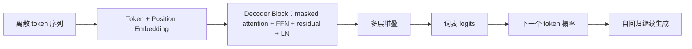

# GPT：基于 Decoder-only Transformer 的自回归语言模型

<TransformerBlockExplorer />

---

> 相关论文：
> - Radford et al. (2018)：提出 GPT，展示基于 Transformer Decoder 的统一生成式预训练框架。
> - Radford et al. (2019)：提出 GPT-2，证明更大规模语言模型具有更强的零样本生成能力。
> - Brown et al. (2020)：提出 GPT-3，系统展示规模扩展带来的能力跃迁。

本文主要负责说明 GPT 作为 decoder-only Transformer 语言模型的建模目标、训练闭环、推理解码与参数规模逻辑。Transformer block、自注意力、位置机制等公共结构以 [transformer.md](./transformer.md)、[self-attention.md](../mechanism/self-attention.md) 与 [positional-encoding.md](../mechanism/positional-encoding.md) 为主文档；本文不再承担这些公共机制的完整总览职责。

---

## 一、路线图与符号约定

GPT 的核心问题，可以压缩为一句话：**如何在只观察左侧前缀的条件下，持续预测下一个 token。**

也就是说，它把“生成一段文本”分解为一系列局部条件分布建模问题：在仅观察左侧前缀的条件下，下一个 token 的概率分布应如何刻画。整个 decoder-only Transformer 的矩阵计算，最终都服务于这一目标。

如果先从全局结构把握，可以把 GPT 的工作链条概括为：

1. 把文本切成 token 序列；
2. 把 token 映射到向量空间，并注入位置信息；
3. 用带因果掩码的 decoder block 在前缀内部做动态信息聚合；
4. 把最后一层隐藏状态投影到词表上；
5. 用最大似然训练，在推理时自回归地逐 token 解码。

本文统一使用以下记号：

| 符号 | 含义 |
| --- | --- |
| $x_{<t}$ | 位置 $t$ 之前的前缀 |
| $V$ | 词表 |
| $u_t\in\mathbb{R}^{|V|}$ | 位置 $t$ 的 one-hot token 向量 |
| $E\in\mathbb{R}^{|V|\times d_{\mathrm{model}}}$ | token embedding 矩阵 |
| $W_P\in\mathbb{R}^{T_{\max}\times d_{\mathrm{model}}}$ | 位置参数矩阵 |
| $H^{(\ell)}$ | 第 $\ell$ 层隐藏状态 |
| $L$ | Transformer block 层数 |
| $o_t\in\mathbb{R}^{|V|}$ | 位置 $t$ 的词表 logits |
| $\theta$ | 模型全部可训练参数 |

若只记住 5 个核心公式，通常已经足够把握 GPT 主线：

1. 自回归分解：
$$
P(x_1,\dots,x_T)=\prod_{t=1}^{T}P(x_t\mid x_{<t})
$$

2. 输入表示：
$$
Z = UE + P
$$

3. 单头 masked attention：
$$
\mathrm{Attention}(Q,K,V)=\mathrm{softmax}\left(\frac{QK^\top+M_{\text{causal}}}{\sqrt{d_k}}\right)V
$$

4. pre-LN block：
$$
U^{(\ell)}=H^{(\ell-1)}+\mathrm{MHA}(\mathrm{LN}(H^{(\ell-1)}))
$$
$$
H^{(\ell)}=U^{(\ell)}+\mathrm{FFN}(\mathrm{LN}(U^{(\ell)}))
$$

5. 最大似然目标：
$$
\mathcal{L}(\theta)=-\sum_{t=1}^{T}\log P_\theta(x_t\mid x_{<t})
$$

---

## 二、建模目标：GPT 所学习的概率对象

GPT 的核心并不是“会说话”，而是学习一个序列联合分布的自回归分解：
$$
P(x_1,\dots,x_T)=\prod_{t=1}^{T}P(x_t\mid x_{<t})
$$

这一步本身没有任何神经网络成分，它只是把整体生成问题拆成一串局部条件分布。真正困难的地方在于，这些条件分布无法靠显式计数表存下，于是需要用共享参数的函数逼近器来近似：
$$
P_\theta(x_t\mid x_{<t})
$$

这里输入是前缀，输出是整个词表上的概率分布。GPT 所做的事，就是把这个函数实现成一个深层的 decoder-only Transformer。

### 最大似然作为训练目标

给定训练语料中的真实序列，GPT 通常通过最大似然或等价的最小负对数似然训练：
$$
\mathcal{L}(\theta)=-\sum_{t=1}^{T}\log P_\theta(x_t\mid x_{<t})
$$

进一步按 token 平均后，也常得到困惑度（perplexity）相关指标。它们的意义并不神秘，本质上都是在问：**模型是否把真实下一个 token 放到了更高概率的位置。**

### 训练样本的右移构造

GPT 训练时通常把同一条序列拆成“输入前缀”和“监督目标”两条对齐但右移一位的序列。例如：

- 输入：`[A, B, C, D]`
- 目标：`[B, C, D, E]`

因此，模型在位置 $t$ 接收到的是左侧前缀，而监督信号是当前位置应预测的真实 token。这就是 **teacher forcing**：训练时前缀来自真实数据，而不是模型自己刚采样出来的输出。

---

## 三、输入表示：从离散 token 到连续向量

GPT 的输入起点依然是离散 token，而不是“直接理解文字本身”。因此它需要先完成两步：

1. 把离散 token 映射到连续向量空间；
2. 把顺序信息注入到输入表示里。

### Tokenization 与离散化对象

GPT 并不是直接处理“词”，而是处理 token。token 可以是完整词、子词片段、符号、空格模式，甚至更细粒度的字节级单位。tokenization 的作用，是先把开放文本空间离散化成一个有限词表 $V$。

于是位置 $t$ 上的输入 token 可以表示为 one-hot 向量 $u_t\in\mathbb{R}^{|V|}$，再通过 embedding 矩阵变成连续表示：
$$
e_t = E^\top u_t
$$

### 位置编码与顺序信息

如果只有 token embedding，而没有任何位置信号，那么 self-attention 只知道“有哪些 token”，却不知道“谁在前谁在后”。因此必须把位置信息显式写入输入表示。

若采用原始 GPT 中常见的可学习绝对位置向量，则长度为 $T$ 的输入可以写成：
$$
Z = UE + P
$$

逐位置写开就是：
$$
z_t = e_t + p_t
$$

对于原始 GPT，这种可学习位置向量是常见写法。后续一些模型可能改用正余弦位置编码或 RoPE，但它们改变的是“位置信息如何注入”，而不是 GPT 的自回归建模本质。位置机制的完整展开应回到 [positional-encoding.md](../mechanism/positional-encoding.md)。

### 词嵌入与输出层权重共享

很多 GPT 类模型会在输入 embedding 与输出投影之间共享参数。其直觉是：

- 输入侧负责把 token 映射到隐藏空间；
- 输出侧负责把隐藏状态重新投影回词表空间；
- 二者都围绕同一词表工作，因此共享可减少参数并增强一致性。

这不是 GPT 的定义性条件，但在参数规模很大时是一个常见而重要的工程设计。

---

## 四、Decoder Block：GPT 的核心计算单元

GPT 的主干由一系列仅含解码器的 Transformer block 构成。若采用现代 GPT 类模型中更常见的 pre-LN 写法，则第 $\ell$ 层可写为：
$$
U^{(\ell)}=H^{(\ell-1)}+\mathrm{MHA}(\mathrm{LN}(H^{(\ell-1)}))
$$
$$
H^{(\ell)}=U^{(\ell)}+\mathrm{FFN}(\mathrm{LN}(U^{(\ell)}))
$$

这套骨架与标准 Transformer 主文档保持一致，GPT 的辨识度不在于发明了全新的 block，而在于它给 block 施加了**严格的因果可见性约束**，并让整套训练目标围绕下一 token 预测展开。

### 单头 masked self-attention

GPT 最关键的计算约束是：
$$
\mathrm{Attention}(Q,K,V)=\mathrm{softmax}\left(\frac{QK^\top+M_{\text{causal}}}{\sqrt{d_k}}\right)V
$$

其中因果掩码满足：
$$
(M_{\text{causal}})_{ij}=
\begin{cases}
0, & j \le i \\
-\infty, & j > i
\end{cases}
$$

这意味着第 $i$ 个位置只能看见自己和左侧历史，而不能访问右侧未来 token。也正因此，GPT 天然适合建模：

- 文本续写；
- 对话生成；
- 代码补全；
- 任何“给定前缀继续往后写”的任务。

### 多头注意力、FFN 与 LayerNorm

GPT 当然也依赖多头注意力、FFN、残差连接与 LayerNorm，但这些已经属于 Transformer 公共骨架。对 GPT 而言，更重要的是它们在 decoder-only 场景里的角色分工：

- **多头注意力**：在多个子空间里并行建模不同类型的历史依赖；
- **FFN**：在每个位置内部继续做非线性特征重组；
- **残差连接与 LayerNorm**：保证深层训练稳定、梯度更容易传播。

这些机制的完整数学细节不再在本文中重复展开，而是统一交回 [transformer.md](./transformer.md)。

---

## 五、输出层：从隐藏状态到词表概率

经过多层 decoder block 之后，每个位置都会得到一个隐藏状态 $h_t$。GPT 的输出层要做的事，是把这个隐藏状态映射到整个词表上的 logits：
$$
o_t = h_t W_{\text{out}} + b
$$

再经 softmax 得到：
$$
P_\theta(x_{t+1}=v\mid x_{\le t}) = \frac{\exp(o_{t,v})}{\sum_{v'\in V}\exp(o_{t,v'})}
$$

这一步的意义可以概括为：**把高维隐藏状态重新翻译回离散词表上的概率分布。**

### 交叉熵损失及其梯度

若真实标签在位置 $t$ 上对应 one-hot 向量 $y_t$，预测分布为 $\hat{p}_t$，则位置级交叉熵可写为：
$$
\mathcal{L}_t = -\sum_{v\in V} y_{t,v}\log \hat{p}_{t,v}
$$

由于 $y_t$ 是 one-hot，这实际上就等价于“只取真实 token 对应的对数概率”。随后，这个梯度会沿着输出层、FFN、残差连接、LayerNorm、attention 以及 embedding 一路反向传播，更新整套参数 $\theta$。

---

## 六、训练闭环：误差如何回传整张网络

GPT 的训练闭环可以压缩成下面几步：

1. 输入真实 token 前缀；
2. 经过 embedding 和多层 decoder block；
3. 输出当前位置对词表的概率分布；
4. 与真实下一个 token 比较，计算交叉熵；
5. 通过反向传播联合更新整套参数。

### 参数共享与联合更新

GPT 的一个关键特点是：同一套 $W_Q,W_K,W_V,W_1,W_2$ 会同时服务于不同句子、不同位置、不同语境。因此，单个 batch 中各位置产生的误差信号，会共同更新同一套参数。

这意味着 GPT 学到的不是“某一句话的局部规则”，而是一套对大量语料统计模式的共享逼近器。

### 训练阶段与推理阶段的不一致性

训练时，模型看到的历史前缀来自真实数据；推理时，模型必须把自己刚刚生成的 token 再喂回去。因此二者之间存在典型的 **exposure bias**：

- 训练时历史是干净的真实前缀；
- 推理时一旦早期生成错误，后续条件分布也会随之偏移。

这也是为什么现代系统除了预训练，往往还会结合指令微调、偏好优化、拒答策略与外部工具，以减轻长链生成中的误差累积。

---

## 七、推理与解码：自回归生成的 token 选择机制

GPT 推理时的大致流程可以概括为：

1. 输入当前前缀；
2. 计算最后位置的词表分布；
3. 从分布中选出一个 token；
4. 把新 token 接回前缀，继续下一步。

### 贪心、温度、Top-k 与 Top-p

在生成任务里，模型每一步实际上输出的是一个词表分布，而不是直接给出唯一答案。因此，推理不仅包含“算出分布”，还包含“如何从分布中选 token”。

常见策略包括：

- **Greedy decoding**：直接选最大概率 token；
- **Temperature**：缩放 logits，控制分布尖锐程度；
- **Top-k**：只在前 $k$ 个候选里采样；
- **Top-p**：在累计概率达到阈值 $p$ 的候选集合中采样。

这些策略不改变 GPT 主干本身，但会显著影响输出的稳定性、多样性与风格。

### KV Cache 的加速原理

若每生成一个新 token 都重新计算整个历史前缀的 $K,V$，代价会非常高。因此现代系统通常缓存历史层的 key / value：

- 旧 token 的 $K,V$ 只算一次并存储；
- 新 token 到来时，只需计算它自己的 query，以及必要的新 key / value；
- attention 再与缓存中的历史 $K,V$ 一起完成读取。

它之所以成立，是因为在因果掩码下，历史位置的 $K,V$ 只依赖它们各自左侧的前缀，不依赖未来 token。因此当序列从长度 $t$ 扩展到 $t+1$ 时，前 $t$ 个位置已经算出的 $K,V$ 数值不会因为新 token 的加入而改变。

### KV Cache 的代价

KV cache 显著降低了重复计算，但也带来新的显存压力。上下文越长、层数越多、头数越多，缓存越大。也正因为如此，长上下文推理的瓶颈往往不只来自参数本身，还来自缓存本身。

长上下文复杂度、缓存管理与更多系统级扩展，已经超出 GPT 主文档边界，若继续深入应回到 [transformer-extensions.md](./transformer-extensions.md)。

---

## 八、参数量估算：175B 的来源

GPT 的参数量，本质上就是所有可训练矩阵中标量元素的总数。若忽略 bias 和 LayerNorm 中相对微小的参数，则一个标准 dense GPT block 的主导参数主要来自两部分：

- attention 中的投影矩阵；
- FFN 的升维与降维矩阵。

### 单层 attention 的参数量

若模型维度为 $d$，则 $W_Q,W_K,W_V,W_O$ 四个矩阵的主导规模通常都是 $d\times d$，因此 attention 部分约为：
$$
4d^2
$$

### 单层 FFN 的参数量

在标准 GPT 结构中，FFN 常把通道宽度扩展到 $4d$，再压回 $d$。因此：
$$
W_1 \in \mathbb{R}^{d\times 4d},\qquad W_2 \in \mathbb{R}^{4d\times d}
$$

FFN 部分总共约为：
$$
8d^2
$$

### 单个 block 的主导参数公式

把 attention 与 FFN 相加，就得到一个标准 dense GPT block 的主导参数量近似：
$$
12d^2
$$

若堆叠 $L$ 层，则主干参数量近似为：
$$
12Ld^2
$$

再加上词嵌入、输出层以及少量归一化参数，就可以得到 GPT-3 级别模型参数为何会迅速膨胀到百亿乃至千亿量级的直觉。

---

## 九、GPT 的有效性及其边界

GPT 之所以有效，核心原因并不神秘，而在于几条非常朴素但可规模化的设计同时成立：

- **统一目标函数**：所有位置都用同一个下一 token 预测目标训练，监督信号密集且稳定；
- **全局前缀可见性**：在因果约束下，每个位置都能直接连接到任意历史位置；
- **共享参数主干**：同一套矩阵反复服务于不同语境，能够在海量文本中累积统计规律；
- **训练与推理接口统一**：都围绕“给定前缀预测下一个 token”这一核心问题展开。

但它的局限也同样清楚：

- 训练目标不等于事实约束，生成“像真的话”不等于内容真实；
- 训练与推理存在分布偏移；
- 推理仍受自回归串行限制；
- 长上下文并不自动等于高效利用长上下文。

---

## 十、与 BERT 和 Encoder-Decoder 路线的区别

GPT、BERT 和 T5 / BART 一类模型都建立在 Transformer 上，但它们优化的概率对象并不相同。

| 模型 | 结构路线 | 主要目标 | 可见性特征 | 典型任务 |
| --- | --- | --- | --- | --- |
| GPT | Decoder-only | 自回归下一 token 预测 | 只能看左侧前缀 | 续写、对话、代码生成 |
| BERT | Encoder-only | MLM 等掩码重建目标 | 双向可见 | 表示学习、判别理解任务 |
| T5 / BART | Encoder-Decoder | 条件生成 | 编码器双向，解码器单向 | 翻译、摘要、条件生成 |

因此，GPT 的关键辨识度不在于它“用了 Transformer”，而在于它选择了 **decoder-only 结构与纯自回归目标** 这条路线。

---

## 十一、总结

GPT 的核心计算链，可以压缩为：

1. 把离散 token 映射到 embedding 空间，并加入位置信息；
2. 用带因果掩码的 self-attention 在前缀内部做动态信息聚合；
3. 用 FFN、残差连接与 LayerNorm 逐层重写隐藏表示；
4. 把最后位置映射到词表分布上；
5. 用最大似然训练，在推理时通过采样策略与 KV cache 实现高效自回归生成。

若将全文压缩为一句话，GPT 并非“会说话的黑箱”，而是一个在高维向量空间中执行大规模条件概率近似的序列模型。它之所以能够表现出续写、对话、总结、代码生成等多种能力，本质上都来自这一条统一的数学主干。
