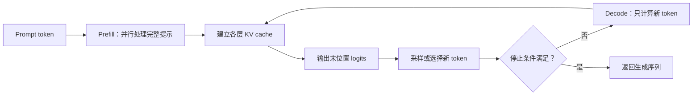

# GPT：以因果语言建模统一理解与生成

GPT 的核心接口是因果下一 token 预测，而非聊天窗口或某一组现代模块。本文区分原始 GPT 研究路线与更宽泛的 Decoder-only 语言模型：后者可能使用 RMSNorm、RoPE、门控 FFN 和 GQA，但不能把这些选择一概归给所有 GPT 版本，也不据此猜测未公开模型结构。

<LanguageModelObjectiveExplorer initial-mode="causal" />

::: info 符号与约定
沿用[数学与符号约定](../foundations/math-notation.md)。$x_t$ 是第 $t$ 个 token，$T$ 是序列长度，$\theta$ 是模型参数，$\mathcal{L}$ 是因果语言模型损失；$z_w$ 是候选 token $w$ 的 logit，$\tau$ 是采样温度；$K_{\leq t},V_{\leq t}$ 是截至位置 $t$ 的 KV cache。
:::

---

## 因果语言模型

对 token 序列 $x_1,\ldots,x_T$：

$$
P(x_1,\ldots,x_T)
=
\prod_{t=1}^{T}P(x_t\mid x_{<t})
$$

训练时用已知前缀预测紧随其后的 token，对有效目标位置计算交叉熵：

$$
\mathcal{L}
=
-\sum_{t=1}^{T}
\log P_\theta(x_t\mid x_{<t})
$$

输入位置 i 的状态可读取自己与左侧输入，用于预测下一 token；目标 $x_t$ 的条件仅包含 $x_{<t}$。输入位置与目标下标不可混用。整段训练仍可并行计算，mask 限制的是可见性。

### 一条序列怎样产生训练信号

序列：

```text
<BOS> 天空 是 蓝色 <EOS>
```

可以构造「前缀末位置—下一 token 标签」对齐：

| 位置 | 模型看到的前缀末尾 | 监督目标 |
| ---: | --- | --- |
| 1 | `<BOS>` | `天空` |
| 2 | `<BOS> 天空` | `是` |
| 3 | `<BOS> 天空 是` | `蓝色` |
| 4 | `<BOS> 天空 是 蓝色` | `<EOS>` |

一次 Transformer 前向会并行产生四个位置的 logits。假设模型分别为四个正确目标分配 $0.8,0.6,0.7,0.9$ 的概率，则：

$$
P(x)=0.8\times0.6\times0.7\times0.9=0.3024
$$

平均负对数似然为：

$$
\mathcal{L}
=-\frac{1}{4}\log0.3024
\approx0.299
$$

对应 token 级困惑度约为 $\exp(0.299)\approx1.35$。训练让真实前缀预测后一 token，不需要先生成完整句子再比较文本。

预训练循环由分词、分段或拼接样本、构造因果 mask、前向计算、有效 token 交叉熵和参数更新组成。文档边界通常使用结束 token 标记；padding 或被明确屏蔽的位置不参与损失。数据怎样切块会决定模型在训练中见到哪些跨段上下文。

---

## Decoder-only 主干

~~~mermaid
flowchart LR
	X["token + position"] --> B1["Causal Transformer Block"]
	B1 --> B2["… × L"]
	B2 --> N["Final Norm"]
	N --> H["Vocabulary Projection"]
	H --> P["Next-token Distribution"]
~~~

每个 block 包含带因果 mask 的 Self-Attention、FFN、残差与归一化。与原始 Transformer Decoder 不同，GPT 不需要 Encoder，也没有必需的 Cross-Attention；提示、问题、示例和待生成内容被序列化到同一个前缀。

输出层把隐藏状态投影到词表 logits。它常与输入 embedding 共享权重，但是否共享属于具体实现选择。

---

## 为什么同一目标能覆盖多种任务

分类、翻译、问答和代码生成都可以被序列化为「给定前缀，继续写出目标文本」。模型在大规模语料上学习的是条件分布，而非任务标签表；提示中的指令、示例和上下文会改变后续 token 的概率。

In-context learning 指模型仅通过当前前缀中的说明或示例改变输出，不更新参数。它依赖预训练学到的模式和上下文窗口，不等同于梯度学习，也不保证对提示改写稳定。

对话系统会先把 system、user、assistant 等消息按照模型约定的模板序列化成单一 token 流。角色标记本身也是 token；模型仍然只执行「根据前缀预测下一个 token」。如果使用了错误的聊天模板，即使文字相同，模型接收到的 token 结构也可能与指令微调阶段不同。

---

## 从预训练到指令模型

### 从任务微调到上下文任务说明

原始 GPT 的研究重点是生成式预训练后进行监督任务适配；GPT-2 研究把任务以文本形式表达后的零样本行为；GPT-3 系统考察少样本上下文提示与规模的关系。这条线改变了使用接口和训练规模，不意味着上下文示例已经写入权重。

少样本提示包含的标签与答案在当前上下文内可读，因此评估必须固定示例选择、顺序和格式。与一个用监督数据更新过参数的模型比较时，要同时记录两种适配预算，而不是只说「都用了几个例子」。

指令微调进一步使模型学习以回答者角色响应，而不只是延续任意文本；偏好优化改变回答取舍。架构相同但数据和训练目标不同，行为就可能明显不同。相关执行成本见[后训练 Runtime](../infra/training/post-training-runtime.md)。

现代 GPT 类系统常经历多个目标不同的阶段：

1. 因果预训练学习通用语言与代码分布；
2. 监督微调学习指令—回答格式和目标行为；
3. 偏好优化使用比较信号调整回答取舍；
4. 任务适配可使用全量微调或 [LoRA](../mechanism/lora.md)。

后续阶段不会修改因果解码接口，却会显著改变模型如何解释指令、拒绝请求和组织回答。因而「架构相同」不表示行为相同。

---

## 自回归生成

温度为正时才使用下面的除法公式；工程中的 temperature=0 通常是选择 greedy 路径的约定，不是实际计算除以零。Top-p 的候选集合还依赖排序、平局与截断规则，所以复现需要记录具体解码实现。

给定前缀，模型每一步产生 logits $z_t$。温度调整：

$$
P_\tau(w)
=
\frac{\exp(z_w/\tau)}
{\sum_v\exp(z_v/\tau)}
$$

$\tau<1$ 使分布更尖锐，$\tau>1$ 增加随机性。Top-k 只保留概率最高的 $k$ 个 token；top-p 保留累计概率达到阈值的最小集合。贪心、beam search 与采样对应不同任务假设，没有普遍最优设置。

例如三个候选 token 的 logits 为 $(2,1,0)$。不同温度下的概率约为：

| 温度 | 第 1 个候选 | 第 2 个候选 | 第 3 个候选 |
| ---: | ---: | ---: | ---: |
| $\tau=0.5$ | $0.867$ | $0.117$ | $0.016$ |
| $\tau=1$ | $0.665$ | $0.245$ | $0.090$ |
| $\tau=2$ | $0.506$ | $0.307$ | $0.186$ |

温度重新分配固定词表内的概率，不会补充知识或扩展词表；Top-k 或 top-p 还会截断并归一化。

停止条件包括结束 token、结构约束、最大长度或外部控制器终止。解码参数会直接改变生成评估结果，必须与模型版本一起记录。

---

## KV cache 与长上下文

第 $t$ 步只需要为新 token 计算 query/key/value，历史 key/value 可复用：

$$
K_{\le t}=[K_{<t};k_t],\qquad
V_{\le t}=[V_{<t};v_t]
$$

一次请求的推理生命周期为：


```mermaid
flowchart LR
	P["Prompt token"] --> F["Prefill：并行处理完整提示"]
	F --> K["建立各层 KV cache"]
	K --> L["输出末位置 logits"]
	L --> S["采样或选择新 token"]
	D["Decode：只计算新 token"]
	D --> K
	S --> Q{"停止条件满足？"}
	Q -->|否| D
	Q -->|是| O["返回生成序列"]
```

Prefill 的输出只有最后位置用于选择第一个新 token，但所有提示位置的 key/value 都会写入缓存。Decode 每轮把新 token 的 key/value 追加到缓存，并让它的 query 读取全部允许的历史。模型不能一次算出尚未生成的后续 token，因为下一轮输入取决于本轮选择。

KV cache 减少重复投影和历史 block 计算，却随上下文线性占用内存。Grouped-Query Attention 减少 KV 头数，量化或淘汰策略减少缓存体积；这些优化可能影响质量或实现复杂度。

位置扩长见[长上下文位置扩展](../mechanism/long-context.md)，真实利用能力见[长上下文评估](../evaluation/long-context-evaluation.md)。

---

## 概率预测不等于事实检索

因果目标奖励对训练分布中下一 token 的预测，并不显式验证陈述真假、推理过程或工具执行结果。因此 GPT 类模型可能：

- 生成流畅但无依据的内容；
- 对提示措辞和上下文位置敏感；
- 复现训练数据中的偏差；
- 在长输出中累积早期错误；
- 对训练截止后的事实没有可靠更新机制。

检索可以提供外部证据，工具可以获得可验证结果，Agent 运行时可以控制动作；它们都不能被模型参数本身的语言概率替代。评估应按任务拆分准确性、忠实性、鲁棒性与成本，见[生成评估](../evaluation/generation-evaluation.md)。

---

## 与 BERT 的结构差异

| 维度 | BERT | GPT |
| --- | --- | --- |
| 主干 | Encoder-only | Decoder-only |
| 可见性 | 双向 | 因果 |
| 预训练目标 | 恢复被遮蔽 token | 预测下一 token |
| 原生输出 | 上下文化表示 | 自回归序列 |
| 典型接口 | 分类、标注、抽取 | 补全、对话、生成 |

差异来自 mask、目标和输出接口，而不是「理解」与「生成」的绝对能力边界。

---

## 参考文献

- Radford, A. et al. (2018). [*Improving Language Understanding by Generative Pre-Training*](https://cdn.openai.com/research-covers/language-unsupervised/language_understanding_paper.pdf).
- Radford, A. et al. (2019). [*Language Models are Unsupervised Multitask Learners*](https://cdn.openai.com/better-language-models/language_models_are_unsupervised_multitask_learners.pdf).
- Brown, T. B. et al. (2020). [*Language Models are Few-Shot Learners*](https://arxiv.org/abs/2005.14165).
- Ouyang, L. et al. (2022). [*Training Language Models to Follow Instructions with Human Feedback*](https://arxiv.org/abs/2203.02155).
