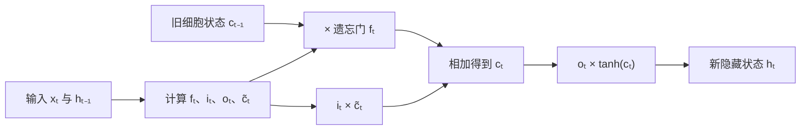

# LSTM：用门控状态改善长期依赖

Long Short-Term Memory（LSTM）把 RNN 的单一隐藏状态拆成细胞状态 $c_t$ 与对外隐藏状态 $h_t$。门控决定哪些信息保留、写入和输出，使梯度拥有一条较稳定的可加性传播路径。

<RecurrentStateExplorer initial-mode="lstm" />

下列公式采用现代常见的带遗忘门 LSTM。1997 年原始结构没有这一完整形式，遗忘门由后续工作引入。

::: info 符号与约定
沿用[数学与符号约定](../foundations/math-notation.md)。$x_t$ 是输入，$h_t$ 是对外隐藏状态，$c_t$ 是细胞状态；$f_t,i_t,o_t$ 分别是遗忘门、输入门、输出门，$\tilde{c}_t$ 是候选记忆；$\odot$ 表示逐元素乘法，$d_x,d_h$ 是输入与隐藏维度；$\bar{h}_t,\bar{c}_t$ 表示损失对对应状态的梯度。
:::

---

## 一次状态更新

将当前输入 $x_t$ 与前一隐藏状态 $h_{t-1}$ 拼接。三个门和候选内容为：

$$
f_t=\sigma(W_f[x_t;h_{t-1}]+b_f)
$$

$$
i_t=\sigma(W_i[x_t;h_{t-1}]+b_i)
$$

$$
o_t=\sigma(W_o[x_t;h_{t-1}]+b_o)
$$

$$
\tilde{c}_t=\tanh(W_c[x_t;h_{t-1}]+b_c)
$$

细胞状态和隐藏状态更新：

$$
c_t=f_t\odot c_{t-1}+i_t\odot\tilde{c}_t
$$

$$
h_t=o_t\odot\tanh(c_t)
$$

| 变量 | 作用 |
| --- | --- |
| $f_t$ | 旧状态保留多少 |
| $i_t$ | 候选内容写入多少 |
| $\tilde{c}_t$ | 当前可写入的信息 |
| $o_t$ | 细胞状态向外暴露多少 |

门值是逐维连续权重，不是整个时间步统一打开或关闭。

---

## 可加性路径为什么重要

普通 RNN 的状态每步都经过新的仿射与非线性变换。LSTM 的细胞状态包含直接乘法与加法路径：

$$
\frac{\partial c_t}{\partial c_{t-1}}=f_t
$$

跨多个时间步的直接路径近似为：

$$
\frac{\partial c_t}{\partial c_k}
\supset
\prod_{j=k+1}^{t}f_j
$$

当相关维度上的遗忘门接近 1 时，信息与梯度可以较少衰减地向后传播。模型也能在不需要某段信息时主动将门压低。

这并不保证无限记忆：多个小于 1 的门仍会连乘衰减，写入竞争、状态容量与优化也会限制有效依赖长度。LSTM 是改善路径，不是消除长序列问题。

---

## 一个门控过程

处理句子「小明把书放下，几小时后他回来取走」时，模型可在读到「小明」时把人物信息写入部分细胞维度；处理中间描述时让对应遗忘门保持较高；读到「他」时通过输出门暴露人物状态。

这个解释是机制直觉，不表示某个具体维度一定稳定对应「人物」。要验证长期依赖，应改变间隔、干扰项与实体位置，观察任务准确率而不是只展示一次门值。

用单个标量维度可以看到门如何共同改写记忆。设 $c_0=0$：

| 时间步 | $f_t$ | $i_t$ | $\tilde{c}_t$ | $o_t$ |
| ---: | ---: | ---: | ---: | ---: |
| 1 | $0.90$ | $0.80$ | $0.50$ | $0.70$ |
| 2 | $0.95$ | $0.10$ | $0.20$ | $0.60$ |
| 3 | $0.80$ | $0.70$ | $-0.30$ | $0.90$ |

第一步写入新信息：

$$
c_1=0.90\times0+0.80\times0.50=0.40
$$

$$
h_1=0.70\tanh(0.40)\approx0.266
$$

第二步几乎保留旧状态，只少量写入：

$$
c_2=0.95\times0.40+0.10\times0.20=0.40
$$

虽然当前候选为正，输入门较小，写入量只有 $0.02$；遗忘路径保留 $0.38$，两者相加后记忆基本不变。第三步写入负候选：

$$
c_3=0.80\times0.40+0.70\times(-0.30)=0.11
$$

$$
h_3=0.90\tanh(0.11)\approx0.099
$$

这个过程同时展示了三种操作：保留旧记忆、抑制无关写入、用新证据覆盖已有状态。输出门只影响 $h_t$ 的可见部分，不直接改变已经写入的 $c_t$。

---

## 序列训练与梯度回传

LSTM 与普通 RNN 一样使用 BPTT。前向阶段按时间保存每一步的门值、候选状态、$c_t$ 和 $h_t$；反向阶段从序列末端向前传播。

设从当前输出传来的隐藏状态梯度为 $\bar{h}_t$，从未来时间步传来的细胞状态梯度为 $\bar{c}_t^{\mathrm{future}}$。当前细胞状态接收的总梯度是：

$$
\bar{c}_t
=
\bar{c}_t^{\mathrm{future}}
+\bar{h}_t\odot o_t\odot\left(1-\tanh^2(c_t)\right)
$$

随后分别流向四条路径：

$$
\bar{f}_t=\bar{c}_t\odot c_{t-1},\qquad
\bar{i}_t=\bar{c}_t\odot\tilde{c}_t
$$

$$
\bar{\tilde{c}}_t=\bar{c}_t\odot i_t,\qquad
\bar{c}_{t-1}=\bar{c}_t\odot f_t
$$

$\bar{c}_{t-1}$ 继续传向更早时间步；其余三项再乘 sigmoid 或 tanh 的导数，回传到对应仿射变换。输出门梯度为：

$$
\bar{o}_t=\bar{h}_t\odot\tanh(c_t)
$$

所有时间步共享同一组门参数，因此各步的参数梯度需要累加。长序列训练仍可使用截断 BPTT 和梯度裁剪；padding 位置必须同时屏蔽损失以及 $(c_t,h_t)$ 的无效更新。

训练语言模型时，真实 token 序列右移一位构成输入与目标。每一步读取真实前一 token，计算输出分布并产生交叉熵；门参数并没有单独的监督标签，它们完全由最终任务损失通过上述路径学习。

---

## 参数与计算

若输入维度为 $d_x$、隐藏维度为 $d_h$，四组仿射变换可合并为一个矩阵：

$$
\begin{bmatrix}
f_t\\i_t\\o_t\\\tilde{c}_t
\end{bmatrix}
=
\begin{bmatrix}
\sigma\\\sigma\\\sigma\\\tanh
\end{bmatrix}
\left(
W[x_t;h_{t-1}]+b
\right)
$$

其中 $W\in\mathbb{R}^{4d_h\times(d_x+d_h)}$。与同隐藏维度的普通 RNN 相比，门控增加参数和每步矩阵计算；时间递推仍然串行。

包含 bias 时，单层 LSTM 的参数量为：

$$
4d_h(d_x+d_h+1)
$$

例如 $d_x=64$、$d_h=128$，参数量为：

$$
4\times128\times(64+128+1)=98\,816
$$

同维度的简单 tanh RNN 只有 $128\times(64+128+1)=24\,704$ 个递推参数。LSTM 约四倍的参数与矩阵计算，换取更可控的状态读写。

训练继续使用 BPTT，并常结合梯度裁剪、长度分桶和 padding mask。遗忘门偏置可初始化为正值，使训练初期更倾向保留状态，但这只是优化选择。

---

## 推理时保存什么状态

在线推理必须同时保存 $(c_t,h_t)$：$c_t$ 承载内部记忆，$h_t$ 既提供当前输出，也参与下一步四个门的计算。新输入到达后只需执行一次状态更新，内存占用不随已处理长度增长。

对于自回归生成，$h_t$ 经词表投影得到下一 token 分布，选出的 token 再作为 $x_{t+1}$。对于分类或时间序列预测，任务头可以在每一步读取 $h_t$，也可以只读取结束时的状态。

以下边界必须由调用方明确管理：

- 新序列开始时重置 $(c_0,h_0)$；
- 同一 batch 中序列结束时间不同时，分别冻结或清空对应状态；
- 双向 LSTM 需要完整输入后才能同时得到两个方向的状态，不能按相同方式用于严格在线场景；
- 保存状态只避免重复计算，不保证有限维状态永远保留早期细节。

---

## 变体与使用边界

GRU 将细胞与隐藏状态合并，并使用更新门、重置门减少参数。双向 LSTM 读取完整输入的两个方向，适合序列标注；因果生成与流式任务只能使用已经到达的信息。

选择 LSTM 的典型理由包括：

- 输入按时间到达，需要固定大小在线状态；
- 数据规模不足以支撑大型 Transformer；
- 序列依赖与门控递推匹配；
- 目标硬件上的延迟和内存优于替代方案。

若任务需要任意位置直接交互或大规模并行训练，[Transformer](./transformer.md)通常提供更短的信息路径；若希望保持线性序列扫描并增强内容选择，可比较[状态空间模型](./state-space-model.md)。

---

## 参考文献

- Hochreiter, S., and Schmidhuber, J. (1997). *Long Short-Term Memory*.
- Gers, F. A., Schmidhuber, J., and Cummins, F. (2000). *Learning to Forget: Continual Prediction with LSTM*.
- Cho, K. et al. (2014). *Learning Phrase Representations using RNN Encoder-Decoder for Statistical Machine Translation*.
