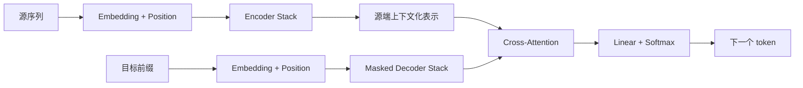

# Transformer：从自注意力到统一序列主干

如果希望先建立对 Transformer block 的直观认识，可以先阅读下面的交互式结构图。该图概括了编码器块与解码器块中 attention、残差连接、Layer Normalization 与前馈网络之间的关系：

<TransformerBlockExplorer />

---

> 相关论文：
> - Bahdanau, Cho, and Bengio (2015)：把 attention 引入 Seq2Seq，开启“按需读取输入”的建模路线。
> - Vaswani et al. (2017)：提出 Transformer，以 self-attention 取代递归，成为现代序列建模主干。
> - Devlin et al. (2019)：以 BERT 展示 encoder-only Transformer 在表示学习与理解任务上的能力。
> - Radford et al. (2018, 2019) 与 Brown et al. (2020)：以 GPT 系列展示 decoder-only Transformer 在自回归生成上的扩展性。
> - Raffel et al. (2020)：以 T5 系统化 encoder-decoder Transformer 在统一文本到文本任务中的作用。

本文讨论 Transformer 作为完整架构时的主干逻辑，包括 block 结构、三类结构路线、训练推理骨架与历史位置。若希望进一步查看 attention、自注意力、位置机制的数学细节，可阅读 [Attention](../mechanism/attention.md)、[Self-Attention](../mechanism/self-attention.md) 与 [Positional Encoding](../mechanism/positional-encoding.md)；若希望继续了解高效变体、长上下文、ViT 与多模态扩展，可阅读 [transformer-extensions.md](./transformer-extensions.md)。

---

## 一、问题背景与范式转变

Transformer（变换器）是一类以 **self-attention 为核心计算单元** 的神经网络架构，用于处理文本、语音、图像 patch、蛋白质序列等具有离散位置结构的数据。

它之所以重要，不只是因为在机器翻译上替代了 RNN，而是因为它把序列建模的默认思路从“沿时间递归传递状态”改写成了“让每个位置按内容去读取全局上下文”。

在 RNN、LSTM 与早期 Seq2Seq 中，信息主要沿时间链条逐步传播：

$$
h_t = f(x_t, h_{t-1})
$$

这意味着：

- 计算天然串行，很难做大规模并行；
- 长距离依赖必须跨越很多时间步才能传播；
- 历史信息被不断压缩进有限状态，容易形成信息瓶颈。

Transformer 的核心改写则是：

- 用 self-attention 让任意两个位置在同一层内直接交互；
- 用位置机制显式补回顺序信息；
- 用残差连接、LayerNorm 与前馈网络，把 attention 稳定地堆叠成深层模型。

因此，Transformer 更准确的定义不是“一种新 attention 公式”，而是：**一种把全局内容相关交互变成主干结构的通用建模框架。**

---

## 二、符号约定与核心公式

本文统一采用 $d_{\mathrm{model}}$ 表示模型维度，序列长度记为 $n$，头数记为 $h$。若无特殊说明，输入矩阵按“序列长度在前、特征维在后”的形式书写。

| 符号 | 含义 |
| --- | --- |
| $X \in \mathbb{R}^{n \times d_{\mathrm{model}}}$ | 输入序列表示矩阵 |
| $x_t \in \mathbb{R}^{d_{\mathrm{model}}}$ | 第 $t$ 个位置的输入向量 |
| $p_t \in \mathbb{R}^{d_{\mathrm{model}}}$ | 第 $t$ 个位置的位置向量 |
| $Q,K,V$ | query、key、value 矩阵 |
| $M$ | 掩码矩阵，如 padding mask 或 causal mask |
| $\mathrm{FFN}(\cdot)$ | 逐位置前馈网络 |
| $\mathrm{LN}(\cdot)$ | Layer Normalization |
| $H^{(\ell)}$ | 第 $\ell$ 层 Transformer block 的输出 |

若只记住 3 个结构公式，通常已经足够把握 Transformer 主干：

1. 输入表示与位置向量结合：
$$
z_t = x_t + p_t
$$

2. 现代常见的 pre-LN Transformer block：
$$
\tilde{H}^{(\ell)} = H^{(\ell-1)} + \mathrm{MHA}(\mathrm{LN}(H^{(\ell-1)}))
$$

$$
H^{(\ell)} = \tilde{H}^{(\ell)} + \mathrm{FFN}(\mathrm{LN}(\tilde{H}^{(\ell)}))
$$

3. Encoder-Decoder 条件生成接口：
$$
P(Y\mid X)=\prod_{t=1}^{m}P(y_t\mid y_{<t},X)
$$

---

## 三、Transformer 的建模动机

Transformer 的出现，根本上是在回答一个问题：**如果目标是建模长距离依赖，为什么还要让信息沿时间一步一步传？**

在递归架构中，序列越长，早期信息到达后续位置的路径就越长；而在 self-attention 中，位置 $i$ 可以直接与位置 $j$ 建立联系。于是，两类架构的主要差异可以概括为：

| 维度 | RNN / LSTM | Transformer |
| --- | --- | --- |
| 信息传递方式 | 递归状态逐步传递 | self-attention 全局交互 |
| 训练并行性 | 弱 | 强 |
| 长依赖路径长度 | 随距离线性增长 | 同层中可直接连接 |
| 顺序信息来源 | 结构天然包含顺序 | 需显式位置机制 |
| 主要瓶颈 | 串行计算、梯度链过长 | attention 的二次复杂度 |

从更高层看，Transformer 建立在 4 个假设之上：

- 序列中任意两个位置之间都可能存在重要依赖；
- 相关性应由内容动态决定，而不是由固定窗口或固定递归路径决定；
- 顺序信息可以通过显式机制注入，而不一定要靠递归结构隐式承载；
- 深层语义表示可以由“跨位置读取 + 逐位置重加工”的 block 反复堆叠得到。

如果把原始 encoder-decoder Transformer 的总流程压缩成一张概览图，可以写成：

---

## 四、Attention、位置与可见性约束

Transformer 之所以成立，不是因为单独发明了 attention，而是因为它把以下 3 个问题稳定地组织在同一个主干里：

- **内容相关读取**：当前位置应该从哪里读取信息；
- **顺序信息补回**：模型如何知道谁在前、谁在后；
- **可见性约束**：哪些位置可以互相看到，哪些位置必须被屏蔽。

在架构层，Transformer 并不需要再次完整展开 attention 的一般数学。只需记住：

- 注意力子层负责按内容相关性读取信息；
- 位置机制负责补回顺序；
- 掩码负责定义不同结构中的可见边界。

### 位置机制与掩码

由于标准 attention 本身并不天然携带顺序感，Transformer 必须借助显式位置机制来补回“谁在前、谁在后”。同时，它还需要用 padding mask 或 causal mask 控制可见性边界。

如果只抓主线，可以记住：

- 位置机制解决“序列顺序如何进入模型”；
- 掩码机制解决“哪些位置此刻允许互相读取”；
- 三类 attention 结构差异，本质上对应不同的信息流边界。

这几部分在这里先保留最小必要概览；若希望继续深入，可分别阅读 [attention.md](../mechanism/attention.md)、[self-attention.md](../mechanism/self-attention.md) 与 [positional-encoding.md](../mechanism/positional-encoding.md)。

---

## 五、Transformer Block 的结构组成

attention 解决的是“当前位置应该从哪里读取信息”，但这还不够。一个可扩展的深层模型还需要解决另外两个问题：

- 读取后的信息如何在当前位置内部继续加工；
- 多层堆叠时如何保持训练稳定。

于是，Transformer block 一般由 4 类部件共同组成：

1. 多头注意力；
2. 前馈网络（FFN）；
3. 残差连接；
4. Layer Normalization。

### 多头注意力与多视角表征

多头注意力的核心不是简单重复 attention，而是把表示投影到多个子空间中并行建模，再在输出端重新拼接：
$$
\mathrm{MultiHead}(Q,K,V) = \mathrm{Concat}(\mathrm{head}_1,\dots,\mathrm{head}_h)W_O
$$

它的重要性在于：模型不必用一个单一分数矩阵同时承载所有关系，而可以在多个头中分别关注不同尺度、不同类型的依赖。

### FFN：逐位置非线性重加工

FFN 的作用不是跨位置读取，而是对每个位置已经聚合好的信息继续做逐位置重加工。它通常可以写成：
$$
\mathrm{FFN}(x)=W_2\,\sigma(W_1x+b_1)+b_2
$$

因此：

- attention 更像“跨位置读取”；
- FFN 更像“在当前位置内部重新组织和扩展特征”。

### 残差连接与 LayerNorm

深层 Transformer 之所以能稳定堆叠，关键不只在 attention 或 FFN，而在于残差连接与归一化把这些子模块串成了可训练的主干。

若只抓住作用分工，可以概括为：

- **残差连接**：保留原有信息路径，减轻深层训练困难；
- **LayerNorm**：稳定激活尺度，改善优化过程；
- **pre-LN 结构**：在现代大模型里更常见，因为它通常更利于深层训练稳定。

### 编码器块与解码器块

如果只看骨架差异，可以概括为：

| 模块 | 编码器块 | 解码器块 |
| --- | --- | --- |
| self-attention | 双向可见 | 因果掩码可见 |
| cross-attention | 无 | 有 |
| 主要职责 | 读懂输入内部关系 | 维护生成历史并按需读源端 |

这也是为什么 Transformer 虽然以 attention 著称，但真正支撑其深层可扩展性的其实是一个完整 block，而不是单个 attention 公式。

---

## 六、Transformer 的三类主流结构路线

Transformer 不是单一固定结构，而是一套可以裁剪的主干。现代最常见的 3 条路线分别是：

| 路线 | 结构保留方式 | 代表模型 | 典型任务 | 可见性特征 |
| --- | --- | --- | --- | --- |
| Encoder-only | 只保留编码器 | BERT、RoBERTa | 分类、抽取、检索、表示学习 | 双向可见 |
| Decoder-only | 只保留解码器 | GPT、LLaMA 类模型 | 自回归生成、对话、代码生成 | 因果可见 |
| Encoder-Decoder | 同时保留两者 | T5、BART | 翻译、摘要、改写、条件生成 | 编码器双向，解码器因果 |

这 3 条路线的共同点是：都复用了 Transformer block；不同点在于，它们围绕不同任务目标裁剪了信息流边界。

### 不同路线的任务接口

如果从“输入和输出怎样进入模型”来理解，3 条路线可以进一步概括为：

- **Encoder-only**：把整段输入编码成上下文化表示，重点是理解与判别；
- **Decoder-only**：把前缀不断延长，重点是自回归续写；
- **Encoder-Decoder**：先编码条件输入，再在解码器中按需读取并生成输出。

这也是为什么今天常把 BERT、GPT、T5 都归在 Transformer 家族之下，但它们并不是同一种结构的简单缩放版本，而是围绕不同目标函数做出的结构裁剪。

---

## 七、训练机制与目标函数

Transformer 的网络结构只是骨架，真正决定模型能力边界的，还包括训练目标本身。

### Encoder-Decoder 的条件生成目标

对 encoder-decoder 模型而言，训练目标通常是：给定输入序列 $X$，最大化目标序列 $Y$ 的条件概率：
$$
P(Y\mid X)=\prod_{t=1}^{m}P(y_t\mid y_{<t},X)
$$

这类目标特别适合翻译、摘要、改写与条件生成。

### Decoder-Only 的语言建模目标

对于 GPT 类模型，训练目标是标准的下一 token 预测：
$$
P(x_1,\dots,x_n)=\prod_{t=1}^{n}P(x_t\mid x_{<t})
$$

它的好处在于接口非常统一，因此更容易被规模化扩展到开放式生成、对话与代码任务。

### Encoder-Only 的掩码建模目标

对于 BERT 类模型，常见目标是 Masked Language Modeling。其关键不是让模型从左到右生成，而是让模型在双向上下文中恢复被遮蔽的 token。

因此，从训练目标角度看：

- encoder-only 更像表示提取器；
- decoder-only 更像序列延续器；
- encoder-decoder 更像条件重写器。

### 从预训练到任务适配

现代 Transformer 系统一般并不是“一次训练直接结束”，而更常采用分阶段过程：

- encoder-only 模型常见“预训练 + 下游微调”；
- decoder-only 模型常见“预训练 + 指令微调 + 对齐”；
- encoder-decoder 模型常见“预训练 + 条件生成微调”。

也正因为这种分阶段训练方式，今天讨论 Transformer 时，往往不能只看网络结构本身，还要连同训练配方一起理解。

---

## 八、推理机制与生成骨架

虽然 Transformer 训练时高度并行，但在自回归生成时，解码器仍必须逐 token 推进：
$$
\hat{y}_t \sim P(y_t \mid y_{<t}, X)
$$

因此，推理阶段的主要瓶颈与训练并不相同。

### KV Cache

在 decoder-only 或解码器侧自回归生成中，若每生成一个新 token 都重新计算整个历史前缀的 $K,V$，代价会非常高。于是现代系统通常缓存历史层的 key / value：

- 旧 token 的 $K,V$ 只算一次并存储；
- 新 token 到来时，只需计算它自己的 query，以及必要的新 key / value；
- attention 再与缓存中的历史 $K,V$ 一起完成读取。

KV cache 的收益很明显，但也带来新的显存压力。上下文越长、层数越多、头数越多，缓存越大。

### 训练与推理的瓶颈差异

| 阶段 | 主要瓶颈 | 典型表现 |
| --- | --- | --- |
| 训练 | 长序列 attention、激活保存、分布式通信 | 吞吐与显存受限 |
| 推理 | 自回归串行、KV cache 膨胀、访存带宽 | 首 token 延迟与每 token 延迟升高 |

也正因此，现代 Transformer 工程优化通常分成两条路线：

- 面向训练：混合精度、并行策略、attention kernel 优化；
- 面向推理：KV cache、量化、连续批处理、speculative decoding 等。

### 生成阶段的解码策略

在生成任务里，模型每一步实际上输出的是一个词表分布，而不是直接给出唯一答案。常见策略包括：

- Greedy decoding；
- Beam search；
- Top-k sampling；
- Top-p sampling；
- Temperature 缩放。

这些策略不改变 Transformer 主干本身，但会显著影响最终输出的稳定性、多样性与风格。

### 长上下文推理

长上下文是 Transformer 推理中的关键扩展问题，但它已经超出了“标准主干解释”的边界。若继续深入长上下文代价、缓存管理、高效变体与位置外推，应转到 [transformer-extensions.md](./transformer-extensions.md) 与机制层位置专题继续阅读。

---

## 九、最小案例：Transformer 中的信息流

考虑一个最小翻译例子：
$$
X = [\text{I},\ \text{love},\ \text{you}]
$$

目标输出为：
$$
Y = [\text{我},\ \text{爱},\ \text{你}]
$$

在 encoder-decoder Transformer 中，信息流大致如下：

| 步骤 | 当前模块 | 发生了什么 |
| --- | --- | --- |
| 1 | 输入层 | `I / love / you` 先变成 embedding，并加入位置信息 |
| 2 | Encoder self-attention | 每个源词读取整句上下文，得到上下文化表示 |
| 3 | Decoder 输入 | 解码器接收已生成前缀，如「我」 |
| 4 | Masked self-attention | 解码器只能看见自己与历史前缀，不能看未来 |
| 5 | Cross-attention | 当前解码状态去读取编码器输出，重点关注相关源端位置 |
| 6 | 输出层 | 线性映射到词表后，预测下一个词 |

这个例子说明，Transformer 真正高效的地方不在于“只剩 attention”，而在于把以下几件事拆开并协同完成：

- 编码器负责把输入“读懂”；
- 解码器负责维护生成历史；
- cross-attention 负责把条件输入按需注入生成过程；
- FFN、残差与 LayerNorm 负责让整个堆叠过程稳定可训练。

---

## 十、优势、局限与常见误解

Transformer 成为主流，不是因为它没有缺点，而是因为它在现代算力条件下最容易被持续放大并稳定获益。

它的主要优势包括：

- 长距离依赖可以直接建模；
- 训练并行性强，适配 GPU / TPU 的矩阵计算；
- 模块化程度高，位置机制、attention 形式、FFN 结构都可替换；
- 容易沿统一主干扩展到不同结构路线。

它的主要局限包括：

- 标准 attention 通常具有二次复杂度；
- 归纳偏置较弱，更依赖大数据与大规模预训练；
- 推理阶段仍受自回归串行限制；
- 长上下文并不等于模型一定会高效利用长上下文。

围绕 Transformer 还有几个常见误区需要分清：

- **误区一：attention 权重就是模型解释。** attention 可以提供分析线索，但不总等价于稳定因果解释。
- **误区二：Transformer 只有 attention。** 真正的主干是“attention + FFN + 残差 + 归一化”的 block。
- **误区三：Transformer 就等于大语言模型。** 大语言模型通常建立在 Transformer 之上，但 Transformer 本身是更一般的架构家族。

---

## 十一、历史位置与相关模型

如果把序列建模的主干演化压缩成一条主线，可以得到：

| 范式 | 代表思路 | 主干机制 | 主要限制 |
| --- | --- | --- | --- |
| N-gram | 固定窗口统计 | 局部共现计数 | 视野短，稀疏严重 |
| RNN / LSTM | 递归状态传递 | 隐状态按时间更新 | 串行、长依赖困难 |
| Seq2Seq + Attention | 条件生成与动态对齐 | 递归主干 + attention 辅助读取 | 主干仍受递归限制 |
| Transformer | self-attention 成为主干 | 全局内容相关交互 | 长序列代价高 |

Transformer 的历史意义，不只是“效果更强”，而是把默认问题从“如何设计更好的递归状态”改写成了“如何设计更好的全局交互与条件读取”。

在它之后，模型演化大致沿两条路线继续推进：

- **结构裁剪**：形成 BERT、GPT、T5 / BART 等不同任务路线；
- **能力扩展**：形成更长上下文、更高效率、视觉与多模态系统。

若继续阅读扩展路线，应转向 [transformer-extensions.md](./transformer-extensions.md)。

---

## 十二、总结

Transformer 的核心思想，可以压缩为一句话：**让序列中每个位置都能按内容直接读取全局上下文，再用可堆叠的 block 把这种读取不断深化。**

如果希望在读完整篇之后快速回看，可以把 Transformer 压缩成下面这张速查表：

| 问题 | 对应机制 |
| --- | --- |
| 序列里谁和谁相关 | self-attention |
| 如何保留顺序 | 位置机制 |
| 如何同时观察多种关系 | 多头注意力 |
| 如何把跨位置读取变成更强的局部表示 | FFN |
| 如何稳定堆叠很多层 | 残差连接 + LayerNorm |
| 如何支持不同任务 | encoder-only / decoder-only / encoder-decoder |
| 为什么训练快、推理慢 | 训练可并行，生成需自回归 |
| 为什么长上下文贵 | attention 代价 + KV cache 膨胀 |

也正因此，Transformer 不是某个短暂流行的技巧，而是现代深度学习中最重要的统一主干之一。
