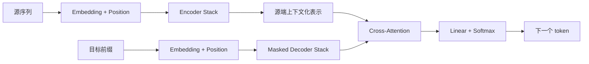

# Transformer：从自注意力到大模型的统一架构

如果希望先建立对 Transformer block 的直观认识，可以先阅读下面的交互式结构图。该图概括了编码器块与解码器块中 attention、残差连接、Layer Normalization 与前馈网络之间的关系：

<TransformerBlockExplorer />

---

> 相关论文：
> - Bahdanau, Cho, and Bengio (2015)：把 attention 引入 Seq2Seq，开启“按需读取输入”的建模路线。
> - Vaswani et al. (2017)：提出 Transformer，以 self-attention 取代递归，成为现代序列建模主干。
> - Devlin et al. (2019)：以 BERT 展示 encoder-only Transformer 在表示学习与理解任务上的能力。
> - Radford et al. (2018, 2019) 与 Brown et al. (2020)：以 GPT 系列展示 decoder-only Transformer 在自回归生成上的扩展性。
> - Raffel et al. (2020)：以 T5 系统化 encoder-decoder Transformer 在统一文本到文本任务中的作用。

## 问题背景与范式转变

Transformer（变换器）是一类以 **self-attention 为核心计算单元** 的神经网络架构，用于处理文本、语音、图像 patch、蛋白质序列等具有离散位置结构的数据。

它之所以重要，不只是因为在机器翻译上替代了 RNN，而是因为它把序列建模的默认思路从「沿时间递归传递状态」改写成了「让每个位置按内容去读取全局上下文」。

在 RNN、LSTM 与早期 Seq2Seq 中，信息主要沿时间链条逐步传播：

$$
h_t = f(x_t, h_{t-1})
$$

这意味着：

- 计算天然串行，很难像矩阵乘法那样大规模并行；
- 长距离依赖必须跨越很多时间步才能传播；
- 历史信息被不断压缩进有限状态，容易形成信息瓶颈。

Transformer 的核心改写则是：

- 用 self-attention 让任意两个位置在同一层内直接交互；
- 用位置编码显式补回顺序信息；
- 用残差连接、LayerNorm 与前馈网络，把 attention 稳定地堆叠成深层模型。

因此，Transformer 更准确的定义不是「一种新 attention 公式」，而是：**一种把全局内容相关交互变成主干结构的通用建模框架。**

---

## 符号约定与核心公式

本文统一采用 $d_{\mathrm{model}}$ 表示模型维度，序列长度记为 $n$，头数记为 $h$。若无特殊说明，输入矩阵按“序列长度在前、特征维在后”的形式书写。

| 符号 | 含义 |
| --- | --- |
| $X \in \mathbb{R}^{n \times d_{\mathrm{model}}}$ | 输入序列表示矩阵 |
| $x_t \in \mathbb{R}^{d_{\mathrm{model}}}$ | 第 $t$ 个位置的输入向量 |
| $p_t \in \mathbb{R}^{d_{\mathrm{model}}}$ | 第 $t$ 个位置的位置向量 |
| $Q,K,V$ | query、key、value 矩阵 |
| $d_k,d_v$ | 每个 attention 头中 key / value 的维度 |
| $M$ | 掩码矩阵，如 padding mask 或 causal mask |
| $A$ | 注意力权重矩阵 |
| $\mathrm{FFN}(\cdot)$ | 逐位置前馈网络 |
| $\mathrm{LN}(\cdot)$ | Layer Normalization |
| $H^{(\ell)}$ | 第 $\ell$ 层 Transformer block 的输出 |

下文依次讨论 Transformer 对递归主干的替代逻辑、attention 的数学主线、位置机制与 mask、多头注意力、编码器与解码器结构，以及训练推理中的工程瓶颈。

在进入正文前，可以先记住 6 个核心公式：

1. 输入表示与位置编码结合：
$$
z_t = x_t + p_t
$$

2. 线性投影得到 $Q,K,V$：
$$
Q = XW_Q,\quad K = XW_K,\quad V = XW_V
$$

3. 缩放点积 attention：
$$
\mathrm{Attention}(Q,K,V) = \mathrm{softmax}\left(\frac{QK^\top}{\sqrt{d_k}}\right)V
$$

4. 带掩码 attention：
$$
\mathrm{MaskedAttention}(Q,K,V) = \mathrm{softmax}\left(\frac{QK^\top}{\sqrt{d_k}} + M\right)V
$$

5. 多头注意力：
$$
\mathrm{MultiHead}(Q,K,V) = \mathrm{Concat}(\mathrm{head}_1,\dots,\mathrm{head}_h)W_O
$$

6. 现代常见的 pre-LN Transformer block：
$$
\tilde{H}^{(\ell)} = H^{(\ell-1)} + \mathrm{MHA}(\mathrm{LN}(H^{(\ell-1)}))
$$

$$
H^{(\ell)} = \tilde{H}^{(\ell)} + \mathrm{FFN}(\mathrm{LN}(\tilde{H}^{(\ell)}))
$$

---

## Transformer 的建模动机

Transformer 的出现，根本上是在回答一个问题：**如果目标是建模长距离依赖，为什么还要让信息沿时间一步一步传？**

在递归架构中，序列越长，早期信息到达后续位置的路径就越长；而在 self-attention 中，位置 $i$ 可以直接与位置 $j$ 建立联系。于是，两类架构的主要差异可以概括为：

| 维度 | RNN / LSTM | Transformer |
| --- | --- | --- |
| 信息传递方式 | 递归状态逐步传递 | self-attention 全局交互 |
| 训练并行性 | 弱 | 强 |
| 长依赖路径长度 | 随距离线性增长 | 同层中可直接连接 |
| 顺序信息来源 | 结构天然包含顺序 | 需显式位置机制 |
| 主要瓶颈 | 串行计算、梯度链过长 | attention 的二次复杂度 |

从更高层看，Transformer 建立在 4 个假设之上：

- 序列中任意两个位置之间都可能存在重要依赖；
- 相关性应由内容动态决定，而不是由固定窗口或固定递归路径决定；
- 顺序信息可以通过显式机制注入，而不一定要靠递归结构隐式承载；
- 深层语义表示可以由“跨位置读取 + 逐位置重加工”的 block 反复堆叠得到。

如果把原始 encoder-decoder Transformer 的总流程压缩成一张概览图，可以写成：



这张图中最关键的不是模块名称，而是信息流逻辑：

- 编码器先把输入序列内部关系建模好；
- 解码器一边维护已生成前缀，一边有条件地读取编码器输出；
- 输出层再把当前隐藏状态映射为下一个 token 的概率分布。

---

## Attention 的数学主干

如果希望从运算顺序理解 attention，可以先看下面的交互式流程图：

<AttentionMathFlow />

### Q、K、V 的功能分解

设输入矩阵为 $X$，Transformer 先通过三组可学习参数得到：

$$
Q = XW_Q,\quad K = XW_K,\quad V = XW_V
$$

这一步不是“把同一个向量复制三次”，而是把同一位置拆成 3 种功能角色：

- **Query**：当前位置正在寻找什么样的上下文；
- **Key**：当前位置可以向别的位置暴露哪些可匹配特征；
- **Value**：当前位置真正被读取、被聚合的内容表示。

如果借助检索系统类比，那么 Query 更像检索请求，Key 更像可匹配的索引特征，Value 更像真正被返回的正文内容。也正因为如此，attention 先比较 $Q$ 与 $K$，再利用匹配结果去读取 $V$。

### 缩放点积 Attention 的计算机制

原始 Transformer 使用的 attention 形式是：

$$
\mathrm{Attention}(Q,K,V) = \mathrm{softmax}\left(\frac{QK^\top}{\sqrt{d_k}}\right)V
$$

把它拆开看，可以分成 4 步：

1. $QK^\top$ 计算所有位置对之间的相关性分数；
2. 除以 $\sqrt{d_k}$ 控制 logits 的数值尺度；
3. softmax 把每一行分数变成和为 $1$ 的注意力分布；
4. 用这组权重对所有 value 做加权聚合。

若聚焦到位置 $i$ 对位置 $j$ 的单个打分，则有：

$$
s_{ij} = \frac{q_i^\top k_j}{\sqrt{d_k}}
$$

再经 softmax 得到：

$$
a_{ij} = \frac{\exp(s_{ij})}{\sum_{\ell=1}^{n}\exp(s_{i\ell})}
$$

于是位置 $i$ 的输出可以写成：

$$
y_i = \sum_{j=1}^{n} a_{ij}v_j
$$

这说明一个位置的新表示，本质上是“按相关性从整段序列中读出信息后的加权和”。

若进一步把权重矩阵显式写为

$$
A = \mathrm{softmax}\left(\frac{QK^\top}{\sqrt{d_k}}\right)
$$

则 attention 输出就是

$$
\mathrm{Attention}(Q,K,V) = AV
$$

其中：

- $QK^\top$ 给出任意两个位置之间的匹配分数；
- softmax 把每一行分数归一化为注意力权重；
- 与 $V$ 相乘后，每个位置得到从整段序列读取后的加权聚合结果。

如果只看第 $i$ 个位置，那么它真正做的事情可以概括为：先问“我现在最需要什么信息”，再对全句所有位置打分，最后把高相关位置的 value 以较大权重读回来。

### 缩放因子的数值稳定性作用

若 $q_i$ 与 $k_j$ 的各维分量近似独立且方差稳定，那么点积 $q_i^\top k_j$ 的量级会随维度增长而增大。若直接把大数送入 softmax，分布会迅速变得过尖，导致：

- 最大项权重过早接近 1；
- 其他项权重接近 0；
- 梯度变小，训练变得不稳定。

因此，除以 $\sqrt{d_k}$ 的作用主要是**校正数值尺度**，而不是改变相关性的排序逻辑。

### 从分数矩阵到加权聚合

如果希望更直观看到掩码、softmax 与加权输出之间的关系，可以看下面的交互式矩阵图：

<AttentionScoreMatrixExplorer />

对固定位置而言，attention 完成的是一次“对全局候选信息的软检索”。这也是 Transformer 相比固定窗口模型最关键的优势之一：当前位置并不需要提前知道应该看多远，而是可以由内容自己决定该看哪里。

为了建立更直观的语义感觉，可以看一个极简例子：

> The animal didn't cross the street because it was too tired.

当模型更新代词 `it` 的表示时，它不会只看 `it` 自己，而会把 `it` 的 query 与全句所有 key 做匹配。一个简化后的示意如下：

| 被关注位置 | 语义线索 | 假设匹配分数 | softmax 后权重 |
| --- | --- | --- | --- |
| `animal` | 可以成为“累”的施事者 | 3.2 | 0.80 |
| `street` | 与“累”在语义上不协调 | 1.1 | 0.10 |
| `it` | 保留当前位置自身信息 | 1.1 | 0.10 |
| 其他词 | 提供背景，但关联较弱 | 接近 0 | 接近 0 |

于是 `it` 的新表示可以近似理解为：

$$
y_{\text{it}}
\approx
0.8\,v_{\text{animal}}
+ 0.1\,v_{\text{street}}
+ 0.1\,v_{\text{it}}
+ \cdots
$$

这个例子体现了 self-attention 的本质：**每个位置都在根据自身需求，从整段序列中动态读取最有用的上下文。**

---

## 多头注意力与多视角表征

单头 attention 已经可以完成全局读取，但它只工作在一组投影后的子空间里。真实语言中，模型往往需要同时关注：

- 局部搭配；
- 主谓宾等句法依赖；
- 指代、共指与长距离一致性；
- 主题、情绪、语气等更高层语义线索。

因此，Transformer 采用多头机制：

$$
\mathrm{head}_r = \mathrm{Attention}(QW_r^Q, KW_r^K, VW_r^V)
$$

$$
\mathrm{MultiHead}(Q,K,V) = \mathrm{Concat}(\mathrm{head}_1,\dots,\mathrm{head}_h)W_O
$$

如果希望从“并行分工”的角度理解多头注意力，可以看下面的交互式结构图：

<MultiHeadAttentionExplorer />

多头机制的关键价值在于：

- 不同头可以把同一输入映射到不同表示子空间；
- 各头可以学习不同类型的匹配模式；
- 拼接后再经 $W_O$ 投影，使模型可以统一融合这些并行视角。

若每个头的输出维度为 $d_v$，则拼接后的向量维度为 $hd_v$，再通过输出投影矩阵映射回标准模型维度。之所以不直接把各头结果相加，而是先做 $\mathrm{Concat}(\cdot)$ 再乘 $W_O$，主要有两个原因：

- 直接相加会过早混合不同头学到的关系模式；
- 拼接后再投影，更有利于保留“先分工、后融合”的结构分层。

因此，多头注意力的输出过程可以理解为两步：

1. 各个头在不同子空间里独立提取上下文特征；
2. 再由 $\mathrm{Concat}(\cdot)$ 与 $W_O$ 统一融合成可传递给下一层的标准表示。

需要特别注意的是，多头注意力并不保证“每个头一定对应一种人类可解释的语言现象”。在实际模型里：

- 有些头确实会呈现较清晰的句法或指代模式；
- 也有一些头更像在执行分工不明显的特征混合；
- 头的重要性会随层数、任务与训练规模而变化。

因此，更稳妥的理解是：**多头注意力是一种表达能力增强机制，而不是一组天然带语义标签的显微镜。**

---

## 顺序信息与可见性约束

attention 本身只关心“谁和谁相关”，并不天然知道“谁在前、谁在后”，也不天然知道“当前位置能不能看未来”。因此，Transformer 还需要两类补充机制：

- 位置机制，解决顺序感问题；
- 掩码机制，解决可见性约束问题。

### 位置编码与顺序表征

Transformer 通常先把 token embedding 与位置向量相加：

$$
z_t = x_t + p_t
$$

若没有这一步，模型面对同一组 token 的不同排列时，往往难以稳定区分顺序差异。

原始 Transformer 使用的是正弦-余弦位置编码：

$$
\mathrm{PE}(pos, 2i) = \sin\left(\frac{pos}{10000^{2i / d}}\right),\quad
\mathrm{PE}(pos, 2i + 1) = \cos\left(\frac{pos}{10000^{2i / d}}\right)
$$

它的直观动机是：

- 不同位置拥有不同相位组合；
- 相邻位置之间变化平滑；
- 模型有机会通过线性关系感知相对位移。

目前常见的位置机制包括：

- **绝对位置编码**：直接告诉模型“你在第几位”；
- **相对位置编码**：直接告诉模型“你与我相差几位”；
- **RoPE**：把位置信息写入 query / key 的旋转相位，在大语言模型中非常常见。

下面的交互式对比图可以帮助建立三类位置机制的直觉：

<PositionEncodingCompareExplorer />

从工程角度看，位置机制不仅影响顺序建模，还影响：

- 长上下文外推能力；
- KV cache 的兼容方式；
- 长距离依赖在注意力中的衰减形式。

若进一步比较三种主流路线，可以大致把它们理解为：

| 机制 | 核心思想 | 优点 | 典型代价或限制 |
| --- | --- | --- | --- |
| 绝对位置编码 | 直接把“你在第几位”加到输入上 | 实现简单，概念直接 | 长长度外推通常较弱 |
| 相对位置编码 | 在 attention 中显式建模相对距离 | 更强调局部与相对关系 | 公式与实现更复杂 |
| RoPE | 把位置写进 $Q,K$ 的旋转相位 | 长上下文与缓存兼容性较好 | 仍需处理外推与缩放问题 |

因此，位置机制虽然在结构图里只是一小步，但它实际上决定了 Transformer 是否真的能区分“谁在前、谁在后”，也是长上下文扩展中最关键的设计点之一。

### 掩码机制与可见性控制

掩码矩阵的常见写法为：

$$
\mathrm{MaskedAttention}(Q,K,V) = \mathrm{softmax}\left(\frac{QK^\top}{\sqrt{d_k}} + M\right)V
$$

其中 $M$ 通常有两类：

- **padding mask**：屏蔽补齐位置，避免模型把无意义的 `<PAD>` 当成真实上下文；
- **causal mask**：在自回归生成中屏蔽未来位置，保证当前位置不能偷看答案。

下面的交互式对比块展示了位置机制与掩码机制在理解式任务和生成式任务中的不同作用：

<MaskPositionExplorer />

对因果掩码而言，常见定义是：

$$
M_{ij} =
\begin{cases}
0, & j \le i \\
-\infty, & j > i
\end{cases}
$$

这样在 softmax 之后，未来位置的权重就会变成 0。

### 三类 Attention 的结构差异

在完整 Transformer 中，最容易混淆的往往不是公式，而是 $Q,K,V$ 分别来自哪里。三类常见 attention 可以统一比较如下：

| 类型 | $Q$ 来源 | $K,V$ 来源 | 可见性约束 | 典型用途 |
| --- | --- | --- | --- | --- |
| Encoder self-attention | 编码器当前层输入 | 同一编码器层输入 | 通常只屏蔽 padding | 建模源序列内部关系 |
| Decoder masked self-attention | 解码器当前层输入 | 同一解码器层输入 | 额外使用 causal mask | 维护生成前缀 |
| Cross-attention | 解码器当前状态 | 编码器输出 | 通常只屏蔽源端 padding | 从条件输入中读取信息 |

其中 cross-attention 可以写为：

$$
\mathrm{CrossAttention}(Q_{\mathrm{dec}}, K_{\mathrm{enc}}, V_{\mathrm{enc}})
=
\mathrm{softmax}\left(
\frac{Q_{\mathrm{dec}}K_{\mathrm{enc}}^\top}{\sqrt{d_k}}
\right)V_{\mathrm{enc}}
$$

它的意义是：解码器不是被动接受整段编码器输出，而是带着“当前最需要什么信息”的查询去读取输入表示。

如果借助检索的直观类比，那么：

- 在 encoder self-attention 中，序列是在“内部互相查看”；
- 在 decoder masked self-attention 中，序列是在“只回顾历史前缀”的前提下内部互相查看；
- 在 cross-attention 中，解码器当前状态则像一个检索请求，去编码器输出中查找此刻最相关的条件信息。

从功能分工上，也可以把三者概括为：

- encoder self-attention：先把输入句子“读懂”；
- decoder masked self-attention：在不偷看未来的前提下维护生成历史；
- cross-attention：在生成当前 token 时，动态对齐并读取源序列内容。

---

## Transformer Block 的结构组成

attention 解决的是“当前位置应该从哪里读取信息”，但这还不够。一个可扩展的深层模型还需要解决另外两个问题：

- 读完上下文之后，当前位置内部如何进一步重组特征；
- 多层堆叠之后，训练如何保持稳定。

这正是 FFN、残差连接与 LayerNorm 存在的原因。

### 前馈网络与逐位置非线性变换

典型前馈网络写为：

$$
\mathrm{FFN}(x) = W_2\,\phi(W_1x + b_1) + b_2
$$

它可以理解为“施加在每个位置上的同一组两层 MLP”。于是：

- attention 负责跨位置交换信息；
- FFN 负责在单个位置内部重组、扩展并压缩特征。

在现代模型中，FFN 常采用“先升维、后压回”的结构，例如：

$$
d_{\mathrm{model}} \rightarrow d_{\mathrm{ff}} \rightarrow d_{\mathrm{model}}
$$

这使模型能够在更大的中间特征空间中执行非线性组合。

如果借助一个更形象的类比，那么 multi-head attention 更像一次“团队讨论”：每个 token 先和其他位置交换信息，弄清楚当前上下文里谁与谁相关；而 FFN 更像讨论结束后的“独立加工环节”：每个位置拿着刚刚整合好的上下文表示，再在自己的局部通道里做进一步分析与压缩。

从这个角度看，attention 解决的是“信息从哪里来”，FFN 解决的是“拿到这些信息后，当前位置内部如何重新组织这些特征”。

### 前馈网络中非线性的必要性

FFN 的关键不只在于“升维再降维”，更在于中间插入了非线性激活函数 $\phi(\cdot)$。若没有这一项，那么连续堆叠的线性变换本质上仍可合并为一个更大的线性变换，模型表达能力会受到明显限制。

更具体地说，若令

$$
\phi(x) = x
$$

则有

$$
\mathrm{FFN}(x) = W_2(W_1x + b_1) + b_2
= (W_2W_1)x + (W_2b_1 + b_2)
$$

这依然只是一次线性变换。也就是说，若 FFN 没有非线性，那么它并不能真正增加表示空间中的可分性与组合能力。

也正因为如此，现代 Transformer 中常见的 FFN 激活函数包括：

- ReLU：实现简单，历史上使用广泛；
- GELU：在 BERT、ViT 等模型中很常见；
- SwiGLU / GeGLU：在许多现代大模型中更常见，因为它们通常在参数利用率与性能上更有优势。

从这个角度看，self-attention 负责“跨位置读信息”，而 FFN 中的非线性负责“把读到的信息转成更有判别力的局部表示”。

### 残差连接与 LayerNorm 的稳定化作用

若没有残差连接，深层网络中的信息与梯度都必须完全穿过复杂的非线性变换；若没有归一化，层间尺度漂移会使训练更加脆弱。

因此，Transformer block 通常采用：

- **残差连接**：保留恒等信息通路；
- **LayerNorm**：稳定不同层之间的数值分布；
- **子层堆叠**：通常是 attention 子层后接 FFN 子层。

现代大模型中更常见的是 pre-LN 形式：

$$
\tilde{H}^{(\ell)} = H^{(\ell-1)} + \mathrm{MHA}(\mathrm{LN}(H^{(\ell-1)}))
$$

$$
H^{(\ell)} = \tilde{H}^{(\ell)} + \mathrm{FFN}(\mathrm{LN}(\tilde{H}^{(\ell)}))
$$

而原始论文中常见的是 post-LN 形式，即在残差相加后再做归一化。两者都能工作，但 pre-LN 往往更有利于深层训练稳定性，因此在现代实现中更常见。

### 编码器块与解码器块的功能分工

结合文首交互图，可以把两类 block 的分工概括为：

- **编码器块**：用 self-attention 理解输入序列内部关系，再用 FFN 重组每个位置表示；
- **解码器块**：先用 masked self-attention 维护生成历史，再用 cross-attention 读取输入条件，最后再经 FFN 输出当前层表示。

这也是为什么 Transformer 虽然以 attention 著称，但真正支撑其深层可扩展性的其实是一个完整 block，而不是单个 attention 公式。

### 编码器块的前向传播伪代码

如果从实现角度理解 Transformer，一个 pre-LN 编码器块的前向过程可以用伪代码写成：

```text
TRANSFORMER-ENCODER-BLOCK(X)
	// X 的形状为 n x d_model
	N1 ← LN(X)
	Q ← N1 W_Q
	K ← N1 W_K
	V ← N1 W_V

	S ← (Q K^T) / √d_k
	A ← softmax(S)
	H ← A V
	M ← Concat(head_1, head_2, ..., head_h) W_O
	R1 ← X + M

	N2 ← LN(R1)
	F ← W_2 φ(W_1 N2 + b_1) + b_2
	Y ← R1 + F

	return Y
```

若是解码器块，则还需要在 self-attention 阶段加入 causal mask，并在中间插入一次 cross-attention。这个伪代码的价值在于，它把前面较抽象的公式主线收束成一个工程上真正会执行的前向过程。

### 解码器块的前向传播伪代码

若进一步从实现角度考察标准 encoder-decoder Transformer，则一个 pre-LN 解码器块的前向过程可以写成：

```text
TRANSFORMER-DECODER-BLOCK(Y, H_enc, M_causal)
	// Y 为解码器输入，H_enc 为编码器输出
	N1 ← LN(Y)
	Q1 ← N1 W_Q^self
	K1 ← N1 W_K^self
	V1 ← N1 W_V^self

	S1 ← (Q1 K1^T) / √d_k + M_causal
	A1 ← softmax(S1)
	U1 ← A1 V1
	R1 ← Y + Concat(head_1, ..., head_h) W_O^self

	N2 ← LN(R1)
	Q2 ← N2 W_Q^cross
	K2 ← H_enc W_K^cross
	V2 ← H_enc W_V^cross

	S2 ← (Q2 K2^T) / √d_k
	A2 ← softmax(S2)
	U2 ← A2 V2
	R2 ← R1 + Concat(head_1, ..., head_h) W_O^cross

	N3 ← LN(R2)
	F ← W_2 φ(W_1 N3 + b_1) + b_2
	Z ← R2 + F

	return Z
```

与编码器块相比，解码器块多出的关键步骤有两点：

- masked self-attention 通过因果掩码保证自回归约束；
- cross-attention 使解码器能够在当前生成步查询编码器输出。

---

## Transformer 的三类主流结构路线

原始 Transformer 是完整的 encoder-decoder 结构，但后续模型很快沿任务目标分化出三条主线：

| 路线 | 结构保留 | 代表模型 | 适合任务 | 核心可见性 |
| --- | --- | --- | --- | --- |
| Encoder-only | 只保留编码器 | BERT、RoBERTa | 分类、抽取、检索、表示学习 | 双向可见 |
| Decoder-only | 只保留解码器 | GPT、LLaMA 类模型 | 自回归生成、对话、代码生成 | 因果可见 |
| Encoder-Decoder | 同时保留两者 | T5、BART | 翻译、摘要、改写、条件生成 | 编码器双向，解码器因果 |

三条路线背后的逻辑并不复杂：

- 若任务重点是“读懂输入”，保留 encoder-only 更自然；
- 若任务重点是“逐步生成输出”，decoder-only 更自然；
- 若任务同时要求“先理解输入，再按条件生成输出”，encoder-decoder 更自然。

这也是为什么今天常把 BERT、GPT、T5 都归在 Transformer 家族之下，但它们并不是同一种结构的简单缩放版本，而是围绕不同目标函数做出的结构裁剪。

### 不同结构路线的任务接口

如果从任务接口而不是从网络结构来理解三条路线，它们也可以被概括为三种不同的“输入输出合同”：

- encoder-only：输入整段序列，输出整段上下文化表示，适合接分类头、抽取头或向量检索头；
- decoder-only：输入前缀，输出下一个 token 分布，适合自回归生成；
- encoder-decoder：输入条件序列与目标前缀，输出条件生成分布，适合翻译、摘要、改写等任务。

这也是为什么同样都叫 Transformer，但具体落到任务时，它们的使用方式会非常不同：

- BERT 类模型更像“表示提取器”；
- GPT 类模型更像“序列延续器”；
- T5 / BART 类模型更像“条件重写器”。

---

## 训练机制与目标函数

Transformer 的训练优势主要体现在：**虽然序列有顺序，但训练时很多位置可以并行计算。**

### Encoder-Decoder 的条件生成目标

在翻译、摘要等任务中，目标通常写为：

$$
P(Y \mid X) = \prod_{t=1}^{m} P(y_t \mid y_{<t}, X)
$$

训练时常使用教师强制（Teacher Forcing），即把真实前缀 $y_{<t}$ 输入解码器，从而并行计算整段目标序列的损失：

$$
\mathcal{L} = -\sum_{t=1}^{m}\log P(y_t \mid y_{<t}, X)
$$

### Decoder-Only 的语言建模目标

对于 GPT 类模型，训练目标是标准的下一 token 预测：

$$
P(x_1,\dots,x_n) = \prod_{t=1}^{n} P(x_t \mid x_{<t})
$$

由于整段训练样本已经已知，虽然注意力带有因果掩码，但所有位置的 logits 仍然可以在一次前向中并行算出。这正是“训练并行、推理串行”这一现象的来源。

### Encoder-Only 的掩码建模目标

对于 BERT 类模型，常见目标是 Masked Language Modeling。其关键不是让模型从左到右生成，而是让模型在双向上下文中恢复被遮蔽的 token。于是：

- 编码器可以同时利用左右文；
- 训练目标更偏向表示学习；
- 输出通常服务于分类、检索、抽取等下游任务。

从这个角度看，Transformer 并不是单一训练范式，而是一个可承载多种目标函数的统一主干。

### 从预训练到任务适配与对齐

现代 Transformer 系统往往并不是“一次训练直接结束”，而是沿着多阶段流程逐步构建能力。若用更工程化的语言概括，常见路径包括：

1. 预训练：在大规模通用数据上学习基础语言或表示能力；
2. 微调：在任务数据上适配特定目标，如分类、问答、摘要或翻译；
3. 对齐：尤其在大语言模型中，再通过指令数据、偏好数据或安全约束继续调节输出风格与行为边界。

对三类 Transformer 而言，这条路径的具体形态又不完全相同：

- encoder-only 模型常见“预训练 + 下游微调”；
- decoder-only 模型常见“预训练 + 指令微调 + 对齐”；
- encoder-decoder 模型常见“预训练 + 任务化条件生成微调”。

也正因为这种分阶段训练方式，今天讨论 Transformer 时，往往不能只看网络结构本身，还要连同训练配方一起理解。很多能力差异不只是“模型长什么样”，也来自“它经历了怎样的训练过程”。

### 复杂度与参数规模

Transformer 的表达能力很强，但代价也很明确。若只看标准 self-attention，长度为 $n$、模型维度为 $d$ 的输入通常需要构造一个 $n \times n$ 的分数矩阵，因此其主导代价常被概括为：

- 时间复杂度与空间复杂度都随序列长度近似呈二次增长；
- 序列越长，attention 矩阵与中间激活越昂贵；
- 这类代价在训练和推理中都会放大，但表现形式不同。

若把参数规模的主要来源粗略拆开，通常包括：

- embedding 与输出层参数；
- attention 中的 $W_Q,W_K,W_V,W_O$；
- FFN 中的两层线性变换；
- LayerNorm 与偏置等辅助参数。

从经验上看，随着层数、头数、隐藏维度与上下文长度一起扩展，模型能力往往能持续提升，但显存、吞吐、通信与推理延迟也会同步上升。这也是为什么 Transformer 的发展始终不是单纯“把模型做大”，而是“在能力扩展与工程成本之间不断重新找平衡”。

---

## 推理机制与生成代价

虽然 Transformer 训练时高度并行，但在自回归生成时，解码器仍必须逐 token 推进：

$$
\hat{y}_t \sim P(y_t \mid y_{<t}, X)
$$

因此，推理阶段的主要瓶颈与训练并不相同。

### KV Cache 与重复计算消除

在 decoder-only 或解码器侧自回归生成中，若每生成一个新 token 都重新计算整个历史前缀的 $K,V$，代价会非常高。于是现代系统通常缓存历史层的 key / value：

- 旧 token 的 $K,V$ 只算一次并存储；
- 新 token 到来时，只需计算它自己的 query，以及必要的新 key / value；
- attention 再与缓存中的历史 $K,V$ 一起完成读取。

KV cache 的收益很明显，但也带来新的显存压力。上下文越长、层数越多、头数越多，缓存越大。

也正因为如此，长上下文推理的瓶颈往往不只来自参数本身，还来自缓存本身。若显存不足，最直接的后果包括：

- cache 不能继续追加，导致 OOM；
- 即使尚未 OOM，访存开销也会显著拉高每 token 延迟；
- 长上下文的理论收益未必能真正兑现，因为系统可能先被缓存管理成本拖慢。

因此，很多长上下文系统会把 KV cache 看成首要优化对象，而不是简单地把“窗口越开越大”当成唯一目标。

### 训练与推理的瓶颈差异

| 阶段 | 主要瓶颈 | 典型表现 |
| --- | --- | --- |
| 训练 | 长序列 attention、激活保存、分布式通信 | 吞吐与显存受限 |
| 推理 | 自回归串行、KV cache 膨胀、访存带宽 | 首 token 延迟与每 token 延迟升高 |

也正因此，现代 Transformer 工程优化通常分成两条路线：

- 面向训练：混合精度、张量并行、流水并行、FlashAttention 等；
- 面向推理：KV cache、量化、连续批处理、speculative decoding 等。

### 生成阶段的解码策略

在生成任务里，模型每一步实际上输出的是一个词表分布，而不是直接给出唯一答案。因此，推理不仅包含“算出分布”，还包含“如何从分布中选 token”。

常见策略包括：

- Greedy decoding：每一步直接取概率最大的 token，简单但容易变得保守、重复；
- Beam search：同时保留多个候选前缀，常用于翻译等条件生成任务；
- Top-k sampling：只在概率最高的前 $k$ 个 token 中采样；
- Top-p sampling：在累计概率达到阈值 $p$ 的候选集合中采样；
- Temperature：通过缩放 logits 控制输出分布的平滑程度。

这些策略不改变 Transformer 主干本身，但会显著影响最终输出的风格：

- 条件生成任务更常偏向稳定搜索，如 beam search；
- 开放式生成任务更常偏向随机采样，如 top-k / top-p；
- 对话系统则常在流畅性、确定性与多样性之间折中选择。

### 长上下文推理的代价来源

标准 self-attention 的时间与空间代价通常随序列长度呈二次增长。对长度为 $n$ 的输入，注意力分数矩阵规模为：

$$
n \times n
$$

因此，当上下文窗口持续扩大时，系统不仅要处理更大的 attention 矩阵，还要维持更大的缓存与更重的访存开销。这也是长上下文 Transformer 研究始终围绕以下问题展开的原因：

- 如何减少二次复杂度；
- 如何让模型更稳定地利用很长的上下文；
- 如何在有限显存下保存真正重要的历史信息。

工程上常见的思路包括：

- **滑动窗口**：只保留最近的 $N$ 个 token；
- **关键位置保留**：优先保留长期重要的 token，而不是只按时间裁剪；
- **分层或分块缓存管理**：按层、按位置范围或按硬件资源做更细粒度分配；
- **压缩与量化**：用更低精度或更紧凑的表示存储历史 $K,V$。

其中滑动窗口最直观，但也最容易带来语义风险。因为语言序列不像普通缓存数据那样只讲“最近最常用”，很早之前出现的系统指令、角色设定、长文主线与关键实体，依然可能决定后续生成。

也正因为如此，更精细的缓存策略通常会同时保留三类对象：

- 最近 token：保证当前局部上下文连续；
- 高重要性 token：例如长期被频繁关注的 heavy hitters；
- 开头锚点 token：一些方法会额外保留最开始的少量位置，作为注意力分布的稳定锚点。

从这个角度看，长上下文推理的本质并不只是“把窗口尽可能开大”，而是“在有限显存下尽量把真正重要的历史信息留下来”。

---

## 最小案例：Transformer 中的信息流

考虑一个最小翻译例子：

$$
X = [\text{I},\ \text{love},\ \text{you}]
$$

目标输出为：

$$
Y = [\text{我},\ \text{爱},\ \text{你}]
$$

在 encoder-decoder Transformer 中，信息流大致如下：

| 步骤 | 当前模块 | 发生了什么 |
| --- | --- | --- |
| 1 | 输入层 | `I / love / you` 先变成 embedding，并加入位置信息 |
| 2 | Encoder self-attention | 每个源词读取整句上下文，得到上下文化表示 |
| 3 | Decoder 输入 | 解码器接收已生成前缀，如「我」 |
| 4 | Masked self-attention | 解码器只能看见自己与历史前缀，不能看未来 |
| 5 | Cross-attention | 当前解码状态去读取编码器输出，重点关注 `love` 或 `you` 等相关位置 |
| 6 | 输出层 | 线性映射到词表后，更容易预测下一个词「爱」 |

这个例子说明，Transformer 真正高效的地方不在于“只剩 attention”，而在于把以下几件事拆开并协同完成：

- 编码器负责把输入“读懂”；
- 解码器负责维护生成历史；
- cross-attention 负责把条件输入按需注入生成过程；
- FFN、残差与 LayerNorm 负责让整个堆叠过程稳定可训练。

### 模块级数据流的细化分析

上面的表格给的是模块级视角。若把同一个例子继续拆到“每一层到底在交换什么信息”的粒度，可以把它理解成如下过程：

1. `I / love / you` 先被映射成 3 个向量，并加上位置编码；
2. 在编码器第一层里，`love` 会与 `I`、`you` 互相计算相关性，从而把“谁是动作发出者、谁是动作对象”这种关系编码进自己的表示；
3. 多层编码器堆叠后，源端输出不再只是 3 个孤立词向量，而是“已经读懂整句关系”的上下文化表示；
4. 解码器在看到前缀「我」时，会先通过 masked self-attention 维护“目前已经生成了什么”；
5. 接着，cross-attention 会让当前解码状态去查询编码器输出，此时很可能更关注 `love` 所在的位置；
6. 经过 FFN 与输出层投影，模型对词表中「爱」的概率会被明显抬高；
7. 当下一步生成「你」时，cross-attention 的关注重点又可能从 `love` 转向 `you`。

若把这个过程理解成一种动态检索，那么生成每个 token 时，解码器都在重复两件事：

- 先回顾“我已经生成到了哪里”；
- 再查询“原输入里此刻最相关的信息在哪里”。

也正因为这种“先维护历史，再按需读条件”的结构，Transformer 才特别适合翻译、摘要、改写、问答等条件生成任务。

### Cross-Attention 的简化示例

假设当前解码器正准备在前缀「我」之后生成下一个词。此时它的查询向量 $q_{\mathrm{dec}}$ 可能会与编码器输出中的 3 个位置产生如下简化打分：

| 源端位置 | 对应词 | 假设匹配分数 |
| --- | --- | --- |
| 1 | `I` | 0.8 |
| 2 | `love` | 3.4 |
| 3 | `you` | 1.2 |

softmax 之后，权重可能近似变成：

| 源端位置 | softmax 权重 |
| --- | --- |
| `I` | 0.06 |
| `love` | 0.82 |
| `you` | 0.12 |

于是 cross-attention 的读出结果就会更接近 `love` 对应的 value 表示。这并不意味着模型“只看 love”，而是说明：**在当前生成步里，`love` 提供了最关键的条件信息。**

如果下一个生成步变成在前缀「我 爱」之后预测最后一个词，那么新的查询向量就可能更多关注 `you`。因此，cross-attention 的本质并不是“整句一次性对齐完毕”，而是“随着生成进度不断重新对齐”。

---

## 常见问题与概念辨析

在第一次学习 Transformer 时，最常见的困惑往往不是公式本身，而是一些“听起来很像、但其实并不一样”的概念。下面把几个高频问题集中澄清。

### Self-Attention 与 Attention 的概念区分

attention 是更一般的概念，意思是“当前位置根据某种查询去读取一组候选表示”。self-attention 则是 attention 的一个特例，其特点是：

- $Q,K,V$ 都来自同一序列；
- 因而本质上是在做“序列内部彼此查看”；
- 它适合建模输入内部关系或生成前缀内部关系。

与之对应，cross-attention 则是：

- $Q$ 来自解码器；
- $K,V$ 来自编码器；
- 本质上是在做“目标端去查询源端”。

### Transformer 中顺序信息的来源

不是。更准确地说，Transformer 的 attention 主体本身不天然携带顺序感，但任务本身通常高度依赖顺序。因此它并不是“不需要顺序”，而是“把顺序信息从递归结构中剥离出来，交给显式位置机制处理”。

这也是为什么位置编码不是附属装饰，而是主干结构不可缺的一部分。

### Attention 权重的解释边界

也不能简单这么理解。attention 权重更接近“当前计算步中，模型把多少读取权重分配给哪些位置”。它可以提供一定解释线索，但并不总能稳定等价于：

- 语义重要性；
- 因果重要性；
- 人类直觉中的“决定性证据”。

因此，attention 图可用于辅助分析，但不应被当作唯一解释工具。

### 头数与建模能力的关系

也不是。更多的头意味着：

- 模型有机会在更多子空间中并行建模；
- 但参数、显存、通信与访存成本也会上升；
- 若头太多而每头维度过小，单头表达能力也可能受限。

因此，头数是一个结构权衡项，而不是越大越好。

### 训练并行性与推理串行性

因为训练时整段目标序列通常是已知的，即使使用 causal mask，所有位置的 logits 仍可在一次前向中并行算出；而推理时下一个 token 尚未知晓，只能在拿到当前步输出后再继续下一步。因此：

- 训练并行，强调吞吐；
- 推理串行，强调延迟。

这也是大模型部署中推理优化格外重要的原因。

### Decoder-Only 路线的主导原因

因为 decoder-only 的目标函数非常统一：始终预测下一个 token。这带来几个好处：

- 训练目标简洁统一；
- 文本续写、对话、代码生成都能自然表达成前缀到下一个 token 的过程；
- 推理接口也足够统一，适合规模化扩展。

这并不意味着 encoder-only 或 encoder-decoder 不重要，而是说明在“统一生成接口”这件事上，decoder-only 特别自然。

---

## 优势、局限与常见误解

Transformer 成为主流，不是因为它没有缺点，而是因为它在现代算力条件下最容易被持续放大并稳定获益。

它的主要优势包括：

- 长距离依赖可以直接建模；
- 训练并行性强，适配 GPU / TPU 的矩阵计算；
- 模块化程度高，位置机制、attention 形式、FFN 结构都可替换；
- 容易沿统一主干扩展到大模型、长上下文与多模态。

它的主要局限包括：

- 标准 attention 通常具有二次复杂度；
- 归纳偏置较弱，更依赖大数据与大规模预训练；
- 推理阶段仍受自回归串行限制；
- 长上下文并不等于模型一定会高效利用长上下文。

训练和部署中的典型难点还包括：

- 深层网络下的训练稳定性；
- 长序列 attention 带来的显存与带宽瓶颈；
- 大词表 softmax 的计算代价；
- 大模型推理中的缓存膨胀与访存瓶颈。

常见缓解方向则包括：

- 改进归一化、初始化与训练配方；
- 采用高效 attention、稀疏 attention 或线性 attention；
- 在部署中结合量化、蒸馏、低秩适配等手段；
- 在推理中结合 KV cache、连续批处理与 speculative decoding。

围绕 Transformer 还有几个常见误区需要分清：

- **误区一：attention 权重就是模型解释。** 实际上，attention 是一种内部路由信号，但并不总等价于稳定的因果解释。
- **误区二：Transformer 只有 attention。** 真正的主干是“attention + FFN + 残差 + 归一化”的 block。
- **误区三：Transformer 就等于大语言模型。** 大语言模型通常建立在 Transformer 之上，但 Transformer 本身是更一般的架构家族。

### 高效变体与改造方向

随着模型规模和上下文长度不断增加，研究者并没有只停留在“把标准 Transformer 越堆越大”，而是持续沿着效率和能力两个方向改造它。常见路线包括：

| 方向 | 核心思路 | 目标 |
| --- | --- | --- |
| 高效 attention | 用 FlashAttention、块式计算或更好的访存组织降低开销 | 提升训练与推理效率 |
| 稀疏 attention | 只让部分位置彼此交互，而不是全量两两相连 | 降低长序列成本 |
| 线性 attention | 通过核技巧或近似改写 attention 计算形式 | 缓解二次复杂度 |
| 位置机制改造 | 改进 RoPE、相对位置、外推缩放策略 | 增强长上下文稳定性 |
| FFN / 激活改造 | 采用 SwiGLU、GeGLU 等结构 | 提升参数利用率 |
| 参数高效适配 | LoRA、Adapter、Prefix Tuning 等 | 降低微调成本 |

这些方法背后的共同动机很一致：标准 Transformer 很强，但也很贵。于是后续研究大量围绕“如何尽量保留其表达能力，同时减小时间、空间、通信或部署成本”展开。

---

## 从 Transformer 到大模型与多模态扩展

Transformer 的统一性很强。只要某种模态能够被改写成 token 序列，它往往就可以被纳入同一主干中处理。

典型扩展方向包括：

- **大语言模型**：以 decoder-only Transformer 为主干，持续扩大参数规模、上下文长度与训练数据；
- **视觉 Transformer**：把图像切成 patch token，再送入 Transformer 编码器；
- **多模态模型**：把图像、音频等表示投影到语言模型可接收的隐藏空间，再与文本 token 联合建模。

也正因为这种“先离散成 token，再统一建模”的能力，Transformer 才会从 NLP 一路扩展到视觉、语音、蛋白质、推荐系统与多模态生成。

### Vision Transformer 的结构改写

Vision Transformer（ViT）的关键思想，不是重新发明一套完全不同的注意力公式，而是先把图像改写成 Transformer 能处理的 patch token 序列。

设输入图像为

$$
I \in \mathbb{R}^{H \times W \times C}
$$

若把图像切成大小为 $P \times P$ 的不重叠 patch，则 patch 数量为

$$
N = \frac{HW}{P^2}
$$

对第 $i$ 个 patch，先展平成向量

$$
x_i \in \mathbb{R}^{P^2C}
$$

再通过线性投影映射到模型维度 $d$：

$$
z_i = x_iW_E + b_E
$$

若把所有 patch 一起写成矩阵形式，则有

$$
X_p \in \mathbb{R}^{N \times (P^2C)},\quad
Z_p = X_pE,\quad
E \in \mathbb{R}^{(P^2C) \times d}
$$

随后再加入位置编码，把整段 patch 序列送入标准 Transformer Encoder。这样一来，self-attention 的语义就从“词与词建立关系”变成了“图像区域与图像区域建立关系”。

ViT 通常还会在 patch 序列最前面额外加入一个可学习的 `class token`：

$$
Z_0 = [z_{\mathrm{cls}}; Z_p] + E_{\mathrm{pos}}
$$

其中 $E_{\mathrm{pos}} \in \mathbb{R}^{(N+1) \times d}$ 表示位置编码矩阵。经过多层编码器后，最终常把最后一层中的 `class token` 隐状态拿出来做分类：

$$
\hat{y} = \mathrm{MLP}(h_{\mathrm{cls}}^{(L)})
$$

这个 `class token` 最初并不对应任何真实 patch，它更像一个专门为全局任务预留的可学习槽位。它之所以能够逐层吸收整张图像的信息，核心仍来自 attention 的查询-键-值机制。若记某一层中 `class token` 的查询为 $q_{\mathrm{cls}}$，所有 patch 的键和值分别为 $k_j,v_j$，则它的输出可以写成：

$$
o_{\mathrm{cls}}
=
\sum_{j=0}^{N}\alpha_{\mathrm{cls},j}v_j,
\quad
\alpha_{\mathrm{cls},j}
=
\frac{\exp(q_{\mathrm{cls}}^\top k_j / \sqrt{d_k})}
{\sum_{m=0}^{N}\exp(q_{\mathrm{cls}}^\top k_m / \sqrt{d_k})}
$$

这意味着 `class token` 会依据当前任务需要，从所有 patch 表示中加权读取最相关的信息，最终逐渐变成整张图像的全局摘要向量。

如果只抓住最关键差异，可以概括为：

| 架构 | 基本视野 | 全局关系建立方式 | 典型归纳偏置 |
| --- | --- | --- | --- |
| CNN | 局部卷积窗口 | 通过多层堆叠逐步扩大感受野 | 强局部性、平移等变性 |
| ViT | patch 级 token | 通过 self-attention 直接全局交互 | 归纳偏置较弱，更依赖数据与预训练 |

### 从 ViT 到多模态连接器

现代多模态大模型常见设计的起点是：一个视觉编码器先输出图像 token 表示，再通过一个可学习投影层把视觉表示映射到语言模型的隐藏空间。

设视觉编码器输出为

$$
Z_{\mathrm{img}} \in \mathbb{R}^{N_v \times d_v}
$$

语言模型期望输入维度为 $d_{\mathrm{lm}}$，则可引入投影矩阵

$$
W_{\mathrm{proj}} \in \mathbb{R}^{d_v \times d_{\mathrm{lm}}}
$$

得到对齐后的视觉 token：

$$
Z_{\mathrm{img}\rightarrow\mathrm{lm}} = Z_{\mathrm{img}}W_{\mathrm{proj}}
$$

再把这些视觉 token 与文本 token 在序列维拼接：

$$
Z_{\mathrm{multi}} = [Z_{\mathrm{img}\rightarrow\mathrm{lm}}; Z_{\mathrm{text}}]
$$

就可以送入 decoder-only 语言模型继续做自回归生成。这样一来，语言模型底层仍在做“预测下一个 token”，但它的前缀中已经包含了图像信息，于是能够完成图像描述、看图问答等任务。

---

## 历史位置与相关模型

如果把序列建模的主干演化压缩成一条主线，可以得到：

| 范式 | 代表思路 | 主干机制 | 主要限制 |
| --- | --- | --- | --- |
| N-gram | 固定窗口统计 | 局部共现计数 | 视野短，稀疏严重 |
| RNN / LSTM | 递归状态传递 | 隐状态按时间更新 | 串行、长依赖困难 |
| Seq2Seq + Attention | 条件生成与动态对齐 | 递归主干 + attention 辅助读取 | 主干仍受递归限制 |
| Transformer | self-attention 成为主干 | 全局内容相关交互 | 长序列代价高 |

Transformer 的历史意义不只是“效果更强”，而是把默认问题从“如何设计更好的递归状态”改写成了“如何设计更好的全局交互与条件读取”。

如果进一步把这条演化链理解为“信息在序列中如何流动”的变化，那么可以看到一条很清晰的主线：

- N-gram 依赖固定窗口，只能在局部上下文里统计共现；
- RNN / LSTM 依赖隐藏状态沿时间递推，把过去压缩进一个不断更新的状态；
- Seq2Seq + Attention 开始允许模型在生成时回看输入序列，但 attention 仍是附属模块；
- Transformer 则进一步把“动态读取全局信息”提升为架构核心。

也正因此，Transformer 的历史意义不仅在于“效果更好”，更在于它改变了研究者组织序列模型的默认思维方式：从“如何设计更好的递归传递”转向“如何设计更好的全局交互与条件读取”。

在它之后，模型演化大致沿两条路线继续推进：

- **能力扩展**：更大模型、更长上下文、更强多模态融合；
- **效率改进**：高效 attention、缓存优化、量化蒸馏、硬件友好实现。

若把后续最有代表性的模型路线单独列出来，通常至少包括：

- BERT 路线：保留编码器，强化表示学习与理解任务；
- GPT 路线：保留解码器，强化自回归生成与规模化语言建模；
- T5 / BART 路线：保留 encoder-decoder，强化条件生成与统一文本到文本建模；
- ViT 与多模态路线：把文本之外的模态也逐步映射到 token 序列中统一处理。

从今天回看，Transformer 的真正影响不是“提出了一个更强的 NLP 模型”，而是提供了一个足够统一、足够模块化、又足够适合大规模并行计算的主干，因此它才能从翻译一路扩展到大语言模型、视觉模型与多模态系统。

---

## 总结

Transformer 的核心思想，可以压缩为一句话：**让序列中每个位置都能按内容直接读取全局上下文，再用可堆叠的 block 把这种读取不断深化。**

如果希望在读完整篇之后快速回看，可以把 Transformer 压缩成下面这张“速查表”：

| 问题 | 对应机制 |
| --- | --- |
| 序列里谁和谁相关 | self-attention |
| 如何保留顺序 | 位置编码 / 位置机制 |
| 如何同时观察多种关系 | 多头注意力 |
| 如何把跨位置读取变成更强的局部表示 | FFN 非线性变换 |
| 如何稳定堆叠很多层 | 残差连接 + LayerNorm |
| 如何支持不同任务 | encoder-only / decoder-only / encoder-decoder |
| 为什么训练快、推理慢 | 训练可并行，生成需自回归 |
| 为什么长上下文贵 | attention 二次复杂度 + KV cache 膨胀 |

若把全文再压缩成 5 个关键词，则分别是：

- 位置编码：补回顺序信息；
- self-attention：决定从哪里读取信息；
- 多头机制：在多个子空间中并行建模；
- FFN、残差与 LayerNorm：保证深层堆叠可训练；
- 结构裁剪与工程优化：决定它如何变成 BERT、GPT、T5 与现代大模型系统。

也正因此，Transformer 不是某个短暂流行的技巧，而是现代深度学习中最重要的统一主干之一。
