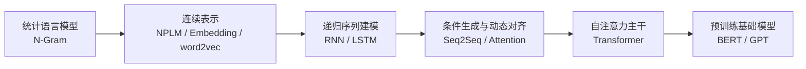

# NLP 历史：从统计建模到预训练 Transformer

如果把自然语言处理的发展压缩成一条主线，那么核心问题始终没有变：

- 如何表示语言；
- 如何建模上下文；
- 如何在统一架构下同时获得训练效率、泛化能力与任务迁移能力。

不同阶段的主要变化，并不是简单的“模型越做越大”，而是研究者对这三个问题的回答不断改变。早期方法依赖离散计数与局部上下文；随后，连续表示与神经网络缓解了稀疏性；再之后，序列模型、注意力机制与 Transformer 逐步重写了“上下文应如何被读取”的方式；最终，预训练成为现代 NLP 的组织原则。

若先建立整体视角，可以把这条演化链概括为：

---

## 阶段总览

从时间线与方法论转折看，NLP 的主干演化大致可以整理为下表：

| 时期 | 代表节点 | 核心问题 | 关键转向 |
| --- | --- | --- | --- |
| 1980s-2000s | N-Gram | 如何用可估计概率描述语言 | 用有限上下文近似完整历史 |
| 1990s-2000s | RNN、LSTM | 如何处理变长序列与长期依赖 | 用递归状态替代固定窗口 |
| 2003-2013 | NPLM、Embedding、word2vec | 如何缓解离散稀疏并共享语义结构 | 从离散符号转向连续表示 |
| 2014-2015 | Seq2Seq、Attention | 如何做条件生成与输入输出对齐 | 从固定压缩转向动态读取 |
| 2017 | Self-Attention、Transformer、Positional Encoding | 如何同时获得全局依赖与并行训练 | 从递归主干转向自注意力主干 |
| 2018 以后 | BERT、GPT | 如何让一个模型迁移到多任务 | 从任务专用模型转向预训练基础模型 |

从历史逻辑上看，后一阶段通常不是完全否定前一阶段，而是集中修正其最主要的结构性限制。例如，NPLM 修正 N-Gram 的稀疏性，LSTM 修正简单 RNN 的长依赖困难，Attention 修正 Seq2Seq 的固定瓶颈，而 Transformer 则进一步修正递归主干的串行限制。

---

## 一、统计语言模型：有限上下文的概率近似

早期 NLP 的主流任务表述，通常建立在语言模型上：给定历史词序列，估计下一个词出现的概率。其基本展开来自链式法则：

$$
P(w_1,\dots,w_T)=\prod_{t=1}^{T}P(w_t\mid w_{<t})
$$

真正困难在于，完整历史 $w_{<t}$ 的组合空间过大，无法直接可靠估计。因此，N-Gram 采用有限上下文近似：

$$
P(w_t\mid w_{<t})\approx P(w_t\mid w_{t-n+1},\dots,w_{t-1})
$$

这一思路的历史意义在于，它第一次把语言建模清晰地落实为可训练、可评估的概率估计问题。它长期服务于：

- 语音识别；
- 输入法与拼写纠错；
- 早期统计机器翻译；
- 信息检索与文本建模中的基础概率模块。

其优势是直接、可解释、工程上稳定，但局限同样根本：

- 词表一大，计数迅速稀疏；
- 高阶组合难以可靠估计；
- 长距离依赖难以进入模型；
- 不同词之间无法共享语义结构。

因此，统计语言模型真正留下的历史遗产，不只是 N-Gram 本身，而是它明确提出了一个长期主线：**语言建模的核心，是如何用有限参数去近似巨大的条件概率空间。**

- 相关专题：[N-Gram](../model/n-gram.md)

---

## 二、连续表示的引入：从离散符号到可学习向量

### NPLM：神经语言模型的起点

2003 年，Bengio 等人提出 Neural Probabilistic Language Model（NPLM）。它仍然做“给定上下文预测下一个词”，但不再把词只看成离散 id，而是先映射到连续向量空间，再用神经网络参数化条件概率。

这一步的关键意义有三点：

- 词表示变成可学习参数，而不是静态符号；
- 相似上下文可以通过向量空间共享统计强度；
- 语言模型开始进入“表示学习 + 参数化函数逼近”的范式。

NPLM 仍依赖固定窗口，因此它不是对上下文建模方式的最终突破；但它完成了更关键的一步，即证明了：**比起只改进平滑与回退策略，更根本的突破来自表示方式的改变。**

- 相关专题：[NPLM](../model/nplm.md)

### Embedding：NLP 的统一输入层

在此之后，Embedding 逐渐成为现代 NLP 的标准入口。它解决的不是某一个具体任务，而是一个更基础的问题：如何把词、子词、类别、位置等离散对象映射到连续空间。

Embedding 的价值不仅在于“降维”，更在于：

- 让相似对象在空间中形成可学习几何关系；
- 让模型可以跨词共享参数；
- 让后续网络能够在连续空间上学习语义与结构。

如果说 N-Gram 世界中的词更像彼此孤立的桶，那么 embedding 世界中的词则开始具有邻近关系、方向结构与组合规律。

- 相关专题：[Embedding](../representation/embedding.md)

### word2vec：分布式表示的大规模实用化

2013 年前后，word2vec 通过 CBOW、Skip-gram、Negative Sampling 等设计，使大规模词向量训练在工程上变得足够高效。它的重要性不只是提出了新的目标函数，而是让“分布式表示”从研究想法变成广泛可用的工业与学术基础设施。

从历史位置看，word2vec 强化了两个共识：

- 语言表示可以先于具体任务单独学习；
- 连续向量空间能够承载可迁移的语义结构。

这直接为后续的预训练思想提供了土壤。

- 相关专题：[word2vec](../representation/word2vec.md)

---

## 三、递归序列模型：从固定窗口到状态传递

### RNN：让模型显式处理变长历史

连续表示缓解了稀疏性，但早期神经语言模型通常仍受固定窗口约束。RNN 的关键转向是：把上下文不再写成一个固定长度的局部片段，而是写成随时间递推的隐藏状态：

$$
h_t=\phi(W_{xh}x_t+W_{hh}h_{t-1}+b_h)
$$

这使模型第一次能够自然处理变长序列。其历史意义主要体现在：

- 序列被统一理解为状态递推过程；
- 语言模型、序列标注、语音任务开始共享同一类神经主干；
- “历史信息应由状态持续携带”成为主流思路。

但 RNN 很快暴露出核心困难：一旦序列较长，梯度消失与爆炸使长期依赖难以稳定学习。

- 相关专题：[RNN](../model/rnn.md)

### LSTM：对长期依赖的门控修正

LSTM 通过细胞状态与输入门、遗忘门、输出门机制，对简单 RNN 的长依赖问题进行结构性修正。其思想并非单纯增加参数，而是显式控制信息的保留、遗忘与暴露。

从历史上看，LSTM 的重要性在于它把“序列状态应如何稳定传递”这个问题推进到了一个可广泛应用的阶段。2010 年代中期，大量 NLP 系统都建立在 LSTM 或其变体上，包括：

- 语言模型；
- 序列标注；
- 机器翻译；
- 语音识别。

不过，LSTM 仍然保留了递归主干的基本代价：训练与推理都强依赖时间展开，难以充分并行。

- 相关专题：[LSTM](../model/lstm.md)

---

## 四、条件生成框架：Seq2Seq 建立统一输入输出范式

2014 年前后，Seq2Seq 把“输入一个序列，输出另一个序列”系统化为统一框架。其条件分布通常写为：

$$
P(Y\mid X)=\prod_{t=1}^{m}P(y_t\mid y_{<t},X)
$$

这一框架的历史价值不在于某一个具体网络细节，而在于它统一了大量原本分散的问题表述：

- 机器翻译；
- 文本摘要；
- 对话生成；
- 改写与纠错。

Seq2Seq 也把编码器-解码器结构确立为条件生成任务的标准组织方式：编码器负责读取输入，解码器负责逐步生成输出。

但早期 Seq2Seq 存在一个很强的结构性瓶颈：编码器常被要求用一个固定长度向量压缩整段输入。输入一长，压缩误差就会迅速放大，模型很难稳定保留全部关键信息。

- 相关专题：[Seq2Seq](../model/seq2seq.md)

---

## 五、注意力机制：从固定压缩到动态读取

Attention 的出现，本质上是在修正 Seq2Seq 的固定向量瓶颈。它让解码器在生成每一步时，都能重新查看输入序列的不同部分，而不是只能依赖单一压缩表示。

其典型上下文向量写为：

$$
c_t=\sum_{i=1}^{n}\alpha_{t,i}h_i
$$

其中，$\alpha_{t,i}$ 表示在输出位置 $t$ 上，对输入位置 $i$ 的注意力权重。

这一机制带来的历史转折非常关键：

- 输入输出之间的对齐关系第一次被显式建模；
- 长句翻译与长序列生成效果显著改善；
- 模型组织方式从“如何压缩全部历史”转向“如何按需读取相关信息”。

也就是说，Attention 改变的不只是效果，而是研究者处理上下文的默认思维方式。

- 相关专题：[Attention](../mechanism/attention.md)

---

## 六、自注意力与 Transformer：序列主干的重新定义

### Self-Attention：把动态读取推广到序列内部

在 Attention 已经证明“按需读取”有效之后，进一步的问题自然是：这种读取方式为什么只能发生在解码器与编码器之间，而不能直接发生在序列内部？

Self-Attention 给出的回答是：序列中每个位置都可以把整段序列作为可访问对象。其核心形式为：

$$
\mathrm{SelfAttn}(X)=\mathrm{softmax}\left(\frac{QK^\top}{\sqrt{d_k}}\right)V
$$

这意味着：

- 任意两个位置之间的依赖路径显著缩短；
- 整段序列的关系可以并行计算；
- 上下文读取不再必须经过递归状态链条。

- 相关专题：[Self-Attention](../mechanism/self-attention.md)

### Positional Encoding：为非递归主干补回顺序信息

Self-attention 虽然带来全局交互与并行性，但它本身并不天然携带顺序感。因此，位置编码不只是补充技巧，而是非递归序列模型得以成立的必要结构。

它回答的问题是：当模型不再沿时间链条传播状态时，如何仍然知道“谁在前、谁在后、相隔多远”。

- 相关专题：[Positional Encoding](../mechanism/positional-encoding.md)

### Transformer：把自注意力提升为主干架构

2017 年，Transformer 通过 multi-head self-attention、位置编码、残差连接、层归一化与前馈网络，正式把自注意力从辅助机制提升为主干架构。

其历史意义之所以决定性，在于它同时解决了两个长期问题：

- 建模层面，长距离依赖可以直接建立；
- 工程层面，整段序列可以高度并行训练。

从此以后，NLP 的主问题不再是“如何设计更好的 RNN”，而转向“如何扩展 Transformer、如何扩展预训练、如何扩展上下文长度与模型规模”。

- 相关专题：[Transformer](../model/transformer.md)

---

## 七、预训练范式：从任务专用模型到基础模型

Transformer 提供了统一且可扩展的主干之后，真正改变现代 NLP 研究组织方式的，是预训练范式。其核心思想是：先在大规模语料上学习通用表示或通用生成能力，再迁移到下游任务。

### BERT：编码器预训练路线

BERT 以 Transformer 编码器为基础，结合遮蔽语言模型，推动了“预训练 + 微调”成为理解任务的标准范式。它更强调双向上下文化表示，适合：

- 分类；
- 匹配；
- 抽取；
- 检索与表示学习。

从历史位置看，BERT 代表的是“先学高质量上下文化表示，再迁移到具体任务”的路线。

- 相关专题：[BERT](../model/bert.md)

### GPT：自回归生成预训练路线

GPT 则把 Transformer 解码器与下一词预测结合起来，其联合分布写为：

$$
P(X)=\prod_{t=1}^{n}P(x_t\mid x_{<t})
$$

它的突出优势在于：

- 目标函数统一；
- 文本生成天然成立；
- 大量任务可以改写为“给定前缀继续生成”。

随着模型规模、训练数据、对齐与推理技术的扩展，GPT 路线逐渐从语言模型走向通用生成式基础模型。

- 相关专题：[GPT](../model/gpt.md)

从更高层概括，BERT 与 GPT 并非互相取代，而是分别强调：

- BERT：高质量表示学习与双向理解；
- GPT：统一生成接口与自回归扩展性。

二者共同推动的真正变化是：**NLP 不再主要围绕单任务定制模型组织，而是围绕通用基础模型组织。**

---

## 八、主线关系总结

如果把整条历史链条进一步压缩，可以得到 5 个关键转向：

### 从离散计数到连续表示

N-Gram 依赖离散统计；NPLM、Embedding 与 word2vec 让语言进入连续空间，从而共享统计强度并建立可学习语义结构。

### 从固定窗口到状态递推

RNN 与 LSTM 让上下文不再局限于固定窗口，而是通过隐藏状态持续传递。

### 从固定压缩到动态读取

Seq2Seq 建立了条件生成框架，但 Attention 才真正把输入读取改写成动态、内容相关的过程。

### 从递归主干到自注意力主干

Self-attention 与 Transformer 让序列模型不再主要依赖时间递归，而转向全局交互与并行计算。

### 从任务模型到预训练基础模型

BERT 与 GPT 共同促成预训练范式成为主流，使“先学通用能力，再迁移到具体任务”成为现代 NLP 的默认组织方式。

---

## 相关主题阅读路线

如果希望按知识依赖关系继续阅读本仓库中的相关文档，可以参考以下顺序：

1. [N-Gram](../model/n-gram.md)
2. [NPLM](../model/nplm.md)
3. [Embedding](../representation/embedding.md)
4. [word2vec](../representation/word2vec.md)
5. [RNN](../model/rnn.md)
6. [LSTM](../model/lstm.md)
7. [Seq2Seq](../model/seq2seq.md)
8. [Attention](../mechanism/attention.md)
9. [Self-Attention](../mechanism/self-attention.md)
10. [Positional Encoding](../mechanism/positional-encoding.md)
11. [Transformer](../model/transformer.md)
12. [BERT](../model/bert.md)
13. [GPT](../model/gpt.md)

---

## Ref

- Shannon, C. E. (1948). A Mathematical Theory of Communication.
- Katz, S. M. (1987). Estimation of Probabilities from Sparse Data for the Language Model Component of a Speech Recognizer.
- Elman, J. L. (1990). Finding Structure in Time.
- Werbos, P. J. (1990). Backpropagation Through Time: What It Does and How to Do It.
- Bengio, Y., Simard, P., and Frasconi, P. (1994). Learning Long-Term Dependencies with Gradient Descent is Difficult.
- Kneser, R., and Ney, H. (1995). Improved Backing-Off for M-gram Language Modeling.
- Hochreiter, S., and Schmidhuber, J. (1997). Long Short-Term Memory.
- Gers, F. A., Schmidhuber, J., and Cummins, F. (2000). Learning to Forget: Continual Prediction with LSTM.
- Bengio, Y., Ducharme, R., Vincent, P., and Janvin, C. (2003). A Neural Probabilistic Language Model.
- Morin, F., and Bengio, Y. (2005). Hierarchical Probabilistic Neural Network Language Model.
- Mikolov, T., Chen, K., Corrado, G., and Dean, J. (2013). Efficient Estimation of Word Representations in Vector Space.
- Mikolov, T. et al. (2013). Distributed Representations of Words and Phrases and their Compositionality.
- Sutskever, I., Vinyals, O., and Le, Q. V. (2014). Sequence to Sequence Learning with Neural Networks.
- Cho, K. et al. (2014). Learning Phrase Representations using RNN Encoder-Decoder for Statistical Machine Translation.
- Bahdanau, D., Cho, K., and Bengio, Y. (2015). Neural Machine Translation by Jointly Learning to Align and Translate.
- Luong, M.-T., Pham, H., and Manning, C. D. (2015). Effective Approaches to Attention-based Neural Machine Translation.
- Vaswani, A. et al. (2017). Attention Is All You Need.
- Peters, M. E. et al. (2018). Deep Contextualized Word Representations.
- Radford, A. et al. (2018). Improving Language Understanding by Generative Pre-Training.
- Devlin, J. et al. (2019). BERT: Pre-training of Deep Bidirectional Transformers for Language Understanding.
- Radford, A. et al. (2019). Language Models are Unsupervised Multitask Learners.
- Liu, Y. et al. (2019). RoBERTa: A Robustly Optimized BERT Pretraining Approach.
- Brown, T. B. et al. (2020). Language Models are Few-Shot Learners.
