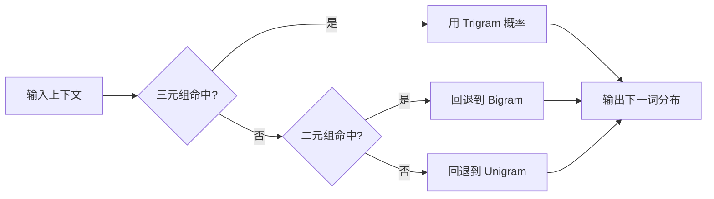
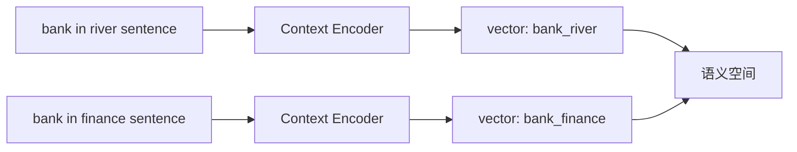
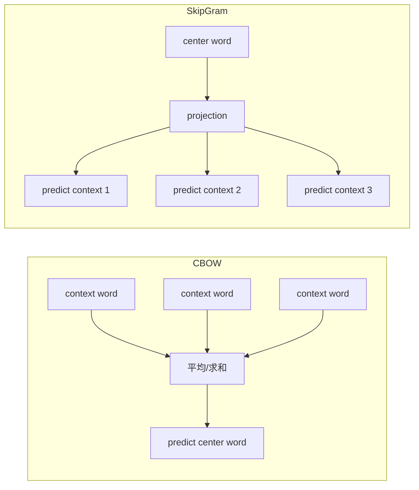
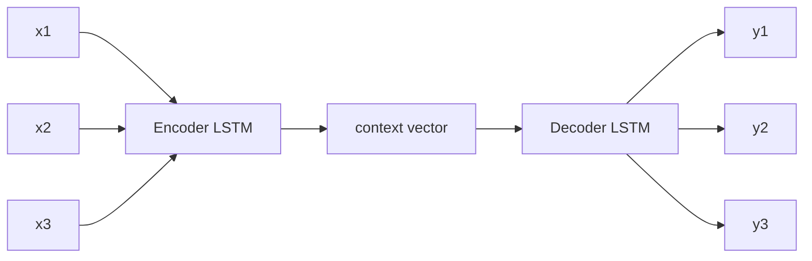
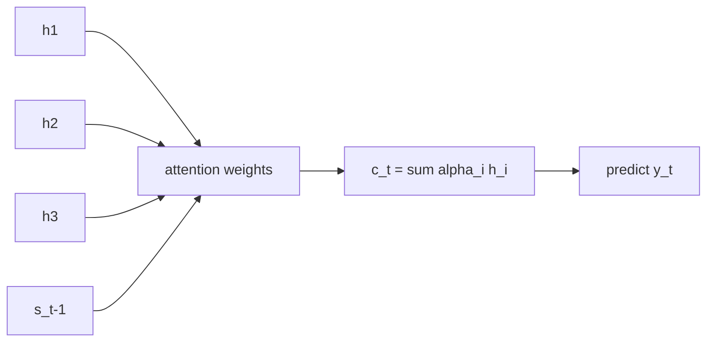
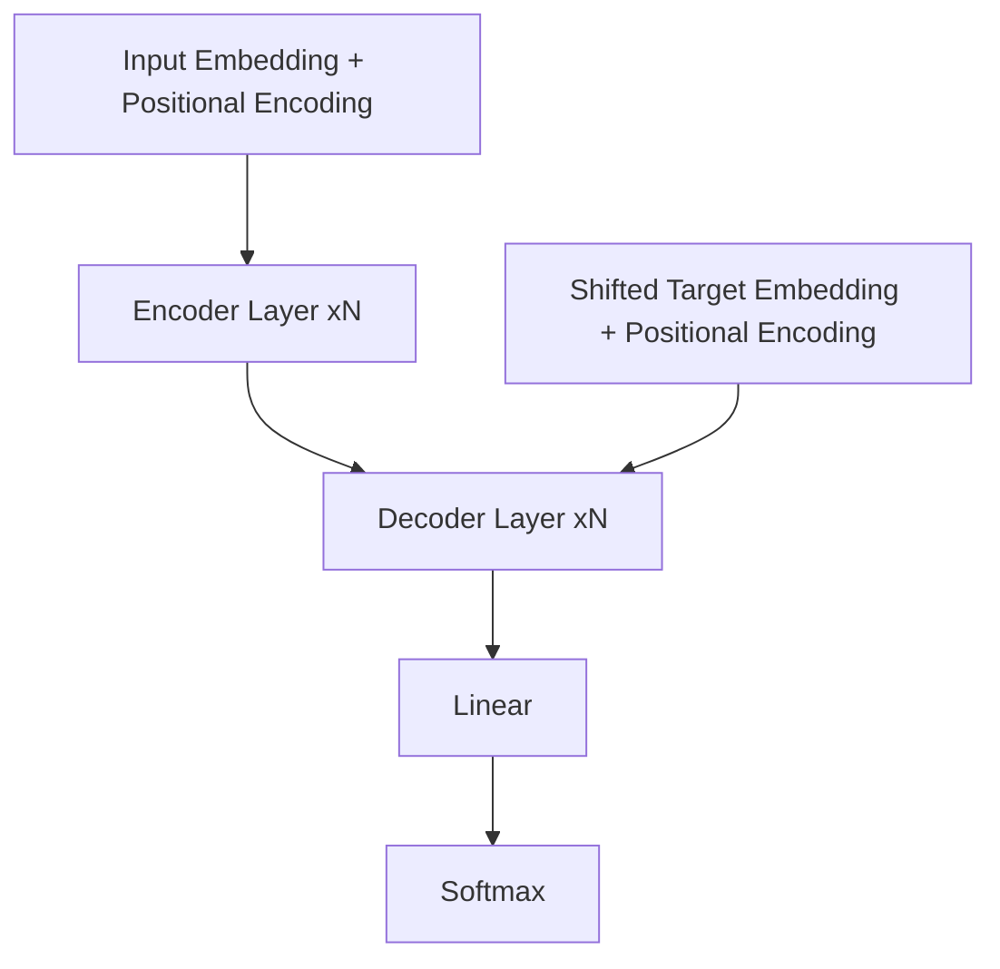

# NLP 历史：从 N-Gram 到 Transformer

## 概览

自然语言处理（NLP）的主线演进，可以概括为「统计方法 -> 神经网络方法 -> 预训练范式」。如果按关键技术节点来看，一条常见时间线如下：

- 1980s-2000s：N-Gram 统计语言模型成为主流
- 2003：NPLM 提出分布式词表示与神经概率语言模型
- 2013：word2vec 推动 embedding 的大规模应用
- 2014：seq2seq 建立「编码器-解码器」生成框架
- 2015：attention 缓解长距离依赖与信息瓶颈
- 2017：Transformer 以自注意力为核心重构 NLP 基础架构

## N-Gram：统计语言模型时代

N-Gram 的核心思想是马尔可夫假设：当前词只依赖前面有限个词。其典型形式是：

$$
P(w_t|w_1,\dots,w_{t-1}) \approx P(w_t|w_{t-n+1},\dots,w_{t-1})
$$

它在早期语音识别、输入法、机器翻译中被广泛应用。

### 原理拆解

- 建模对象：用条件概率建模序列生成过程，将句子概率分解为条件概率连乘。
- 参数估计：常用极大似然估计（MLE），通过计数得到：

$$
P(w_t|w_{t-n+1}^{t-1})=\frac{C(w_{t-n+1}^{t})}{C(w_{t-n+1}^{t-1})}
$$

- 训练本质：不是梯度下降，而是统计语料中的 n-gram 频次表。
- 稀疏性处理：通过平滑与回退缓解「未见过组合概率为 0」问题。
- 常见策略：Add-k、Good-Turing、Kneser-Ney、Backoff、Interpolation。
- 推理方式：给定上下文，查表得到下一个词概率分布，再做贪心或采样。

### 论文重点

- Shannon (1948)：提出用有限上下文近似语言生成过程，是 n-gram 语言模型的思想源头。
- Katz (1987)：提出 Katz Backoff，核心是「高频组合用高阶模型，低频组合回退到低阶模型」。
- Kneser-Ney (1995)：提出绝对折扣与改进的回退分布，显著提升稀疏场景下的泛化能力。

### 图片介绍

- 论文图阅读重点：关注「高阶计数不足时如何回退」和「回退权重如何归一化」。
- 可视化示意：下图表达 n-gram 的查表与回退路径。



- 优点：实现简单、可解释性强、在小规模任务上效果稳定
- 局限：数据稀疏严重，难以建模长距离语义关系

## NPLM：神经语言模型的起点

2003 年，Bengio 等人提出 NPLM（Neural Probabilistic Language Model）。该工作用神经网络学习词的低维连续向量，并在此基础上估计语言模型概率。

这一步非常关键，因为它将「离散符号」映射为「连续空间」中的向量，为后续深度学习 NLP 奠定了基础。

### 原理拆解

- 输入表示：将上下文词映射为 embedding，拼接或组合成连续向量。
- 网络结构：典型为「输入层 -> 隐藏层 -> softmax 输出层」。
- 概率建模：输出层给出词表上每个候选词的条件概率。

$$
P(w_t|w_{t-n+1}^{t-1})=\text{softmax}(f(e_{t-n+1},...,e_{t-1}))
$$

- 学习目标：最大化语料的对数似然（等价于最小化交叉熵）。
- 核心收益：相似上下文可共享参数，能把未见组合映射到邻近语义区域。
- 主要瓶颈：softmax 需遍历大词表，训练复杂度高。

### 论文重点

- Bengio et al. (2003)：
- 重点 1：首次系统提出「词嵌入 + 前馈神经网络」的概率语言模型。
- 重点 2：证明连续表示可以缓解「离散计数模型」的数据稀疏问题。
- 重点 3：指出大词表 softmax 成本是主要训练瓶颈，为后续近似训练方法铺路。

### 图片介绍

- 论文图阅读重点：输入词索引先映射为 embedding，再拼接进入 MLP，最后经 softmax 输出词表分布。
- 对应原图：Bengio 2003 的模型结构图（通常为 Figure 1）。
- 可视化示意：

```mermaid
flowchart LR
W1[w_t-n+1] --> E1[Embedding]
W2[...] --> E2[Embedding]
W3[w_t-1] --> E3[Embedding]
E1 --> C[Concat]
E2 --> C
E3 --> C
C --> H[Hidden Layer]
H --> Y[Softmax over Vocab]
Y --> O[P(w_t | context)]
```

- 贡献：缓解维度灾难，首次系统展示神经语言模型优于传统统计方法的潜力
- 局限：当时训练成本高、语料规模和算力受限

## Embedding（常见误写：enbedding）

Embedding 指将词或子词映射到稠密向量空间，使模型可以通过向量距离表达语义相似性。

相比 one-hot 表示，embedding 具有更强的泛化能力：

- 语义相近词在向量空间中更接近
- 支持参数共享，提升模型训练效率
- 可以作为下游任务的通用输入表示

Embedding 不是单一算法，而是一类表示学习思想。NPLM、word2vec、GloVe 以及后续上下文表示模型都属于这一演进链条。

### 原理拆解

- 基本映射：词表大小为 \(|V|\)，embedding 维度为 \(d\)，参数矩阵为 \(E\in\mathbb{R}^{|V|\times d}\)。
- 查表过程：one-hot 向量 \(x_w\) 与矩阵相乘，本质是取第 \(w\) 行向量。

$$
e_w = E^\top x_w
$$

- 学习机制：embedding 不是手工构造，而是在任务损失反向传播中联合学习。
- 几何含义：向量夹角和距离反映语义或句法相似性。
- 发展脉络：静态 embedding（同一词一个向量）逐步发展到上下文 embedding（同一词随语境变化）。

### 论文重点

- Collobert et al. (2011)：展示了统一神经网络框架下，词向量作为通用输入表示可迁移到多任务。
- Pennington et al. (2014, GloVe)：用全局共现统计学习词向量，强调词向量差值可编码语义关系。
- Peters et al. (2018, ELMo) 与 Devlin et al. (2018, BERT)：将 embedding 推向「上下文化」，同一词在不同上下文有不同向量。

### 图片介绍

- 论文图阅读重点：
- 静态 embedding 图：一个词对应一个固定点。
- 上下文 embedding 图：同一个词在不同句子投影到不同区域。
- 可视化示意：



## word2vec：高效词向量学习

2013 年，Mikolov 等人提出 word2vec，主要包含 CBOW 与 Skip-gram 两种训练目标，并结合负采样等技巧，大幅提升了训练效率。

- CBOW：用上下文预测中心词
- Skip-gram：用中心词预测上下文

word2vec 的影响在于：它把 embedding 从研究概念变成了工业可用组件，显著推动了 NLP 从特征工程走向表示学习。

### 原理拆解

- CBOW 目标：最大化 \(P(w_t|context)\)，用上下文向量平均或求和预测中心词。
- Skip-gram 目标：最大化上下文词条件概率：

$$
\max \sum_{t}\sum_{-m\le j\le m,j\ne 0}\log P(w_{t+j}|w_t)
$$

- 原始 softmax 代价高：分母涉及整个词表。
- Negative Sampling：将多分类转为二分类，对正样本拉近、对负样本推远。

$$
\log \sigma(u_o^\top v_c) + \sum_{i=1}^k \log \sigma(-u_i^\top v_c)
$$

- 训练技巧：高频词子采样、动态窗口、层次 softmax，进一步降低成本。
- 结果特性：向量空间可线性表达一定语义关系（如类比关系）。

### 论文重点

- Mikolov et al. (2013, ICLR Workshop)：
- 重点 1：提出 CBOW 与 Skip-gram 两种高效目标函数。
- 重点 2：证明在大语料上，简单架构也能学到高质量词向量。
- Mikolov et al. (2013, NIPS)：
- 重点 3：引入 Negative Sampling 和 Subsampling，显著降低训练成本。
- 重点 4：词向量呈现可解释的线性结构（类比关系）。

### 图片介绍

- 论文图阅读重点：CBOW 是「多输入单输出」，Skip-gram 是「单输入多输出」。
- 对应原图：Mikolov 2013 的 CBOW/Skip-gram 结构图（常见 Figure 1）。
- 可视化示意：



## seq2seq：端到端生成范式

2014 年，seq2seq（Sequence-to-Sequence）架构提出后，机器翻译等任务从「流水线模块拼接」转向「端到端建模」。

其基本结构是：

- 编码器（Encoder）：将输入序列编码为语义表示
- 解码器（Decoder）：基于语义表示逐步生成输出序列

早期 seq2seq 多基于 RNN/LSTM。它开启了统一生成框架，但也暴露出固定长度上下文向量的信息瓶颈问题。

### 原理拆解

- 概率分解：将目标序列概率写成自回归连乘：

$$
P(y|x)=\prod_{t=1}^{T_y}P(y_t|y_{<t},x)
$$

- 编码阶段：Encoder 把输入 \(x_1,...,x_{T_x}\) 压缩为状态向量（或状态序列）。
- 解码阶段：Decoder 以「上一步输出 + 编码信息」递归生成下一个词。
- 训练方式：Teacher Forcing，训练时喂入真实上一词以加速收敛。
- 推理方式：只能自回归逐步生成，常用 Greedy 或 Beam Search。
- 核心问题：若只使用单一固定向量，长句信息在压缩过程中损失明显。

### 论文重点

- Sutskever et al. (2014)：
- 重点 1：提出 Encoder-Decoder LSTM 框架，统一建模变长输入和变长输出。
- 重点 2：实验中发现「源序列反转」可提升训练效果，缓解长依赖优化难题。
- 重点 3：用端到端训练替代传统 SMT 的多模块流水线。

### 图片介绍

- 论文图阅读重点：左侧编码器逐 token 压缩语义，右侧解码器逐步展开目标序列。
- 对应原图：Sutskever 2014 的 Seq2Seq 架构图（通常为 Figure 1）。
- 可视化示意：



## Attention：解决长依赖与信息瓶颈

2015 年，Bahdanau Attention 被引入 seq2seq。在解码每一步时，模型不再只依赖单一全局向量，而是对输入序列进行动态加权，聚焦最相关的部分。

### 原理拆解

- 输入元素：Encoder 隐状态序列 \(\{h_i\}\) 与当前 Decoder 状态 \(s_{t-1}\)。
- 对齐打分：计算每个输入位置与当前解码步的相关性：

$$
e_{t,i}=v^\top \tanh(W_s s_{t-1}+W_h h_i)
$$

- 归一化权重：

$$
\alpha_{t,i}=\text{softmax}(e_{t,i})
$$

- 上下文向量：按权重求和得到当前步语义上下文：

$$
c_t=\sum_i \alpha_{t,i}h_i
$$

- 生成输出：将 \(c_t\) 与解码状态联合用于预测 \(y_t\)。
- 本质价值：每一步都可「按需读取」输入序列，不再依赖单一瓶颈向量。

### 论文重点

- Bahdanau et al. (2015)：
- 重点 1：提出 Additive Attention，把「对齐」与「翻译」联合学习。
- 重点 2：在每个解码步动态选择源序列关键位置，明显改善长句翻译。
- 重点 3：注意力权重可解释，能可视化模型关注区域。
- Luong et al. (2015)：
- 重点 4：系统比较 dot/general/concat 打分函数，给出更工程化的注意力实现。

### 图片介绍

- 论文图阅读重点：关注注意力热力图中「解码词与源词」的软对齐关系。
- 对应原图：Bahdanau 2015 的对齐示意与注意力可视化图。
- 可视化示意：



- 直接收益：翻译质量显著提升，尤其是长句
- 方法价值：提供可微分的「软对齐」机制
- 历史意义：为后续自注意力（Self-Attention）与 Transformer 铺路

## Transformer：自注意力成为主干

2017 年，《Attention Is All You Need》提出 Transformer，核心改动是用多头自注意力替代循环结构，并通过位置编码注入顺序信息。

相比 RNN/LSTM 架构，Transformer 的关键优势是：

- 并行性强，训练效率更高
- 更擅长建模长距离依赖
- 可扩展性好，适合大规模预训练

随后 BERT、GPT 等模型在 Transformer 架构上发展出理解与生成两大路线，NLP 进入预训练大模型时代。

### 原理拆解

- 基础注意力：

$$
\text{Attention}(Q,K,V)=\text{softmax}\left(\frac{QK^\top}{\sqrt{d_k}}\right)V
$$

- Self-Attention：同一序列同时生成 \(Q,K,V\)，任意 token 可直接与其他 token 交互。
- Multi-Head：并行多个子空间注意力头，再拼接融合，提升关系建模能力。
- 位置编码：用正余弦或可学习位置向量补充顺序信息。
- 前馈网络：每层注意力后接 Position-wise FFN，增强非线性表达。
- 残差与归一化：Residual + LayerNorm 稳定深层训练。
- 编码器与解码器：
- 编码器：双向自注意力，学习输入表示。
- 解码器：带因果 Mask 的自注意力，保证只看历史 token。
- 训练与推理：
- 训练可并行计算整段序列。
- 推理仍是自回归逐 token 生成，但每步计算可高效缓存 KV。

### 论文重点

- Vaswani et al. (2017)：
- 重点 1：提出「Attention Is All You Need」，完全移除 RNN/CNN 主干。
- 重点 2：Multi-Head Self-Attention 使模型在多个子空间并行捕获依赖关系。
- 重点 3：位置编码解决无递归结构下的序列顺序建模问题。
- 重点 4：残差连接 + LayerNorm 稳定深层训练，支持大规模并行。
- 重点 5：在机器翻译任务上以更低训练成本取得更优效果，成为后续预训练模型基础。

### 图片介绍

- 论文图阅读重点：
- Figure 1：整体 Encoder-Decoder 堆叠结构。
- Figure 2：Scaled Dot-Product Attention 与 Multi-Head Attention 细节。
- 可视化示意：



## 小结

从历史脉络看，NLP 的核心转变是「如何表示语言」与「如何建模上下文」：

- N-Gram：基于离散计数的局部上下文建模
- NPLM 与 embedding：进入连续表示空间
- word2vec：高效学习通用词向量
- seq2seq 与 attention：建立可学习的序列生成与对齐机制
- Transformer：统一并放大上下文建模能力，成为现代 NLP 基座

## Ref

- Shannon, C. E. (1948). A Mathematical Theory of Communication.
- Katz, S. M. (1987). Estimation of Probabilities from Sparse Data for the Language Model Component of a Speech Recognizer.
- Kneser, R., and Ney, H. (1995). Improved Backing-Off for M-gram Language Modeling.
- Bengio, Y., Ducharme, R., Vincent, P., and Janvin, C. (2003). A Neural Probabilistic Language Model.
- Collobert, R. et al. (2011). Natural Language Processing (Almost) from Scratch.
- Mikolov, T., Chen, K., Corrado, G., and Dean, J. (2013). Efficient Estimation of Word Representations in Vector Space.
- Mikolov, T. et al. (2013). Distributed Representations of Words and Phrases and their Compositionality.
- Pennington, J., Socher, R., and Manning, C. D. (2014). GloVe: Global Vectors for Word Representation.
- Sutskever, I., Vinyals, O., and Le, Q. V. (2014). Sequence to Sequence Learning with Neural Networks.
- Bahdanau, D., Cho, K., and Bengio, Y. (2015). Neural Machine Translation by Jointly Learning to Align and Translate.
- Luong, M.-T., Pham, H., and Manning, C. D. (2015). Effective Approaches to Attention-based Neural Machine Translation.
- Peters, M. E. et al. (2018). Deep Contextualized Word Representations.
- Devlin, J. et al. (2018). BERT: Pre-training of Deep Bidirectional Transformers for Language Understanding.
- Vaswani, A. et al. (2017). Attention Is All You Need.
