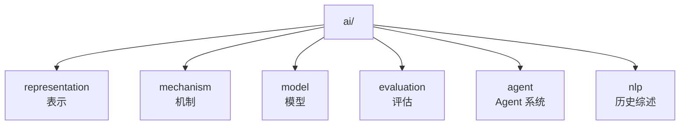
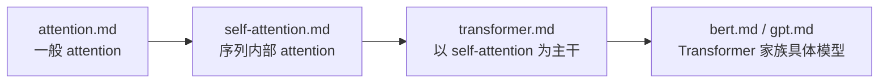
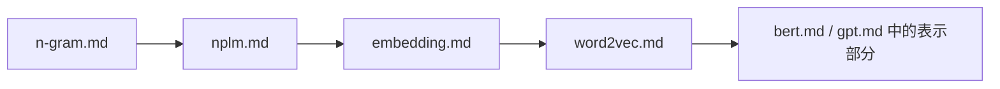
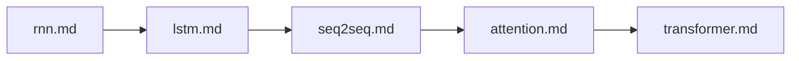

# AI 文档改造说明：目录梳理、重复治理与结构升级方案

本文用于说明当前 `ai/` 目录中文档的主要结构问题，并给出一套可长期执行的改造方案。目标不是简单“删减篇幅”，而是把整套 AI 文档从“单篇大而全”调整为“分层清晰、主从明确、可持续扩展”的知识体系。

---

## 一、现状概览

当前 `ai/` 目录已经形成较完整的主题覆盖，主要包含以下几类内容：



从主题分布上看，这一结构本身是合理的，已经具备“表示 - 机制 - 模型 - 评估 - 历史”这条主线。但当前更大的问题，不在目录名，而在**单篇文档的边界控制与主题归属**。

按当前行数粗略统计，若干文档已明显偏长：

| 文档 | 行数 | 主要问题 |
| --- | --- | --- |
| `ai/mechanism/positional-encoding.md` | 1308 | 主题跨度过大，已混合“基础定义 + 主流机制 + 长上下文外推专题” |
| `ai/model/bert.md` | 880 | 模型本体、架构比较、任务适配、扩展阅读耦合过重 |
| `ai/model/gpt.md` | 786 | GPT 本体与 Transformer 公共机制重复较多 |
| `ai/model/transformer.md` | 775 | 已覆盖 attention、position、BERT/GPT/T5、ViT、多模态，过于中心化 |
| `ai/representation/embedding.md` | 742 | 已从词向量扩展到多模态、检索、向量数据库，跨度过大 |
| `ai/mechanism/attention.md` | 622 | 与 `self-attention.md`、`transformer.md` 存在明显重叠 |
| `ai/model/seq2seq.md` | 613 | 对 attention 的展开过深，压缩了框架本身的辨识度 |
| `ai/representation/word2vec.md` | 609 | 与 `embedding.md`、`nplm.md` 共享较大背景段落 |

这说明当前体系已经从“文档不够”进入“文档之间职责重叠”的阶段。

---

## 二、核心问题诊断

### 1. 单篇文档承担了过多职责

当前不少文章同时承担了以下多种职责：

- 定义一个概念；
- 介绍该概念的历史位置；
- 解释与前后代模型的关系；
- 展开底层数学机制；
- 继续扩展到工程实现、长上下文、多模态、评测与选型。

这会带来两个后果：

- 新读者很难判断“这篇文章的主问题到底是什么”；
- 后续维护时，一处概念修改往往牵连多篇大文档。

### 2. 缺少“主文档所有权”

当前重复内容的根本原因，不是写得多，而是缺少明确的“主题归属”。例如：

- `attention.md`、`self-attention.md`、`transformer.md` 都在完整展开 Q/K/V、mask、多头；
- `embedding.md`、`word2vec.md`、`nplm.md` 都在讲“离散到连续表示”的历史与动机；
- `rnn.md`、`lstm.md`、`seq2seq.md` 都在讲递归状态、教师强制、序列生成；
- `transformer.md`、`bert.md`、`gpt.md` 都在解释 Transformer block、position、训练目标与架构差异。

一旦没有“谁是主讲、谁只做引用”的规则，所有文档都会自然走向“大而全”。

### 3. 目录边界已经被正文突破

当前目录分类虽然清晰，但部分正文实际上已经越界：

- `representation/embedding.md` 已延伸到向量检索、ANN、RAG、连接器、多模态对齐；
- `mechanism/positional-encoding.md` 已延伸到长上下文外推专题；
- `model/transformer.md` 已延伸到 ViT、多模态连接器、后续模型路线综述；
- `model/bert.md` 中相当篇幅在做 GPT / T5 / BART 比较；
- `seq2seq.md` 中 attention 的篇幅已经接近“机制文档”。

这不是内容本身有问题，而是说明当前已经需要“专题拆分”。

### 4. 缺少统一入口文档

目前 `ai/nlp/history.md` 已经是较好的历史入口，但整个 `ai/` 目录仍然缺少一个更高层的阅读地图，用来回答：

- 初学者应该从哪里进入；
- 哪些文档是总览，哪些是机制细讲，哪些是专题深挖；
- 同一概念的“第一次出现”应阅读哪篇；
- 文档之间如何避免来回跳转造成阅读负担。

### 5. 文档粒度不均衡

当前同时存在两种极端：

- 一些文档过长，已经接近小册子；
- 一些文档过短，尚不足以承担完整专题。

例如：

- `positional-encoding.md`、`embedding.md` 明显适合拆分；
- `evaluation/` 下内容目前较薄，尚不足以形成稳定专题层；
- `agent/` 与 `nlp/` 目录主题清晰，但还未形成和其他目录同等级的“路线图 + 子专题”结构。

---

## 三、重复关系梳理

### 1. Attention 主线

当前最明显的重复链条如下：



这里的合理层级本应是：

- `attention.md` 负责“一般 attention 的抽象与数学骨架”；
- `self-attention.md` 负责“attention 在序列内部的特化”；
- `transformer.md` 负责“如何围绕 self-attention 组织成 block 和整机架构”；
- `bert.md` / `gpt.md` 只讨论各自的训练目标、结构裁剪与任务接口。

当前实际情况是，上述 4 层都在重复讲：

- Q/K/V；
- mask；
- 多头注意力；
- Transformer block；
- 架构间差异。

### 2. 表示学习主线

当前重复链条如下：



更合理的职责应是：

- `embedding.md` 负责“离散对象进入连续空间”的统一定义；
- `word2vec.md` 负责“高效词向量训练方法”；
- `nplm.md` 负责“神经语言模型历史起点”；
- 其他模型文档只保留与本模型直接相关的表示层说明。

当前实际问题是：

- `embedding.md` 与 `word2vec.md` 都在大量铺陈词向量背景；
- `embedding.md` 已延伸到多模态、检索与向量系统；
- `bert.md`、`gpt.md` 中又重复解释静态表示与上下文化表示差异。

### 3. 序列建模主线

当前链条如下：



合理分工应是：

- `rnn.md` 负责递归状态与 BPTT；
- `lstm.md` 负责门控记忆；
- `seq2seq.md` 负责条件生成框架与 encoder-decoder；
- `attention.md` 负责动态读取机制；
- `transformer.md` 负责非递归主干。

当前实际情况是：

- `seq2seq.md` 对 attention 已展开过深；
- `transformer.md` 反过来又复述大量 Seq2Seq 与 attention 历史；
- `gpt.md`、`bert.md` 又重复说明 Transformer 的结构来源。

---

## 四、最完美的目标结构

所谓“最完美”的改造，不是把所有文章都拆得很碎，而是建立**分层知识架构 + 主题主文档制度 + 稳定交叉链接**。

目标结构建议如下：

### 1. 建立四层文档体系

| 层级 | 作用 | 建议篇幅 | 典型文档 |
| --- | --- | --- | --- |
| 入口层 | 建立地图、阅读顺序、主题关系 | 150-300 行 | `ai/index.md`、`ai/nlp/history.md` |
| 核心层 | 解释一个主题的定义、主机制、主公式 | 250-500 行 | `attention.md`、`embedding.md`、`rnn.md` |
| 模型层 | 解释某个模型如何使用已有机制 | 250-500 行 | `transformer.md`、`bert.md`、`gpt.md` |
| 专题层 | 深挖某个复杂分支、工程问题或变体 | 300-700 行 | `sparse-attention.md`、RoPE / ALiBi / 长上下文专题 |

这里最关键的原则是：

- 入口层负责“导航”；
- 核心层负责“概念所有权”；
- 模型层负责“组合与落地”；
- 专题层负责“深入与扩展”。

### 2. 为每个主题指定“主文档”

后续改造应明确以下所有权：

| 主题 | 主文档 | 其他文档允许写到的深度 |
| --- | --- | --- |
| 一般 attention | `ai/mechanism/attention.md` | 只允许 1-2 段概述 + 链接 |
| self-attention | `ai/mechanism/self-attention.md` | 只允许说明其在具体模型中的角色 |
| 位置机制 | `ai/mechanism/positional-encoding.md` | 其他文档只保留必要引用 |
| Transformer block | `ai/model/transformer.md` | `bert.md`/`gpt.md` 不再完整重讲 |
| Embedding 一般定义 | `ai/representation/embedding.md` | `word2vec.md`/`bert.md` 仅保留局部说明 |
| word2vec 训练机制 | `ai/representation/word2vec.md` | 其他文档仅作历史引用 |
| RNN 基本序列建模 | `ai/model/rnn.md` | `lstm.md`/`seq2seq.md` 不再重讲 BPTT 主体 |
| LSTM 门控机制 | `ai/model/lstm.md` | 其他文档仅说明为什么需要它 |
| Seq2Seq 条件生成框架 | `ai/model/seq2seq.md` | `transformer.md` 不再完整展开 RNN 版细节 |

只有建立“主文档所有权”，重复治理才会真正稳定。

### 3. 拆分超长专题

以下文档建议拆分：

#### `ai/mechanism/positional-encoding.md`

建议拆为：

- `ai/mechanism/positional-encoding.md`
  负责位置编码的基础定义、绝对/相对/RoPE 总览；
- `ai/mechanism/rope.md`
  负责 RoPE 数学机制、旋转结构、工程实现；
- `ai/mechanism/long-context-position.md`
  负责 ALiBi、位置插值、长度外推与长上下文失效模式。

#### `ai/representation/embedding.md`

建议拆为：

- `ai/representation/embedding.md`
  负责 embedding 的统一定义、几何直觉、静态/动态表示；
- `ai/representation/text-embedding-training.md`
  负责 GloVe、FastText、句向量路线；
- `ai/representation/retrieval-embedding.md`
  负责向量检索、ANN、混合检索、Late Interaction；
- 多模态连接器部分后续可独立为 `ai/representation/multimodal-alignment.md`。

#### `ai/model/transformer.md`

建议拆为：

- `ai/model/transformer.md`
  只保留 Transformer 主干、block、三类结构、训练推理骨架；
- `ai/model/transformer-extensions.md`
  负责 ViT、多模态连接器、长上下文、高效变体总览。

#### `ai/model/bert.md`

建议拆为：

- `ai/model/bert.md`
  聚焦 BERT 本体、MLM、NSP、微调范式；
- `ai/model/bert-family.md`
  负责 RoBERTa、ALBERT、DeBERTa 等变体与路线对比。

### 4. 建立统一入口与阅读地图

建议新增：

- `ai/index.md`
  整个 AI 目录的总入口；
- 每个子目录一个简短索引页，例如：
  - `ai/mechanism/index.md`
  - `ai/model/index.md`
  - `ai/representation/index.md`

这些索引页不需要长，但必须清楚回答：

- 本目录研究对象是什么；
- 推荐先读哪篇；
- 哪些是基础篇，哪些是专题篇；
- 文档之间如何衔接。

### 5. 控制单篇文档目标篇幅

建议后续维护时，采用以下经验边界：

- 200-350 行：总览型与入口型文档；
- 300-500 行：标准核心文档；
- 500-700 行：允许用于复杂专题，但必须主题单一；
- 超过 700 行：默认触发“是否拆分”的复核。

这不是硬性限制，但应作为维护信号。

---

## 五、具体改造方案

### 第一阶段：建立规则与地图

这一阶段优先做“减耦合”，不做大规模迁移。

建议动作：

1. 新增 `ai/index.md`，作为全目录入口。
2. 为 `model/`、`mechanism/`、`representation/` 增加各自 `index.md`。
3. 在索引页中明确“主文档所有权”。
4. 在超长文档开头补一段“本文只负责什么，不负责什么”。

这一阶段的目标是：先把边界写出来，让后续拆分有依据。

### 第二阶段：切分超长文档

优先级建议如下：

1. `positional-encoding.md`
2. `embedding.md`
3. `transformer.md`
4. `bert.md`

原因是这 4 篇最容易成为其他文档的重复源头。

切分原则：

- 主文档保留统一概念骨架；
- 复杂变体与工程问题拆到专题文档；
- 原文中的长段背景说明尽量改为“1 段摘要 + 跳转链接”。

### 第三阶段：回收重复段落

这一阶段重点不是新增内容，而是收缩重复表述。

建议回收方向：

- `gpt.md` 中对 Transformer block 的完整数学展开，压缩并链接到 `transformer.md`；
- `bert.md` 中大段 GPT / T5 比较，压缩成一张对比表；
- `seq2seq.md` 中 attention 数学细节，压缩并指向 `attention.md`；
- `transformer.md` 中对 attention / position 的细枝末节，回收至对应 mechanism 文档；
- `embedding.md` 中向量数据库与 RAG 相关内容，迁移到检索专题文档。

### 第四阶段：补齐薄弱层

当前目录中相对薄弱的是“入口层”和“评估层”。

建议补齐方向：

- `evaluation/` 目录增加：
  - 表示评估；
  - 生成评估；
  - 检索评估；
  - 长上下文评估。
- `agent/` 目录增加索引页，把 Agent 相关内容与 LLM 主线区分清楚。

---

## 六、可执行计划清单

下面给出一份可以直接落地的执行清单。它不是抽象原则，而是按顺序推进的任务序列。每一步都尽量回答 4 个问题：

- 这一步为什么现在做；
- 这一步要改哪些文件；
- 这一步完成后应产出什么；
- 怎样判断这一步已经完成。

### 当前进度快照

截至目前，已落地的步骤如下：

- 已完成：第 1-9 步
- 未开始：第 10-13 步
- 部分完成：第 14 步
- 已多次局部验证，未做最终总复查：第 15 步

当前已完成的核心产出包括：

- 已新增 `ai/doc-governance-ledger.md`
- 已新增 `ai/index.md`
- 已新增 `ai/representation/index.md`
- 已新增 `ai/representation/text-embedding-training.md`
- 已新增 `ai/representation/retrieval-embedding.md`
- 已新增 `ai/representation/multimodal-alignment.md`
- 已新增 `ai/mechanism/index.md`
- 已新增 `ai/model/index.md`
- 已新增 `ai/model/transformer-extensions.md`
- 已新增 `ai/model/bert-family.md`
- 已新增 `ai/evaluation/index.md`
- 已新增 `ai/agent/index.md`
- 已为 6 篇核心长文补充职责声明
- 已新增 `ai/mechanism/rope.md`
- 已新增 `ai/mechanism/long-context-position.md`
- 已收缩 `ai/mechanism/positional-encoding.md`

### 阶段 0：冻结规则，避免继续变乱

#### 第 1 步：把本说明文档定为临时总规则

状态：`已完成`

目的：

- 在正式拆分前，先让后续新增文档不再继续“大而全”扩张；
- 给所有后续改动一个统一参照。

操作：

- 保留本文档作为 `ai/` 目录临时改造总说明；
- 后续凡是改 `ai/` 目录文档，都先遵守本文中的“主文档所有权”和“单篇只回答一个主问题”。

产出物：

- 当前这份 [refactor-plan.md](d:/GitHubRepositories/computer-science/ai/refactor-plan.md)。

完成标准：

- 后续改文档时，不再新增跨主题大段扩写；
- 每次修改都能说明“这段内容属于哪篇主文档”。

#### 第 2 步：建立一份文档台账

状态：`已完成`

目的：

- 把“哪些文档过长、哪些重复严重、哪些应拆分”从主观判断变成可追踪事项；
- 方便后续逐项清理。

操作：

- 在本文末尾或单独新建一个清单文件，记录：
  - 文档路径；
  - 当前角色；
  - 是否为主文档；
  - 是否需拆分；
  - 是否存在越界内容；
  - 改造优先级。

建议首批纳入台账的文件：

- `ai/mechanism/positional-encoding.md`
- `ai/representation/embedding.md`
- `ai/model/transformer.md`
- `ai/model/bert.md`
- `ai/model/gpt.md`
- `ai/model/seq2seq.md`
- `ai/mechanism/attention.md`
- `ai/mechanism/self-attention.md`

产出物：

- [ai/doc-governance-ledger.md](d:/GitHubRepositories/computer-science/ai/doc-governance-ledger.md)

完成标准：

- 至少覆盖当前高优先级 8 篇文档；
- 每篇都有明确的下一步动作。

### 阶段 1：先做入口，不先拆正文

#### 第 3 步：新增 `ai/index.md`

状态：`已完成`

目的：

- 给整个 AI 目录建立总入口；
- 让新读者先看到地图，再进入单篇长文。

操作：

- 创建 `ai/index.md`；
- 内容控制在 150-250 行；
- 必须包含：
  - AI 目录的主题分层图；
  - 推荐阅读路径；
  - 各子目录职责说明；
  - “先读什么、后读什么”的顺序。

产出物：

- `ai/index.md`

完成标准：

- 从 `ai/index.md` 能跳转到 `nlp/history.md`、`representation/`、`mechanism/`、`model/`、`evaluation/`、`agent/`；
- 新读者不打开长文，也能理解目录结构。

#### 第 4 步：补齐子目录索引页

状态：`已完成`

目的：

- 把“目录名”变成“目录入口”；
- 让每个子目录都能说明自己的研究对象与阅读顺序。

操作：

- 新增以下文件：
  - `ai/representation/index.md`
  - `ai/mechanism/index.md`
  - `ai/model/index.md`
  - `ai/evaluation/index.md`
  - `ai/agent/index.md`

每个索引页必须包含：

- 本目录研究对象；
- 本目录与相邻目录的边界；
- 基础篇 / 进阶篇 / 专题篇划分；
- 推荐阅读顺序。

产出物：

- 5 个子目录索引页。

完成标准：

- 每个索引页都能清楚回答“这个目录是讲什么的，不是讲什么的”；
- 每个索引页至少链接本目录全部核心文档。

#### 第 5 步：在核心长文开头补“职责声明”

状态：`已完成`

目的：

- 不等拆分完成，先把边界写出来；
- 降低读者和维护者对文档职责的误判。

操作：

- 在下列文件开头增加一小段“本文范围”说明：
  - `ai/mechanism/attention.md`
  - `ai/mechanism/positional-encoding.md`
  - `ai/representation/embedding.md`
  - `ai/model/transformer.md`
  - `ai/model/bert.md`
  - `ai/model/gpt.md`

职责声明模板建议回答：

- 本文主要解释什么；
- 本文不展开什么；
- 深入内容请跳到哪篇。

产出物：

- 6 篇核心文档的范围声明。

完成标准：

- 任意打开一篇核心长文，前 30 行内就能知道其边界。

### 阶段 2：处理最大重复源

#### 第 6 步：拆分 `positional-encoding.md`

状态：`已完成`

为什么先做：

- 它当前最长；
- 同时承担基础定义、RoPE、ALiBi、长度外推等多个专题；
- 会反向影响 `transformer.md`、`gpt.md` 等多篇文档。

操作：

1. 保留 `positional-encoding.md` 作为位置机制总览。
2. 新建 `rope.md`。
3. 新建 `long-context-position.md`。
4. 从原文中迁出：
	- RoPE 数学推导；
	- ALiBi；
	- Position Interpolation；
	- Length Extrapolation；
	- 长上下文失效模式。
5. 在原文中改成“摘要 + 跳转链接”。

产出物：

- `ai/mechanism/rope.md`
- `ai/mechanism/long-context-position.md`
- 收缩后的 `ai/mechanism/positional-encoding.md`

完成标准：

- `positional-encoding.md` 回到“位置机制总览”角色；
- RoPE 与长上下文外推拥有独立专题页；
- 行数明显下降，且不影响主线完整性。

#### 第 7 步：拆分 `embedding.md`

状态：`已完成`

为什么第二个做：

- 它是表示学习链条中的总入口；
- 当前同时覆盖静态表示、上下文化表示、多模态、检索、向量数据库；
- 容易和 `word2vec.md`、`bert.md`、RAG 相关内容产生交叉。

操作：

1. 保留 `embedding.md` 作为统一定义文档。
2. 新建：
	- `text-embedding-training.md`
	- `retrieval-embedding.md`
	- 视情况新增 `multimodal-alignment.md`
3. 迁出以下内容：
	- GloVe / FastText / 句向量路线；
	- ANN、向量数据库、混合检索、Late Interaction；
	- 多模态连接器与跨模态对齐。

产出物：

- `ai/representation/text-embedding-training.md`
- `ai/representation/retrieval-embedding.md`
- `ai/representation/multimodal-alignment.md`
- 更聚焦的 `ai/representation/embedding.md`

完成标准：

- `embedding.md` 只负责 embedding 的统一概念、几何直觉、静态/动态差异；
- 检索系统与多模态对齐不再混在同一篇主文档中。

#### 第 8 步：收缩 `transformer.md`

状态：`已完成`

为什么第三个做：

- 它是模型层中心节点；
- 当前对 attention、position、BERT/GPT/T5、ViT、多模态都有较深展开；
- 很多文档都在向它或从它重复内容。

操作：

1. 明确 `transformer.md` 只负责：
	- Transformer 主干；
	- block 结构；
	- 三类架构路线；
	- 训练与推理骨架。
2. 新建 `transformer-extensions.md`。
3. 迁出：
	- ViT；
	- 多模态连接器；
	- 长上下文与高效变体总览；
	- 过长的后代路线综述。

产出物：

- `ai/model/transformer-extensions.md`
- 收缩后的 `ai/model/transformer.md`

完成标准：

- `transformer.md` 成为标准模型主文档；
- 扩展路线改由专题页承接。

#### 第 9 步：收缩 `bert.md`

状态：`已完成`

为什么接着做：

- `bert.md` 当前不只讲 BERT，本质上还在讲 Transformer 家族比较；
- 这会与 `transformer.md`、`gpt.md` 重复。

操作：

1. 保留 `bert.md` 只讲：
	- BERT 架构；
	- 输入表示；
	- MLM / NSP；
	- 微调范式；
	- 理解任务定位。
2. 新建 `bert-family.md`。
3. 把变体与路线比较迁出。

产出物：

- `ai/model/bert-family.md`
- 收缩后的 `ai/model/bert.md`

完成标准：

- `bert.md` 不再承担“BERT 家族综述”职责；
- 与 GPT / T5 的比较压缩为必要对比表。

### 阶段 3：回收次级重复

#### 第 10 步：清理 `gpt.md` 中的公共机制重复

状态：`已完成`

操作重点：

- 压缩对 Transformer block 的完整复述；
- 对 attention、position、LayerNorm 等公共内容只保留 GPT 必需部分；
- 增加指向 `transformer.md` 的明确链接。

完成标准：

- `gpt.md` 的中心问题清晰变成“decoder-only Transformer 如何形成自回归 LM”。

#### 第 11 步：清理 `seq2seq.md` 中的 attention 重复

状态：`已完成`

操作重点：

- attention 保留为“为什么需要 + 最小公式 + 在 Seq2Seq 中怎么用”；
- 不再在 `seq2seq.md` 中完整重讲一般 attention 数学体系。

完成标准：

- `seq2seq.md` 重新聚焦于条件生成框架与 encoder-decoder。

#### 第 12 步：对齐 `attention.md`、`self-attention.md`、`transformer.md`

状态：`未开始`

操作重点：

- `attention.md` 负责一般机制；
- `self-attention.md` 负责序列内部特化；
- `transformer.md` 负责架构组合；
- 删除三者之间可以互相替代的大段说明。

完成标准：

- 三篇文章并列阅读时，不再出现大段同义正文。

### 阶段 4：补齐薄弱目录

#### 第 13 步：补齐 `evaluation/` 目录

状态：`未开始`

建议顺序：

1. `evaluation/index.md`
2. `retrieval-evaluation.md`
3. `generation-evaluation.md`
4. `long-context-evaluation.md`

完成标准：

- `evaluation/` 不再只是零散两篇，而是形成完整评估层。

#### 第 14 步：补齐 `agent/` 目录入口

状态：`部分完成`

操作重点：

- 新增 `agent/index.md`；
- 说明 Agent 主题与基础模型主题的边界；
- 给出与 `tool-calling`、`RAG`、`planning` 的阅读入口。

完成标准：

- `agent/` 从单篇文章升级为目录级主题。

### 阶段 5：统一复查

#### 第 15 步：做一次全目录一致性检查

状态：`已多次局部验证，未做最终总复查`

检查项：

- 是否每个主题都有主文档；
- 是否还存在超长且职责混杂的文章；
- 是否还有明显重复段落；
- 是否每个目录都有索引页；
- 是否阅读路径已经闭环；
- 是否构建通过。

建议检查方式：

- 人工通读目录索引页；
- 抽检核心长文；
- 执行 `npm run docs:build`。

完成标准：

- 目录可导航；
- 文档可分层阅读；
- 交叉引用稳定；
- 构建通过。

### 一份更短的执行顺序总表

如果只看“先做什么、后做什么”，建议严格按下面顺序执行：

1. 把本文当作临时总规则。
2. 建立 AI 文档治理台账。
3. 新增 `ai/index.md`。
4. 新增各子目录 `index.md`。
5. 在核心长文开头补职责声明。
6. 拆 `positional-encoding.md`。
7. 拆 `embedding.md`。
8. 收缩 `transformer.md` 并新增扩展页。
9. 收缩 `bert.md` 并新增家族页。
10. 回收 `gpt.md`、`seq2seq.md` 的重复段落。
11. 对齐 `attention.md`、`self-attention.md`、`transformer.md` 的边界。
12. 补 `evaluation/` 和 `agent/` 的入口与专题。
13. 做一次全目录复查和构建验证。

### 第一轮改造的建议里程碑

为了避免一次性改太多，建议把第一轮工作控制在以下里程碑内：

| 里程碑 | 包含步骤 | 目标 |
| --- | --- | --- |
| M1 | 第 1-5 步 | 先建立地图、边界和规则 |
| M2 | 第 6-9 步 | 清理最大重复源 |
| M3 | 第 10-12 步 | 回收公共机制重复 |
| M4 | 第 13-15 步 | 补齐薄弱层并做全局收尾 |

当前里程碑状态：

| 里程碑 | 当前状态 | 说明 |
| --- | --- | --- |
| M1 | 已完成 | 第 1-5 步均已落地 |
| M2 | 已完成 | 第 6-9 步均已落地 |
| M3 | 进行中 | 第 10-11 步已完成，第 12 步未开始 |
| M4 | 未开始 | 仅 `agent/index.md` 已先行补上 |

---

## 七、推荐的最终目录形态

一个较理想、又不至于过度碎片化的形态如下：

```text
ai/
		index.md
		nlp/
				history.md
		representation/
				index.md
				embedding.md
				word2vec.md
				text-embedding-training.md
				retrieval-embedding.md
				multimodal-alignment.md
		mechanism/
				index.md
				attention.md
				self-attention.md
				positional-encoding.md
				rope.md
				long-context-position.md
				sparse-attention.md
				lora.md
				moe.md
				state-space-model.md
		model/
				index.md
				n-gram.md
				nplm.md
				rnn.md
				lstm.md
				seq2seq.md
				transformer.md
				transformer-extensions.md
				bert.md
				bert-family.md
				gpt.md
		evaluation/
				index.md
				language-model-evaluation.md
				embedding-geometry.md
				retrieval-evaluation.md
		agent/
				index.md
				arch.md
```

这套结构的优点是：

- 不会推翻现有目录语义；
- 只对超长主题做专题拆分；
- 新读者更容易找到入口；
- 后续再新增文档时，知道应该放在哪一层。

---

## 八、文档改造时的执行原则

后续每次改造，建议统一遵守以下规则：

### 1. 一篇文档只回答一个主问题

例如：

- `attention.md` 回答“attention 是什么，如何算”；
- `transformer.md` 回答“Transformer 如何围绕 self-attention 组织成架构”；
- `gpt.md` 回答“decoder-only Transformer 如何形成自回归语言模型”。

一篇文章可以有扩展，但不能同时承担多个中心问题。

### 2. 历史关系只讲承接，不再全文重讲

每篇都可以交代前后关系，但应限制在：

- 我是为了解决谁的问题；
- 我保留了谁的思想；
- 我对后续产生了什么影响。

不再在每一篇中重新完整复述整条历史链。

### 3. 公共机制只在一个地方完整展开

例如 Q/K/V、mask、多头、自回归目标、embedding 查表，这类公共机制必须有主文档，其他文档只保留最小必要表述。

### 4. 专题深入应拆分，不应继续向主文档内堆叠

一旦出现以下信号，就应优先拆专题：

- 新增内容已经不服务于主问题；
- 新增部分需要重新引入一套新符号；
- 新增部分读者群明显不同；
- 新增部分已经构成独立选型问题或工程问题。

---

## 九、建议的优先执行清单

如果按投入产出比排序，推荐优先做以下 8 项：

1. 新增 `ai/index.md`。
2. 新增 `ai/model/index.md`、`ai/mechanism/index.md`、`ai/representation/index.md`。
3. 拆分 `ai/mechanism/positional-encoding.md`。
4. 拆分 `ai/representation/embedding.md`。
5. 收缩 `ai/model/transformer.md`，把变体与扩展迁出。
6. 收缩 `ai/model/bert.md`，只保留 BERT 本体。
7. 回收 `gpt.md`、`seq2seq.md` 中与公共机制重复的段落。
8. 为每篇核心文档补“相关主题”与“阅读顺序”入口。

---

## 十、结论

当前 `ai/` 目录的主要问题，并不是内容质量不足，而是内容已经进入“需要体系化治理”的阶段。现状最明显的风险是：

- 单篇文档持续膨胀；
- 同一概念在多处完整重讲；
- 新文档继续沿着“大而全”路径扩张；
- 维护成本、阅读成本和一致性成本同步上升。

最完美的改造方向应当是：

- 保留现有目录主干；
- 建立入口层与索引层；
- 为每个主题明确主文档所有权；
- 把超长主题拆为“主文档 + 专题文档”；
- 用交叉链接替代重复正文；
- 让整套文档从“单篇优秀”升级为“体系清晰”。

如果后续按这个方案持续推进，那么 `ai/` 目录会从“很多篇写得很完整的独立文章”，逐步演化为“一套边界清晰、层级稳定、便于长期维护的 AI 知识库”。
