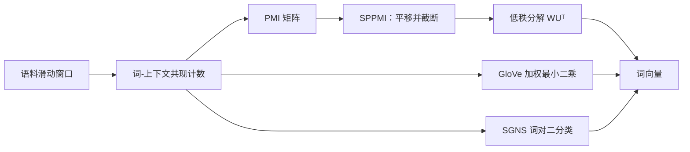

# 嵌入的矩阵分解视角：从 SGNS 到 SPPMI 与 GloVe

SGNS 与 GloVe 都可以从共现统计理解，但「隐式矩阵分解」不等于有限维训练结果严格等于某次 SVD。先将每个词对内积视为可独立优化的标量，才能推导 SGNS 的理想目标；施加共享低维向量后，各词对相互耦合。Levy 与 Goldberg 的分析解释了目标结构，而非消除了维度、权重和优化的影响。

::: info 符号与约定
沿用[数学与符号约定](../foundations/math-notation.md)。$\mathcal{V}$ 是词表，$v_w$ 与 $u_w$ 分别是词 $w$ 的输入、输出向量；$\#(w,c)$ 是词对 $(w,c)$ 在滑动窗口中的共现次数，$\#(w)=\sum_c\#(w,c)$，$|\mathcal{C}|=\sum_{w,c}\#(w,c)$；$k$ 是负样本数，$P_n(\cdot)$ 是负采样分布，$\sigma$ 是 sigmoid 函数。
:::

---

## 总览：三条数学线索

三条线索的起点都是同一个共现计数矩阵：

- SGNS 的期望二分类目标，在逐词对内积独立且噪声分布指定时，有可求出的理想最优值；
- SPPMI 是把平移 PMI 截断后形成的显式表示，分解它是另一种目标，不等同于 SGNS；
- GloVe 对非零共现项作加权回归。三者都利用共现，但目标、零计数处理与低维折中不同。

---

## 从 SGNS 目标到逐对最优内积

### 全局目标

单个词对的负采样目标在 [word2vec](./word2vec.md) 中已经给出。把语料中所有词对累加，SGNS 的全局目标为：

$$
\ell=\sum_{w\in\mathcal{V}}\sum_{c\in\mathcal{V}}\#(w,c)\left[\log\sigma(v_w^\top u_c)+k\sum_{c_N\in\mathcal{V}}P_n(c_N)\log\sigma(-v_w^\top u_{c_N})\right]
$$

这里是需要最大化的期望目标；采样实现用有限负例估计它。$\#(w)$ 是中心词参与的训练词对总数，不一定等于原始语料中的词频。令 $\#(c)=\sum_w\#(w,c)$，交换求和后，对固定词对 $(w,c)$ 的噪声系数为 $k\,\#(w)P_n(c)$：

$$
\ell=\sum_{w,c}\left[\#(w,c)\log\sigma(v_w^\top u_c)+k\,\#(w)P_n(c)\log\sigma(-v_w^\top u_c)\right]
$$

### 一元采样下的闭式解

取训练词对的上下文边缘分布 $P_n(c)=\#(c)/|\mathcal{C}|$。令 $x=v_w^\top u_c$，把不同词对的内积暂时视为可独立调整的变量；以下有限驻点要求 $\#(w,c)>0$ 且噪声系数为正。对 $x$ 求导并置零：

$$
\frac{\partial\ell}{\partial x}=\#(w,c)(1-\sigma(x))-k\,\#(w)\frac{\#(c)}{|\mathcal{C}|}\sigma(x)=0
$$

解得：

$$
\sigma(x)=\frac{\#(w,c)}{\#(w,c)+k\,\#(w)\#(c)/|\mathcal{C}|}
$$

两边取 logit：

$$
x=\log\frac{\#(w,c)\,|\mathcal{C}|}{\#(w)\#(c)}-\log k
$$

### 认出 PMI

点互信息（Pointwise Mutual Information）定义为：

$$
\operatorname{PMI}(w,c)=\log\frac{P(w,c)}{P(w)P(c)}=\log\frac{\#(w,c)/|\mathcal{C}|}{(\#(w)/|\mathcal{C}|)(\#(c)/|\mathcal{C}|)}=\log\frac{\#(w,c)\,|\mathcal{C}|}{\#(w)\#(c)}
$$

代入上式，得到本页的核心等式：

$$
\boxed{v_w^\top u_c=\operatorname{PMI}(w,c)-\log k}
$$

这是特定噪声分布下、解除低秩耦合后的逐词对最优值，不是有限维随机训练必然收敛到该值的定理。一般噪声分布的推导给出：

$$
x^*=\log\frac{\#(w,c)}{k\,\#(w)P_n(c)}
=\operatorname{PMI}(w,c)-\log k+\log\frac{P(c)}{P_n(c)}
$$

其中 $P(c)=\#(c)/|\mathcal{C}|$。使用 $3/4$ 次幂噪声时，最后一项随上下文变化，不能省略成同一个常数平移。

---

## SPPMI：截断与显式低秩分解

需要区分三个操作。先在指定噪声分布下求理想词对得分，再把负值截断构成 SPPMI，最后选择低秩近似。这不是 SGNS 训练逐步执行的算法流程；SGNS 直接优化词向量，未显式创建并截断整张矩阵。

噪声分布若为上下文边缘分布，可得到常见 PMI 减 $\log k$ 的形式；若采用按频率 $3/4$ 次幂归一化的噪声，理想内积还含随上下文变化的修正项。不能在推导中使用一种噪声，却把结论不加说明地移给另一种。

交互图保留负 PMI 的数值。负值表示低于独立共现基线，而不是缺失数据；右侧 SPPMI 才截断。玩具语料中的「天空」总计只有 17 次，不能把它当作高频词降权的实验证据。

### 为什么要截断

SGNS 不给内积设置统一上下界。对从未共现但可能被采为负例的词对，正项系数为零，其理想目标在 $x\to-\infty$ 时趋于上确界。若正、负系数都大于零，才有上节的有限最优值。

负 PMI 表示共现低于独立假设的预期，不必来自稀有事件。为了获得可存储的稀疏显式表示，可以将负值和未见事件的 $-\infty$ 截成零，定义 SPPMI（Shifted Positive PMI）：

$$
\operatorname{SPPMI}_k(w,c)=\max(\operatorname{PMI}(w,c)-\log k,\ 0)
$$

### 显式矩阵近似与 SGNS 的区别

把截断统计排成矩阵 $M_{wc}=\operatorname{SPPMI}_k(w,c)$，可另外求一个低秩近似：

$$
M\approx WU^\top,\qquad W,U\in\mathbb{R}^{|\mathcal{V}|\times d}
$$

W、U 的行分别承载词和上下文向量。对平方重建损失，截断 SVD 可求最优秩约束近似；SGNS 优化的是带词对计数权重的 logistic 目标，既没有把负得分全部设为零，也不等同于该平方损失。即使参数量相同，两种方法也会选择不同的低维折中。

例如某词对理想平移 PMI 为 $-2$，SPPMI 会把它记为 0；这两个目标值已经不同，增加向量维度也不能使「拟合 0」自动等于「拟合 $-2$」。论文对 SVD 与 SGNS 的相似度、类比任务比较同样表明，不能把二者视为可互换实现。

<SppmiShiftExplorer />

### 这个解释回答了什么

- 类比现象（$\vec{\text{king}}-\vec{\text{man}}+\vec{\text{woman}}\approx\vec{\text{queen}}$）是 PMI 空间线性结构的经验体现，不是目标函数的显式约束；
- $k$ 在固定噪声分布下改变理想得分；对显式 SPPMI，增大 k 也会提高截断阈值，但不能因此把 SGNS 描述成硬截断算法；
- 词频下采样改变训练词对分布，改变噪声分布则同时改变目标值和权重，二者不只是相同的「降权」；
- 词—上下文矩阵提供统一分析视角，不意味着 LSA 的词—文档矩阵、HAL 的共现统计与 SGNS 的损失完全相同。

---

## 负采样目标本身的推导

Goldberg 与 Levy（2014）的笔记回答另一个问题：负采样这个目标函数，是怎么从 Skip-gram 原始目标变出来的。

### 出发点：Skip-gram 的 softmax

Skip-gram 的原始目标是：

$$
\max_\theta\sum_{t=1}^{T}\sum_{\substack{-m\le j\le m\\j\ne0}}\log P(w_{t+j}\mid w_t),\qquad
P(w_O\mid w_I)=\frac{\exp(u_{w_O}^\top v_{w_I})}{\sum_{w\in\mathcal{V}}\exp(u_w^\top v_{w_I})}
$$

分母对全词表归一化，单样本代价与 $|\mathcal{V}|$ 同阶，这是训练的主要瓶颈。

### 用对比代替归一化

负采样把「从 $|\mathcal{V}|$ 个候选中选出正确词」替换为「正确词对加 $k$ 个噪声词对」的二分类：

$$
J_{\mathrm{NS}}(w_I,w_O)=\log\sigma(u_{w_O}^\top v_{w_I})
+k\,\mathbb{E}_{w_N\sim P_n}\left[\log\sigma(-u_{w_N}^\top v_{w_I})\right]
$$

推导要点：

- 这是替换后的二分类训练目标，不是完整 softmax 对数概率的逐项近似等式；
- sigmoid 在有限实数上输出 $(0,1)$，但 $\log\sigma(s)$ 可趋于 $-\infty$，负对数损失没有有限上界；
- 梯度趋于零只说明局部更新变小，不会为内积建立有限硬边界；
- SGNS 借鉴数据/噪声判别思想，却不等同于带噪声概率修正、用于估计正规化模型的 NCE；
- $P_n$ 改变负项系数与逐词对最优值，必须随训练配方报告。

单步梯度的推导见 [word2vec](./word2vec.md)。正是这个目标的函数形式决定了上一节的闭式解——数学解释不是事后附会，而是目标函数的直接推论。

---

## GloVe：从共现概率比值出发

GloVe（Pennington et al., 2014）不做采样，直接对全局共现矩阵建模，推导终点与 SGNS 惊人地接近。

### 出发点：比值编码语义

设 $X_{ij}$ 是词 $j$ 出现在词 $i$ 上下文窗口中的次数，$X_i=\sum_j X_{ij}$，$P(j\mid i)=X_{ij}/X_i$。原论文的关键观察是：语义关系编码在两个概率的比值里，而不是单个概率里。

| $w_j$ | $P(j\mid\text{ice})$ | $P(j\mid\text{steam})$ | $P(j\mid\text{ice})/P(j\mid\text{steam})$ |
| --- | --- | --- | --- |
| solid | $1.9\times10^{-4}$ | $2.2\times10^{-5}$ | 8.9 |
| gas | $6.6\times10^{-5}$ | $7.8\times10^{-4}$ | $8.5\times10^{-2}$ |
| water | $3.0\times10^{-3}$ | $2.2\times10^{-3}$ | 1.36 |
| fashion | $1.7\times10^{-5}$ | $1.8\times10^{-5}$ | 0.96 |

上表按原论文 Table 1 保留已舍入的概率和报告比值；直接相除显示值不一定精确复现比值。例如 $1.9\times10^{-4}/(2.2\times10^{-5})\approx8.64$，但原表报告 8.9。比值远大于 1 表示该上下文更偏 ice，远小于 1 更偏 steam，接近 1 则区分力较弱。

### 从比值到内积

希望模型直接表示这个比值：

$$
F(w_i,w_k,\tilde w_j)=\frac{P(j\mid i)}{P(j\mid k)}
$$

向量空间中最自然的线性运算是向量差，令：

$$
F\!\left((w_i-w_k)^\top\tilde w_j\right)=\frac{P(j\mid i)}{P(j\mid k)}
$$

若要求正值、连续的 F 满足 $F(a-b)=F(a)/F(b)$，可采用指数族 $F(a)=e^{ca}$；尺度可吸收到向量参数中。选择单位尺度得到：

$$
(w_i-w_k)^\top\tilde w_j=\log P(j\mid i)-\log P(j\mid k)
$$

这是一组建模要求，不保证有限维向量能精确表达任意经验概率。结合 $\log P(j\mid i)=\log X_{ij}-\log X_i$ 并将词相关项吸收到偏置，再引入中心/上下文对称参数化，采用以下近似拟合形式：

$$
w_i^\top\tilde w_j+b_i+\tilde b_j\approx\log X_{ij}
$$

### 加权最小二乘目标

零计数处 $\log X_{ij}$ 无定义，因此实际目标只遍历非零项；稀有共现的影响由权重控制：

$$
J=\sum_{\substack{1\le i,j\le|\mathcal{V}|\\X_{ij}>0}}
f(X_{ij})\left(w_i^\top\tilde w_j+b_i+\tilde b_j-\log X_{ij}\right)^2
$$

$$
f(x)=\begin{cases}(x/x_{\max})^\alpha & x<x_{\max}\\1 & x\ge x_{\max}\end{cases},\qquad \alpha=0.75,\ x_{\max}=100
$$

在 $0<x<x_{\max}$ 时权重小于 1，高频端封顶。以上是原论文使用的一组超参数，不是定义所强制；不要写成 $0\times(\log0)^2$ 来实现零项排除。GloVe 加权与显式 SPPMI 的硬截断是不同选择，SGNS 本身不做这种截断。

---

## 三种视角对比

| 视角 | 优化对象 | 内积逼近的量 | 统计来源 | 代表工作 |
| --- | --- | --- | --- | --- |
| SGNS | 局部词对二分类 | $\operatorname{PMI}(w,c)-\log k$（隐式） | 滑动窗口采样 | word2vec |
| SPPMI 分解 | 显式矩阵分解 | $\operatorname{SPPMI}_k(w,c)$ | 全局共现计数 | Levy & Goldberg |
| GloVe | 加权最小二乘 | $\log X_{ij}$ 加偏置 | 全局共现计数 | GloVe |

三条路线共享共现统计视角，但不能用「只有优化方式不同」概括。SGNS 的表中理想值还要求指定边缘噪声与逐词对松弛；SPPMI 改变目标矩阵，GloVe 采用偏置与非零项加权回归。有限维表示的几何必须结合目标、数据与优化诊断，见[向量表示分析](../evaluation/embedding-geometry.md)。

---

## 参考文献

- Levy, O., and Goldberg, Y. (2014). [*Neural Word Embedding as Implicit Matrix Factorization*](https://papers.nips.cc/paper/5477-neural-word-embedding-as-implicit-matrix-factorization). NeurIPS.
- Goldberg, Y., and Levy, O. (2014). [*word2vec Explained: Deriving Mikolov et al.'s Negative-Sampling Word-Embedding Method*](https://arxiv.org/abs/1402.3722). arXiv:1402.3722.
- Pennington, J., Socher, R., and Manning, C. D. (2014). [*GloVe: Global Vectors for Word Representation*](https://aclanthology.org/D14-1162/). EMNLP.
- Church, K. W., and Hanks, P. (1990). [*Word Association Norms, Mutual Information, and Lexicography*](https://aclanthology.org/J90-1003/). Computational Linguistics.
- Mikolov, T. et al. (2013). [*Distributed Representations of Words and Phrases and their Compositionality*](https://arxiv.org/abs/1310.4546).
