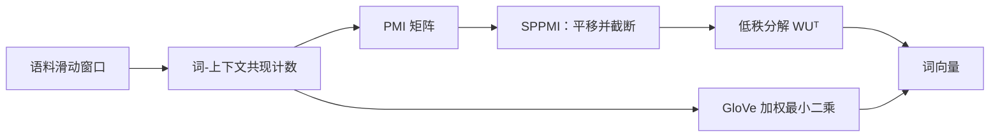

# 嵌入的矩阵分解视角：从 SGNS 到 SPPMI 与 GloVe

word2vec 的负采样目标看起来是神经网络训练，但它可以等价改写为矩阵分解：Levy 与 Goldberg（2014）证明，Skip-gram 负采样（SGNS）隐式分解的是一个平移后的点互信息矩阵；Goldberg 与 Levy（2014）的笔记则从 Skip-gram 原始目标出发，把负采样公式逐步推导出来；GloVe 走另一条路，从共现概率的比值推出形式不同但内核相通的模型。本页推导这三条线索，说明「词向量内积逼近共现统计的对数线性度量」为什么是这类方法的共同数学核心。

::: info 符号与约定
沿用[数学与符号约定](../foundations/math-notation.md)。$\mathcal{V}$ 是词表，$v_w$ 与 $u_w$ 分别是词 $w$ 的输入、输出向量；$\#(w,c)$ 是词对 $(w,c)$ 在滑动窗口中的共现次数，$\#(w)=\sum_c\#(w,c)$，$|\mathcal{C}|=\sum_{w,c}\#(w,c)$；$k$ 是负样本数，$P_n(\cdot)$ 是负采样分布，$\sigma$ 是 sigmoid 函数。
:::

---

## 总览：三条数学线索

三条线索的起点都是同一个共现计数矩阵：

- SGNS 从局部词对的二分类目标出发，其最优解恰好落在 PMI 的平移上；
- 把这一结论全局化，SGNS 等价于对 SPPMI 矩阵做隐式低秩分解；
- GloVe 不做采样，直接用加权最小二乘拟合 $\log X_{ij}$，终点与 SGNS 仅差偏置与加权方式。

---

## 从 SGNS 目标到逐对最优内积

### 全局目标

单个词对的负采样目标在 [word2vec](./word2vec.md) 中已经给出。把语料中所有词对累加，SGNS 的全局目标为：

$$
\ell=\sum_{w\in\mathcal{V}}\sum_{c\in\mathcal{V}}\#(w,c)\left[\log\sigma(v_w^\top u_c)+k\sum_{c_N\in\mathcal{V}}P_n(c_N)\log\sigma(-v_w^\top u_{c_N})\right]
$$

第一项抬高真实共现词对的内积，第二项压低噪声词对的内积。交换负样本求和与外层求和的顺序：对固定词对 $(w,c)$，负样本项的总系数是 $k\,\#(w)P_n(c)$——中心词 $w$ 共出现 $\#(w)$ 次，每次以概率 $P_n(c)$ 把 $c$ 抽为负样本。于是：

$$
\ell=\sum_{w,c}\left[\#(w,c)\log\sigma(v_w^\top u_c)+k\,\#(w)P_n(c)\log\sigma(-v_w^\top u_c)\right]
$$

### 一元采样下的闭式解

取一元分布 $P_n(c)=\#(c)/|\mathcal{C}|$（这是原始推导的假设；实际实现常用 $3/4$ 次幂平滑，此时结论是近似）。令 $x=v_w^\top u_c$，并假设每个词对的内积可以独立优化，即向量维度足够大、词对之间不存在参数共享约束。对 $x$ 求导并置零：

$$
\frac{\partial\ell}{\partial x}=\#(w,c)(1-\sigma(x))-k\,\#(w)\frac{\#(c)}{|\mathcal{C}|}\sigma(x)=0
$$

解得：

$$
\sigma(x)=\frac{\#(w,c)}{\#(w,c)+k\,\#(w)\#(c)/|\mathcal{C}|}
$$

两边取 logit：

$$
x=\log\frac{\#(w,c)\,|\mathcal{C}|}{\#(w)\#(c)}-\log k
$$

### 认出 PMI

点互信息（Pointwise Mutual Information）定义为：

$$
\operatorname{PMI}(w,c)=\log\frac{P(w,c)}{P(w)P(c)}=\log\frac{\#(w,c)/|\mathcal{C}|}{(\#(w)/|\mathcal{C}|)(\#(c)/|\mathcal{C}|)}=\log\frac{\#(w,c)\,|\mathcal{C}|}{\#(w)\#(c)}
$$

代入上式，得到本页的核心等式：

$$
\boxed{v_w^\top u_c=\operatorname{PMI}(w,c)-\log k}
$$

负采样训练稳定后，词对内积收敛到 PMI 的一个平移版本。这个结论不依赖神经网络的任何特殊性质，只由目标函数的函数形式决定。

---

## SPPMI：截断与隐式低秩分解

### 为什么要截断

核心等式给出的是无约束最优值，但 SGNS 的内积并不能无限负：

- 正样本项 $\log\sigma(x)$ 在 $x\to-\infty$ 时趋于 $-\infty$，负样本项 $\log\sigma(-x)$ 在 $x\to+\infty$ 时趋于 $-\infty$，内积被夹在一个有限区间内；
- 负 PMI 几乎只来自稀有共现，统计上不可靠，直接拟合会把噪声写进向量。

Levy 与 Goldberg 据此定义 SPPMI（Shifted Positive PMI）：

$$
\operatorname{SPPMI}_k(w,c)=\max(\operatorname{PMI}(w,c)-\log k,\ 0)
$$

### 隐式矩阵分解

把所有词对排成矩阵 $M\in\mathbb{R}^{|\mathcal{V}|\times|\mathcal{V}|}$，令 $M_{wc}=\operatorname{SPPMI}_k(w,c)$。SGNS 实际求解的是：

$$
M\approx WU^\top,\qquad W,U\in\mathbb{R}^{|\mathcal{V}|\times d}
$$

其中 $W$ 的行是输入向量 $v_w$，$U$ 的行是输出向量 $u_w$。向量维度 $d$ 就是低秩约束：$d$ 越小近似越粗，$d\to\infty$ 时逐对等式精确成立。SGNS 与显式矩阵分解的区别只在于优化方式——它用随机采样的局部二分类损失代替全局重建损失，自始至终不构造矩阵 $M$。

<SppmiShiftExplorer />

### 这个解释回答了什么

- 类比现象（$\vec{\text{king}}-\vec{\text{man}}+\vec{\text{woman}}\approx\vec{\text{queen}}$）是 PMI 空间线性结构的经验体现，不是目标函数的显式约束；
- $k$ 不只是计算参数：它平移截断阈值，$k$ 越大幸存的共现对越少，高频泛化词被整体降权；
- 高频下采样、负采样分布的 $3/4$ 次幂平滑，本质上都在改变矩阵分解的有效加权；
- 神经网络词向量与经典分布式语义（LSA、HAL）被统一为「分解某个共现导出矩阵」，区别只在矩阵定义与损失函数。

---

## 负采样目标本身的推导

Goldberg 与 Levy（2014）的笔记回答另一个问题：负采样这个目标函数，是怎么从 Skip-gram 原始目标变出来的。

### 出发点：Skip-gram 的 softmax

Skip-gram 的原始目标是：

$$
\max_\theta\sum_{t=1}^{T}\sum_{\substack{-m\le j\le m\\j\ne0}}\log P(w_{t+j}\mid w_t),\qquad
P(w_O\mid w_I)=\frac{\exp(u_{w_O}^\top v_{w_I})}{\sum_{w\in\mathcal{V}}\exp(u_w^\top v_{w_I})}
$$

分母对全词表归一化，单样本代价与 $|\mathcal{V}|$ 同阶，这是训练的主要瓶颈。

### 用对比代替归一化

负采样把「从 $|\mathcal{V}|$ 个候选中选出正确词」替换为「正确词对加 $k$ 个噪声词对」的二分类：

$$
\log P(w_O\mid w_I)\approx\log\sigma(u_{w_O}^\top v_{w_I})+\sum_{i=1}^{k}\mathbb{E}_{w_i\sim P_n(w)}\left[\log\sigma(-u_{w_i}^\top v_{w_I})\right]
$$

推导要点：

- sigmoid 把无界内积压进 $(0,1)$，使二分类的对数损失有定义且有界；
- 正样本项 $\log\sigma(s)$ 随 $s$ 增大趋于 0，梯度 $\sigma(-s)$ 趋于 0，内积获得软上界；负样本项同理给出软下界；
- 这是噪声对比估计（NCE）思想的简化：不估计归一化常数，直接用「真实对噪声」的对比学习参数；
- 负采样分布 $P_n$ 不是附属细节：它决定负样本项的系数，因而决定最优内积落在 PMI 的哪个平移上。

单步梯度的推导见 [word2vec](./word2vec.md)。正是这个目标的函数形式决定了上一节的闭式解——数学解释不是事后附会，而是目标函数的直接推论。

---

## GloVe：从共现概率比值出发

GloVe（Pennington et al., 2014）不做采样，直接对全局共现矩阵建模，推导终点与 SGNS 惊人地接近。

### 出发点：比值编码语义

设 $X_{ij}$ 是词 $j$ 出现在词 $i$ 上下文窗口中的次数，$X_i=\sum_j X_{ij}$，$P(j\mid i)=X_{ij}/X_i$。原论文的关键观察是：语义关系编码在两个概率的比值里，而不是单个概率里。

| $w_j$ | $P(j\mid\text{ice})$ | $P(j\mid\text{steam})$ | $P(j\mid\text{ice})/P(j\mid\text{steam})$ |
| --- | --- | --- | --- |
| solid | $1.9\times10^{-3}$ | $2.2\times10^{-5}$ | 8.8 |
| gas | $6.6\times10^{-5}$ | $7.9\times10^{-4}$ | $8.5\times10^{-2}$ |
| water | $3.0\times10^{-3}$ | $2.2\times10^{-3}$ | 1.36 |
| fashion | $1.7\times10^{-5}$ | $1.8\times10^{-5}$ | 0.96 |

比值远大于 1 表示 $j$ 与 ice 更相关，远小于 1 表示与 steam 更相关，接近 1 表示不区分两者。

### 从比值到内积

希望模型直接表示这个比值：

$$
F(w_i,w_j,\tilde w_k)=\frac{P(j\mid i)}{P(j\mid k)}
$$

向量空间中最自然的线性运算是向量差，令：

$$
F\!\left((w_i-w_k)^\top\tilde w_j\right)=\frac{P(j\mid i)}{P(j\mid k)}
$$

要求 $F$ 保持群运算结构（$F(a-b)=F(a)/F(b)$），唯一自然的选择是 $F=\exp$，于是：

$$
(w_i-w_k)^\top\tilde w_j=\log P(j\mid i)-\log P(j\mid k)
$$

该式对任意 $k$ 成立，故 $\log P(j\mid i)$ 可分解为 $w_i^\top\tilde w_j$ 加两个偏置；又 $\log P(j\mid i)=\log X_{ij}-\log X_i$，其中 $\log X_i$ 与 $j$ 无关，可吸收进偏置。再要求中心词与上下文词交换时模型对称，得到：

$$
w_i^\top\tilde w_j+b_i+\tilde b_j=\log X_{ij}
$$

### 加权最小二乘目标

直接平方误差会让稀有共现（噪声大）和零共现（数量多）主导优化，因此引入加权函数 $f$：

$$
J=\sum_{i,j=1}^{|\mathcal{V}|}f(X_{ij})\left(w_i^\top\tilde w_j+b_i+\tilde b_j-\log X_{ij}\right)^2
$$

$$
f(x)=\begin{cases}(x/x_{\max})^\alpha & x<x_{\max}\\1 & x\ge x_{\max}\end{cases},\qquad \alpha=0.75,\ x_{\max}=100
$$

$\alpha<1$ 对低频共现降权，封顶值 $x_{\max}$ 防止高频词主导。与 SGNS 的 SPPMI 截断对照：两者都在抑制不可靠的低频统计，只是一个用硬截断，一个用软加权。

---

## 三种视角对比

| 视角 | 优化对象 | 内积逼近的量 | 统计来源 | 代表工作 |
| --- | --- | --- | --- | --- |
| SGNS | 局部词对二分类 | $\operatorname{PMI}(w,c)-\log k$（隐式） | 滑动窗口采样 | word2vec |
| SPPMI 分解 | 显式矩阵分解 | $\operatorname{SPPMI}_k(w,c)$ | 全局共现计数 | Levy & Goldberg |
| GloVe | 加权最小二乘 | $\log X_{ij}$ 加偏置 | 全局共现计数 | GloVe |

三条路线形式不同，但共享同一个数学内核：词向量内积逼近共现统计的对数线性度量。SGNS 与 GloVe 的差异主要是加权方式与截断方式，而不是「神经网络与矩阵分解」的本质对立。理解这一点后，词向量的几何性质（类比、聚类、各向异性）都可以回到共现统计上解释，诊断方法见[向量表示分析](../evaluation/embedding-geometry.md)。

---

## 参考文献

- Levy, O., and Goldberg, Y. (2014). *Neural Word Embedding as Implicit Matrix Factorization*. NeurIPS.
- Goldberg, Y., and Levy, O. (2014). *word2vec Explained: Deriving Mikolov et al.'s Negative-Sampling Word-Embedding Method*. arXiv:1402.3722.
- Pennington, J., Socher, R., and Manning, C. D. (2014). *GloVe: Global Vectors for Word Representation*. EMNLP.
- Church, K. W., and Hanks, P. (1990). *Word Association Norms, Mutual Information, and Lexicography*. Computational Linguistics.
- Mikolov, T. et al. (2013). *Distributed Representations of Words and Phrases and their Compositionality*.
