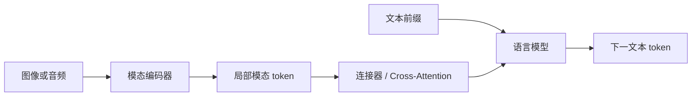

# 多模态对齐：让不同输入共享可比较的表示

文本、图像和音频的原始数据结构不同，编码器输出的维度与分布也不同。多模态对齐通过成对数据与共享目标，使相关内容在同一表示空间中接近。它可以服务跨模态检索，也可以为生成模型提供条件 token。

::: info 符号与约定
沿用[数学与符号约定](../foundations/math-notation.md)。$I_i,T_i$ 是第 $i$ 对图像与文本，$v_i,t_i$ 是归一化后的模态向量，$S$ 是 batch 内相似度矩阵，$B$ 是 batch 大小，$\tau$ 是温度；$H,W$ 是图像高与宽，$P$ 是 patch 边长，$N$ 是 patch 数量；$Z_v$ 是视觉 token，$g$ 是连接器，$\widetilde{Z}_v$ 是映射到语言模型维度后的视觉 token。
:::

---

## 双塔对齐

以图文对为例，图像编码器和文本编码器分别产生向量：

$$
v_i=\operatorname{norm}(f_{\text{img}}(I_i)),\qquad
t_i=\operatorname{norm}(f_{\text{text}}(T_i))
$$

一个 batch 的相似度矩阵为：

$$
S_{ij}=\frac{v_i^\top t_j}{\tau}
$$

$\tau>0$ 是对比学习温度，控制 softmax 分布的尖锐程度。

匹配图文位于对角线。对称对比损失同时要求图像找对文本、文本找对图像：

$$
\mathcal{L}
=
\frac{1}{2}
\left(
\mathcal{L}_{\text{image}\rightarrow\text{text}}
+
\mathcal{L}_{\text{text}\rightarrow\text{image}}
\right)
$$

训练完成后，两侧可以独立编码和缓存，因此双塔适合图搜文、文搜图与跨模态聚类。

负样本质量仍是关键。批内随机负例往往只教会模型区分粗粒度类别；外观相似但描述不同、文本相近但关键属性冲突的困难负例，才能推动模型学习颜色、数量、关系等细节。同时要避免把同一事件的另一张图误作负例。

一个 batch 的图文编码会形成 $B\times B$ 相似度矩阵。图像到文本方向对每一行做 softmax，要求第 $i$ 张图找到第 $i$ 段文本；文本到图像方向对每一列做 softmax，要求第 $j$ 段文本找回第 $j$ 张图。对称损失避免只优化其中一个检索方向。

若 batch 中包含「一只红色杯子」和「一只蓝色杯子」两组图文，它们既是彼此的困难负例，也能直接检查模型是否学习颜色属性。若文字只写「杯子」，则两张图都可能与同一句描述相关，把其中一张强制当作负例会制造错误监督。

---

## 图像怎样进入 Transformer

Vision Transformer 先把图像切成 patch。对大小为 $H\times W$、patch 边长为 $P$ 的图像，patch 数量为：

$$
N=\frac{HW}{P^2}
$$

每个 patch 展平并线性投影为 token，再加位置表示送入 Transformer Encoder。这个步骤把二维信号改写为序列，但不自动完成图文对齐；对齐仍来自配对数据和跨模态目标。

例如 $224\times224$ 图像使用 $16\times16$ patch，会得到：

$$
N=\frac{224\times224}{16^2}=196
$$

如果加入一个聚合 token，Encoder 输入长度为 197。patch 变小会保留更多局部细节，同时按面积快速增加 token 数与 Attention 成本。

音频可以按时间帧或谱图片段编码，视频还要保留时间关系。不同模态的 token 化方式决定了局部结构与计算成本。

---

## 检索空间与生成接口不是一回事

双塔通常把每个模态压缩成单个全局向量，适合快速相似度检索。多模态生成模型则需要保留更多局部信息，让语言模型读取一组视觉或音频 token。

设视觉编码器输出：

$$
Z_v\in\mathbb{R}^{N_v\times d_v}
$$

连接器 $g$ 将其映射到语言模型维度：

$$
\tilde{Z}_v=g(Z_v)\in\mathbb{R}^{M\times d_{\text{lm}}}
$$

$g$ 可以是线性投影、带查询的压缩模块或交叉注意力层。它需要解决维度、分布和 token 数量的差异。把向量投到同一维度只是接口兼容，不保证细粒度语义已经对齐。

常见训练顺序是先固定大部分单模态编码器、训练连接器建立基本对应，再按任务需要联合微调部分或全部组件。冻结策略取决于数据规模与保持原能力的要求，不是结构定义的一部分。

跨模态生成的训练和推理可以沿同一数据流理解：

训练时，目标文本右移一位产生生成损失，梯度是否更新模态编码器、连接器和语言模型取决于冻结策略。推理时先编码模态输入，把得到的条件 token 纳入语言模型 Prefill，再逐 token Decode。模态特征通常在一次回答中复用，不必每生成一个词都重新运行视觉编码器。

跨模态检索则不同：图像向量与文本向量分别离线或在线编码，直接比较相似度，不进入语言模型生成循环。二者可能共享视觉主干，但输出粒度和训练目标不能混用。

---

## 对齐失败怎样表现

多模态系统常见的失败是只学到捷径，而非完全不相关：

- 依赖图像中的文字或水印，而非视觉内容；
- 能判断主体类别，却混淆数量、空间关系和属性；
- 训练数据中的共同偏差被映射成错误关联；
- 长尾模态或低资源语言被主流数据分布淹没；
- 检索向量表现良好，但生成连接器丢失局部细节。

评估应按方向分别报告 image-to-text 与 text-to-image 检索，并加入组合属性、关系、否定和分布外样本。生成系统还需检查视觉依据是否真正支持回答，不能只看语言流畅度。

---

## 与相邻主题的关系

[Embedding](./embedding.md)提供连续表示与相似度的基础；[文本嵌入](./text-embedding.md)解释单模态对比学习与双编码器；[向量检索](./vector-retrieval.md)负责对齐向量的部署。Transformer 只提供编码主干，跨模态训练目标和连接器才定义模态间如何交换信息。

---

## 参考文献

- Radford, A. et al. (2021). *Learning Transferable Visual Models From Natural Language Supervision*.
- Dosovitskiy, A. et al. (2021). *An Image is Worth 16x16 Words: Transformers for Image Recognition at Scale*.
- Alayrac, J.-B. et al. (2022). *Flamingo: a Visual Language Model for Few-Shot Learning*.
