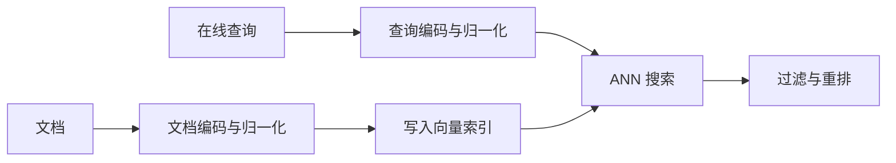

# 文本嵌入：为语义匹配学习句子与文档向量

文本嵌入模型把可变长度文本编码为固定维度向量，使相似度计算可以替代昂贵的逐对文本交互。它最常用于语义检索、聚类、去重和匹配。与静态词向量不同，训练对象通常是完整查询、句子或文档。

::: info 符号与约定
沿用[数学与符号约定](../foundations/math-notation.md)。$x_q,x_d$ 是查询与文档文本，$q,d$ 是对应向量；$f_\theta,g_\phi$ 是两侧编码器，$H=[h_1,\ldots,h_n]$ 是 token 隐藏状态，$d_h$ 是隐藏维度；$s(\cdot,\cdot)$ 是相似度，$B$ 是 batch 大小，$\tau$ 是温度，$\mathcal{L}$ 是训练损失。
:::

---

## 双编码器接口

查询与文档分别经过编码器：

$$
q=f_\theta(x_q),\qquad d=g_\phi(x_d)
$$

再用点积或余弦相似度打分：

$$
s(q,d)=q^\top d
$$

这种双编码器（dual encoder）结构允许离线计算并存储所有文档向量，在线只需编码查询并做最近邻搜索。它牺牲了一部分 token 级交互能力，换取大规模召回所需的速度。

$f_\theta$ 与 $g_\phi$ 可以共享参数，也可以分别建模查询和文档。搜索查询往往短且带意图，文档较长且包含背景；当两侧分布明显不同时，非对称训练和不同指令前缀通常更合适。

---

## 从 token 状态得到单个向量

Transformer 编码器输出：

$$
H=[h_1,\ldots,h_n]\in\mathbb{R}^{n\times d_h}
$$

系统需要把它压缩为一个向量。常见方法包括：

- 使用专门的聚合 token；
- 对有效 token 做均值池化；
- 以可学习权重做池化；
- 对长文档分块编码，再在文档级聚合。

直接取某个预训练模型的隐藏状态并不保证得到适合余弦检索的句向量。预训练目标可能只要求逐 token 预测，没有要求整句向量形成均匀、可分的空间；因此通常还需要面向匹配任务训练。

---

## 对比学习塑造检索空间

给定一个 batch 中的正样本对 $\{(q_i,d_i^+)\}_{i=1}^{B}$，可把其他文档当作 batch 内负样本。查询到文档方向的 InfoNCE 损失为：

$$
\mathcal{L}_{q\rightarrow d}
=
-\frac{1}{B}\sum_{i=1}^{B}
\log
\frac{\exp(s(q_i,d_i^+)/\tau)}
{\sum_{j=1}^{B}\exp(s(q_i,d_j)/\tau)}
$$

温度 $\tau$ 控制分布尖锐程度。对称训练还会加入文档到查询方向的损失。

这项损失明确要求正对得分高于负对，但效果高度依赖样本构造：

- 随机负样本太容易，模型学不到细粒度边界；
- 困难负样本能提高分辨率，但错误标注的「假负例」会伤害语义空间；
- batch 越大，候选负例更多，同时也更容易出现未标注的相关样本；
- 只按表面词汇挖掘困难负例，可能让模型过度依赖词面差异。

真实系统常用现有检索器召回候选，再由人工标签、点击信号或交叉编码器筛选负例。

### 一个 batch 的相似度矩阵

假设 batch 中有 3 个查询和 3 个对应文档，已经除以温度的相似度矩阵为：

$$
S=
\begin{bmatrix}
3.0 & 1.0 & 0.0\\
0.4 & 2.5 & 1.0\\
0.2 & 0.5 & 2.0
\end{bmatrix}
$$

对角线是正样本。查询 $q_1$ 找到正确文档 $d_1$ 的训练概率为：

$$
P(d_1\mid q_1)
=
\frac{e^3}{e^3+e^1+e^0}
\approx0.844
$$

对应损失约为 $-\log0.844\approx0.170$。如果主题相近但不能回答问题的 $d_2$ 得分从 1.0 升到 2.8，损失会明显增大，梯度将要求模型更清楚地区分两者。这正是困难负样本能够塑造决策边界的原因。

训练一步通常包含：

1. 采样正对并选择或挖掘负例；
2. 两侧 tokenizer 分别构造查询与文档 batch；
3. 编码、池化并按打分约定归一化向量；
4. 计算整个相似度矩阵，而不是只算对角线；
5. 求单向或双向对比损失并更新编码器；
6. 用独立验证查询检查检索指标，而不只观察训练 loss。

分布式训练常汇集不同设备上的文档向量以扩大负样本池。这样会增加通信，也提高假负例概率；batch 规模与负例语义需要共同设计。

---

## 训练目标必须匹配使用方式

文本相似并不是单一概念。下列任务需要的空间不同：

| 任务 | 正样本关系 | 容易混淆的负样本 |
| --- | --- | --- |
| 语义搜索 | 查询能够由文档回答 | 主题相近但不能回答 |
| 去重 | 两段文本表达同一内容 | 共享实体但事实不同 |
| 聚类 | 属于同一语义簇 | 相邻主题或多标签样本 |
| 推荐 | 用户可能偏好该内容 | 曝光但未点击不一定是负例 |

若训练数据把「主题相同」当作正例，模型未必能学会问答相关性；若部署使用归一化余弦，训练却只优化未归一化内积，向量模长可能承担未预期的信号。

---

## 长文档与细粒度交互

单向量会压缩掉词项、数字和局部事实。常见补救方式是改变检索链路，而非无限增大向量维度：

1. 按语义边界把长文档切成可检索块；
2. 用双编码器召回较大的候选集；
3. 使用 late interaction 或 cross-encoder 进行精排；
4. 在生成任务中把最终证据交给模型。

Late interaction 保留 query 与 document 的 token 向量，并在打分阶段做局部匹配。Cross-encoder 则让两段文本一起进入模型，表达能力更强但无法预计算所有文本对。

### 三种交互接口并不只是速度档位

以 ColBERT 的 MaxSim 思想为例，查询保留 $m$ 个 token 向量 $q_i$，文档保留 $n$ 个向量 $d_j$，基础打分为：

这里采用投影后经 $L_2$ 归一化的 token 向量；否则模长也会进入点积。

$$
s_{\text{late}}(q,d)=\sum_{i=1}^{m}\max_{1\le j\le n}q_i^\top d_j
$$

对每个查询 token，在文档中找最匹配的局部向量再求和。它与先平均再点积不同：若文档只有一小段匹配查询，先平均可能被大量无关内容稀释；MaxSim 可以保留局部匹配。但每个查询位置独立选择最大值也可能忽略词序、否定和联合关系。

| 接口 | 文档能离线保存什么 | 查询与文档何时交互 | 要付出的主要代价 |
| --- | --- | --- | --- |
| 单向量双编码器 | 每文档一个向量 | 最后一次相似度 | 固定向量的信息压缩 |
| Late interaction | 每文档多个 token 向量 | 局部匹配聚合 | 更多存储、匹配与索引复杂度 |
| Cross-encoder | 通常不能预存独立文档向量来复现完整打分 | 模型内部联合注意力 | 每个候选对都要运行联合编码 |

因此不是「把双编码器参数调大」就自然得到交叉编码器的接口。常见链路组合召回与重排，正是为了让昂贵交互只发生在少量候选上；召回漏掉的文档仍无法由重排恢复。

---

## 论文之间的改造轴

Sentence-BERT、DPR 和 SimCSE 都可以输出单个文本向量，但不应统称为同一种对比学习配方：

| 工作 | 面对的问题 | 核心信号与改造 | 结论的适用边界 |
| --- | --- | --- | --- |
| Sentence-BERT，2019 | BERT 逐对编码不适合大量句子比较 | Siamese/triplet 网络，共享编码并池化，研究 NLI 分类、回归和 triplet 目标 | 不能把原始 SBERT 一概写成批内 InfoNCE |
| DPR，2020 | 开放域问答需要从大文档库召回证据 | 问题与 passage 双编码器，正例、批内负例及困难负例 | 衡量的是回答证据召回，不是对称语义相似度 |
| SimCSE，2021 | 句向量空间需要更好的区分性 | 无监督版用同一句的独立 dropout 视图作为正对；监督版利用 NLI | 无监督不等于没有构造正负标签，也不保证所有检索域有效 |
| ColBERT，2020 | 单向量压缩限制细粒度匹配 | 延迟 token 交互和 MaxSim | 更丰富的打分仍需考虑存储、索引和关系理解 |

SimCSE 的无监督训练不是用另一条随机句子作正例，而是同一句话经过两次带独立 dropout 的编码。去掉这种随机性后，正例几乎成为完全相同的向量，训练信号会发生变化。论文中的消融研究这一选择；它不意味着任意强度的数据扰动都能改善语义表示。

以上分别改变任务、监督来源和交互粒度，不是一条「后者全面替代前者」的路线。要选择训练配方，应先写清正例究竟是同义句、蕴含关系，还是能回答问题的证据段落，再决定损失与候选集合。

---

## 评估与部署

离线评估至少报告 Recall@K 或 NDCG，并固定候选库规模、去重规则和查询分布。还应记录向量维度、索引类型、编码吞吐、查询延迟和存储成本。

在领域迁移、语言切换、拼写噪声、短查询和新鲜文档上分层评估，可以避免平均分掩盖真实失败。指标定义见[检索评估](../evaluation/retrieval-evaluation.md)，索引与重排链路见[向量检索](./vector-retrieval.md)。

线上使用通常拆成离线与在线两条路径：

文档编码可以离线完成，查询编码位于在线路径。未经兼容训练和验证就只更新查询编码器，可能使旧文档空间失配；两侧需要兼容接口，并非版本号必须完全相同。

编码器最大长度之外的文本不会自动获得完整表示。截断、滑窗分块或层级聚合会改变检索单元，应和索引版本一起记录。向量缓存也要把模型版本与预处理配置纳入 key，不能仅按原始文本复用。

---

## 参考文献

- Reimers, N., and Gurevych, I. (2019). [*Sentence-BERT: Sentence Embeddings using Siamese BERT-Networks*](https://aclanthology.org/D19-1410/). 网络、池化与多种目标的区别。
- Karpukhin, V. et al. (2020). [*Dense Passage Retrieval for Open-Domain Question Answering*](https://aclanthology.org/2020.emnlp-main.550/). 双编码器、负例选择及开放域问答证据召回。
- Gao, T., Yao, X., and Chen, D. (2021). [*SimCSE: Simple Contrastive Learning of Sentence Embeddings*](https://aclanthology.org/2021.emnlp-main.552/). Dropout 正对、NLI 监督与句向量空间分析。
- Khattab, O. and Zaharia, M. (2020). [*ColBERT: Efficient and Effective Passage Search via Contextualized Late Interaction over BERT*](https://arxiv.org/abs/2004.12832). MaxSim 与可预计算文档表示的边界。
